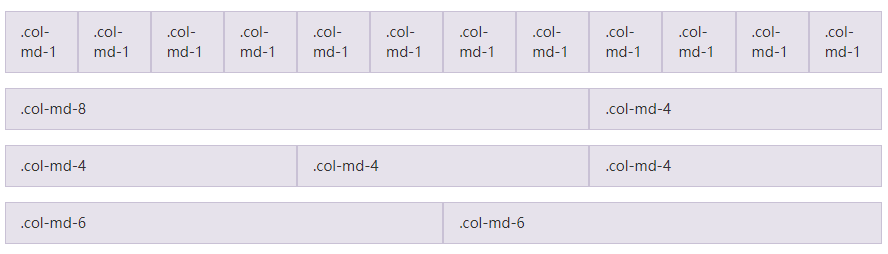

# Bootstrap栅格系统

官方描述:

Bootstrap 3 提供了一套响应式、移动设备优先的流式栅格系统，随着屏幕或视口（viewport）尺寸的增加，系统会自动分为最多12列。它包含了易于使用的预定义类，还有强大的mixin 用于生成更具语义的布局。

也就是说**Bootstrap 3 是移动设备优先的，Bootstrap代码从小屏幕设备开始，然后扩展到大屏幕设备上的组件和栅格**。

## 什么是栅格（grid）

在平面设计中，栅格是一种由一系列用于组织内容的相交的直线（垂直的、水平的〕组成的结构〔通常是二维
的）。它广泛应用于打印设计中的设计布局和内容结构。在网页设计中，它是一种用于快速创建一致的布局和
有效地使HTML和CSS的方法。

简单地说，**网页设计中的栅格用于组织内容(布局），让网站易于浏览，并降低户端的负载**。

## 移动设备优先策略

* 内容
  * 决定什么是最重要的
  * 布局
* 优先设计更小的宽度
  * 基础的CSS是移动设备优先，**媒体查询是针对平板电脑、台式电脑**
  * **渐进增强**
* 随着屏幕的大小增加而添加元素  

::: tip 注意
媒体查询是 CSS 3 的重要特性，渐进增强、优雅降级是前端设计的两个思想。渐进增强，向上兼容，从低版本开始向上支持显示；优雅降级，向下兼容，优先显示高版本的浏览器。
:::

响应式栅格系统，随着屏幕或视口（viewport）尺寸的增加，系统会自动分为最多12列。



```
响应式栅格系统是为了解决布局的问题。

在早期，采用 table 来进行布局，可是带来了问题, 表格里的内容必须加载完成才显示。之后，采用 div + css 的方式去布局，能够实现边加载边显示的效果，因为代码是从上往下执行的，但是在实现布局的操作仍比较困难。而网格/栅格系统的出现就是为了解决以上的问题。
```

## 栅格系统的工作原理

* “行（row）”必须包含在 `.container `（固定宽度）或` .container-fluid` （100% 宽度）中，以便为其赋予合适的排列（aligment）和内补（padding）。
* 通过“行（row）”在水平方向创建一组“列（column）”。
* 你的内容应当放置于“列（column）”内，并且，只有“列（column）”可以作为行（row）”的直接子元素。
* 类似 `.row` 和 `.col-xs-4` 这种预定义的类，可以用来快速创建栅格布局。Bootstrap 源码中定义的 mixin 也可以用来创建语义化的布局。
* 通过为“列（column）”设置 `padding` 属性，从而创建列与列之间的间隔（gutter）。通过为 `.row `元素设置负值 `margin` 从而抵消掉为 `.container` 元素设置的 padding，也就间接为“行（row）”所包含的“列（column）”抵消掉了`padding`。
* 负值的 margin就是下面的示例为什么是向外突出的原因。在栅格列中的内容排成一行。
* 栅格系统中的列是通过指定1到12的值来表示其跨越的范围。例如，三个等宽的列可以使用三个 `.col-xs-4` 来创建。
* 如果一“行（row）”中包含了的“列（column）”大于 12，多余的“列（column）”所在的元素将被作为一个整体另起一行排列。
* 栅格类适用于与屏幕宽度大于或等于分界点大小的设备 ， 并且针对小屏幕设备覆盖栅格类。 因此，在元素上应用任何 `.col-md-*` 栅格类适用于与屏幕宽度大于或等于分界点大小的设备 ， 并且针对小屏幕设备覆盖栅格类。 因此，在元素上应用任何 `.col-lg-*` 不存在， 也影响大屏幕设备。

## 栅格选项

<table>
    <tr>
        <td></td>
		<td>超小屏幕 手机 (<≥68px)</td>
        <td>小屏幕 平板 (≥768px)</td>
        <td>中等屏幕 桌面显示器 (≥992px)</td>
        <td>大屏幕 大桌面显示器 (≥1200px)</td>
    </tr>
    <tr>
        <td>栅格系统行为</td>
        <td>总是水平排列</td>
		<td colspan = "3">开始是堆叠在一起的，当大于这些阈值时将变为水平排列C</td>
    </tr>
    <tr>
        <td>.container 最大宽度</td>
        <td>None （自动）</td>
		<td>750px</td>
        <td>970px</td>
        <td>1170px</td>
    </tr>
    <tr>
        <td>类前缀</td>
		<td>.col-xs-</td>
        <td>.col-sm-</td>
        <td>.col-md-</td>
        <td>.col-lg-</td> 
    </tr>
    <tr>
        <td>列（column）数</td>
        <td colspan = "4">12</td>
    </tr>
    <tr>
        <td>最大列（column）宽</td>
        <td>自动</td>
		<td>~62px</td>
        <td>~81px</td>
        <td>~97px</td>
    </tr>
    <tr>
        <td>槽（gutter）宽</td>
        <td colspan = "4">30px （每列左右均有 15px）</td>
    </tr>
    <tr>
        <td>可嵌套</td>
        <td colspan = "4">是</td>
    </tr>
    <tr>
        <td>偏移（Offsets）</td>
        <td colspan = "4">是</td>
    </tr>
    <tr>
        <td>列排序	</td>
        <td colspan = "4">是</td>
    </tr>
</table>

如何实现自适应？-媒体查询

参考：
[Bootstrap v3 栅格系统简介](https://v3.bootcss.com/css/#grid-intro)