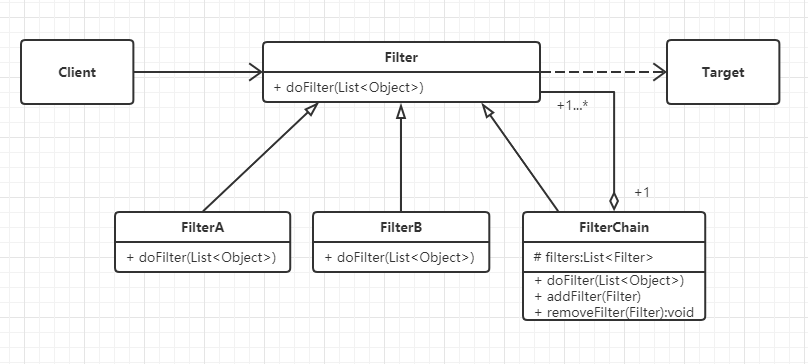

# 过滤模式

## 什么是过滤模式

过滤器模式就是根据某种规则，从一组对象中，过滤掉一些不符合要求的对象的过程。如在互联网上发布信息时对敏感词汇的过滤，或在Web接口请求与响应时，对请求和响应信息的过滤。


## 过滤模式的核心思想

过滤器模式的核心思想就是把不需要的信息过滤掉，通过指定规则来判定哪些是不需要的信息，指定的规则可以称为过滤器，它是对数据流进行操作的。

### 与职责模式的联系

过滤器模式与责任链模式的相似之处是处理过程都一环一环地进行，不同之处在于责任链中责任的传递一般会有一定的顺序，而过滤器通常没有这种顺序，所以**过滤器比责任链简单**。当然，过滤器也可以按照职责模式的方式来实现，这时我们认为每一次的过滤都是一种职责（一个任务），而整个过滤流程是一种特殊的链。


## 从生活中领悟过滤模式

制作一杯鲜纯细腻的豆浆:

``` python
# 过滤模式 - 制作一杯鲜纯细腻的豆浆
class FilterScreen:
    """过滤网"""

    def doFilter(self, rawMaterials):
        for material in rawMaterials:
            if (material == "豆渣"):
                rawMaterials.remove(material)
        return rawMaterials


def testFilterScreen():
    rawMaterials = ["豆浆", "豆渣"]
    print("过滤前：", rawMaterials)
    filter = FilterScreen()
    filteredMaterials = filter.doFilter(rawMaterials)
    print("过滤后：",filteredMaterials)


if __name__ == '__main__':
    testFilterScreen()

"""
过滤前： ['豆浆', '豆渣']
过滤后： ['豆浆']
"""
```

除了制作豆浆，生活中还有很多例子用到过滤模式，比如在基建行业中，沙子是最重要的原材料之一。这些沙子很多是从江河中打捞上来的，但是打捞上来的不只有沙子，还有小石头和水。要得到颗粒均匀的沙子，就必须把水和石头过滤掉。

使用Python自带的filter函数：

```python
# 使用python自带过滤函数
def testFilter():
    rawMaterials = ["豆浆", "豆渣"]
    print("过滤前：", rawMaterials)
    filteredMaterials = list(filter(lambda material: material == "豆浆", rawMaterials))
    print("过滤后：", filteredMaterials)
    
"""
过滤前： ['豆浆', '豆渣']
过滤后： ['豆浆']
"""
```

自带的filter函数不等同与过滤器模式：

1. filter函数是面向过程编程，而过滤器模式是一种设计思想。

2. filter函数只能对简单的数组中的对象过滤，对于一些更复杂的需求（例如对不符合要求的对象进行替换），filter函数难以应付。

   

## 过滤模式的框架模型

对过滤模式进一步进行抽象，重构和优化得到过滤模式的设计：

### 类图和实现



Filter：所有过滤器的抽象类，定义了统一的过滤接口doFilter（）。FilterA和FilterB是过滤器的实现类，一个类定义一个过滤规则。FilterChain：过滤器链，它可以包含多个过滤器，并管理这些过滤器，在过滤对象元素时，包含的每一个过滤器都会进行一次过滤。Target：要过滤的目标对象，一般是一个对象数组，如示例中的豆渣和豆浆。

代码实现：
``` python
# 过滤模式 - 代码框架
from abc import ABCMeta, abstractmethod
# 引入ABCMeta和abstractmethod来定义抽象类和抽象方法


class Filter(metaclass=ABCMeta):
    """过滤器"""

    @abstractmethod
    def doFilter(self, elements):
        """过滤方法"""
        pass


class FilterChain(Filter):
    """过滤器链"""

    def __init__(self):
        self._filters = []

    def addFilter(self, filter):
        self._filters.append(filter)

    def removeFilter(self, filter):
        self._filters.remove(filter)

    def doFilter(self, elements):
        for filter in self._filters:
            elements = filter.doFilter(elements)
        return elements
```


### 示例基于框架实现
``` python
# 过滤模式 - 制作一杯鲜纯细腻的豆浆,基于框架
from filter_frame import Filter


class FilterScreen(Filter):
    """过滤网"""

    def doFilter(self, elements):
        for material in elements:
            if (material == "豆渣"):
                elements.remove(material)
        return elements


def testFilterScreen():
    rawMaterials = ["豆浆", "豆渣"]
    print("过滤前：", rawMaterials)
    filter = FilterScreen()
    filteredMaterials = filter.doFilter(rawMaterials)
    print("过滤后：",filteredMaterials)


if __name__ == '__main__':
    testFilterScreen()

"""
过滤前： ['豆浆', '豆渣']
过滤后： ['豆浆']
"""

```

### 模型设计要点

过滤器模式中主要有三个角色：

1. 过滤的目标（Target）：即要被过滤的对象，通常是一个对象数组（对象列表）。
2. 过滤器（Filter）：负责过滤不需要的对象，一般一个规则对应一个类。
3. 过滤器链（FilterChain）：即过滤器的集合，负责管理和维护过滤器，用这个对象进行过滤时，它包含的每一个子过滤器都会进行一次过滤。这个类并不总是必要的，但如果有多个过滤器，有这个类将会带来极大的方便。

### 优缺点

优点：

1. 将对象的过滤、校验逻辑抽离出来，降低系统的复杂度。
2. 过滤规则可实现重复利用。

缺点：

1. 性能较低，每个过滤器对每一个元素都会进行遍历。如果有n个元素，m个过滤器，则复杂度为O（mn）。


## 实战应用

在互联网上发布信息时，经常被进行敏感词过滤；我们提交的表单信息以HTML的形式显示，会对一些特殊字符进行转换，这时我们就需要用过滤器模式对提交的信息进行过滤和处理。


``` python
# 过滤模式应用 - 信息发布敏感词过滤

import re
# 引入正则表达式库
from filter_frame import Filter, FilterChain


class SensitiveFilter(Filter):
    """敏感词过滤"""

    def __init__(self):
        self.__sensitives = ["黄色", "台独", "贪污"]

    def doFilter(self, elements):
        # 敏感词列表转换成正则表达式
        regex = ""
        for word in self.__sensitives:
            regex += word + "|"
        regex = regex[0: len(regex) - 1]

        # 对每个元素进行过滤
        newElements = []
        for element in elements:
            item, num = re.subn(regex, "", element)
            newElements.append(item)

        return newElements


class HtmlFilter(Filter):
    """HTML特殊字符转换"""

    def __init__(self):
        self.__wordMap = {
            "&": "&amp;",
            "'": " &apos;",
            ">": "&gt;",
            "<": "&lt;",
            "\"": " &quot;",
        }

    def doFilter(self, elements):
        newElements = []
        for element in elements:
            for key, value in self.__wordMap.items():
                element = element.replace(key, value)
            newElements.append(element)
        return newElements


def testFilterContent():
    contents = [
        '有人出售黄色书：<黄情味道>',
        '有人企图搞台独活动, ——"造谣咨询"',
    ]
    print("过滤前的内容：", contents)
    filterChain = FilterChain()
    filterChain.addFilter(SensitiveFilter())
    filterChain.addFilter(HtmlFilter())
    newContents = filterChain.doFilter(contents)
    print("过滤后的内容：", newContents)


if __name__ == '__main__':
    testFilterContent()

"""
过滤前的内容： ['有人出售黄色书：<黄情味道>', '有人企图搞台独活动, ——"造谣咨询"']
过滤后的内容： ['有人出售书：&lt;黄情味道&gt;', '有人企图搞活动, —— &quot;造谣咨询 &quot;']
"""
```


## 应用场景

1. 敏感词过滤、舆情监测。
2. 需要对对象列表（或数据列表）进行检验、审查或预处理的场景。
3. 对网络接口的请求和响应进行拦截，例如对每一个请求和响应记录日志，以便日后分析。


> 摘自： 罗伟富. 《人人都懂设计模式：从生活中领悟设计模式：Python实现》. 电子工业出版社
