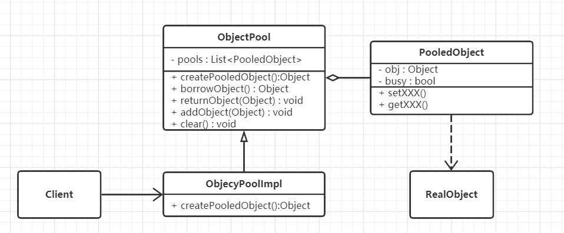

# 对象池技术

## 什么是对象池

对象池是一个对象的集合，里面包含了已经初始化且可以使用的对象。我们称这些对象都被**池化**了，也就是被对象池所管理，想要使用这样的对象，从池子里取一个就行，但是用完得归还。

可以将对象池理解为单例模式的延展 —— 多例模式。**对象实例是有限的，要用可以，但用完必须归还，这样其他人才能再使用**。


## 对象池技术的核心思想

核心思想就是将对象放入池子，通过借用、归还让对象重复地被使用，且在被使用的时候是使用者独享的，使用者能够改变它们的属性。它是单例模式、享元模式的延伸。

### 与享元模式的联系

[享元模式](/design-patterns-base/18_dp-flyweight.html)可以实现对象的共享，使用享元模式可以节约内存空间，提高系统的性能。但这个模式也存在一个问题，那就是享元对象的内部状态和属性一经创建不能被随意改变。因为如果可以改变，则A取得这个对象obj后，就改变了其状态；B再去取这个对象obj时就已经不是原来的状态了。对象池机制正好可以弥补享元模式的这个缺陷。它通过借、还的机制，让一个对象在某段时间内被一个使用者**独占**，用完之后归还该对象。在独占的这段时间内使用者可以修改对象的部分属性（因为这段时间内其他用户不能使用这个对象）；而享元模式因为没有这种机制，享元对象在整个生命周期内都是被所有使用者**共享**的。所以对象池机制就是享元模式的一个延伸，也可以理解为享元模式的升级版。


## 从生活中领悟对象池技术

生活中共享充电宝非常形象地类比了对象池的概念：对象池就如同存放充电宝的智能箱盒，对象就是充电宝，而对象的借用、使用、归还分别对应着充电宝的借用、使用、归还。

``` python
# 对象池技术 - 共享充电宝
class PowerBank:
    """移动电源"""

    def __init__(self, serialNum, electricQuantity):
        self.__serialNum = serialNum
        self.__electricQuantity = electricQuantity
        self.__user = ""

    def getSerialNum(self):
        return self.__serialNum

    def getElectricQuantity(self):
        return self.__electricQuantity

    def setUser(self, user):
        self.__user = user

    def getUser(self):
        return self.__user

    def showInfo(self):
        print("序列号:%s 电量:%d%%  使用者:%s" % (self.__serialNum, self.__electricQuantity, self.__user) )


class ObjectPack:
    """对象的包装类,封装指定的对象(如充电宝)是否被使用中"""
    def __init__(self, obj, inUsing = False):
        self.__obj = obj
        self.__inUsing = inUsing

    def inUsing(self):
        return self.__inUsing

    def setUsing(self, isUsing):
        self.__inUsing = isUsing

    def getObj(self):
        return self.__obj


class PowerBankBox:
    """存放移动电源的智能箱盒"""

    def __init__(self):
        self.__pools = {}
        self.__pools["0001"] = ObjectPack(PowerBank("0001", 100))
        self.__pools["0002"] = ObjectPack(PowerBank("0002", 100))

    def borrow(self, serialNum):
        """借用移动电源"""
        item = self.__pools.get(serialNum)
        result = None
        if(item is None):
            print("没有可用的电源！")
        elif(not item.inUsing()):
            item.setUsing(True)
            result = item.getObj()
        else:
            print("%s电源 已被借用！" % serialNum)
        return result

    def giveBack(self, serialNum):
        """归还移动电源"""
        item = self.__pools.get(serialNum)
        if(item is not None):
            item.setUsing(False)
            print("%s电源 已归还!" % serialNum)


def testPowerBank():
    box = PowerBankBox()
    powerBank1 = box.borrow("0001")
    if(powerBank1 is not None):
        powerBank1.setUser("Tony")
        powerBank1.showInfo()
    powerBank2 = box.borrow("0002")
    if(powerBank2 is not None):
        powerBank2.setUser("Sam")
        powerBank2.showInfo()
    powerBank3 = box.borrow("0001")
    box.giveBack("0001")
    powerBank3 = box.borrow("0001")
    if(powerBank3 is not None):
        powerBank3.setUser("Aimee")
        powerBank3.showInfo()


if __name__ == '__main__':
    testPowerBank()

"""
序列号:0001 电量:100%  使用者:Tony
序列号:0002 电量:100%  使用者:Sam
0001电源 已被借用！
0001电源 已归还!
序列号:0001 电量:100%  使用者:Aimee
"""
```


## 对象池技术的框架模型

池子、借用、归还是对象池机制的核心思想，我们可以基于这一思想逐步抽象出一个简单可用的框架模型：

### 类图和实现



ObjectPool：一个抽象的对象池。包含一些基本对象池的操作方法，如借用对象borrowObject()、归还对象returnObject()、添加对象addObject()、清空对象池clear();

ObjectPoolImpl：对象池的实现，需要实现创建对象的方法createPooledObject()；

PooledObject：池对象RealObject的包装类。用于控制其其是否被占用的状态。

代码实现：
``` python
# 对象池技术 - 框架模式
from abc import ABCMeta, abstractmethod
# 引入ABCMeta和abstractmethod来定义抽象类和抽象方法
import logging
# 引入logging模块用于输出日志信息
import time
# 引入时间模块
logging.basicConfig(level=logging.INFO)
# 如果想在控制台打印INFO以上的信息，则加上此配制


class PooledObject:
    """池对象,也称池化对象"""

    def __init__(self, obj):
        self.__obj = obj
        self.__busy = False

    def getObject(self):
        return self.__obj

    def setObject(self, obj):
        self.__obj = obj

    def isBusy(self):
        return self.__busy

    def setBusy(self, busy):
        self.__busy = busy


class ObjectPool(metaclass=ABCMeta):
    """对象池"""

    """对象池初始化大小"""
    InitialNumOfObjects = 10
    """对象池最大的大小"""
    MaxNumOfObjects = 50

    def __init__(self):
        self.__pools = []
        for i in range(0, ObjectPool.InitialNumOfObjects):
            obj = self.createPooledObject()
            self.__pools.append(obj)

    @abstractmethod
    def createPooledObject(self):
        """创建池对象, 由子类实现该方法"""
        pass

    def borrowObject(self):
        """借用对象"""
        # 如果找到空闲对象，直接返回
        obj = self._findFreeObject()
        if(obj is not None):
            logging.info("%x对象已被借用, time:%s", id(obj),
                         time.strftime("%Y-%m-%d %H:%M:%S", time.localtime(time.time())) )
            return obj
        # 如果对象池未满，则添加新的对象
        if(len(self.__pools) < ObjectPool.MaxNumOfObjects):
            pooledObj = self.addObject()
            if (pooledObj is not None):
                pooledObj.setBusy(True)
                logging.info("%x对象已被借用, time:%s", id(obj),
                             time.strftime("%Y-%m-%d %H:%M:%S", time.localtime(time.time())))
                return pooledObj.getObject()
        # 对象池已满且没有空闲对象，则返回None
        return None

    def returnObject(self, obj):
        """归还对象"""
        for pooledObj in self.__pools:
            if(pooledObj.getObject() == obj):
                pooledObj.setBusy(False)
                logging.info("%x对象已归还, time:%s", id(obj),
                             time.strftime("%Y-%m-%d %H:%M:%S", time.localtime(time.time())))
                break

    def addObject(self):
        """添加新对象"""
        obj = None
        if(len(self.__pools) < ObjectPool.MaxNumOfObjects):
            obj = self.createPooledObject()
            self.__pools.append(obj)
            logging.info("添加新对象%x, time:", id(obj),
                         time.strftime("%Y-%m-%d %H:%M:%S", time.localtime(time.time())))
        return obj

    def clear(self):
        """清空对象池"""
        self.__pools.clear()

    def _findFreeObject(self):
        """查找空闲的对象"""
        obj = None
        for pooledObj in self.__pools:
            if(not pooledObj.isBusy()):
                obj = pooledObj.getObject()
                pooledObj.setBusy(True)
                break
        return obj
```


### 示例基于框架实现
``` python
# 对象池技术 - 共享充电宝基于框架实现
from object_pool_frame import ObjectPool, PooledObject


class PowerBank:
    """移动电源"""

    def __init__(self, serialNum, electricQuantity):
        self.__serialNum = serialNum
        self.__electricQuantity = electricQuantity
        self.__user = ""

    def getSerialNum(self):
        return self.__serialNum

    def getElectricQuantity(self):
        return self.__electricQuantity

    def setUser(self, user):
        self.__user = user

    def getUser(self):
        return self.__user

    def showInfo(self):
        print("序列号:%03d  电量:%d%%  使用者:%s" % (self.__serialNum, self.__electricQuantity, self.__user))


class PowerBankPool(ObjectPool):
    """存放移动电源的智能箱盒"""

    __serialNum = 0

    @classmethod
    def getSerialNum(cls):
        cls.__serialNum += 1
        return cls.__serialNum


    def createPooledObject(self):
        powerBank = PowerBank(PowerBankPool.getSerialNum(), 100)
        return PooledObject(powerBank)


def testObjectPool():
    powerBankPool = PowerBankPool()
    powerBank1 = powerBankPool.borrowObject()
    if (powerBank1 is not None):
        powerBank1.setUser("Tony")
        powerBank1.showInfo()
    powerBank2 = powerBankPool.borrowObject()
    if (powerBank2 is not None):
        powerBank2.setUser("Sam")
        powerBank2.showInfo()
    powerBankPool.returnObject(powerBank1)
    # powerBank1归还后，不能再对其进行相关操作
    powerBank3 = powerBankPool.borrowObject()
    if (powerBank3 is not None):
        powerBank3.setUser("Aimee")
        powerBank3.showInfo()

    powerBankPool.returnObject(powerBank2)
    powerBankPool.returnObject(powerBank3)
    powerBankPool.clear()


if __name__ == '__main__':
    testObjectPool()

"""
INFO:root:1d63d824e50对象已被借用, time:2021-01-10 17:20:28
序列号:001  电量:100%  使用者:Tony
INFO:root:1d63d824f10对象已被借用, time:2021-01-10 17:21:02
序列号:002  电量:100%  使用者:Sam
INFO:root:1d63d824e50对象已归还, time:2021-01-10 17:21:08
INFO:root:1d63d824e50对象已被借用, time:2021-01-10 17:21:21
序列号:001  电量:100%  使用者:Aimee
INFO:root:1d63d824f10对象已归还, time:2021-01-10 17:21:31
INFO:root:1d63d824e50对象已归还, time:2021-01-10 17:21:43
"""
```

### 模型设计要点

对象池机制中主要有两个核心对象和三个关键动作：

两个核心对象：

1. **要进行池化的对象**：通常是一些创建和销毁时会非常耗时，或对象本身非常占内存的对象。
2. **对象池（Object Pool）**：对象的集合，其实就是对象的管理器，管理对象的借用、归还。

三个关键动作：

1. 借用对象（borrow object）：从对象池中获取对象。
2. 使用对象（using object）：即使用对象进行业务逻辑的处理。
3. 归还对象（return、giveback）：将对象归还对象池，归还后这个对象的引用不能再用于其他对象，除非重新获取对象。
   

### 优缺点

优点：

1. 对象池机制通过借用、归还的思想，实现了对象的重复利用，能有效地节约内存，提升程序性能。

缺点：

1. 借用和归还必须成对出现，用完必须归还，不然这个对象将一直处于被占用状态。
2. 对已归还的对象的引用，不能再进行任何其他的操作，否则将产生不可预料的结果。

> 对象池机制的这两个缺点有点类似于C语言中对象内存的分配和释放，程序员必须自己负责内存的申请和释放。同样，对于对象池的对象，程序员要自己负责对象的借用和归还，这给程序员带来了很大的负担。要解决这个问题，就要使用引用计数技术。引用计数技术的核心思想是，这个对象每多一个使用者（如对象的赋值和传递），引用就自动加1；每少一个使用者（如del一个变量，或退出作用域），引用就自动减1。当引用为1时（只有对象池指向这个对象），自动归还给对象池，这样使用者只需要申请一个对象，而不用关心什么时候归还。这一部分的实现方式比较复杂，这里不再详细讲述。引用计数技术在每一门计算机语言的实现方式中都各不相同，如Java的Commons-pool库中就有SoftReferenceObjectPool类用来解决这个问题；而C++则可以使用智能指针的方式来实现；Python则内置了引用计数，你可以通过sys包中的getrefcount（）来获得一个对象被引用的数量。


## 应用场景

对象池机制特别**适用于那些初始化和销毁的代价高且需要经常被实例化的对象，如大对象、需占用I/O的对象等，这些对象在创建和销毁时会非常耗时，以及对象本身非常占内存的对象**。如果是简单的对象，对象的创建和销毁都非常迅速，也“不吃”内存；但有些对象，把它进行池化的时间比自己构建还多，这样就不划算了。因为对象池的管理本身也是需要占用资源的，如对象的创建、借用、归还这些都是需要消耗资源的。

我们经常听到的（数据库）连接池、线程池用到的都是对象池机制的思想。这一章讲的是对象池技术中最核心部分的一种实现，在实际的项目开发中，也有很多成熟的开源项目可以用，比如Java语言有Apache的commons-pool库，提供了种类多样、功能强大的对象池实现；C++语言也有Boost库，提供了相应的对象池的功能。


> 摘自： 罗伟富. 《人人都懂设计模式：从生活中领悟设计模式：Python实现》. 电子工业出版社
