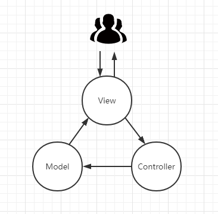
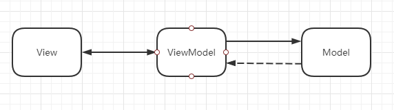
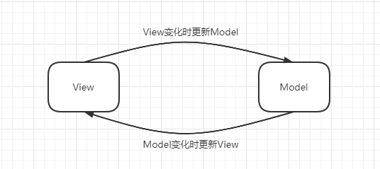
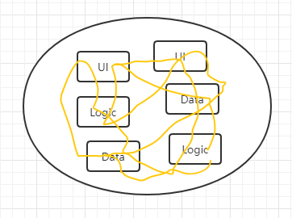
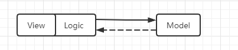
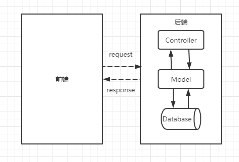
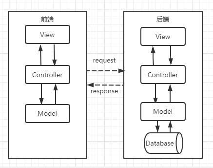

# MVC模式

## 什么是MVC模式

MVC模式是软件工程中的一种软件架构模式，把软件系统分为三个基本部分：模型（Model）、视图（View）和控制器（Controller）。模型负责数据的持久化，也就是存储；视图负责数据的输入和显示，直接和用户交互的一层，如大家看到的网站的页面内容、在表单上输入的数据；控制器负责具体的业务逻辑，根据用户的请求内容操作相应的模型和视图。


## MVC模式的核心思想

MVC模式到目前为止没有一个标准的定义，但它的应用却广泛到让每一个程序员都耳熟能详。不同的框架、不同的组织对MVC模式的理解都不太一样，“什么是标准的MVC模式”便成了众多程序员茶余饭后的一个话题。但有一点是公认的：MVC模式将程序分成了三层，即模型层（Model）、视图层（View）和控制层（Controller）。软件的分层是为了更好地对软件进行**解耦**，不同的层可以独立开发，既方便团队的分工合作，也增强了程序的可维护性。

### 与中介模式的联系

[中介模式](/design-patterns-base/3_dp-intermediary.html)通过一个中介对象来封装一系列的对象交互，使多个对象之间不需要显式地相互引用，从而使其耦合松散。MVC模式可以理解成对中介模式的一种延伸，可以将中介模式提升到一个更高的系统架构层次。MVC中的 Controller 就充当着中介的角色，负责把Model和View隔离开，协调M和V的协同工作。

### 与外观模式的联系

[外观模式](/design-patterns-base/9_dp-facade.html)的核心思想是：用一个简单的接口来封装一个复杂的系统，使这个系统更容易使用，也就是对软件进行分层，不同的层实现不同的功能。而MVC模式将这一思想应用到了极致，它将软件拆分成视图层、模型层和控制层。这种拆分方式被广泛应用于现今的很多软件，特别是Web网站。

## 从生活中领悟MVC模式

生活中很多人都喜欢摄影，但并不是所有人都知道相机的构成和工作流程。一部完整的（单反）相机主要由两部分组成：机身和镜头。机身通常会附带一个显示器，此外你还需要一张SD卡，当然电源也是必需的。因此相机的功能性部件有四个：镜头、机身、SD卡、显示器。它们各司其职，构成相机的完整功能。镜头用于采集图像，机身负责控制快门、光圈和感光度、拍摄的模式和功能等，SD卡用来存储图像，显示器用来查看图像、视频。用相机拍摄照片的整个工作流程大致是这样的：

1. 根据拍摄的场景和模特，通过机身的各个控制按钮调整好各项设置（快门、光圈和感光度、测光等）。
2. 进行构图和对焦。
3. 按下快门进行拍照，拍照的原理是通过镜头采集图像，光线通过镜头进入电子感应器，电子感应器接收光线并处理，转换成数字信号后记录到SD卡中。
4. 打开显示器查看拍摄的图像，观看拍摄的效果。

相机就是对MVC模式非常形象的一个比喻：SD卡相当于模型层（Model），进行图像的存储；镜头和显示器相当于视图层（View），分别负责采集图像和显示图像；而机身相当于控制层（Controller），负责拍摄相关的控制，以及对镜头、显示器和SD卡的相关调度。我们用程序来模拟一下用相机拍摄照片的整个工作流程：

``` python
# mvc模式 - 相机，定格最美瞬间
import random
# 引入随机数模块


class Camera:
    """相机机身"""

    # 对焦类型
    SingleFocus = "单点对焦"
    AreaFocus = "区域对焦"
    BigAreaFocus = "大区域对焦"
    Focus45 = "45点自动对焦"

    def __init__(self, name):
        self.__name = name
        self.__aperture = 0.0       # 光圈
        self.__shutterSpeed = 0     # 快门速度
        self.__lightSensitivity = 0 # 感光度
        self.__lens = Lens()        # 镜头
        self.__sdCard = SDCard()    # SD卡
        self.__display = Display()  # 显示器

    def shooting(self):
        """拍照"""
        print("[开始拍摄中")
        imageLighting = self.__lens.collecting()
        # 通过快门、光圈和感光度、测光来控制拍摄的过程，省略此部分
        image = self.__transferImage(imageLighting)
        self.__sdCard.addImage(image)
        print("拍摄完成]")

    def viewImage(self, index):
        """查看图像"""
        print("查看第%d张图像：" % (index + 1))
        image = self.__sdCard.getImage(index)
        self.__display.showImage(image)

    def __transferImage(self, imageLighting):
        """接收光线并处理成数字信号，简单模拟"""
        print("接收光线并处理成数字信号")
        return Image(6000, 4000, imageLighting)

    def setting(self, aperture, shutterSpeed, lightSensitivity):
        """设置相机的拍摄属性：光圈、快门、感光度"""
        self.__aperture = aperture
        self.__shutterSpeed = shutterSpeed
        self.__lightSensitivity = lightSensitivity

    def focusing(self, focusMode):
        """对焦，要通过镜头来调节焦点"""
        self.__lens.setFocus(focusMode)

    def showInfo(self):
        """显示相机的属性"""
        print("%s的设置   光圈：F%0.1f  快门：1/%d  感光度：ISO %d" %
              (self.__name, self.__aperture, self.__shutterSpeed, self.__lightSensitivity))


class Lens:
    """镜头"""

    def __init__(self):
        self.__focusMode = ''   # 对焦
        self.__scenes = {0 : '风光', 1 : '生态', 2 : '人文', 3 : '纪实', 4 : '人像', 5 : '建筑'}

    def setFocus(self, focusMode):
        self.__focusMode = focusMode

    def collecting(self):
        """图像采集，采用随机的方式来模拟自然的拍摄过程"""
        print("采集光线，%s" % self.__focusMode)
        index = random.randint(0, len(self.__scenes)-1)
        scens = self.__scenes[index]
        return "美丽的 " + scens + " 图像"


class Display:
    """显示器"""

    def showImage(self, image):
        print("图片大小：%d x %d，  图片内容：%s" % (image.getWidth(), image.getHeight(), image.getPix()))


class SDCard:
    """SD存储卡"""

    def __init__(self):
        self.__images = []

    def addImage(self, image):
        print("存储图像")
        self.__images.append(image)

    def getImage(self, index):
        if (index >= 0 and index < len(self.__images)):
            return self.__images[index]
        else:
            return None


class Image:
    """图像(图片), 方便起见用字符串来代码图像的内容(像素)"""

    def __init__(self, width, height, pixels):
        self.__width = width
        self.__height = height
        self.__pixels = pixels

    def getWidth(self):
        return self.__width

    def getHeight(self):
        return self.__height

    def getPix(self):
        return self.__pixels


def testCamera():
    camera = Camera("EOS 80D")
    camera.setting(3.5, 60, 200)
    camera.showInfo()
    camera.focusing(Camera.BigAreaFocus)
    camera.shooting()
    print()

    camera.setting(5.6, 720, 100)
    camera.showInfo()
    camera.focusing(Camera.Focus45)
    camera.shooting()
    print()

    camera.viewImage(0)
    camera.viewImage(1)


if __name__ == '__main__':
    testCamera()

"""
EOS 80D的设置   光圈：F3.5  快门：1/60  感光度：ISO 200
[开始拍摄中
采集光线，大区域对焦
接收光线并处理成数字信号
存储图像
拍摄完成]

EOS 80D的设置   光圈：F5.6  快门：1/720  感光度：ISO 100
[开始拍摄中
采集光线，45点自动对焦
接收光线并处理成数字信号
存储图像
拍摄完成]

查看第1张图像：
图片大小：6000 x 4000，  图片内容：美丽的 生态 图像
查看第2张图像：
图片大小：6000 x 4000，  图片内容：美丽的 纪实 图像
"""
```


## MVC模式技术的框架模型

### MVC

最初的MVC模式框架图如下：



1. User直接与View进行交互；
2. View传送指令到Controller；
3. Controller完成业务逻辑后，要求Model更新数据和状态；
4. Model将新的数据发送到View，用户得到反馈。

### MVP

MVP是MVC的一个变种，很多框架都自称遵循MVC模式，但是实际上它们实现的是MVP模式。MVP在MVC的基础上，**使用Presenter对视图和模型进行解耦，视图和模型独立发展，互不干扰，沟通都通过Presenter进行**。MVP模式框架图如下图所示：


1. Presenter相当于MVC中的Controller，负责业务逻辑的处理；
2. Model和View不能直接通信，只能通过Presenter间接地通信；
3. Presenter与Model、Presenter与View是双向通信；
4. Presenter协调和控制Model与View的工作。

其实MVP模式被应用得更为广泛，很多著名的框架都用的是这种模式，如Java的SpringMVC，PHP的Laravel。上述相机的示例代码也用的是这种模式。

### MVVM

MVVM也是MVC的一个变种。MVVM（Model-View-ViewModel）最早由微软提出，ViewModel指 “ModelofView”，即“视图的模型”，它将View的状态和行为抽象化，让我们可以将UI和业务逻辑分开。MVVM模式架构图如下所示：



在MVP中，Presenter负责协调和控制Model与View的工作，保证Model和View的数据实时同步和更新，但这个操作需要程序员写代码手动控制。而**MVVM中ViewModel把View和Model的同步逻辑自动化了**，以前Presenter负责的View和Model同步不再需要手动地进行操作，而是交给框架所提供的数据绑定功能来负责，只需要告诉它View显示的数据对应的是Model的哪一部分即可。

MVVM模式的最佳实践当属前端的Vue.js框架。Vue.js专注于MVVM中的ViewModel，不仅做到了数据**双向绑定**，而且也是一个相对轻量级的JS库。不同的框架实现双向数据绑定的技术有所不同，Vue采用数据劫持和发布-订阅模式的方式。双向数据绑定可以简单地理解为一个模板引擎，当视图改变时更新模型，当模型改变时更新视图，如下图所示：



从MVC到MVP，再到MVVM，就像一个打怪升级的过程，软件架构模式随着软件技术的升级而不断发展和延伸。

### 模型设计要点

MVC模式有三个关键的角色，在设计MVC模式时要找到并区分这些角色：

1. 模型（Model）：负责数据的存储和管理。
2. 视图（View）：负责数据的输入和显示，是直接和用户交互的一层。
3. 控制器（Controller）：负责具体的业务逻辑，根据用户的请求内容操作相应的模型和视图。

### 优缺点

优点：

1. 低耦合性。MVC模式将视图和模型分离，可以独立发展。
2. 高重用性和可适用性。对于某些应用，我们可能会有不同的端，如Web端、移动端、桌面端，但它们使用的用户数据是相同的，因此可以用同一套服务端代码，即M层和C层是相同的。
3. 快速开发，快速部署。有很多现成的框架本身就是采用MVC模式进行设计的，如Java的SpringMVC、PHP的ThinkPHP，采用这些框架可以快速地进行开发。
4. 方便团队合作。将软件分成三层后，可以由不同的人员负责不同的模块。


缺点：

1. 增加了系统结构和实现的复杂性。对于简单的界面，严格遵循MVC会使模型、视图与控制器分离，增加很多代码。


## 应用场景

MVC的应用可谓随处可见，几乎可在各大成熟的框架中看到它的影子。MVC最核心的思想是软件分层，将软件分成模型层、视图层和控制层。

最早期的软件，逻辑代码、界面代码、数据混杂在一起，像一碗意大利面。



后来有了数据库，有了各种存储介质，于是就有了模型层，但这时界面代码和逻辑代码还是混杂在一起的。如JSP代码中会同时掺杂HTML的网页代码和Java的控制代码，只是通过JavaBean将模型层给独立出去了；PHP的代码中也会同时包含HTML的网页代码和PHP的控制代码。



随着互联网的发展，网站的业务逻辑越来越复杂，这种 *前后端一站式* 的架构越来不能满足时代的要求。这时出现了前后端分离，前端一个项目，后端一个项目；前端通过AJAX请求后端的接口，后端负责业务逻辑和数据的存储，后端处理完请求后通过HTTP协议将数据返回给前端，如下图所示：



互联网发展非常迅速，数据越来越来多，业务也越来越复杂。为了响应快速开发、快速部署的要求，前后端都出现了很多成熟的框架，而每一个框架几乎都可用MVC模式来实现。这时，前端应用MVC模式（前端的Model并不持久化数据，只是缓存数据或临时数据），后端也用MVC模式。我们如果站在一个更高的层次看，整个网站也是一种MVC模式，前端相当于View，而后端同时负责Controller和Mode（服务器代码相当于Controller，数据库相当于Model）；用户直接与前端进行交互，根本不知道有后端的存在。



> 摘自： 罗伟富. 《人人都懂设计模式：从生活中领悟设计模式：Python实现》. 电子工业出版社
