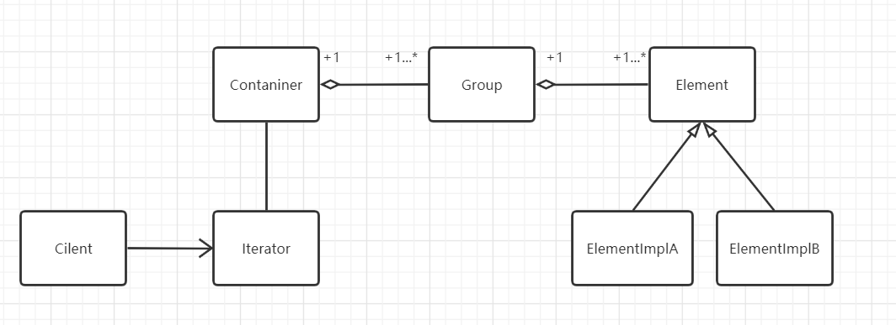

# 迭代模式

## 什么是迭代模式

> Provide a way to access the elements of an aggregate object sequentially without exposing its
>
> underlying representation.
>

提供一种方法顺序地访问一组聚合对象（一个容器）中的各个元素，而又不需要暴露该对象的内部细节。

## 迭代模式的设计思想

迭代模式也称为迭代器模式。迭代器其实就是一个指向容器中当前元素的指针，这个指针可以返回当前所指向的元素，可以移到下一个元素的位置，通过这个指针可以遍历容器中的所有元素。迭代器一般至少有以下两种方法。

- 获取当前所指向的元素：current（）。
- 将指针移至下一个元素：next（）。

这两个是最基本的方法，可以实现从前往后遍历各个元素，而一些更为丰富的迭代器可能还会有以下功能：

- 将指针移至起始的位置：toBegin（）。
- 将指针移至结尾的位置：toEnd（）。
- 将指针移至上一个元素： previous（）。

加上这些方法可以实现往前或者往后遍历。

## 从生活中领悟迭代模式

生活中排队取餐、排队就诊等都是迭代模式的例子，这里以医院使用排号系统，让病人排队就诊的为例：

``` python
# 迭代模式 - 医院排队挂号就诊，下一个就是你了


class Customer:
    """客户"""

    def __init__(self, name):
        self.__name = name
        self.__num = 0
        self.__clinics = None

    def getName(self):
        return self.__name

    def register(self, system):
        system.pushCustomer(self)

    def setNum(self, num):
        self.__num = num

    def getNum(self):
        return self.__num

    def setClinic(self, clinic):
        self.__clinics = clinic

    def getClinic(self):
        return self.__clinics


class NumeralIterator:
    """迭代器"""

    def __init__(self, data):
        self.__data = data
        self.__curIdx = -1

    def next(self):
        """移动至下一个元素"""
        if(self.__curIdx < len(self.__data) -1):
            self.__curIdx += 1
            return True
        else:
            return False

    def current(self):
        """获取当前的元素"""
        return self.__data[self.__curIdx] if (self.__curIdx < len(self.__data) and self.__curIdx >= 0) else None


class NumeralSystem:
    """排号系统"""

    __clinics = ("1号诊室", "2号诊室", "3号诊室")

    def __init__(self, name):
        self.__customers = []
        self.__curNum = 0
        self.__name = name

    def pushCustomer(self, customer):
        customer.setNum(self.__curNum + 1)
        click = NumeralSystem.__clinics[self.__curNum % len(NumeralSystem.__clinics)]
        customer.setClinic(click)
        self.__curNum += 1
        self.__customers.append(customer)
        print("%s 您好！您已在%s 成功挂号，序号：%04d，请耐心等待！" % (customer.getName(), self.__name, customer.getNum()))

    def getIterator(self):
        return NumeralIterator(self.__customers)


def testHospital():
    numeralSystem = NumeralSystem("挂号台")
    lily = Customer("Lily")
    lily.register(numeralSystem)
    pony = Customer("Pony")
    pony.register(numeralSystem)
    nick = Customer("Nick")
    nick.register(numeralSystem)
    tony = Customer("Tony")
    tony.register(numeralSystem)
    print()

    iterator = numeralSystem.getIterator()
    while(iterator.next()):
        customer = iterator.current()
        print("下一位病人 %04d（%s）请到 %s 就诊。"
              % (customer.getNum(), customer.getName(), customer.getClinic()))


if __name__ == "__main__":
    testHospital()


"""
Lily 您好！您已在挂号台 成功挂号，序号：0001，请耐心等待！
Pony 您好！您已在挂号台 成功挂号，序号：0002，请耐心等待！
Nick 您好！您已在挂号台 成功挂号，序号：0003，请耐心等待！
Tony 您好！您已在挂号台 成功挂号，序号：0004，请耐心等待！

下一位病人 0001（Lily）请到 1号诊室 就诊。
下一位病人 0002（Pony）请到 2号诊室 就诊。
下一位病人 0003（Nick）请到 3号诊室 就诊。
下一位病人 0004（Tony）请到 1号诊室 就诊。

Process finished with exit code 0
"""
```

客户拥有去挂号的功能，在排号系统挂号之后可以领取到一个排队序号（这里只是显示了序号）。

迭代器负责排号系统中客户的排号迭代。

排号系统提供挂号功能，对客户进行诊室的分配，提供一个迭代器给予外部访问。


## 迭代模式的框架模型

迭代器其实很简单，就是将数据进行"装纳"，并给予一些公开的接口，能够有序地去访问这些数据。迭代器通常有以下丰富的功能：

### 类图和实现

一个迭代器一般对应着一个容器类，而一个容器会包含多个元素，这些元素可能会有不同的子类。普通迭代模式的类图如下：


在实际项目开发可能会遇到更复杂的逻辑。例如，具有层级关系的组织架构：一个公司有A、B、C三个部门，每个部门有自己的成员，这时要遍历一个公司的所有成员，就会类似以下具有层级结构的迭代器模式类图：



这里公司对应Container，部门对应Group。我们并不遍历Group，而是按照一定的顺序遍历Group的每一个成员，一个Group遍历完成后，在遍历下一个Group。这样使用者只需要调用迭代next方法就可以遍历所有的成员，而不用关注内部的组织架构。

迭代模式重点是在迭代器的实现：

``` python
# 迭代模式 - 迭代器框架
class BaseIterator:
    """迭代器"""

    def __init__(self, data):
        self.__data = data
        self.toBegin()

    def toBegin(self):
        """将指针移至起始位置"""
        self.__curIdx = -1

    def toEnd(self):
        """将指针移至结尾位置"""
        self.__curIdx = len(self.__data)

    def next(self):
        """移动至下一个元素"""
        if(self.__curIdx < len(self.__data) - 1):
            self.__curIdx += 1
            return True
        else:
            return False

    def previous(self):
        """移动至上一个元素"""
        if(self.__curIdx > 0):
            self.__curIdx -= 1
            return True
        else:
            return False

    def current(self):
        """获取当前的元素"""
        return self.__data[self.__curIdx] if (self.__curIdx < len(self.__data) and self.__curIdx >= 0 ) else None


def testBaseIterator():
    print("从前往后遍历：")
    iterator = BaseIterator(range(0, 10))
    while(iterator.next()):
        customer = iterator.current()
        print(customer, end='\t')
    print()
    print("从后往前遍历")
    iterator.toEnd()
    while(iterator.previous()):
        customer = iterator.current()
        print(customer, end='\t')


if __name__ == "__main__":
    testBaseIterator()

"""
从前往后遍历：
0	1	2	3	4	5	6	7	8	9	
从后往前遍历
9	8	7	6	5	4	3	2	1	0	
"""
```

迭代器框架中，包含了上述提到的toBegin、toEnd、next、previous、current的方法，如果有想要有序遍历的数据只需要将数据传递给迭代器，再调用迭代器提供的方法去调用即可。

### 设计要点

1. 了解容器的数据结构及可能的层次结构。
2. 根据需要确定迭代器要实现的功能，如next()、previous()、current()、toBegin()、toEnd()中的一个或几个。

### 迭代模式优缺点

优点：

1. 迭代器模式将存储数据和遍历数据的职责分离
2. 简化了聚合数据的访问方式
3. 可支持多种不同的方式（如顺序和逆序）遍历一个聚合对象

缺点：

1. 需要额外增加迭代器的功能实现，增加新的聚合类时，可能需要增加新的迭代器。

## 应用场景

1. 集合的内部结构复杂，不想暴露对象的内部细节，只提供精简的访问方式。
2. 需要提供统一的访问接口，从而对不同的集合使用统一的算法。
3. 需要一系列聚合对象提供多种不同的访问方式。

> 摘自： 罗伟富. 《人人都懂设计模式：从生活中领悟设计模式：Python实现》. 电子工业出版社