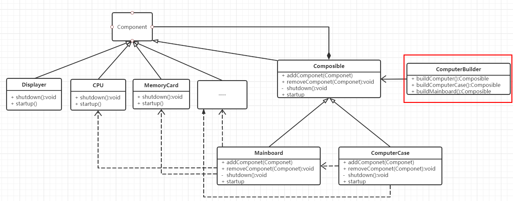
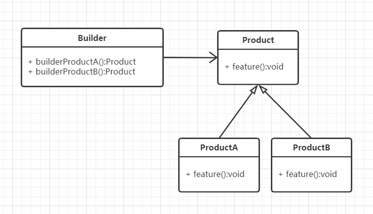
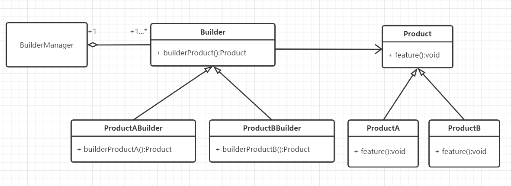

#  构建模式

## 什么是构建模式

> Separate the construction of a complex object from its representation so that the same construction process can create different representation.

将复杂对象的构建过程与其表现分离，以便相同的构建过程可以创建不同的表现。

小时候玩搭积木，把不同的部件拼装成自己想要的东西的过程，就是一个构建过程。构建，顾名思义就是把各种部件通过一定的方式和流程构造成一个成品的过程。在程序中，我们将这一过程称为构建模式（Builder Pattern，也叫建造者模式或生成器模式）。

构建模式还是比较常用的一种设计模式，常常用于有多个对象需要创建且每个对象都有比较复杂的内部结构。


## 构建模式的设计思想

构建模式的核心思想是：将产品的创建过程与产品本身分离开来，使得创建过程更加清晰，能够更加精确地控制复杂对象的创建过程，让使用者可以用相同的创建过程创建不同的产品。

构建模式是一个产品或对象的生成器，强调产品的构建过程，与工厂模式、组合模式有一定区别：

### 与工厂模式的区别

*工厂模式  关注的是整个产品（整体对象）的生成，即成品的生成*；而构建模式关注的是产品的创建过程和细节，一步一步地由各个子部件构建为一个成品。比如要创建一辆汽车，如果用工厂模式，直接就创建一辆有车身、轮胎、发动机的能用的汽车。如果用构建模式，则需要由车身、轮胎、发动机一步一步地组装成一辆汽车。

### 与组合模式的区别

*组合模式关注的是对象内部的组成结构，强调的是部分与整体的关系*。构建模式关注的是对象的创建过程，即由一个一个的子部件构建一个成品的过程。组合模式和构建模式其实也经常被一起使用。

以组装电脑为例，组合模式和构建模式一起使用。ComputerBuilder就是构建者，负责整个电脑的组装过程：先把内存卡、硬盘、CPU组装在主板上，再把主板、电池、风扇组装在机箱里，最后连接鼠标、键盘、显示器，就构成了一台完整的台式电脑。




## 从生活中领悟构建模式

以小时候的玩具搭积木为例说明构建模式：搭积木，造一辆车或一个花园。

```python
# 构建模式 - 积木玩具，一辆车还是一个庄园
from abc import ABCMeta, abstractmethod


class Toy(metaclass=ABCMeta):
    """玩具"""

    def __init__(self, name):
        self._name = name
        self.__components = []

    def getName(self):
        return self._name

    def addComponent(self, component, count = 1, unit = "个"):
        self.__components.append([component, count, unit])
        print("%s 增加了 %d %s%s" % (self._name, count, unit, component))

    @abstractmethod
    def feature(self):
        pass


class Car(Toy):
    """小车"""

    def feature(self):
        print("我是 %s, 我可以快速奔跑······" % self._name)


class Manor(Toy):
    """庄园"""

    def feature(self):
        print("我是 %s, 可供观赏，也可用来游玩······" % self._name)


class ToyBuilder:
    """玩具构建者"""

    def buildCar(self):
        car = Car("迷你小车")
        print("正在构建 %s ······" % car.getName())
        car.addComponent("轮子", 4)
        car.addComponent("车身", 1)
        car.addComponent("发送机", 1)
        car.addComponent("方向盘")
        return car

    def buildManor(self):
        manor = Manor("淘淘小庄园")
        print("正在构建 %s ······" % manor.getName())
        manor.addComponent("客厅", 1, "间")
        manor.addComponent("卧室", 2, "间")
        manor.addComponent("书房", 1, "间")
        manor.addComponent("厨房", 1, "间")
        manor.addComponent("花园", 1)
        manor.addComponent("厕所", 1, "间")
        manor.addComponent("阳台", 1)
        manor.addComponent("围墙", 1, "堵")
        return manor


def testBuilder():
    builder = ToyBuilder()
    car = builder.buildCar()
    car.feature()

    print()
    mannor =builder.buildManor()
    mannor.feature()


if __name__ == '__main__':
    testBuilder()

"""
正在构建 迷你小车 ······
迷你小车 增加了 4 个轮子
迷你小车 增加了 1 个车身
迷你小车 增加了 1 个发送机
迷你小车 增加了 1 个方向盘
我是 迷你小车, 我可以快速奔跑······

正在构建 淘淘小庄园 ······
淘淘小庄园 增加了 1 间客厅
淘淘小庄园 增加了 2 间卧室
淘淘小庄园 增加了 1 间书房
淘淘小庄园 增加了 1 间厨房
淘淘小庄园 增加了 1 个花园
淘淘小庄园 增加了 1 间厕所
淘淘小庄园 增加了 1 个阳台
淘淘小庄园 增加了 1 堵围墙
我是 淘淘小庄园, 可供观赏，也可用来游玩······
"""
```


## 构建模式的框架模型

 对搭积木剧情代码抽象出构建模式的框架模型：

### 类图和实现

精简版构建模式类图：

 

Builder：一个构建者，如示例中的ToyBuilder。

Product：要构建成的目标产品的基类，如示例中的Toy。

ProductA/B：是具体的产品类型，如示例中的Car和Manor。

当产品的类型越来越多，构建者（Builder）就会变得越来越臃肿且难以管理，上述模型是无法解决的。例如，示例中的ToyBuilder通过不同的积木模块和建造顺序，可以建造出不同的车和庄园。如果应用场景更复杂一些，如：Toy不只有车（Car）和庄园（Manor），还有飞机、坦克、摩天轮、过山车等，而且不只造一辆车和一个庄园，数量由孩子（用户）自己定，想要几个就几个。这个时候就要对这个类图模型进行升级改造。

如下是升级版构建模式的类图：



引入一个构建管理类(BuilderManager，很多资料和书籍中称它为导演类Director)，负责管理每一种产品的创建数量和创建顺序。然后对原先的Builder进行抽象，细分出ProductABuilder和ProductBBuilder，分别是对应产品的具体构建类，由它们各自负责构建自家的产品，


基于升级版构建模式框架重构示例（这里为了节省篇幅，省略Toy、Car、Manor类，因为他们之前的示例是一样的）：

```python
# 构建模式，基于框架模型 - 积木玩具，一辆车还是一个庄园
from abc import ABCMeta, abstractmethod


class ToyBuilder(metaclass=ABCMeta):
    """玩具构建者"""

    @abstractmethod
    def buildProduct(self):
        pass


class CarBuilder(ToyBuilder):
    """车的构建类"""

    def buildProduct(self):
        car = Car("迷你小车")
        print("正在构建 %s ······" % car.getName())
        car.addComponent("轮子", 4)
        car.addComponent("车身", 1)
        car.addComponent("发送机", 1)
        car.addComponent("方向盘")
        return car


class ManorBuilder(ToyBuilder):
    """庄园的构建类"""

    def buildProduct(self):
        manor = Manor("淘淘小庄园")
        print("正在构建 %s ······" % manor.getName())
        manor.addComponent("客厅", 1, "间")
        manor.addComponent("卧室", 2, "间")
        manor.addComponent("书房", 1, "间")
        manor.addComponent("厨房", 1, "间")
        manor.addComponent("花园", 1)
        manor.addComponent("厕所", 1, "间")
        manor.addComponent("阳台", 1)
        manor.addComponent("围墙", 1, "堵")
        return manor


class BuilderMgr:
    """构建类的管理类"""

    def __init__(self):
        self.__carBuilder = CarBuilder()
        self.__manorBuilder = ManorBuilder()

    def buildCar(self, num):
        count = 0
        products = []
        while(count < num):
            car = self.__carBuilder.buildProduct()
            products.append(car)
            count += 1
            print("建造完成第 %d 辆 %s" % (count, car.getName()))
        return products

    def buildManor(self, num):
        count = 0
        products = []
        while(count < num):
            manor = self.__manorBuilder.buildProduct()
            products.append(manor)
            count += 1
            print("建造完成第 %d 个 %s" % (count, manor.getName()))
        return products


def testAdvancedBuilder():
    builderMgr = BuilderMgr()
    builderMgr.buildCar(1)

    print()
    builderMgr.buildManor(1)


if __name__ == '__main__':
    testAdvancedBuilder()


"""
同之前示例结果
"""
```

### 设计要点

升级版的构建模式中主要有三个角色，在设计构建模式时要找到并区分这些角色。

1. 产品（Product）：即你要构建的对象。
2. 构建者（Builder）：构建模式的核心类，负责产品的构建过程。
3. 指挥者（BuilderManager）：构建的管理类，负责管理每一种产品的创建数量和创建顺序。1）（2）（3）

### 构建模式优缺点

 优点：

1. 将产品（对象）的创建过程与产品（对象）本身分离开来，让使用方（调用者）可以用相同的创建过程创建不同的产品（对象）。
2. 将对象的创建过程单独分解出来，使得创建过程更加清晰，能够更加精确地控制复杂对象的创建过程。
3. 针对升级版的构建模式，每一个具体构建者都相对独立，而与其他的具体构建者无关，因此可以很方便地替换具体构建者或增加新的具体构建者。

缺点：

1. 增加了很多创建类，如果产品的类型和种类比较多，将会增加很多类，使整个系统变得更加庞杂。

2. 产品之间的结构相差很大时，构建模式将很难适应。

   

## 应用场景

1. 产品（对象）的创建过程比较复杂，希望将产品的创建过程和它本身的功能分离开来。

2. 产品有很多种类，每个种类之间内部结构比较类似，但有很多差异；不同的创建顺序或不同的组合方式，将创建不同的产品。

   例如：比如程序员都熟悉的XML，是由很多标签组成的一种树形结构的文档或文本内容，每个标签可以有多个属性或子标签。如果我们要增加一些自定义的XML元素，就可以使用构建模式。因为每个元素都有类似的内部结构（都是树形的标签结构），但每个元素都有自己不同的属性和子标签（且含义各不相同）。

>  摘自： 罗伟富. 《人人都懂设计模式：从生活中领悟设计模式：Python实现》. 电子工业出版社