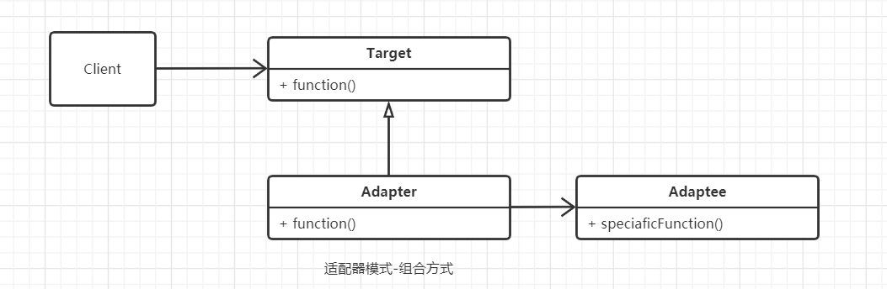
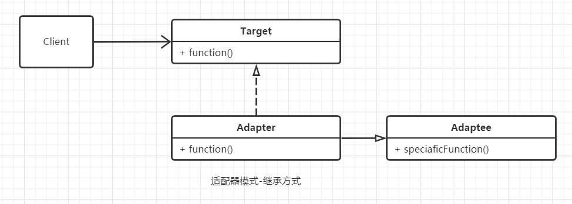
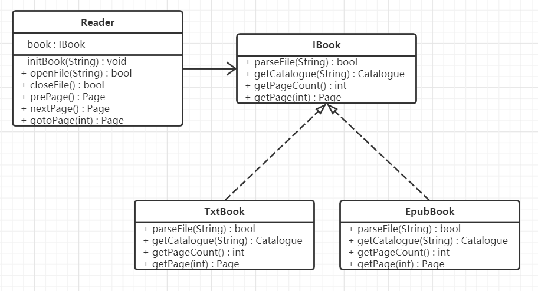
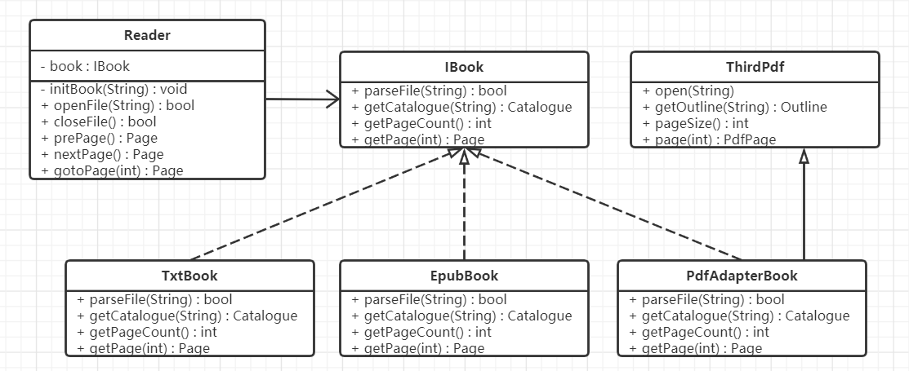

#  适配器模式

## 什么是适配器模式

> Convert the interface of a class into another interface clients expect. Adapter lets classes work together that couldn't otherwise because of incompatible interfaces.

将一个类的接口变成客户端所期望的另一种接口，从而使原本因接口不匹配而无法一起工作的两个类能够在一起工作。这就是适配模式，又叫包装（Wrapper）模式。

适配器模式的作用：

1. 接口转换，将原有的接口（或方法）转换成另一种接口。
2. 用新的接口包装一个已有的类。
3. 匹配一个老的组件到一个新的接口。


## 适配器模式的设计思想

适配器模式的核心思想是：将一个对象经过包装或转换后使它符合指定的接口，使得调用方可以像使用接口的一般对象一样使用它。适配模式通常用于对已有的系统进行新功能拓展，尤其适用于在设计良好的系统框架下接入第三方的接口或第三方的SDK。在系统的最初设计阶段，最好不要把适配模式考虑进去，除非一些特殊的场景，例如系统本身就是要对接和适配多种类型的硬件接口。


## 从生活中领悟适配器模式

适配器的思想在生活中可谓处处可见，例如插座转换器，具有电压转换功能的变压器插座，各种转接头，如MiniDP转HDMI接头、HDMI转VGA线转换器、MicroUSB转Type-C接头等等。下面以去香港旅游时经常遇到的插座适配器为例，中国香港的插座大多是英标插座（T字方型3针脚），而我们中国大陆使用的是国标插座（八字扁型3针脚），所以经常使用一个适配器，将英标插座转换为国标插座来给我们的数码产品充电。

```python
# 适配模式-插座适配器

from abc import ABCMeta, abstractmethod
# 引入ABCMeta和abstractmethod来定义抽象类和抽象方法


class SocketEntity:
    """插座接口类型定义"""

    def __init__(self, numOfPin, typeOfPin):
        self.__numOfPin = numOfPin  # 针数
        self.__typeOfPin = typeOfPin  # 插座类型

    def getNumOfPin(self):
        return self.__numOfPin

    def setNumOfPin(self, numOfPin):
        self.__numOfPin = numOfPin

    def getTypeOfPin(self):
        return self.__typeOfPin

    def setTypeOfPin(self, typeOfPin):
        self.__typeOfPin = typeOfPin


class ISocket(metaclass=ABCMeta):
    """插座类型"""

    def getName(self):
        """插座名称"""
        pass

    def getSocket(self):
        """获取接口"""
        pass


class ChineseSocket(ISocket):
    """国标插座"""

    def getName(self):
        return "国标插座"

    def getSocket(self):
        return SocketEntity(3, "八字扁型")


class BritishSocket:
    """英标插座"""

    def name(self):
        return "英标插座"

    def socketInterface(self):
        return SocketEntity(3, "T字方型")


class AdapterSocket(ISocket):
    """插座转换器"""

    def __init__(self, britishSocket):
        self.__britishSocket = britishSocket

    def getName(self):
        return self.__britishSocket.name() + "转换器"

    def getSocket(self):
        socket = self.__britishSocket.socketInterface()
        socket.setTypeOfPin("八字扁型")
        return socket


def canChargeforDigtalDevice(name, socket):
    if socket.getNumOfPin() == 3 and socket.getTypeOfPin() == "八字扁型":
        isStandard = "符合"
        canCharge = "可以"
    else:
        isStandard = "不符合"
        canCharge = "不能"

    print("[%s]：\n针脚数量：%d，针脚类型：%s； %s中国标准，%s给大陆的电子设备充电！"
          % (name, socket.getNumOfPin(), socket.getTypeOfPin(), isStandard, canCharge))


def testSocket():
    chineseSocket = ChineseSocket()
    canChargeforDigtalDevice(chineseSocket.getName(), chineseSocket.getSocket())

    britishSocket = BritishSocket()
    canChargeforDigtalDevice(britishSocket.name(), britishSocket.socketInterface())

    adapterSocket = AdapterSocket(britishSocket)
    canChargeforDigtalDevice(adapterSocket.getName(), adapterSocket.getSocket())


if __name__ == "__main__":
    testSocket()

"""
[国标插座]：
针脚数量：3，针脚类型：八字扁型； 符合中国标准，可以给大陆的电子设备充电！
[英标插座]：
针脚数量：3，针脚类型：T字方型； 不符合中国标准，不能给大陆的电子设备充电！
[英标插座转换器]：
针脚数量：3，针脚类型：八字扁型； 符合中国标准，可以给大陆的电子设备充电！
"""
```

这个示例中，使用插座转换器将英标插口转换为国标插口，解决了因为接口不同而不能给电子设备充电的问题，像这种将原本不匹配某种功能的对象转变变得匹配这种功能，在程序中就叫做适配模式。


## 适配器模式的框架模型

 对插座转换器示例代码抽象出适配器模式的框架模型：

### 类图和实现

适配器模式有两种实现方式：一种是组合方式，另一种是继承方式。

 

 

Target：一个接口类，是提供给用户调用的接口抽象，如示例中的ISocket。

Adaptee：是要进行适配的对象类，如示例中的BritishSocket。

Adapter：是一个适配器，是对Adaptee的适配，它将Adaptee的对象转换（包装）成符合Target接口的对象。如示例中的AdapterSocket，它将BritishSocket的name（）和socketInterface（）方法包装成成ISocket的getName（）和getSocket（）接口。

**适配模式的两种实现方式，比较推荐组合的方式，**因为在一些没有interface类型的编程语言（如C++、Python）中，Adapter类就会多继承，同时继承Target和Adaptee，在程序设计中应该尽量避免多继承（虽然Target只是一个接口类）。  

代码实现：

```python
# 适配模式-代码框架

from abc import ABCMeta, abstractmethod
# 引入ABCMeta和abstractmethod来定义抽象类和抽象方法


class Target(metaclass=ABCMeta):
    """目标类"""

    @abstractmethod
    def function(self):
        pass


class Adaptee:
    """源对象类，被适配对象"""

    def speciaficFunction(self):
        print("被适配对象的特殊功能")


class Adapter(Target):
    """适配器"""

    def __init__(self, adaptee):
        self.__adaptee = adaptee

    def function(self):
        print("进行功能的转换")
        self.__adaptee.speciaficFunction()

```

### 设计要点

适配器模式中主要有三个角色，在设计适配器模式时要找到并区分这些角色。

1. 目标（Target）：即你期望的目标接口，要转换成的接口。
2. 源对象（Adaptee）：即要被转换的角色，要把谁转换成目标角色。
3. 适配器（Adapter）：适配模式的核心角色，负责把源对象转换和包装成目标对象。

### 适配器模式优缺点

 优点：

1. 可以让两个没有关联的类一起运行，起中间转换的作用。
2. 提高了类的复用率。
3. 灵活性好，不会破坏原有系统。

缺点：

1. 如果原有系统没有设计好（如Target不是抽象类或接口，而是一个实体类），适配模式将很难实现。

2. 过多地使用适配器，容易使代码结构混乱，如明明看到调用的是A接口，内部调用的却是B接口的实现。

   

## 实战应用

假如有一个电子书阅读器的项目（Reader），研发之初，经过各方讨论，产品经理最后告诉我们只支持TXT和Epub格式的电子书。然后经过仔细思考、精心设计，采用了如下图所示的类图结构。



在这个类图中，有一个阅读器的核心类Reader，一个TXT文档的关键类TxtBook（负责TXT格式文件的解析），以及一个Epub文档的关键类EpubBook（负责Epub格式文件的解析）。

产品上线半年后，市场反响良好，业务部门反映：有很多办公人员也在用我们的阅读器，他们希望这个阅读器能同时支持PDF格式，这样就不用在多个阅读器之间来回切换了。这时我们的程序就需要增加对PDF格式的支持，而支持PDF格式并不是核心业务，我们不会单独为其开发一套PDF解析内核，而会使用一些开源的PDF库（我们称它为第三方库），如MuPDF、TCPDF等。而开源库的接口和我们的接口并不相同，返回的内容也不是我们直接需要的，需要经过一些转换才能符合我们的要求。



这时，我们就需要对第三方的PDF解析库（如MuPDF）进行适配，这个时候我们就可以使用适配器模式来实现这个需求。

```python
# 适配模式-实战电子书阅读器

from abc import ABCMeta, abstractmethod, ABC
# 引入ABCMeta和abstractmethod来定义抽象类和抽象方法
import os
# 导入os库,用于文件、路径相关的解析


class Page:
    """电子书一页的内容"""

    def __init__(self, pageNum):
        self.__pageNum = pageNum

    def getContent(self):
        return "第 " + str(self.__pageNum) + " 页的内容"


class Catalogue:
    """目录结构"""

    def __init__(self, title):
        self.__title = title
        self.__chapters = []

    def addChapter(self, title):
        self.__chapters.append(title)

    def showInfo(self):
        print("书名：" + self.__title)
        print("目录：")
        for chapter in self.__chapters:
            print("    " + chapter)


class IBook(metaclass=ABCMeta):
    """电子书文档的接口类"""

    @abstractmethod
    def parseFile(self, filePath):
        """解析文档"""
        pass

    @abstractmethod
    def getCatalogue(self):
        """获取目录"""
        pass

    @abstractmethod
    def getPage(self, pageNum):
        """获取第pageNum页的内容"""
        pass


class TxtBook(IBook, ABC):
    """txt解析类"""

    def parseFile(self, filePath):
        # 模拟文档的解析
        print(filePath + " 文件解析成功")
        self.__title = os.path.splitext(filePath)[0]
        self.__pageCount = 800
        return True

    def getCatalogue(self):
        catelogue = Catalogue(self.__title)
        catelogue.addChapter("第一章 标题")
        catelogue.addChapter("第二章 标题")
        return catelogue

    def getPageCount(self):
        return self.__pageCount

    def getPage(self, pageNum):
        return Page(pageNum)


class EpubBook(IBook, ABC):
    """Epub解析类"""

    def parseFile(self, filePath):
        # 模拟文档的解析
        print(filePath + " 文件解析成功")
        self.__title = os.path.splitext(filePath)[0]
        self.__pageCount = 800
        return True

    def getCatalogue(self):
        catelogue = Catalogue(self.__title)
        catelogue.addChapter("第一章 标题")
        catelogue.addChapter("第二章 标题")
        return catelogue

    def getPageCount(self):
        return self.__pageCount

    def getPage(self, pageNum):
        return Page(pageNum)


class Outline:
    """第三方PDF解析库的目录类"""

    def __init__(self):
        self.__outlines = []

    def addOutline(self, title):
        self.__outlines.append(title)

    def getOutlines(self):
        return self.__outlines


class PdfPage:
    """PDF页"""

    def __init__(self, pageNum):
        self.__pageNum = pageNum

    def getPageNum(self):
        return self.__pageNum


class ThirdPdf:
    """第三方PDF解析库"""

    def __init__(self):
        self.__pageSize = 0
        self.__title = ""

    def open(self, filePath):
        print("第三方库解析PDF文件：" + filePath)
        self.__title = os.path.splitext(filePath)[0]
        self.__pageCount = 1000
        return True

    def getTitle(self):
        return self.__title

    def getOutLine(self):
        outline = Outline()
        outline.addOutline("第一章 PDF电子书标题")
        outline.addOutline("第二章 PDF电子书标题")
        return outline

    def pageSize(self):
        return self.__pageSize

    def page(self, index):
        return PdfPage(index)


class PdfAdapterBook(ThirdPdf, IBook):
    """对第三方的PDF解析库重新进行包装"""

    def __init__(self, thirdPdf):
        self.__thirdPdf = thirdPdf

    def parseFile(self, filePath):
        # 模拟文档的解析
        rtn = self.__thirdPdf.open(filePath)
        if(rtn):
            print(filePath + "文件解析成功")
        return rtn

    def getCatalogue(self):
        outline = self.__thirdPdf.getOutLine()
        print("将Outline结构的目录转换成Catalogue结构的目录")
        catalogue = Catalogue(self.__thirdPdf.getTitle())
        for title in outline.getOutlines():
            catalogue.addChapter(title)
        return catalogue

    def getPageCount(self):
        return self.__thirdPdf.pageSize()

    def getPage(self, pageNum):
        page = self.__thirdPdf.page(pageNum)
        print("将PdfPage的面向对象转换成Page的对象")
        return Page(page.getPageNum())


class Reader:
    """阅读器"""

    def __init__(self, name):
        self.__name = name
        self.__filePath = ""
        self.__curBook = None
        self.__curPageNum = -1

    def __initBook(self, filePath):
        self.__filePath = filePath
        extName = os.path.splitext(filePath)[1]
        if(extName.lower() == ".epub"):
            self.__curBook = EpubBook()
        elif(extName.lower() == ".txt"):
            self.__curBook = TxtBook()
        elif (extName.lower() == ".pdf"):
            self.__curBook = PdfAdapterBook(ThirdPdf())
        else:
            self.__curBook = None

    def openFile(self, filePath):
        self.__initBook(filePath)
        if(self.__curBook is not None):
            rtn = self.__curBook.parseFile(filePath)
            if(rtn):
                self.__curPageNum = 1
            return rtn
        return False

    def closeFile(self):
        print("关闭 " + self.__filePath + "文件")
        return True

    def showCatalogue(self):
        catalogue = self.__curBook.getCatalogue()
        catalogue.showInfo()

    def prePage(self):
        print("往前翻一页：", end="")
        return self.gotoPage(self.__curPageNum - 1)

    def nextPage(self):
        print("往后翻一页：", end="")
        return self.gotoPage(self.__curPageNum + 1)

    def gotoPage(self, pageNum):
        if(pageNum > 1 and pageNum < self.__curBook.getPageCount() - 1):
            self.__curPageNum = pageNum
        print("显示第" + str(self.__curPageNum) + "页")
        page = self.__curBook.getPage(self.__curPageNum)
        page.getContent()
        return page


def testReaderBase(fileName, reader):
    if (not reader.openFile(fileName)):
        return
    reader.showCatalogue()
    reader.prePage()
    reader.nextPage()
    reader.nextPage()
    reader.closeFile()
    print()


def testReader():
    reader = Reader("阅读器")
    testReaderBase("背影.txt", reader)
    testReaderBase("解忧杂货铺.epub", reader)
    testReaderBase("如何从生活中领悟设计模式.pdf", reader)


if __name__ == '__main__':
    testReader()

"""
背影.txt 文件解析成功
书名：背影
目录：
    第一章 标题
    第二章 标题
往前翻一页：显示第1页
往后翻一页：显示第2页
往后翻一页：显示第3页
关闭 背影.txt文件

解忧杂货铺.epub 文件解析成功
书名：解忧杂货铺
目录：
    第一章 标题
    第二章 标题
往前翻一页：显示第1页
往后翻一页：显示第2页
往后翻一页：显示第3页
关闭 解忧杂货铺.epub文件

第三方库解析PDF文件：如何从生活中领悟设计模式.pdf
如何从生活中领悟设计模式.pdf文件解析成功
将Outline结构的目录转换成Catalogue结构的目录
书名：如何从生活中领悟设计模式
目录：
    第一章 PDF电子书标题
    第二章 PDF电子书标题
往前翻一页：显示第1页
将PdfPage的面向对象转换成Page的对象
往后翻一页：显示第1页
将PdfPage的面向对象转换成Page的对象
往后翻一页：显示第1页
将PdfPage的面向对象转换成Page的对象
关闭 如何从生活中领悟设计模式.pdf文件

"""
```


## 应用场景

1. 系统需要使用现有的类，而这些类的接口不符合现有系统的要求。
2. 对已有的系统拓展新功能，尤其适用于在设计良好的系统框架下增加接入第三方的接口或第三方的SDK。

>  摘自： 罗伟富. 《人人都懂设计模式：从生活中领悟设计模式：Python实现》. 电子工业出版社