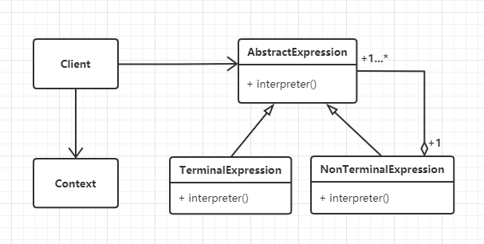

#  解释模式

## 什么是解释模式

> Given a language, define a representation for its grammar along with an interpreter that uses the representation to interpret sentences in the language.
>

给定一种语言，定义其语法的表示，以及使用该表示来解释该语言中的句子的解释器。


## 解释模式的设计思想

解释模式又叫解释器模式，它是一种使用频率相对较低但学习难度较大的设计模式，**它用于描述如何使用面向对象语言构建一个简单的语言解释器**。在某些情况下，为了更好地描述某些特定类型的问题，我们可以创建一种新的语言，这种语言拥有自己的表达式和结构，即文法规则（编译原理学科的概念），这些问题的实例将对应为该语言中的句子。如在金融业务中，经常需要定义一些模型运算来统计、分析大量的金融数据，从而窥探一些商业发展趋势。


## 解释模式的框架模型

### 类图



AbstractExpression：解释器的抽象类，定义统一的解析方法。

TerminalExpression：终结符表达式，终结符表达式是语法中的最小单元逻辑，不可再拆分。如接下来示例中的VarExpression。

NonTerminalExpression：非终结符表达式，语法中每一条规则对应一个非终结符表达式。如接下来示例中中的AddExpression和SubExpression。

Context：上下文环境类，包含解析器之外的一些全局信息，如接下来示例中的newExp和expressionMap。


## 实战应用
我们用数学中最简单的加减法来看解释模式的应用。假设有两个表达式规则：a+b+c和a+b-c，下面用解释模式
式来实现这两个表达式规则的解析流程。

使用代码实现如下：

```python
# 解释模式应用 - 模拟加减法文法

from abc import ABCMeta, abstractmethod
# 引入ABCMeta和abstractmethod来定义抽象类和抽象方法


class Expression(metaclass=ABCMeta):
    """抽象表达式"""

    @abstractmethod
    def interpreter(self, var):
        pass


class VarExpression(Expression):
    """变量解析器"""

    def __init__(self, key):
        self.__key = key

    def interpreter(self, var):
        return var.get(self.__key)


class SymbolExpression(Expression):
    """运算符解析器，运算符的抽象类"""

    def __init__(self, left, right):
        self._left = left
        self._right = right


class AddExpression(SymbolExpression):
    """加法解析器"""

    def __init__(self, left, right):
        super().__init__(left, right)

    def interpreter(self, var):
        return self._left.interpreter(var) + self._right.interpreter(var)


class SubExpression(SymbolExpression):
    """减法解析器"""

    def __init__(self, left, right):
        super().__init__(left, right)

    def interpreter(self, var):
        return self._left.interpreter(var) - self._right.interpreter(var)


class Stack:
    """封装一个堆栈类"""

    def __init__(self):
        self.items = []

    def isEmpty(self):
        return len(self.items) == 0

    def push(self, item):
        self.items.append(item)

    def pop(self):
        return self.items.pop()

    def peek(self):
        if not self.isEmpty():
            return self.items[len(self.items) - 1]

    def size(self):
        return len(self.items)


class Calculator:
    """计算器类"""

    def __init__(self, text):
        self.__expression = self.parserText(text)

    def parserText(self, expText):
        # 定义一个栈，处理运算的先后顺序
        stack = Stack()
        left = right = None # 左右表达式
        idx = 0
        while(idx < len(expText)):
            if (expText[idx] == '+'):
                left = stack.pop()
                idx += 1
                right = VarExpression(expText[idx])
                stack.push(AddExpression(left, right))
            elif(expText[idx] == '-'):
                left = stack.pop()
                idx += 1
                right = VarExpression(expText[idx])
                stack.push(SubExpression(left, right))
            else:
                stack.push(VarExpression(expText[idx]))
            idx += 1
        return stack.pop()

    def run(self, var):
        return self.__expression.interpreter(var)

def testCalculator():
    # 获取表达式
    expStr = input("请输入表达式：")
    # 获取各参数的键值对
    newExp, expressionMap = getMapValue(expStr)
    calculator = Calculator(newExp)
    result = calculator.run(expressionMap)
    print("运算结果为:" + expStr + " = " + str(result))


def getMapValue(expStr):
    preIdx = 0
    expressionMap = {}
    newExp = []
    for i in range(0, len(expStr)):
        if (expStr[i] == '+' or expStr[i] == '-'):
            key = expStr[preIdx:i]
            key = key.strip()  # 去除前后空字符
            newExp.append(key)
            newExp.append(expStr[i])
            var = input("请输入参数" + key + "的值：");
            var = var.strip()
            expressionMap[key] = float(var)
            preIdx = i + 1

    # 处理最后一个参数
    key = expStr[preIdx:len(expStr)]
    key = key.strip()  # 去除前后空字符
    newExp.append(key)
    var = input("请输入参数" + key + "的值：")
    var = var.strip()
    expressionMap[key] = float(var)

    return newExp, expressionMap


if __name__ == '__main__':
    testCalculator()

"""
请输入表达式：a + b - c + d
请输入参数a的值：2020
请输入参数b的值：1
请输入参数c的值：1997
请输入参数d的值：2
运算结果为:a + b - c + d = 26.0
"""


```


## 应用场景

1. 解释模式是一个简单的语法分析工具，最显著的优点是拓展性好，修改语法规则只要修改相应的非终结符表达式就可以了。解释模式在实际的项目开发中应用得比较少，因为实现复杂，较难维护，但在一些特定的领域还是会被用到的，如数据分析、科学计算、数据统计与报表分析。

   

>  摘自： 罗伟富. 《人人都懂设计模式：从生活中领悟设计模式：Python实现》. 电子工业出版社