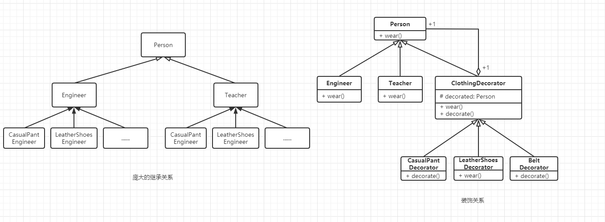
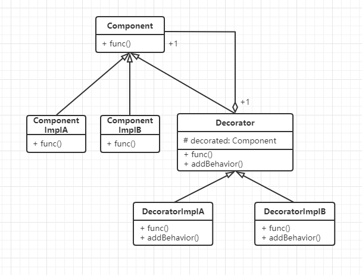

# 装饰模式

## 什么是装饰模式

> Attach additional responsibilities to an object dynamically.Decorators provide a flexible alternative to subclassing for extending functionality.

 装饰模式能够动态地将额外的一些职责附加到一个对象。 装饰器为扩展功能提供了比生成子类的方式更灵活的选择。也就是说装饰模式的显著作用是：将结构庞大的子类继承关系转换成结构紧凑的装饰关系。

装饰模式是面向对象的编程思想，修饰的是某个类中的指定方法，只对修饰的这一个对象起效。


## 装饰模式的设计思想

装饰模式的设计思想是使继承关系的类结构更加清晰、紧凑，这样的好处是能够在不改动原有代码的情况下，能够给一个类增加额外的功能，也就是能够进行功能扩展。


## 从生活中领悟装饰模式

生活中的着装问题，就是程序中装饰模式的典型样例。

``` python
# 装饰模式，衣服穿搭-- Version 1.0.0
from abc import ABCMeta, abstractmethod
# 引入ABCMeta和abstractmethod来定义抽象类和抽象方法


class Person(metaclass=ABCMeta):
    """人"""

    def __init__(self, name):
        self._name = name

    @abstractmethod
    def wear(self):
        print("着装：")


class Engineer(Person):
    """工程师"""

    def __init__(self, name, skill):
        super().__init__(name)
        self.__skill = skill

    def getSkill(self):
        return self.__skill

    def wear(self):
        print("我是 " + self.getSkill() + "工程师 " + self._name, end="， ")
        super().wear()


class Teacher(Person):
    """教师"""

    def __init__(self, name, title):
        super().__init__(name)
        self.__title = title

    def getTitle(self):
        return self.__title

    def wear(self):
        print("我是 " + self._name + self.getTitle(), end="， ")
        super().wear()


class ClothingDecorator(Person):
    """服装装饰器的基类"""

    def __init__(self, person):
        self._decorated = person

    def wear(self):
        self._decorated.wear()
        self.decorate()

    @abstractmethod
    def decorate(self):
        pass


class CasualPantDecorator(ClothingDecorator):
    """休闲裤装饰器"""

    def __init__(self, person):
        super().__init__(person)

    def decorate(self):
        print("一条卡其色休闲裤")


class BeltDecorator(ClothingDecorator):
    """腰带装饰器"""

    def __init__(self, person):
        super().__init__(person)

    def decorate(self):
        print("一条银色针扣头的黑色腰带")


class LeatherShoesDecorator(ClothingDecorator):
    """皮鞋装饰器"""

    def __init__(self, person):
        super().__init__(person)

    def decorate(self):
        print("一双深色休闲皮鞋")


class KnittedSweaterDecorator(ClothingDecorator):
    """针织毛衣装饰器"""

    def __init__(self, person):
        super().__init__(person)

    def decorate(self):
        print("一件紫红色针织毛衣")


class WhiteShirtDecorator(ClothingDecorator):
    """白色衬衫装饰器"""

    def __init__(self, person):
        super().__init__(person)

    def decorate(self):
        print("一件白色衬衫")


class GlassesDecorator(ClothingDecorator):
    """眼镜装饰器"""

    def __init__(self, person):
        super().__init__(person)

    def decorate(self):
        print("一副方形黑框眼镜")


# test
def testDecorator():
    tony = Engineer("Tony", "客户端")
    pant = CasualPantDecorator(tony)
    belt = BeltDecorator(pant)
    shoes = LeatherShoesDecorator(belt)
    shirt = WhiteShirtDecorator(shoes)
    sweater = KnittedSweaterDecorator(shirt)
    glasses = GlassesDecorator(sweater)
    glasses.wear()

    print()
    decorateTeacher = GlassesDecorator(WhiteShirtDecorator(LeatherShoesDecorator(Teacher("wells", "教授"))))
    decorateTeacher.wear()


if __name__ == "__main__":
    testDecorator()


'''
我是 客户端工程师 Tony， 着装：
一条卡其色休闲裤
一条银色针扣头的黑色腰带
一双深色休闲皮鞋
一件白色衬衫
一件紫红色针织毛衣
一副方形黑框眼镜

我是 wells教授， 着装：
一双深色休闲皮鞋
一件白色衬衫
一副方形黑框眼镜
'''
```

结构庞大的子类继承关系对比紧凑的装饰关系：



PS：DEMO中的testDecorator()的有两种不同调用方式，其实是等价的。值得注意的是第二种方式：**一个对象套一个对象的方式进行创建的**。这在装饰模式中非常常见的。

``` python
decorateTeacher = GlassesDecorator(WhiteShirtDecorator(LeatherShoesDecorator(Teacher("wells", "教授"))))
```


## 装饰模式的框架模型

从示例中抽象出中介模式的框架模型代码：

### 类图和实现




Component：一个抽象类，代表具有某种功能的组件

ComponentImplA、ComponentImplB：分别是其具体的实现子类。

Decorator：是Component的装饰器，里面有一个Component的对象decorated，这就是被装饰的对象，装饰器可为被装饰对象添加额外的功能或行为（addBehavior）。

DecoratorImplA、DecoratorImplB：分别是两个具体的装饰器（实现子类）。	


### 装饰模式优缺点

优点：

- 使用装饰模式来实现扩展比使用继承更加灵活，它可以在不创造更多子类的情况下，将对象的功能加以扩展

- 可以动态地给一个对象附加更多的功能。

- 可以用不同的装饰器进行多重装饰，装饰的顺序不同，可能产生不同的效果。

- 装饰类和被装饰类可以独立发展，不会相互耦合；装饰模式相当于继承的一个替代模式。

缺点：
- 与继承相比，用装饰的方式拓展功能容易出错，排错也更困难。对于多次装饰的对象，调试寻找错误时可能需要逐级排查，较为烦琐。


## 应用场景

- 有大量独立的扩展，为支持每一种组合将产生大量的子类，使得子类数目呈爆炸性增长时。
- 需要动态地增加或撤销功能时。
- 不能采用生成子类的方法进行扩充时，类的定义不能用于生成子类（如Java中的final类）。


装饰模式的应用场景非常广泛。如在实际项目开发中经常看到的过滤器，Java程序中FilterInputStream和FilterOutputStream它们的实现其实就是一个装饰模式。


> 摘自： 罗伟富. 《人人都懂设计模式：从生活中领悟设计模式：Python实现》. 电子工业出版社