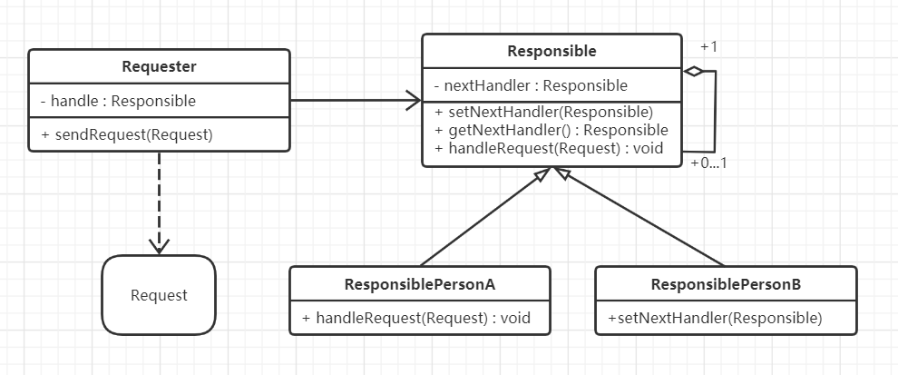

# 职责模式

## 什么是职责模式

> Avoid coupling the sender of a request to its receiver by giving more than one object a chance to handle the request. Chain the receiving objects and pass the request along the chain until an object handles it.

为避免请求的发送方与其接收方耦合，让多个对象都有处理请求的机会。将接收对象串起来，并沿着链传递请求，直到有一个对象处理它。这就是职责模式，又称责任链模式。责任链模式的特点是请求发送方不需要知道接受方的信息以及处理方式，只需要注重请求发送即可，反观接收方只需要关注自身的处理方式的实现。

## 职责模式的设计思想

设计思想：由一些节点串联起来的形成的固定流程我们称之为责任链。责任链由上的每个节点通常都带有固定的职责，都只能处理当前节点职责范围内的请求，对于处理不了的请求，则依据流程继续往下传递请求，让有可能有职责的人去处理。

ps：对于接触过工作流开发的工作者，对于责任链模式应该会很熟悉。

## 从生活中领悟职责模式

在平常的工作中，请假、调薪、申请调休、辞职流程等都可以体现出职责模式的思想，例如请假的流程，通常是请假人需要填写请假条，把请假条交给上级领导审批。这个请假条就是设计模式中的请求，而上级领导背后往往是一条责任链，请假的你只需要关系请假申请有没有通过。通常来说，责任链的长短是固定的，而真正执行的责任链长度（真正有处理作用的节点）往往是根据请求的内容决定。

例如：请假流程，通常是根据请假的天数，来决定责任链的长度，往往请假天数越多，需要签字的领导越多。请假其实是一责任担当的过程：你请假了，必然会给团队或部门增加工作压力，所以领导肯定会控制风险。请假的时间越长，风险越大，领导的压力和责任也越大，责任人也就越多，责任人的链条也就越长。

假设某公司有以下请假流程：

（1）少于等于2天，直属领导签字，提交行政部门；

（2）多于2天，少于等于5天，直属领导签字，部门总监签字，提交行政部门；

（3）多于5天，少于等于1个月，直属领导签字，部门总监签字，CEO签字，提交行政部门。

``` python
# 职责模式 Version 1.0 请假流程
from abc import ABCMeta, abstractmethod


class Person:
    """请假申请人"""
    def __init__(self, name, dayoff, reason):
        self.__name = name
        self.__dayoff = dayoff
        self.__reason = reason
        self.__leader = None

    def getName(self):
        return self.__name

    def getDayOff(self):
        return self.__dayoff

    def getReason(self):
        return self.__reason

    def setLeader(self, leader):
        self.__leader = leader

    def request(self):
        print("%s 申请请假 %d 天。请假事由：%s" % (self.__name, self.__dayoff, self.__reason))
        if self.__leader is not None:
            self.__leader.handleRequest(self)


class Manager(metaclass=ABCMeta):
    """公司管理人员-基类"""

    def __init__(self, name, title):
        self.__name = name
        self.__title = title
        self._nextHandler = None

    def getName(self):
        return self.__name

    def getTitle(self):
        return self.__title

    def setNextHandler(self, nextHandler):
        self._nextHandler = nextHandler

    @abstractmethod
    def handleRequest(self, person):
        pass


class Supervisor(Manager):
    """主管"""

    def __init__(self, name, title):
        super().__init__(name, title)

    def handleRequest(self, person):
        if(person.getDayOff() <= 2):
            print("同意 %s 请假，签字人：%s(%s)" % (person.getName(), self.getName(), self.getTitle()))
        if(self._nextHandler is not None):
            self._nextHandler.handleRequest(person)


class DepartmentManager(Manager):
    """部门总监"""
    def __init__(self, name, title):
        super().__init__(name, title)

    def handleRequest(self, person):
        if(person.getDayOff() >2 and person.getDayOff() <= 5):
            print("同意 %s 请假，签字人：%s(%s)" % (person.getName(), self.getName(), self.getTitle()))
        if(self._nextHandler is not None):
            self._nextHandler.handleRequest(person)


class CEO(Manager):
    """CEO"""

    def __init__(self, name, title):
        super().__init__(name, title)

    def handleRequest(self, person):
        if (person.getDayOff() > 5 and person.getDayOff() <= 22):
            print("同意 %s 请假，签字人：%s(%s)" % (person.getName(), self.getName(), self.getTitle()))
        if (self._nextHandler is not None):
            self._nextHandler.handleRequest(person)


class Administrator(Manager):
    """行政人员"""

    def __init__(self, name, title):
        super().__init__(name, title)

    def handleRequest(self, person):
        print("%s 的请假申请已审核，情况属实！已备案处理。处理人：%s(%s)\n" % (person.getName(), self.getName(), self.getTitle()))


def testAskForLeave():
    directLeader = Supervisor("Eren", "客户端研发部经理")
    departmentLeader = DepartmentManager("Eric", "技术研发中心总监")
    ceo = CEO("Helen", "创新文化公司CEO")
    administrator = Administrator("Nina", "行政中心总监")
    directLeader.setNextHandler(departmentLeader)
    departmentLeader.setNextHandler(ceo)
    ceo.setNextHandler(administrator)

    sunny = Person("Sunny", 1, "参加MDCC大会。")
    sunny.setLeader(directLeader)
    sunny.request()
    tony = Person("Tony", 5, "家里有紧急事情！")
    tony.setLeader(directLeader)
    tony.request()
    pony = Person("Pony", 15, "出国深造。")
    pony.setLeader(directLeader)
    pony.request()


if __name__ == "__main__":
    testAskForLeave()

'''
Sunny 申请请假 1 天。请假事由：参加MDCC大会。
同意 Sunny 请假，签字人：Eren(客户端研发部经理)
Sunny 的请假申请已审核，情况属实！已备案处理。处理人：Nina(行政中心总监)

Tony 申请请假 5 天。请假事由：家里有紧急事情！
同意 Tony 请假，签字人：Eric(技术研发中心总监)
Tony 的请假申请已审核，情况属实！已备案处理。处理人：Nina(行政中心总监)

Pony 申请请假 15 天。请假事由：出国深造。
同意 Pony 请假，签字人：Helen(创新文化公司CEO)
Pony 的请假申请已审核，情况属实！已备案处理。处理人：Nina(行政中心总监)
'''
```

## 职责模式的框架模型

对示例代码进行重构和优化，抽象出职责模式的框架模型：

### 类图和实现



Requester是请求的发送者，Request是请求的包装类，封装一个请求对象。Responsible是责任人的抽象基类，也是责任链的节点，它有一个指向自身的引用，也就是下一个责任人，这是形成责任链的关键。ResponsiblePersonA和ResponsiblePersonB是具体的责任人。

代码实现：

``` python
# 职责模式-代码框架
from abc import ABCMeta, abstractmethod


class Request:
    """请求(内容)"""

    def __init__(self, name, dayoff, reason):
        self.__name = name
        self.__dayoff = dayoff
        self.__reason = reason
        self.__leader = None

    def getName(self):
        return self.__name

    def getDayOff(self):
        return self.__dayoff

    def getReason(self):
        return self.__reason


class Responsible(metaclass=ABCMeta):
    """责任人抽象类"""

    def __init__(self, name, title):
        self.__name = name
        self.__title = title
        self._nextHandler = None

    def getName(self):
        return self.__name

    def getTitle(self):
        return self.__title

    def setNextHandler(self, nextHandler):
        self._nextHandler = nextHandler

    def getNextHandler(self):
        return self._nextHandler

    def handleRequest(self, request):
        """请求处理"""
        # 当前责任人处理请求
        self._handleRequestImpl(request)
        # 如果存在下一个责任人，则将请求传递(提交)给下一个责任人
        if (self._nextHandler is not None):
            self._nextHandler.handleRequest(request)

    @abstractmethod
    def _handleRequestImpl(self, request):
        """真正处理请求的方法"""
        pass


```

实例基于框架的实现：

```python
# 基于框架的实现
from duty_frame import Responsible, Request


class Person:
    """请求者(请假人)"""

    def __init__(self, name):
        self.__name = name
        self.__leader = None

    def setName(self, name):
        self.__name = name

    def getName(self):
        return self.__name

    def setLeader(self, leader):
        self.__leader = leader

    def getLeader(self):
        return self.__leader

    def sendRequest(self, request):
        print("%s 申请请假 %d 天。请假事由：%s" % (self.__name, request.getDayOff(), request.getReason()))
        if (self.__leader is not None):
            self.__leader.handleRequest(request)


class Supervisor(Responsible):
    """主管"""

    def __init__(self, name, title):
        super().__init__(name, title)

    def _handleRequestImpl(self, request):
        if (request.getDayOff() <= 2):
            print("同意 %s 请假，签字人：%s(%s)" % (request.getName(), self.getName(), self.getTitle()))


class DepartmentManager(Responsible):
    """部门总监"""

    def __init__(self, name, title):
        super().__init__(name, title)

    def _handleRequestImpl(self, request):
        if (request.getDayOff() > 2 and request.getDayOff() <= 5):
            print("同意 %s 请假，签字人：%s(%s)" % (request.getName(), self.getName(), self.getTitle()))


class CEO(Responsible):
    """CEO"""

    def __init__(self, name, title):
        super().__init__(name, title)

    def _handleRequestImpl(self, request):
        if (request.getDayOff() > 5 and request.getDayOff() <= 22):
            print("同意 %s 请假，签字人：%s(%s)" % (request.getName(), self.getName(), self.getTitle()))


class Administrator(Responsible):
    """行政人员"""

    def __init__(self, name, title):
        super().__init__(name, title)

    def _handleRequestImpl(self, request):
        print("%s 的请假申请已审核，情况属实！已备案处理。处理人：%s(%s)\n" % (request.getName(), self.getName(), self.getTitle()))


def testChainOfResponsibility():
    directLeader = Supervisor("Eren", "客户端研发部经理")
    departmentLeader = DepartmentManager("Eric", "技术研发中心总监")
    ceo = CEO("Helen", "创新文化公司CEO")
    administrator = Administrator("Nina", "行政中心总监")
    directLeader.setNextHandler(departmentLeader)
    departmentLeader.setNextHandler(ceo)
    ceo.setNextHandler(administrator)

    sunny = Person("Sunny")
    sunny.setLeader(directLeader)
    sunny.sendRequest(Request(sunny.getName(), 1, "参加MDCC大会。"))
    tony = Person("Tony")
    tony.setLeader(directLeader)
    tony.sendRequest(Request(tony.getName(), 5, "家里有紧急事情！"))
    pony = Person("Pony")
    pony.setLeader(directLeader)
    pony.sendRequest(Request(pony.getName(), 15, "出国深造。"))


if __name__ == "__main__":
    testChainOfResponsibility()

'''
运行结果同示例
'''
```

### 设计要点

1. 请求者与请求内容：确认谁要发送请求，发送请求的对象称为请求者。请求的内容通过发送请求时的参数进行传递。

2. 有哪些责任人：责任人是构成责任链的关键要素。请求的流动方向是链条中的线，而责任人是链条上的节点，线和节点共同组成了一条链条。
3. 对责任人进行抽象：责任人的共同特征是-可以处理请求，对责任人进行抽象，使得他们具有责任的可传递性。
4. 责任人可自由组合：责任链上的责任人可以根据业务的具体逻辑进行自由的组合和排序。

### 职责模式优缺点

优点：

- 降低耦合度。请求者和接收者解耦。
- 简化了对象。对象不需要知道责任链的结构。
- 增强给对象指派职责的灵活性。可改变链内的成员或者调动它们的次序，允许动态地新增或删除责任人。
- 增加新的处理类方便。

缺点

- 不能保证请求一定被接收处理
- 系统性能将受到一定影响，代码调试不方便，可能造成循环调用

## 应用场景

1. 有多个对象可以处理同一个请求，具体哪个对象处理该请求在运行时刻自动确定。
2. 请求的处理有明显的一层传递关系。
3. 请求的处理流程和顺序需要程序运行时动态确定。
4. 常见的审批流程（财务报账、转岗申请、请假申请等）
5. 工作流开发

> 摘自： 罗伟富. 《人人都懂设计模式：从生活中领悟设计模式：Python实现》. 电子工业出版社