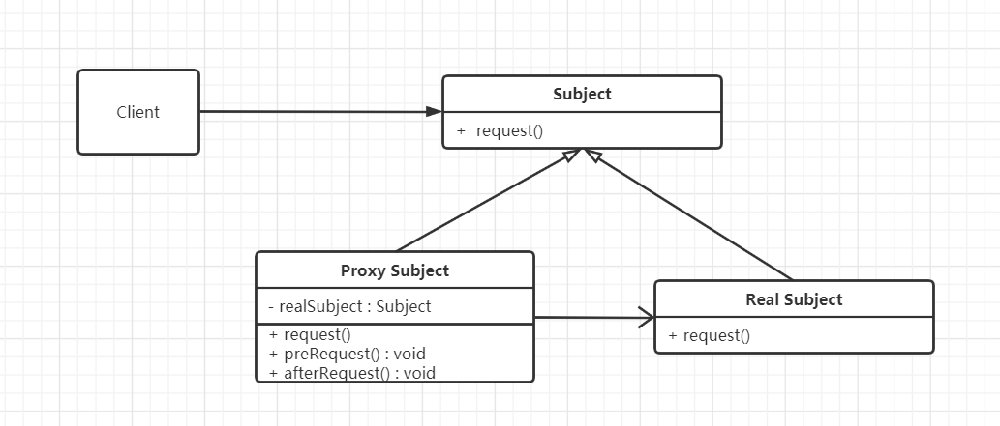

# 代理模式

## 什么是代理模式

> Provide a surrogate or placeholder for another object to control access to it.

为其他对象提供一种代理来控制对它的访问。简单来说就是，一个对象可能拥有一个或多个对象的引用，该对象就称为他们的代理，代理对象可以操作这些被代理对象，调用被代理对象的方法来处理外界的请求。

## 代理模式的设计思想

代理模式（Proxy）的核心思想：

- 使用一个额外的间接层来支持分散的、可控的、智能的访问。
- 增加一个包装和委托来保护真实的组件，以避免过度复杂。

简单阐述：代理对象可以在客户端和目标对象之间起到中间调和的作用，并且可以通过代理对象隐藏不希望被客户端看到的内容和服务，或者添加客户需要的额外服务。

## 从生活中领悟代理模式

在现实生活中有非常多的代理模式的模型：代拿快递、火车票机票代售点、公司代表出席会议。

这里使用代拿快递做例子：Tony的快递（雪地靴）到了，但是由于不在家，让邻居 Wendy 代拿快递。

``` python
# 代理模式-代收快递
from abc import ABCMeta, abstractmethod


class ReceiveParcel(metaclass=ABCMeta):
    """接收包裹抽象类"""

    def __init__(self, name):
        self.__name = name

    def getName(self):
        return self.__name

    @abstractmethod
    def receive(self, parcelContent):
        pass


class TonyReception(ReceiveParcel):
    """Tony 接收"""

    def __init__(self, name, phoneNum):
        super().__init__(name)
        self.__phoneNum = phoneNum

    def getPhoneNum(self):
        return self.__phoneNum

    def receive(self, parcelContent):
        print("货物主人：%s, 手机号：%s" % (self.getName(), self.getPhoneNum()))
        print("接受到一个包裹, 包裹内容：%s" % parcelContent)


class WendyReception(ReceiveParcel):
    """Wendy 代收"""

    def __init__(self, name, receiver):
        super().__init__(name)
        self.__receiver = receiver

    def receive(self, parcelContent):
        print("我是%s的朋友，我来帮他代收快递 " % (self.__receiver.getName()+""))
        if(self.__receiver is not None):
            self.__receiver.receive(parcelContent)
        print("代收人：%s" % self.getName())


def testReceiveParcel():
    tony = TonyReception("Tony", "18812345678")
    print("Tony 接收：")
    tony.receive("雪地靴")
    print()

    print("Wendy 代收：")
    wendy = WendyReception("Wendy", tony)
    wendy.receive("雪地靴")


if __name__ == "__main__":
    testReceiveParcel()

"""
Tony 接收：
货物主人：Tony, 手机号：18812345678
接受到一个包裹, 包裹内容：雪地靴

Wendy 代收：
我是Tony的朋友，我来帮他代收快递 
货物主人：Tony, 手机号：18812345678
接受到一个包裹, 包裹内容：雪地靴
代收人：Wendy

Process finished with exit code 0
"""

```

ReceiveParcel：接收包裹动作的抽象类，receive方法需要每个子类去实现接收包裹的动作实现。

TonyReception是被代理类，WendyReception是代理类，代理类会引用被代理类，调用被代理类的receive方法，去接收包裹。


## 代理模式的框架模型

对示例代码进一步重构和优化，抽象代理模式框架

### 类图和实现



Subject：活动主题（代理行为）的抽象基类，负责定义统一的接口。例如接收快递、代购、参会代表等。抽象出来的行为使用request表示。

RealSubject：真实主题（被代理对象）真正去处理主题的对象，是Subject的具体实现类。

ProxySubject：代理主题（代理对象），代理RealSubject的功能，同样是Subject的具体实现类，但是往往比RealSubject要复杂些。

框架代码：

``` python
# 代理模式 框架
from abc import ABCMeta, abstractmethod


class Subject(metaclass=ABCMeta):
    """主题类"""

    def __init__(self, name):
        self.__name = name

    def getName(self):
        return self.__name

    @abstractmethod
    def request(self, content = ''):
        pass


class RealSubject(Subject):
    """真实主题类"""

    def request(self, content):
        print("RealSubject todo something...")


class ProxySubject(Subject):
    """代理主题类"""

    def __init__(self, name, subject):
        super().__init__(name)
        self._realSubject = subject

    def request(self, content = ''):
        self.preRequest()
        if(self._realSubject is not None):
            self._realSubject.request(content)
        self.afterRequest()

    def preRequest(self):
        print("preRequest")

    def afterRequest(self):
        print("afterRequest")


def testProxy():
    realObj = RealSubject('RealSubject')
    proxyObj = ProxySubject('ProxySubject', realObj)
    proxyObj.request()


if __name__ == "__main__":
    testProxy()

"""
preRequest
RealSubject todo something...
afterRequest
"""
```

示例代码基于框架实现，会简单很多，仅仅调用方法 由 receive 变成了 request ：

``` python
# 代理模式2.0 - 基于框架框架代收快递
from proxy_frame import Subject, ProxySubject


class TonyReception(Subject):
    """Tony 接收"""

    def __init__(self, name, phoneNum):
        super().__init__(name)
        self.__phoneNum = phoneNum

    def getPhoneNum(self):
        return self.__phoneNum

    def request(self, content = ''):
        print("货物主人：%s, 手机号：%s" % (self.getName(), self.getPhoneNum()))
        print("接受到一个包裹, 包裹内容：%s" % str(content))


class WendyReception(ProxySubject):
    """Wendy 代收"""

    def __init__(self, name, receiver):
        super().__init__(name, receiver)

    def preRequest(self):
        print("我是%s的朋友，我来帮他代收快递 " % (self._realSubject.getName() + ""))

    def afterRequest(self):
        print("代收人：%s" % self.getName())


def testReceiveParcel():
    tony = TonyReception("Tony", "18812345678")
    print("Tony 接收：")
    tony.request("雪地靴")
    print()

    print("Wendy 代收：")
    wendy = WendyReception("Wendy", tony)
    wendy.request("雪地靴")


if __name__ == "__main__":
    testReceiveParcel()

"""
Tony 接收：
货物主人：Tony, 手机号：18812345678
接受到一个包裹, 包裹内容：雪地靴

Wendy 代收：
我是Tony的朋友，我来帮他代收快递 
货物主人：Tony, 手机号：18812345678
接受到一个包裹, 包裹内容：雪地靴
代收人：Wendy
"""
```

### 设计要点

区分代理模式的三个角色：

1. 主题（Subject，被代理的行为）：定义操作、活动、任务的接口类。
2. 真实主题（RealSubject，被代理类）：真正完成操作、活动、任务的具体类。
3. 代理主题（ProxySubject，代理类）：代替真实主题，完成操作、活动、任务的代理类。

### 代理模式优缺点

优点：

- 代理模式能够协调调用者和被调用者，在一定程度上降低系统的耦合度。
- 可以灵活地隐藏被代理对象的部分功能和服务，也可以增加额外的功能和服务。

缺点：

- 由于在客户端和真实主题之间增加了代理对象，因此有些类型的代理模式可能会造成请求的处理速度变慢。
- 实现代理模式需要额外的工作，有些代理模式的实现非常复杂。

## 应用场景

1. 不想或者不能直接引用一个对象时。

   - 在移动端加载网页信息时，因为下载真实大图比较耗费流量、影响性能，可以用一个小图代替渲染（用一个代理对象去下载小图），在真正点击图片时，才去下载大图，显示大图效果。

   - HTML中占位符也是代理模式思想。

2. 想对一个对象的功能进行加强时。

   - 在字体渲染时，遇到粗体渲染的时候，可使用字体对象进行代理，只要在对字体进行渲染后进行加粗的操作即可。

3. 各种特俗用途的代理：远程代理、虚拟代理、Copy-on-Write代理、保护（ProtectorAccess）代理、Cache代理、防火墙（Firewall）代理、同步化（Synchronization）代理、智能引用（SmartReference）代理。

> 摘自： 罗伟富. 《人人都懂设计模式：从生活中领悟设计模式：Python实现》. 电子工业出版社