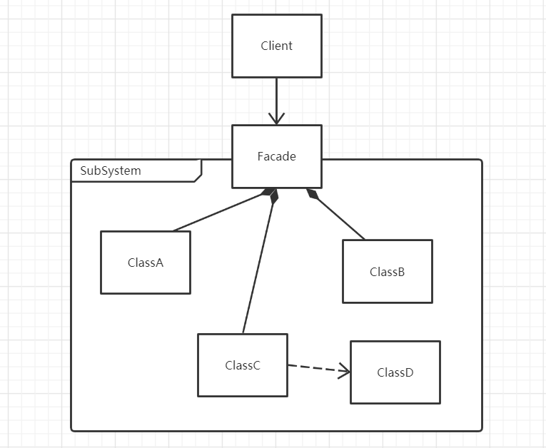

# 外观/门面模式

## 什么是外观模式

> Provide a unified interface to a set of interfaces in a subsystem. Facade defines a higher-level interface that makes the subsystem easier to use.

为子系统中的一组接口提供一个一致的界面称为外观模式，外观模式定义了一个高层接口，这个接口使得子系统更容易使用。外观模式又被称为门面模式，通常体现层次结构，是比较简单的设计模式，但却是非常常用的设计模式。


## 外观模式的设计思想

外观模式的核心思想是：用一个简单的接口封装一个复杂的系统，使这个系统更容易使用。客户端只需要跟接口交互，而不需要关系内部复杂的运行机制。

外观模式的应用可以体现软件的分层结构思想。


## 从生活中领悟外观模式

在生活中，迎宾接待的礼仪、新手指南说明书、迎新志愿者等都是外观模式的例子。

这里用迎新志愿者做示例，在新学期开始的时候，校方通常都会组织迎新志愿者，让他们陪同并帮助入学新生完成报到登记、缴纳学费、领日用品、入住宿舍等一系列的报到流程。新生不用知道具体的报到流程，不用去寻找各个场地；只要跟着志愿者走，到指定的地点，根据志愿者的指导，完成指定的任务即可。志愿者虽然不直接提供这些报到服务，但也相当于间接提供了报到登记、缴纳学费、领日用品、入住宿舍等一条龙的服务，帮新生减轻了不少麻烦和负担。

``` python
# 外观/门面模式 - 新生报到
class Register:
    """报到登记"""

    def register(self, name):
        print("活动中心：%s 同学报到成功！" % name)


class Payment:
    """缴费中心"""

    def pay(self, name, money):
        print("缴费中心：收到 %s 同学 %s 元付款，缴费成功！" % (name, money))


class DormitoryManagementCenter:
    """宿舍管理中心"""

    def provideLivingGoods(self, name):
        print("生活中心：%s 同学的生活用品已发放。" % name)


class Dormitory:
    """宿舍"""

    def meetRoommate(self, name):
        print("宿舍 ：大家好！这是刚来的%s 同学，是你们未来需要共度四年的室友！相互认识一下...balala" % name)


class Volunteer:
    """迎新志愿者"""

    def __init__(self, name):
        self.__name = name
        self.__register = Register()
        self.payment = Payment()
        self.lifeCenter = DormitoryManagementCenter()
        self.__dormitory = Dormitory()

    def welcomeFreshmen(self, name):
        print("你好，%s 同学! 我是新生报到的志愿者%s ，我将带你完成整个报到流程。" % (name, self.__name))
        self.__register.register(name)
        self.payment.pay(name, 10000)
        self.lifeCenter.provideLivingGoods(name)
        self.__dormitory.meetRoommate(name)


def testRegister():
    volunteer = Volunteer("Frank")
    volunteer.welcomeFreshmen("Tony")


if __name__ == '__main__':
    testRegister()

"""
你好，Tony 同学! 我是新生报到的志愿者Frank ，我将带你完成整个报到流程。
活动中心：Tony 同学报到成功！
缴费中心：收到 Tony 同学 10000 元付款，缴费成功！
生活中心：Tony 同学的生活用品已发放。
宿舍 ：大家好！这是刚来的Tony 同学，是你们未来需要共度四年的室友！相互认识一下...balala
"""

```

在这里，我们可以进一步把学校想象成一个庞大且复杂的系统，而登记中心、缴费中心、生活中心都是系统的一小部分，这些部分的登记、缴费、发放生活用品的功能可以组成完成新生注册报到的流程，志愿者是学校系统的门脸，将新生报到的流程需要用到的功能进行组合，提供了“新生报到”的功能，新来的学生可以在志愿者的帮助下快速完成入学报到。

整个示例，就有了以下的分层结构：

``` 
学校系统(System)---迎新流程（SubSystem)---迎新志愿者(Facade) --- 新生(Client)
```


## 外观模式的框架模型

对示例代码进一步思考，抽象代理模式框架

### 类图



Facade封装了子系统的复杂实现，给外部提供一个统一的接口，用户只需要通过Facade来访问子系统，而不用关心内部ClassA、ClassB、ClassC、ClassD的具体实现。

### 设计要点

外观模式需要区分以下两个角色：

- 外观角色（Façade）：为子系统封装统一的对外接口，如同子系统的门面。这个类一般不负责具体的业务逻辑，只是一个委托类，具体的业务逻辑由子系统完成。
- 子系统（SubSystem）：由多个类组成的具有某一特定功能的子系统。可以是第三方库，也可以是自己的基础库，还可以是一个子服务，为整个系统提供特定的功能或服务。

### 外观模式优缺点

优点：

1. 契合软件的层次化结构设计。可以用外观模式来定义每一层系统的调用接口，层与层之间不直接产生联系，而是通过外观类建立联系，降低底层之间的耦合度。
2. 实现子系统与客户端之间的松耦合关系，这使得子系统的变化不会影响调用它的客户端。
3. 门脸能提供简单的可用的调用接口，简化了客户端对子系统的使用难度，客户端（用户）无须关心子系统复杂的具体实现方式，而只需要和外观进行交互即可。
4. 为不同的用户提供了统一的调用接口，方便了系统的管理和维护。

缺点：

1. 因为统一了调用的接口，降低了系统功能的灵活性。

## 实战应用

在互联网世界中，文件的压缩与解压缩是一项非常重要的功能，它不仅能减小文件的存储空间，还能减少网络带宽，现在最常用的压缩文件格式有ZIP、RAR、7Z。从压缩率看：ZIP<RAR<7Z（即7Z的压缩比最高），从压缩时间看：ZIP<RAR<7Z（即ZIP的压缩速度最快）。从普及率上看，ZIP应该是应用最广泛的，因为出现的时间最早，格式开放且免费；而7Z因为其极高的压缩比和开放性，大有赶超之势。

假设我们有一个压缩与解压缩系统专门处理文件的压缩和解压缩，这个系统有三个模块：ZIPModel、RARModel、ZModel，分别处理ZIP、RAR、7Z三种文件格式的压缩与解压缩。现在这一系统要提供给上层应用程序使用。

为了让这一系统更方便使用，就可以用外观模式进行封装，定义一套统一的调用接口，如下：

``` python
# 外观模式 应用实战-压缩、解压缩系统
# 引入path，进行路径相关的处理
from os import path
# 引入logging，进行错误日志的记录
import logging


class ZIPModel:
    """ZIP模块，负责ZIP文件的压缩与解压缩，简单模拟"""

    def compress(self, srcFilePath, dstFilePath):
        print("ZIP模块正在进行 %s 文件的压缩......" % srcFilePath)
        print("文件压缩成功，已保存至 %s " % dstFilePath)

    def decompress(self, srcFilePath, dstFilePath):
        print("ZIP模块正在进行 %s 文件的解压缩....." % srcFilePath)
        print("文件解压缩成功，已保存至 %s " % dstFilePath)


class RARModel:
    """RAR模块，负责RAR文件的压缩与解压缩，简单模拟"""

    def compress(self, srcFilePath, dstFilePath):
        print("RAR模块正在进行 %s 文件的压缩......" % srcFilePath)
        print("文件压缩成功，已保存至 %s " % dstFilePath)

    def decompress(self, srcFilePath, dstFilePath):
        print("RAR模块正在进行 %s 文件的解压缩....." % srcFilePath)
        print("文件解压缩成功，已保存至 %s " % dstFilePath)


class ZModel:
    """7Z模块，负责7Z文件的压缩与解压缩，简单模拟"""

    def compress(self, srcFilePath, dstFilePath):
        print("7Z模块正在进行 %s 文件的压缩......" % srcFilePath)
        print("文件压缩成功，已保存至 %s " % dstFilePath)

    def decompress(self, srcFilePath, dstFilePath):
        print("7Z模块正在进行 %s 文件的解压缩....." % srcFilePath)
        print("文件解压缩成功，已保存至 %s " % dstFilePath)


class CompressionFacade:
    """压缩系统的外观类"""

    def __init__(self):
        self.__zipModel = ZIPModel()
        self.__rarModel = RARModel()
        self.__zModel = ZModel()

    def compress(self, srcFilePath, dstFilePath, type):
        """根据不同的压缩类型，压缩成不同的格式"""
        # 获取新的文件名
        extName = "." + type
        fullName = dstFilePath + extName
        if(type.lower() == "zip"):
            self.__zipModel.compress(srcFilePath, fullName)
        elif(type.lower() == "rar"):
            self.__rarModel.compress(srcFilePath, fullName)
        elif(type.lower() == "7z"):
            self.__zModel.compress(srcFilePath, fullName)
        else:
            logging.error("Not support this format:" + str(type))
            return False
        return True

    def decompress(self, srcFilePath, dstFilePath):
        """从srcFilePath中获取后缀，根据不同后缀名，进行不同格式的解压缩"""
        baseName = path.basename(srcFilePath)
        extName = baseName.split(".")[1]
        if (extName.lower() == "zip"):
            self.__zipModel.decompress(srcFilePath, dstFilePath)
        elif (extName.lower() == "rar"):
            self.__rarModel.decompress(srcFilePath, dstFilePath)
        elif (extName.lower() == "7z"):
            self.__zModel.decompress(srcFilePath, dstFilePath)
        else:
            logging.error("Not support this format:" + str(extName))
            return False
        return True


def testCompression():
    facade = CompressionFacade()
    facade.compress("C:/app/facade/zip.md", "C:/app/facade/zip压缩文件", "zip")
    facade.decompress("C:/app/facade/zip压缩文件.zip", "C:/app/facade/file")
    print()
    facade = CompressionFacade()
    facade.compress("C:/app/facade/rar.md", "C:/app/facade/rar压缩文件", "rar")
    facade.decompress("C:/app/facade/rar压缩文件.rar", "C:/app/facade/file")
    print()
    facade = CompressionFacade()
    facade.compress("C:/app/facade/7z.md", "C:/app/facade/7z压缩文件", "7z")
    facade.decompress("C:/app/facade/7z压缩文件.7z", "C:/app/facade/file")


if __name__ == '__main__':
    testCompression()

'''
ZIP模块正在进行 C:/app/facade/zip.md 文件的压缩......
文件压缩成功，已保存至 C:/app/facade/zip压缩文件.zip 
ZIP模块正在进行 C:/app/facade/zip压缩文件.zip 文件的解压缩.....
文件解压缩成功，已保存至 C:/app/facade/file 

RAR模块正在进行 C:/app/facade/rar.md 文件的压缩......
文件压缩成功，已保存至 C:/app/facade/rar压缩文件.rar 
RAR模块正在进行 C:/app/facade/rar压缩文件.rar 文件的解压缩.....
文件解压缩成功，已保存至 C:/app/facade/file 

7Z模块正在进行 C:/app/facade/7z.md 文件的压缩......
文件压缩成功，已保存至 C:/app/facade/7z压缩文件.7z 
7Z模块正在进行 C:/app/facade/7z压缩文件.7z 文件的解压缩.....
文件解压缩成功，已保存至 C:/app/facade/file 
'''

```

ps: 在实际的项目开发中，不应该通过文件后缀名来区分文件格式，因为用户可能将一个RAR格式的文件改成.zip后缀，这会造成解压缩的错误；应该通过文件的魔数来判断，每一种格式的文件，在二进制文件的开头都会有一个魔数（MagicNumber）来说明该文件的类型（可通过二进制文件工具查看，如WinHex），如ZIP的魔数是PK（50 4B 03 04）,RAR的魔数是Rar（52 61 72）,7z的魔数是7z（37 7A）。

## 应用场景

1. 要为一个复杂子系统提供一个简单接口时。
2. 客户程序与多个子系统之间存在很大的依赖性时。引入外观类将子系统与客户以及其他子系统解耦，可以提高子系统的独立性和可移植植性。
3. 在层次化结构中，可以使用外观模式定义系统中每一层的入口，层与层之间不直接产生联系，而通过外观类建立联系，降低层之间的耦合度。

> 摘自： 罗伟富. 《人人都懂设计模式：从生活中领悟设计模式：Python实现》. 电子工业出版社