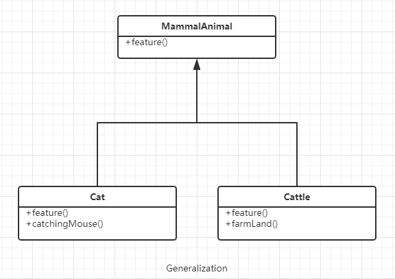
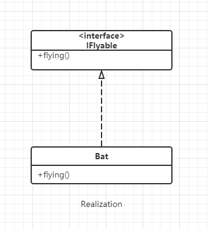
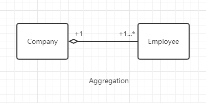
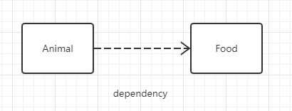

# UML概述

## UML的定义

UML：Unified Modeling Language , 统一建模语言。 
由套图组成用于帮助系统开发人员阐明、设计和构建软件系统的标准化建模语言

UML套图被分为两组：
- 结构性图：类图、组件图、部署图、对象图、包图、组合结构图、轮廓图
- 行为性图：用例图、活动图（流程图）、状态机图、序列图、通信图、交互图、时序图。

其中类图是应用最广泛的一种图，常用于软件架构设计中。

## 常见关系

类图用于表示不同的实体以及它们之间的关系，描述的是系统中对象的类型以及它们之间存在的各种`静态关系`，是`一切面向对象方法的核心建模工具`。

UML类图中常见的几种关系有：泛化、实现、组合、聚合、关联和依赖。关系的强弱顺序为：  
`泛化 = 实现 > 组合 > 聚合 > 关联 > 依赖`。

### 泛化

泛化（Generalization)是一种`继承`关系，表示`一般与特殊`的关系，它`指定了子类如何特化父类所有的特征和行为`。

如：哺乳动物具有恒温、胎生、哺乳等生理特征，猫和牛都是哺乳动物，也都具有这些特征，但除此之外，猫会抓老鼠，牛会耕地。

### 实现

实现（Realization）是一种`类与接口`的关系，表示`类是接口所有特征和行为的实现`。

如：蝙蝠也是哺乳动物，它具有哺乳动物的一般特征外，还会飞，我们可以定义一个IFlyable接口，表示飞行的动作，而蝙蝠需要实现这个接口。

### 组合

组合（Composition）是一种表示`整体与部分`的关系，`部分离开整体后无法单独存在`。因此，组合比聚合具有更强的关系。

如：我们的电脑由CPU、主板、硬盘、内存组成，电脑与CPU、主板、硬盘、内存是整体与部分的关系，CPU、主板等组件单独存在，就无法工作，因此没有意义。

### 聚合

聚合（Aggregation）也是一种`整体与部分`的关系，但`部分离开整体后可以单独存在`。

如：一个公司会有多个员工，但员工可以离开公司单独存在。

### 关联

关联（Association）是一种`拥有`的关系，它`使一个类知道另一个类的属性和方法`。关联可以单向或双向。

例如：一本书会有多个读者，一个读者也可能会有多本书，书和读者是一种双向的关系（多对多）；但一本书通常只会有一个作者，是一种单向关系（一对一的关系，也可能是一对多关系，一个作者可以写多本书）。

### 依赖

依赖（Dependency）是一种`使用`的关系，即`一个类的实现需要另一个类的协助`。注意：`尽量不要使用双向的互相依赖`。

如：所有的动物都要吃东西才能活着，动物与食物就是一种依赖关系，动物依赖食物而生生存。

