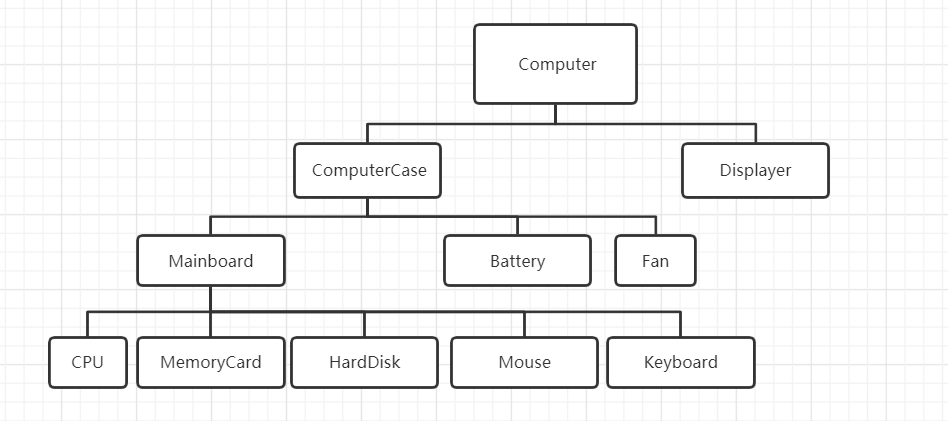
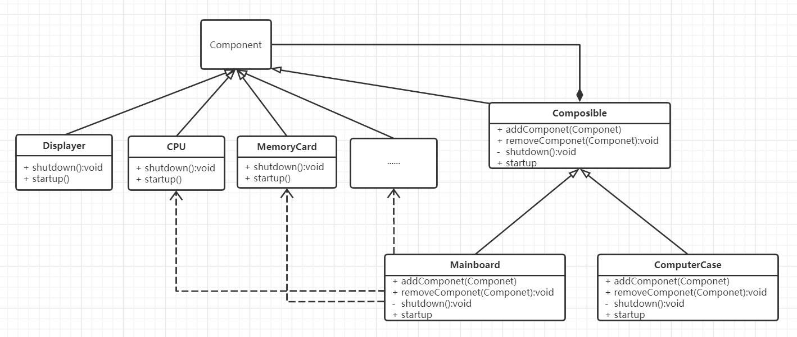
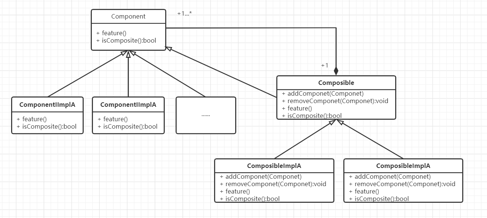

#  组合模式

## 什么是组合模式

> Compose objects into tree structures to represent whole-part hierarchies. Composite lets clients treat individual objects and compositions of objects uniformly.

将对象组合成树形结构以表示“整体-部分”的层次结构关系。组合使得用户对单个对象和复合对象的使用具有一致性。使用组合对象就像使用一般对象一样，不用关系内部的组织结构。


## 组合模式的设计思想

组合模式有着明显的部分与整体的关系，而且这种"部分-整体"的层次结构转换成对象组合的时候，往往将组合对象当作一般对象（整体）使用，而不用关系内部结构组织。

## 从生活中领悟组合模式

不知各位有没有组装过(DIY)台式电脑，组装电脑的过程就是组合模式在生活中应用非常好的例子。 

组装的电脑具有明显的部分与整体的关系。在组装前，CPU、硬盘、显卡等都是电脑配件，而不能称为电脑，只有将他们以正确的方式组装在一起，配合操作系统才能正常运行，才能称为电脑。我们来看看电脑的：“部分-整体”的层次结构：显示器、机箱、主板、电源等是电脑的一部分，而机箱上又装有主板、电源、散热风扇等组件，电脑重要的组件主板上又有CPU、硬盘、显卡等，它们又是主板的一部分。



碰巧我最近组装了台itx主机， 我们将这种层次关系转换成对象的组合关系：

```python
# 组合模式 -- 组装电脑
from abc import ABCMeta, abstractmethod


class ComputerComponent(metaclass=ABCMeta):
    """组件，所有子配件的基类"""

    def __init__(self, name):
        self._name = name

    @abstractmethod
    def showInfo(self, indent=""):
        pass

    def isComposite(self):
        return False

    def startup(self, indent=""):
        print("%s%s 准备开始工作..." % (indent, self._name))

    def shutdown(self, indent=""):
        print("%s%s 即将结束工作..." % (indent, self._name))


class CPU(ComputerComponent):
    """中央处理器"""

    def __init__(self, name):
        super().__init__(name)

    def showInfo(self, indent=""):
        print("%s CPU:%s, 可以进行高速计算。" % (indent, self._name))


class MemoryCard(ComputerComponent):
    """内存条"""

    def __init__(self, name):
        super().__init__(name)

    def showInfo(self, indent=""):
        print("%s 内存:%s, 可以缓存数据，读写速度快。" % (indent, self._name))


class HardDisk(ComputerComponent):
    """硬盘"""

    def __init__(self, name):
        super().__init__(name)

    def showInfo(self, indent=""):
        print("%s 硬盘:%s, 可以永久存储数据，容量大。" % (indent, self._name))


class GraphicsCard(ComputerComponent):
    """显卡"""

    def __init__(self, name):
        super().__init__(name)

    def showInfo(self, indent=""):
        print("%s 显卡:%s, 可以高速计算和处理图形图像。" % (indent, self._name))


class Battery(ComputerComponent):
    """电源"""

    def __init__(self, name):
        super().__init__(name)

    def showInfo(self, indent=""):
        print("%s 电源:%s, 可以持续给主板和外接配件供电。" % (indent, self._name))


class Fan(ComputerComponent):
    """风扇"""

    def __init__(self, name):
        super().__init__(name)

    def showInfo(self, indent=""):
        print("%s 风扇:%s, 辅助CPU散热。" % (indent, self._name))


class Displayer(ComputerComponent):
    """显示器"""

    def __init__(self, name):
        super().__init__(name)

    def showInfo(self, indent=""):
        print("%s 显示器:%s, 负责内容的显示。" % (indent, self._name))


class ComputerComposite(ComputerComponent):
    """配件组合器"""

    def __init__(self, name):
        super().__init__(name)
        self._components = []

    def showInfo(self, indent=""):
        print("%s,由以下部件组成：" % self._name)
        indent += "\t"
        for element in self._components:
            element.showInfo(indent)

    def isComposite(self):
        return True

    def addComponent(self, component):
        self._components.append(component)

    def removeComponent(self, component):
        self._components.remove(component)

    def startup(self, indent=""):
        super().startup(indent)
        indent += "\t"
        for element in self._components:
            element.startup(indent)

    def shutdown(self, indent=""):
        super().startup(indent)
        indent += "\t"
        for element in self._components:
            element.shutdown(indent)


class Mainboard(ComputerComposite):
    """主板"""

    def __init__(self, name):
        super().__init__(name)

    def showInfo(self, indent=""):
        print(indent + "主板:", end="")
        super().showInfo(indent)


class ComputerCase(ComputerComposite):
    """机箱"""

    def __init__(self, name):
        super().__init__(name)

    def showInfo(self, indent=""):
        print(indent + "机箱", end="")
        super().showInfo(indent)


class Computer(ComputerComposite):
    """电脑"""

    def __init__(self, name):
        super().__init__(name)

    def showInfo(self, indent=""):
        print(indent + "电脑", end="")
        super().showInfo(indent)


def testComputer():
    mainBoard = Mainboard("MSI B450I GAMING PLUS AC")
    mainBoard.addComponent(CPU("AMD Ryzen 5 3600 6-Core Processor"))
    mainBoard.addComponent(MemoryCard("Corsair DDR4 16GB x2"))
    mainBoard.addComponent(HardDisk("海康威视C2000 PRO 512G SSD"))
    mainBoard.addComponent(GraphicsCard("Radeon RX 570 Series 4G"))

    computerCase = ComputerCase("K39 v2")
    computerCase.addComponent(mainBoard)
    computerCase.addComponent(Battery("ENP 7025B FLEX 小1U 500W"))
    computerCase.addComponent(Fan("利民 AXP90R"))

    computer = Computer("wenwl ITX 主机")
    computer.addComponent(computerCase)
    computer.addComponent(Displayer("GoBiggeR 15.6 1080P"))

    computer.showInfo()
    print("\n开机过程:")
    computer.startup()
    print("\n关机过程:")
    computer.shutdown()


if __name__ == '__main__':
    testComputer()

"""
电脑wenwl ITX 主机,由以下部件组成：
	机箱K39 v2,由以下部件组成：
		主板:MSI B450I GAMING PLUS AC,由以下部件组成：
			 CPU:AMD Ryzen 5 3600 6-Core Processor, 可以进行高速计算。
			 内存:Corsair DDR4 16GB x2, 可以缓存数据，读写速度快。
			 硬盘:海康威视C2000 PRO 512G SSD, 可以永久存储数据，容量大。
			 显卡:Radeon RX 570 Series 4G, 可以高速计算和处理图形图像。
		 电源:ENP 7025B FLEX 小1U 500W, 可以持续给主板和外接配件供电。
		 风扇:利民 AXP90R, 辅助CPU散热。
	 显示器:GoBiggeR 15.6 1080P, 负责内容的显示。

开机过程:
wenwl ITX 主机 准备开始工作...
	K39 v2 准备开始工作...
		MSI B450I GAMING PLUS AC 准备开始工作...
			AMD Ryzen 5 3600 6-Core Processor 准备开始工作...
			Corsair DDR4 16GB x2 准备开始工作...
			海康威视C2000 PRO 512G SSD 准备开始工作...
			Radeon RX 570 Series 4G 准备开始工作...
		ENP 7025B FLEX 小1U 500W 准备开始工作...
		利民 AXP90R 准备开始工作...
	GoBiggeR 15.6 1080P 准备开始工作...

关机过程:
wenwl ITX 主机 准备开始工作...
	K39 v2 准备开始工作...
		MSI B450I GAMING PLUS AC 准备开始工作...
			AMD Ryzen 5 3600 6-Core Processor 即将结束工作...
			Corsair DDR4 16GB x2 即将结束工作...
			海康威视C2000 PRO 512G SSD 即将结束工作...
			Radeon RX 570 Series 4G 即将结束工作...
		ENP 7025B FLEX 小1U 500W 即将结束工作...
		利民 AXP90R 即将结束工作...
	GoBiggeR 15.6 1080P 即将结束工作...
"""

```



## 组合模式的框架模型

 对组装电脑剧情代码抽象出组合模式的框架模型：

### 类图和实现

 

Component：组件的基类，定义统一的方法feature（）和isComposite（）。ComponentImplA和ComponentImplB是具体的组件。

- feature（）：组件统一对外的方法。
- isComposite（）：用于判断一个组件是否为复合组件。

Composite：复合组件（也就是组合对象），复合组件可以添加或删除组件，CompositeImplA和CompositeImplB是具体的复合组件。**复合组件本身也是一个组件，因此组合对象可以像一般对象一样被使用，因为它也实现了Component的feature（）方法。**

```python
# 组合模式框架模型
from abc import ABCMeta, abstractmethod


class Component(metaclass=ABCMeta):
    """组件"""

    def __init__(self, name):
        self._name = name

    def getName(self):
        return self._name

    def isComposite(self):
        return False

    @abstractmethod
    def feature(self, indent):
        # indent 仅用于内容输出时的缩进
        pass


class Composite(Component):
    """复合组件"""

    def __init__(self, name):
        super().__init__(name)
        self._components = []

    def addComponent(self, component):
        self._components.append(component)

    def removeComponents(self, component):
        self._components.remove(component)

    def isComposite(self):
        return True

    def feature(self, indent):
        indent += "\t"
        for component in self._components:
            print(indent, end="")
            component.feature(indent)
```

### 设计要点

1. 需要理清整体与部分的关系，了解对象的组成结构。
2. **组合模式是一种具有层次关系的树形结构，不能再分的叶子节点是具体的组件，也是最小的逻辑单元；具有子节点（由多个子组件组成）的组件称为复合组件，也就是组合对象。**

### 组合模式优缺点

 优点：

1. 调用简单，组合对象可以像一般对象一样使用。
2. 组合对象可以自由地增加、删除组件，可灵活地组合不同的对象。

缺点：

1. 在一些层次结构太深的场景中，组合结构会变得太庞杂。

## 实战应用

### 案例一：文件夹和文件读取

组合模式是一个常用的模式，你可能在有意或无意间就已经用上了，比如公司（各个部门或各个子公司）的组织架构、学校各个学院与班级的关系，再比如文件夹与文件的关系。很多应用程序都会涉及文件读写的I/O处理，谈到文件读写及路径的处理，文件和文件夹是永远绕不开的一个话题。

假设有这样一个需求：遍历一个文件夹下的所有文件和文件夹（递归遍历所有子目录），并以对象的形式返回：如果是文件，要知道文件名和文件的大小，如果是文件夹，要知道文件夹名称和这一文件夹下的文件数量。

```python
# 组合模式 - 应用，遍历文件夹下所有目录

import os
from composite_frame import Component, Composite


class FileDetail(Component):
    """文件详情"""

    def __init__(self, name):
        super().__init__(name)
        self._size = 0

    def setSize(self, size):
        self._size = size

    def getFileSize(self):
        return self._size

    def feature(self, indent):
        # 文件大小，单位：kb， 精确度：2位小数
        fileSize = round(self._size / float(1024), 2)
        print("文件名称：%s，文件大小：%sKB" % (self._name, fileSize))


class FolderDetail(Composite):
    """文件夹详情"""

    def __init__(self, name):
        super().__init__(name)
        self._count = 0

    def setCount(self, fileNum):
        self._count = fileNum

    def getCount(self):
        return self._count

    def feature(self, indent):
        print("文件夹名：%s， 文件数量：%d， 包含的文件：" % (self._name, self._count))
        super().feature(indent)


def scanDir(rootPath, folderDetail):
    """扫描某一文件夹下的所有目录"""
    if not os.path.isdir(rootPath):
        raise ValueError("rootPath不是有效的路径：%s" % rootPath)
    if folderDetail is None:
        raise ValueError("folderDetail不能为空！")

    fileNames = os.listdir(rootPath)
    for fileName in fileNames:
        filePath = os.path.join(rootPath, fileName)
        if os.path.isdir(filePath):
            folder = FolderDetail(fileName)
            scanDir(filePath, folder)
            folderDetail.addComponent(folder)
        else:
            fileDetail = FileDetail(fileName)
            fileDetail.setSize(os.path.getsize(filePath))
            folderDetail.addComponent(fileDetail)
            folderDetail.setCount(folderDetail.getCount() + 1)


if __name__ == '__main__':
    folder = FolderDetail("组合模式")
    scanDir("C:/app/WorkSpace/PyCharm/py-design-pattern/base/c11_composite", folder)
    folder.feature("")


"""
文件夹名：组合模式， 文件数量：3， 包含的文件：
	文件名称：composite_1.py，文件大小：6.41KB
	文件名称：composite_app.py，文件大小：2.32KB
	文件名称：composite_frame.py，文件大小：0.95KB
	文件夹名：__pycache__， 文件数量：1， 包含的文件：
		文件名称：composite_frame.cpython-38.pyc，文件大小：1.89KB
"""
```


### 图形绘制系统

在图形绘制系统中，图元（GraphicUnit）可以有多种不同的类型：Text、Line、Rect、Ellipse等，还可以是矢量图（vectorgraph）。而矢量图本身又由一个或多个Text、Line、Rect、Ellipse组成。但所有的图元都有一个共同的方法，那就是draw（）。

## 应用场景

1. **对象之间具有明显的“部分-整体”的关系时，或者具有层次关系时。**
2. **组合对象与单个对象具有相同或类似行为（方法），用户希望统一地使用组合结构中的所有对象。**

>  摘自： 罗伟富. 《人人都懂设计模式：从生活中领悟设计模式：Python实现》. 电子工业出版社