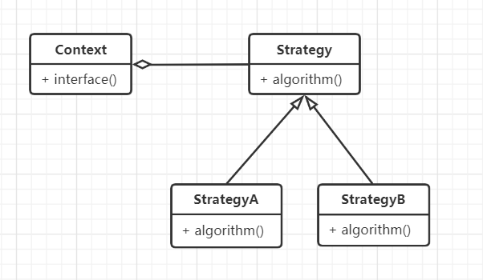
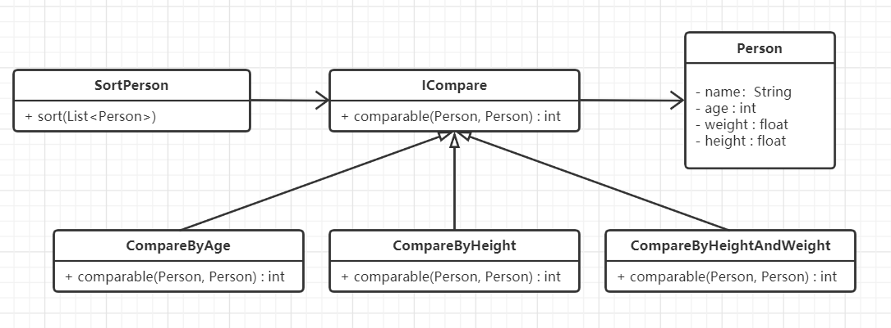

#  策略模式

## 什么是策略模式

> Define a family of algorithms, encapsulate each one, and make them interchangeable.Strategy lets the algorithm vary independently from the clients that use it.

定义一系列算法，将每个算法都封装起来，并且使它们之间可以相互替换。策略模式使算法可以独立于使用它的用户而变化。


## 策略模式的设计思想

策略模式的核心思想是：对算法、规则进行封装，使得替换算法和新增算法更加灵活。


## 从生活中领悟策略模式

在生活中，朋友聚餐的时候，大家采用的出行方式都不同，有的开车、有的坐地铁、有的骑共享单车等等，如果是在聚会地点附近居住的朋友直接步行过来，我们用代码来模拟大家使用不同的出行方式来聚餐的场景，这其实是策略模式的一种应用。

```python
# 策略模式 - 聚会，怎么来不重要，人到就行
from abc import ABCMeta, abstractmethod


class IVehicle(metaclass=ABCMeta):
    """交通工具的抽象类"""

    @abstractmethod
    def running(self):
        pass


class SharedBicycle(IVehicle):
    """共享单车"""

    def running(self):
        print("骑共享单车（轻快便捷）", end='')


class ExpressBus(IVehicle):
    """快速公交"""

    def running(self):
        print("坐快速公交（经济绿色）", end='')


class Express(IVehicle):
    """快车"""

    def running(self):
        print("打快车（快速方便）", end='')


class Subway(IVehicle):
    """地铁"""

    def running(self):
        print("坐地铁（高效安全）", end='')


class Classmate:
    """来聚餐的同学"""

    def __init__(self, name, vehicle):
        self.__name = name
        self.__vehicle = vehicle

    def attendTheDinner(self):
        print(self.__name + " ", end='')
        self.__vehicle.running()
        print(" 来聚餐！")


def testTheDinner():
    joe = Classmate("Joe", SharedBicycle())
    joe.attendTheDinner()
    helen = Classmate("Helen", Subway())
    helen.attendTheDinner()
    henry = Classmate("Henry", ExpressBus())
    henry.attendTheDinner()
    ruby = Classmate("Ruby", Express())
    ruby.attendTheDinner()


if __name__ == '__main__':
    testTheDinner()


"""
Joe 骑共享单车（轻快便捷） 来聚餐！
Helen 坐地铁（高效安全） 来聚餐！
Henry 坐快速公交（经济绿色） 来聚餐！
Ruby 打快车（快速方便） 来聚餐！
"""
```

示例中我们可以选择不同的出行方式（共享单车、地铁、快速公交、打快车）来聚餐，在实际生活中我们可以根据自己的实际情况进行选择和更换不同的出行方式，只要能够准时到达聚餐的地点即可。这里，选择不同的交通工具，相当于选择了不同的出行策略，类似程序中的策略模式。

示例中不同的出行方式可以理解成一种出行算法，将这些算法抽象出一个基类：IVehicle，并定义一系列的算法（出行方式）：共享单车、地铁、快速公交、打快车，根据实际场景选择合适的出行方式即可。这样的好处就是可以方便地更换出行方式。


## 策略模式的框架模型

 对聚餐示例代码抽象出策略模式的框架模型：

### 类图和实现

策略模式有两种实现方式：一种是组合方式，另一种是继承方式。

 

Context：上下文环境类，负责提供对外接口，与用户交互，屏蔽上层对策略（算法）的直接访问。如示例中的Classmate。

Strategy：策略（算法）的抽象类，定义统一的接口。如示例中的IVehicle。StrategyA和StrategyB是具体策略的实现。如示例中的SharedBicycle、ExpressBus等。注意：algorithm方法，可以不仅仅定义成一种算法，还可以定义为一种规则、一个动作或一种行为等，视实际情况而定。


### 设计要点

策略模式中主要有三个角色，在设计策略模式时要找到并区分这些角色。

1. 上下文环境（Context）：起着承上启下的封装作用，屏蔽上层应用对策略（算法）的直接访问，封装可能存在的变化。

2. 策略的抽象（Strategy）：策略（算法）的抽象类，定义统一的接口，规定每个子类必须实现的方法。

3. 具备的策略：策略的具体实现者，可以有多个不同的（算法或规则）实现。

   

### 策略模式优缺点

 优点：

1. 算法（规则）可自由切换。
2. 避免使用多重条件判断。
3. 方便拓展和增加新的算法（规则）。

缺点：

1. 所有策略类都需要对外暴露。

   


## 实战应用

有一个Person类，有年龄（age）、体重（weight）、身高（height）三个属性。现在要对
对Person类的一组对象进行排序，但并没有确定根据什么规则来排序，有时需要根据年龄进行排序，有时需要根据身高进行排序，有时可能需要根据身高和体重的综合情况来排序，还有可能……

通过对这个应用场景进行分析，我们会发现，这里需要多种排序算法，而且需要动态地在这几种算法中进行选择。这个时候策略模式就登场了！用策略模式来定义排序规则：

```python
# 策略模式应用 - 更具不同比较算法，对人进行排序
from abc import ABCMeta, abstractmethod


class Person:
    """人类"""

    def __init__(self, name, age, weight, height):
        self.name = name
        self.age = age
        self.weight = weight
        self.height = height

    def showMyself(self):
        print("%s 年龄：%d 岁，体重：%0.2fkg，身高：%0.2fm" % (self.name, self.age, self.weight, self.height))


class ICompare(metaclass=ABCMeta):
    """比较算法"""

    @abstractmethod
    def comparable(self, person1, person2):
        " person1 > person2 返回值>0, person1 == person2 返回0，person1 < person2 返回值小于0 "
        pass


class CompareByAge(ICompare):
    """通过年龄排序"""

    def comparable(self, person1, person2):
        return person1.age - person2.age


class CompareByHeight(ICompare):
    """通过身高排序"""

    def comparable(self, person1, person2):
        return person1.height - person2.height


class CompareByHeightAndWeight(ICompare):
    """通过身高和体重的综合情况来排序(身高和体重的权重分别为0.6和0.4）"""

    def comparable(self, person1, person2):
        value1 = person1.height * 0.6 + person1.weight * 0.4
        value2 = person2.height * 0.6 + person2.weight * 0.4
        return value1 - value2


class SortPerson:
    """Person的排序类"""

    def __init__(self, compare):
        self.__compare = compare

    def sort(self, personList):
        """排序算法，冒泡排序"""
        n = len(personList)
        for i in range(0, n-1):
            for j in range(0, n-i-1):
                if(self.__compare.comparable(personList[j], personList[j+1]) > 0):
                    tmp = personList[j]
                    personList[j] = personList[j+1]
                    personList[j+1] = tmp
                j += 1
            i += 1


def testSortPerson():
    personList = [
        Person("Tony", 2, 54.5, 0.82),
        Person("Jack", 31, 74.5, 1.82),
        Person("Nick", 54, 44.5, 1.59),
        Person("Eric", 23, 62.0, 1.78),
        Person("Helen", 16, 45.7, 1.60)
    ]
    ageSorter = SortPerson(CompareByAge())
    ageSorter.sort(personList)
    print("根据年龄进行排序后的结果：")
    for person in personList:
        person.showMyself()
    print()

    ageSorter = SortPerson(CompareByHeight())
    ageSorter.sort(personList)
    print("根据身高进行排序后的结果：")
    for person in personList:
        person.showMyself()
    print()

    ageSorter = SortPerson(CompareByHeightAndWeight())
    ageSorter.sort(personList)
    print("根据身高和体重进行排序后的结果：")
    for person in personList:
        person.showMyself()
    print()


if __name__ == '__main__':
    testSortPerson()
    
"""
根据年龄进行排序后的结果：
Tony 年龄：2 岁，体重：54.50kg，身高：0.82m
Helen 年龄：16 岁，体重：45.70kg，身高：1.60m
Eric 年龄：23 岁，体重：62.00kg，身高：1.78m
Jack 年龄：31 岁，体重：74.50kg，身高：1.82m
Nick 年龄：54 岁，体重：44.50kg，身高：1.59m

根据身高进行排序后的结果：
Tony 年龄：2 岁，体重：54.50kg，身高：0.82m
Nick 年龄：54 岁，体重：44.50kg，身高：1.59m
Helen 年龄：16 岁，体重：45.70kg，身高：1.60m
Eric 年龄：23 岁，体重：62.00kg，身高：1.78m
Jack 年龄：31 岁，体重：74.50kg，身高：1.82m

根据身高和体重进行排序后的结果：
Nick 年龄：54 岁，体重：44.50kg，身高：1.59m
Helen 年龄：16 岁，体重：45.70kg，身高：1.60m
Tony 年龄：2 岁，体重：54.50kg，身高：0.82m
Eric 年龄：23 岁，体重：62.00kg，身高：1.78m
Jack 年龄：31 岁，体重：74.50kg，身高：1.82m
""" 
```

示例代码的类图如下：



PS: 许多高级语言都内置了排序的功能，例如Python的sorted方法、Java的Comparable接口（典型的策略模式）和java.util.Arrays的Sort方法等等。因此示例中的部分代码可以用简单的方式实现排序，例如：根据身高或体重排序：

```python
from operator import itemgetter, attrgetter

# 使用operator模块根据年龄、身高进行排序
sortedPersons = sorted(personList, key = attrgetter('age'))
sortedPersons1 = sorted(personList, key = attrgetter('height'))
```

但是遇到复杂的需求，通用的排序功能就无法使用，例如根据身高和体重来排序，而策略模式就可以更方便实现，像示例代码中的CompareByHeightAndWeight


## 应用场景

1. 如果一个系统里面有许多类，它们之间的区别仅在于有不同的行为，那么可以使用策略模式动态地让一个对象在许多行为中选择一种。
2. 一个系统需要动态地在几种算法中选择一种。
3. 设计程序接口时希望部分内部实现由调用方自己实现。

>  摘自： 罗伟富. 《人人都懂设计模式：从生活中领悟设计模式：Python实现》. 电子工业出版社