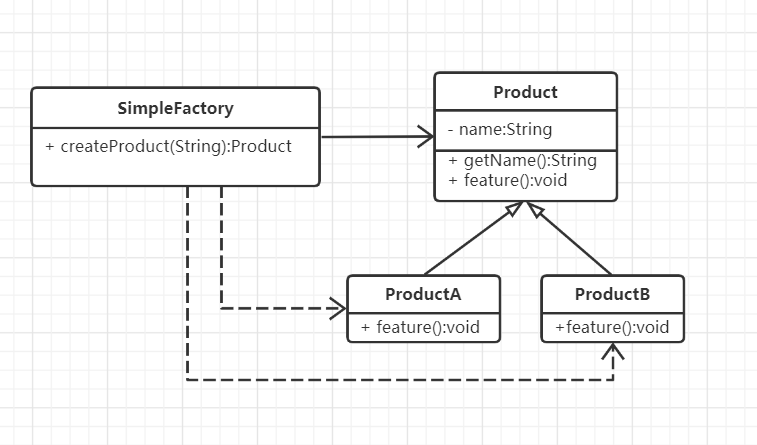
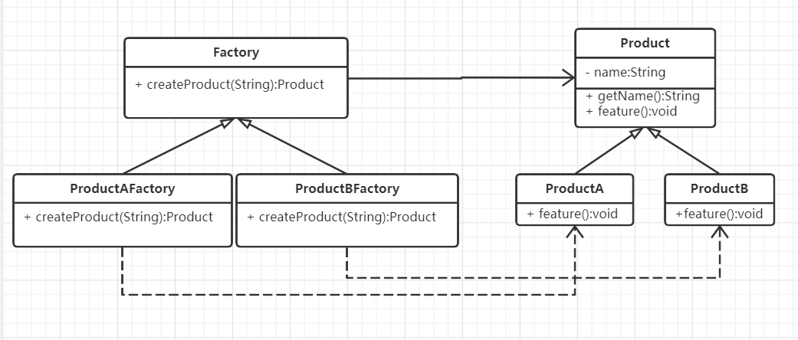
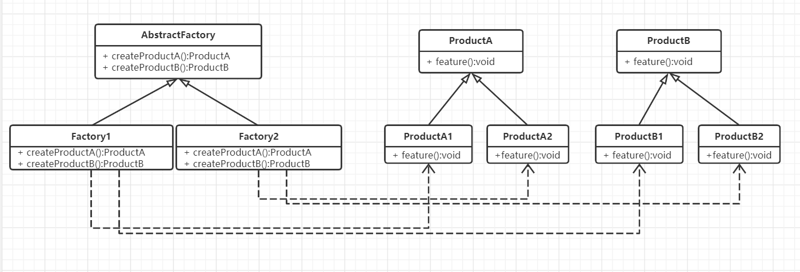

#  工厂模式

## 什么是工厂模式

专门定义一个类来负责创建其他类的实例，根据参数的不同创建不同类的实例，被创建的实例通常具有共同的父类，这个模式叫简单工厂模式（Simple Factory Pattern）。

简单工厂模式又称为静态工厂方法模式。之所以叫“静态”，是因为在很多语言（如Java、C++）中方法通常被定义成一个静态（static）方法，这样便可通过类名来直接调用方法。


## 工厂模式的设计思想

工厂模式的核心思想是：在工厂模式中，用来创建对象的类叫工厂类，被创建的对象的类称为产品类。在创建对象的过程就如同一个工厂一样，我们加入不同的配料（条件、参数等），就会生产出不同的产品（对象），这就是程序设计中工厂模式的概念。


## 从生活中领悟简单工厂模式

以咖啡机制作咖啡为例，通过加入不同风味的咖啡豆产生不同口味咖啡（例如拿铁、摩卡等咖啡），咖啡机制作咖啡的过程如同一个工厂一样，加入不同的配料，就会生产不同的产品：

```python
# 工厂模式 - 你要拿铁还是摩卡？
from abc import ABCMeta, abstractmethod
# 引入ABCMeta和abstractmethod来定义抽象类和抽象方法


class Coffee(metaclass=ABCMeta):
    """咖啡"""

    def __init__(self, name):
        self.__name = name

    def getName(self):
        return self.__name

    @abstractmethod
    def getTaste(self):
        pass


class LatteCoffee(Coffee):
    """拿铁咖啡"""

    def __init__(self, name):
        super().__init__(name)

    def getTaste(self):
        return "轻柔而香醇"


class MochaCoffee(Coffee):
    """摩卡咖啡"""

    def __init__(self, name):
        super().__init__(name)

    def getTaste(self):
        return "丝滑与醇厚"


class Coffeemaker:
    """咖啡机"""

    @staticmethod
    def makeCoffee(coffeeBean):
        "通过staticmethod装饰器修饰来定义一个静态方法"
        if(coffeeBean == "拿铁咖啡豆"):
            coffee = LatteCoffee("拿铁咖啡")
        elif(coffeeBean == "摩卡咖啡豆"):
            coffee = MochaCoffee("摩卡咖啡")
        else:
            raise ValueError("不支持的参数：%s" % coffeeBean)
        return coffee


def testCoffeeMaker():
    latte = Coffeemaker.makeCoffee("拿铁咖啡豆")
    print("%s已为您准备好了，口感：%s。请慢慢享用！" % (latte.getName(), latte.getTaste()) )
    mocha = Coffeemaker.makeCoffee("摩卡咖啡豆")
    print("%s已为您准备好了，口感：%s。请慢慢享用！" % (mocha.getName(), mocha.getTaste()))


if __name__ == '__main__':
    testCoffeeMaker()

"""
拿铁咖啡已为您准备好了，口感：轻柔而香醇。请慢慢享用！
摩卡咖啡已为您准备好了，口感：丝滑与醇厚。请慢慢享用！
"""
```

示例中CoffeeMaker就是工厂类，LatteCoffee和MochaCoffee就是产品类，它们都有一个共同的抽象Coffee类。


## 工厂模式（三姐妹）的框架模型

咖啡机示例只是工厂模式中简单工厂模式的范例，工厂模式有三种细分的版本（工厂模式三姐妹）：简单工厂模式（小妹妹）、工厂方法模式（妹妹）、抽象工厂模式（姐姐）。这三种模式可以理解为同一种编程思想的三个版本，从简单到高级不断升级。工厂方法模式是简单工厂模式的升级，抽象工厂模式又是工厂方法模式的升级！

### 简单工厂模式

#### 定义
> Define an interface for creating an object, it through the argument to decide which class to instantiate.

定义一个创建对象（实例化对象）的接口，通过参数来决定创建哪个类的实例。

#### 类图

最简单的工厂模式，只有一个工厂类SimpleFactory，类中有一个静态的创建方法
法createProduct，该方法根据参数传递过来的类型值（type）或名称（name）来创建具体的产品（子类）对象。



SimpleFactory是工厂类，负责创建对象，如示例中的CoffeeMaker。Product是要创建的产品的抽象类，负责定义统一的接口，如示例中的Coffee。ProductA和ProductB是具体的产品类型，如示例中的LatteCaffe和MochaCoffee。

#### 优缺点

简单工厂模式的优点：

1.  实现简单、结构清晰。
2. 抽象出一个专门的类来负责某类对象的创建，分割出创建的职责，不能直接创建具体的对象，要传入适当的参数才能创建对象。
3. 使用者可以不关注具体对象的类名称，只需知道传入什么参数可以创建哪些需要的对象。

简单工厂模式的缺点：

1. 不易拓展，一旦添加新的产品类型，就不得不修改工厂的创建逻辑。**不符合“开放封闭”原则**，如果要增加或删除一个产品类型，就要修改switch...case...（或if...else...）的判断代码。
2. 当产品类型较多时，工厂的创建逻辑可能过于复杂，switch...case...（或if...else...）判断会变得非常多。一旦出错可能造成所有产品创建失败，不利于系统的维护。

#### 应用场景

1. 产品具有明显的继承关系，且产品的类型不太多。
2. 所有的产品具有相同的方法和类似的属性，使用者不关心具体的类型，只希望传入合适的参数能返回合适的对象。

尽管简单工厂模式不符合“开放-封闭”原则，但因为它简单，所以仍然能在很多项目中看到它。


### 工厂方法模式

####  定义

> Define an interface for creating an object, but let subclasses decide which class to instantiate. Factory Method lets a class defer instantiation to subclasses.

定义一个创建对象（实例化对象）的接口，让子类来决定创建哪个类的实例。工厂方法使一个类的实例化延迟到其子类。

####  类图

工厂方法模式是简单工厂模式的一个升级版本，为**解决简单工厂模式不符合“开放-封闭”原则**的问题，**对SimpleFactory进行了一个拆分，抽象出一个父类Factory，并增加多个子类分别负责创建不同的具体产品。**



如上所说，同简单工厂模式中不同的是SimpleFactory被拆分了，现在Factory是所有工厂的抽象类，负责定义统一的接口。进一步拆分出来的ProductAFactory和ProductBFactory是具体的工厂类，分别负责产品ProductA和ProductB的创建。

#### 优缺点

工厂方法模式的优点：

1. 解决了简单工厂模式不符合“开放-封闭”原则的问题，使程序更容易拓展。
2. 实现简单。

工厂方法模式的缺点：

1. 对于具有二级分类或多种分类的产品，工厂方法模式并不适用。

   二级分类：如一个家电工厂，它可能同时生产冰箱、空调和洗衣机，那么冰箱、空调、洗衣机属于一级分类；而洗衣机又可分为高效型的和节能型的，高效型洗衣机和节能型洗衣机就属于二级分类。

   多种分类：如我们有一个电子白板程序，可以绘制各种图形，那么画笔的绘制功能可以理解为一个工厂，而图形可以理解为一种产品；图形可以根据形状分为直线、矩形、椭圆等，也可以根据颜色分为红色图形、绿色图形、蓝色图形等。

#### 应用场景

1. 客户端不知道它所需要的对象的类。
2. 工厂类希望通过其子类来决定创建建哪个具体类的对象。

因为工厂方法模式简单且易拓展，因此在项目中也应用得非常广泛，在很多标准库和开源项目中都能看到它的影子。

#### 

### 抽象工厂模式

#### 定义

> Provide an interface for creating families of related or dependent objects without specifying their concrete classes.

提供一个创建一系列相关或相互依赖的对象的接口，而无须指定它们的具体类。

#### 类图

不言而喻，抽象工厂模式是工厂方法模式的升级版本，**用来解决具有二级分类产品的创建问题**。也就是说抽象工厂模式适用于有多个系列且每个系列有相同子分类的产品。



我们定义一个抽象的工厂类AbstractFactory，AbstractFactory中定义生产每个系列产品的方法；而两个具体的工厂实现类Factory1和Factory2分别生产子分类1的每一系列产品和子分类2的每一系列产品。

如之前提到的二级分类例子中的家电工厂，有冰箱、空调、洗衣机三个系列的产品，而每个系列都有相同的子分类，即高效型和节能型。注意，类图中没有标注的是：如果每个系列有很多相同的属性还可继续抽象出一个公共父类，即ProductA和ProductB还可以继续抽象出一个比如叫Product的父类，当然这需要根据实际应用场景而定，如果差别很大则没有必要。

#### 优缺点

优点：

1. 解决了具有二级分类的产品的创建。

缺点：

1. 如果产品的分类超过二级，如三级甚至更多级，抽象工厂模式将会变得非常臃肿。
2. 不能解决产品有多种分类、多种组合的问题。

#### 应用场景

1. 系统中有多于一个的产品族，而每次只使用其中某一产品族。
2. 产品等级结构稳定，设计完成之后，不会向系统中增加新的产品等级结构或者删除已有的产品等级结构。

### 进一步思考

1. **如果产品出现三级甚至更多级分类怎么办？**

   如果程序中出现了三级分类的对象，就需要重新审视一下你的设计，看一下有些类是不是可以进行归纳、抽象合并。*如果实际的应用场景中确实有三级甚至更多级分类，建议你不要使用工厂模式了，直接交给每一个具体的产品类自己去创建吧！*因为超过三级（含三级）以上分类，会使工厂类变得非常臃肿而难以维护，开发成本也会急剧增加。模式是死的，人是活的，不要为了使用设计模式而使用设计模式！

2. **如果产品有多种分类、多种组合怎么办？**

   如果产品有多种分类，就不能单独使用工厂模式了，需要结合其他的设计模式进行优化。如接下来准备描述的实战：白板程序，既有形状的分类又有颜色的分类，就可以结合桥接模式一起使用，用桥接模式来定义产品，再用工厂模式来创建产品。


## 实战应用-简单工厂模式

基于经典的简单工厂模式，可以进行一些延伸和拓展。一般的简单工厂模式中我们可以创建任意多个对象，但在一些特定场景下，我们可能希望每一个具体的类型只能创建一个对象（单例的思想），这就需要对工厂类的实现方式做一些修改。

比如，在众多的在线教育产品和视频教学产品中都会有一个白板功能（用电子白板来模拟线下的黑板功能），白板功能中需要不同类型的画笔，比如直线、矩形、椭圆等，但在一个白板中我们只需要一支画笔。可对简单工厂模式进行一些修改以满足这种需求，具体的实现代码如下：

```python
# 简单工厂模式 - 白板中画笔的创建
from abc import ABCMeta, abstractmethod
from enum import Enum
# Python3.4 之后支持枚举Enum的语法


class PenType(Enum):
    """画笔类型"""
    PenTypeLine = 1
    PenTypeRect = 2
    PenTypeEllipse = 3


class Pen(metaclass=ABCMeta):
    """画笔"""

    def __init__(self, name):
        self.__name = name

    @abstractmethod
    def getType(self):
        pass

    def getName(self):
        return self.__name


class LinePen(Pen):
    """直线画笔"""

    def __init__(self, name):
        super().__init__(name)

    def getType(self):
        return PenType.PenTypeLine


class RectanglePen(Pen):
    """矩形画笔"""

    def __init__(self, name):
        super().__init__(name)

    def getType(self):
        return PenType.PenTypeRect


class EllipsePen(Pen):
    """椭圆画笔"""

    def __init__(self, name):
        super().__init__(name)

    def getType(self):
        return PenType.PenTypeEllipse


class PenFactory:
    """画笔工厂类"""

    def __init__(self):
        "定义一个字典(key:PenType，value：Pen)来存放对象,确保每一个类型只会有一个对象"
        self.__pens = {}

    def getSingleObj(self, penType, name):
        """获得唯一实例的对象"""


    def createPen(self, penType):
        """创建画笔"""
        if (self.__pens.get(penType) is None):
            # 如果该对象不存在，则创建一个对象并存到字典中
            if penType == PenType.PenTypeLine:
                pen = LinePen("直线画笔")
            elif penType == PenType.PenTypeRect:
                pen = RectanglePen("矩形画笔")
            elif penType == PenType.PenTypeEllipse:
                pen = EllipsePen("椭圆画笔")
            else:
                pen = Pen("")
            self.__pens[penType] = pen
        # 否则直接返回字典中的对象
        return self.__pens[penType]


def testPenFactory():
    factory = PenFactory()
    linePen = factory.createPen(PenType.PenTypeLine)
    print("创建了 %s，对象id：%s， 类型：%s" % (linePen.getName(), id(linePen), linePen.getType()) )
    rectPen = factory.createPen(PenType.PenTypeRect)
    print("创建了 %s，对象id：%s， 类型：%s" % (rectPen.getName(), id(rectPen), rectPen.getType()) )
    rectPen2 = factory.createPen(PenType.PenTypeRect)
    print("创建了 %s，对象id：%s， 类型：%s" % (rectPen2.getName(), id(rectPen2), rectPen2.getType()) )
    ellipsePen = factory.createPen(PenType.PenTypeEllipse)
    print("创建了 %s，对象id：%s， 类型：%s" % (ellipsePen.getName(), id(ellipsePen), ellipsePen.getType()) )


if __name__ == '__main__':
    testPenFactory()

"""
创建了 直线画笔，对象id：1545750336464， 类型：PenType.PenTypeLine
创建了 矩形画笔，对象id：1545750336608， 类型：PenType.PenTypeRect
创建了 矩形画笔，对象id：1545750336608， 类型：PenType.PenTypeRect
创建了 椭圆画笔，对象id：1545750336704， 类型：PenType.PenTypeEllipse
"""
```

示例中，虽然创建了矩形画笔的对象，但这两个变量指向的是同一个对象。这说明通过这种方式我们实现了每一个类型只创建一个对象的功能。

>  摘自： 罗伟富. 《人人都懂设计模式：从生活中领悟设计模式：Python实现》. 电子工业出版社