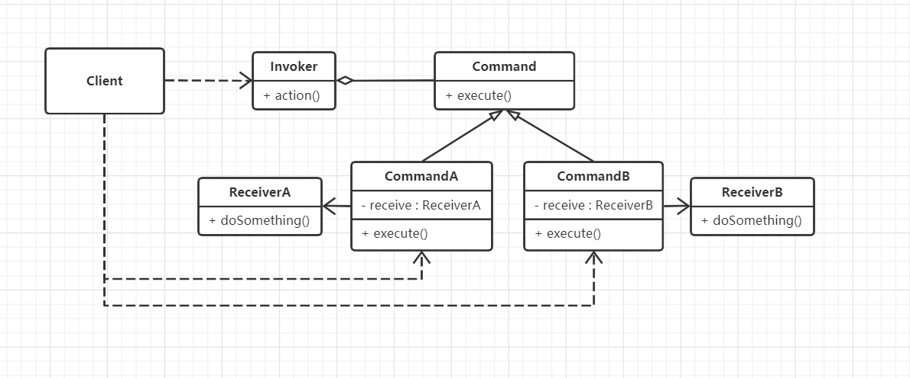

#  命令模式

## 什么是命令模式

> Encapsulate a request as an object, thereby letting you parametrize clients with different requests, queue or log requests, and support undoable operations.
>

将一个请求封装成一个对象，从而让你使用不同的请求把客户端参数化，对请求排队或者记录请求日志，可以提供命令的撤销和恢复功能。


## 命令模式的设计思想

命令模式的核心思想是：**将具体的命令与对应的接收者相关联（捆绑），使得调用方不用关心具体的行动执行者及如何执行，只要发送正确的命令，就能准确无误地完成相应的任务。**

命令模式是一种高内聚的模式，因为它把命令封装成对象，并与接收者关联在一起，从而使（命令的）请求者（Invoker）和接收者（Receiver）分离。


## 从生活中领悟简单命令模式

在生活中，点餐就是一个活生生的命令模式，我们只要发一个订单就能吃到我们想要的美味佳肴，而不用知道厨师是谁，更不用关心他是怎么做的。点餐的订单就是命令，而发送者（客户）与接收者（厨师）没有任何依赖关系，我们只要发送订单就能完成想要完成的任务，这在程序中叫作命令模式。作者以在盒马生鲜中点清蒸或者爆炒大闸蟹为例：

```python
# 命令模式- 大闸蟹，走起
from abc import ABCMeta, abstractmethod
# 引入ABCMeta和abstractmethod来定义抽象类和抽象方法


class Chef():
    """厨师"""

    def steamFood(self, originalMaterial):
        print("%s清蒸中..." % originalMaterial)
        return "清蒸" + originalMaterial

    def stirFriedFood(self, originalMaterial):
        print("%s爆炒中..." % originalMaterial)
        return "香辣炒" + originalMaterial


class Order(metaclass=ABCMeta):
    """订单"""

    def __init__(self, name, originalMaterial):
        self._chef = Chef()
        self._name = name
        self._originalMaterial = originalMaterial

    def getDisplayName(self):
        return self._name + self._originalMaterial

    @abstractmethod
    def processingOrder(self):
        pass


class SteamedOrder(Order):
    """清蒸"""

    def __init__(self, originalMaterial):
        super().__init__("清蒸", originalMaterial)

    def processingOrder(self):
        if(self._chef is not None):
            return self._chef.steamFood(self._originalMaterial)
        return ""


class SpicyOrder(Order):
    """香辣炒"""

    def __init__(self, originalMaterial):
        super().__init__("香辣炒", originalMaterial)

    def processingOrder(self):
        if (self._chef is not None):
            return self._chef.stirFriedFood(self._originalMaterial)
        return ""


class Waiter:
    """服务员"""

    def __init__(self, name):
        self.__name = name
        self.__order = None

    def receiveOrder(self, order):
        self.__order = order
        print("服务员%s：您的 %s 订单已经收到,请耐心等待" % (self.__name, order.getDisplayName()) )

    def placeOrder(self):
        food = self.__order.processingOrder()
        print("服务员%s：您的餐 %s 已经准备好，请您慢用!" % (self.__name, food) )


def testOrder():
    waiter = Waiter("Anna")
    steamedOrder = SteamedOrder("大闸蟹")
    print("客户David：我要一份 %s" % steamedOrder.getDisplayName())
    waiter.receiveOrder(steamedOrder)
    waiter.placeOrder()
    print()

    spicyOrder = SpicyOrder("大闸蟹")
    print("客户Tony：我要一份 %s" % spicyOrder.getDisplayName())
    waiter.receiveOrder(spicyOrder)
    waiter.placeOrder()


if __name__ == '__main__':
    testOrder()

"""
客户David：我要一份 清蒸大闸蟹
服务员Anna：您的 清蒸大闸蟹 订单已经收到,请耐心等待
大闸蟹清蒸中...
服务员Anna：您的餐 清蒸大闸蟹 已经准备好，请您慢用!

客户Tony：我要一份 香辣炒大闸蟹
服务员Anna：您的 香辣炒大闸蟹 订单已经收到,请耐心等待
大闸蟹爆炒中...
服务员Anna：您的餐 香辣炒大闸蟹 已经准备好，请您慢用!
"""
```

示例中Chef和Customer是没有直接接触的，Customer也不用去关系Chef是如何执行爆炒、清蒸大闸蟹的，只需要将订单这个具体的命令，交给Waiter，Waiter会将命令再次传达给Chef，Chef就会执行相关的操作，完成任务，再由Waiter将结果呈现给Waiter。对于Customer来说只做了下具体Order动作，剩下的全由Waiter和Chef处理即可。


## 命令模式的框架模型

对示例代码进一步重构和优化，抽象出命令模式的框架：

### 类图



Command是核心类，表示一项任务或者一个动作，如示例中的订单，它是所有命令的抽象类，定义了统一的执行方法execute。

CommandA和CommandB包装了命令的接收者（如ReceiveA和ReceiveB），在执行execute方法时会调用接收者的实现。

Receiver是命令的接收者，也是任务的具体执行者，如示例中的厨师。

Invoker负责命令的调用，如示例中的服务员。

Client是真正的用户，如示例中的顾客。

### 设计要点

命令模式中主要有四个角色，在设计命令模式时要找到并区分这些角色。

1. 命令（Command）：要完成的任务，或要执行的动作，这是命令模式的核心角色。
2. 接收者（Receiver）：任务的具体实施方，或行动的真实执行者。
3. 调度者（Invoker）：接收任务并发送命令，对接用户的需求并执行内部的命令，负责外部用户与内部命令的交互。
4. 用户（Client）：命令的使用者，即真正的用户。

### 命令模式优缺点

优点：

1. 对命令的发送者与接收者进行解耦，使得调用方不用关心具体的行动执行者及如何执行，只要发送正确的命令即可。
2. 可以很方便地增加新的命令。

缺点：

1. 在一些系统中可能会有很多命令，而每一个命令都需要一个具体的类去封装，容易使命令的类急剧膨胀。

## 应用场景

1. 希望系统发送一个命令（或信号），任务就能得到处理时。如GUI中的的各种按钮的点击命令，再如自定义一套消息的响应机制。
2. 需要将请求调用者和请求接收者解耦，使得调用者和接收者不直接交互时。
3. 需要将一系列的命令组合成一组操作时，可以使用宏命令的方式。宏命令（MacroCommand）也是一个具体的命令类，它拥有一个集合属性，在集合中包含了对其他命令的引用。例如，操作游戏中的角色，很多都是操作命令都是宏命令，如弹跳攻击，下蹲前进等。

>  摘自： 罗伟富. 《人人都懂设计模式：从生活中领悟设计模式：Python实现》. 电子工业出版社