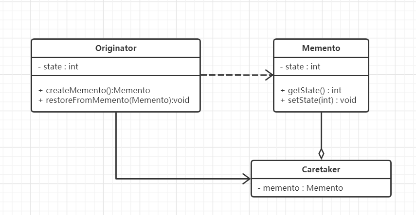
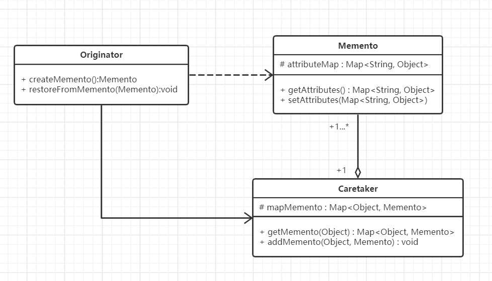

#  备忘模式

## 什么是备忘模式

> Capture the object's internal state without exposing its internal structure, so that the object can be Capture the object's internal state without exposing its internal structure, so that the object can be returned to this state later.
>

在不破坏内部结构的前提下，捕获一个对象的内部状态，这样便可在以后将对象恢复到原先保存的状态。


## 备忘模式的设计思想

备忘模式的核心思想是：**备份**，将一个对象的状态或内容作为备份，在状态发生改变或者出行异常时，可以恢复对象之前的状态或内容。


## 从生活中领悟简单备忘模式

在很多地方可见备忘模式，例如手机上的恢复出厂设置，虚拟机软件的保存快照功能，命令行中的历史命令保存等等。这里作者用Tony为了能够随时能够会想起要做的工作，把工作项写入到To Do List备忘作为例子说明备忘录模式：

```python
# 备忘录模式 - 好记性不如烂笔头

class Engineer:
    """工程师"""

    def __init__(self, name):
        self.__name = name
        self.__workItems = []

    def addWorkItem(self, item):
        self.__workItems.append(item)

    def forget(self):
        self.__workItems.clear()
        print(self.__name + "工作太忙了，都忘记要做什么了！")

    def writeTodoList(self):
        """将工作项记录到TodoList"""
        todoList = TodoList()
        for item in self.__workItems:
            todoList.writeWorkItem(item)
        return todoList

    def retrospect(self, todoList):
        """回忆工作项"""
        self.__workItems = todoList.getWorkItems()
        print(self.__name + "想起要做什么了！")

    def showWorkItem(self):
        if(len(self.__workItems)):
            print(self.__name + "的工作项：")
            for idx in range(0, len(self.__workItems)):
                print(str(idx + 1) + ". " + self.__workItems[idx] + ";")
        else:
            print(self.__name + "暂无工作项")


class TodoList:
    """工作项"""

    def __init__(self):
        self.__workItems = []

    def writeWorkItem(self, item):
        self.__workItems.append(item)

    def getWorkItems(self):
        return self.__workItems


class TodoListCaretaker:
    """TodoList管理类"""

    def __init__(self):
        self.__todoList = None

    def setTodoList(self, todoList):
        self.__todoList = todoList

    def getTodoList(self):
        return self.__todoList


def testEngineer():
    tony = Engineer("Tony")
    tony.addWorkItem("解决线上部分用户因为昵称过长而无法显示全的问题")
    tony.addWorkItem("完成PDF的解析")
    tony.addWorkItem("在阅读器中显示PDF第一页的内容")
    tony.showWorkItem()

    caretaker = TodoListCaretaker()
    caretaker.setTodoList(tony.writeTodoList())

    print()
    tony.forget()
    tony.showWorkItem()

    print()
    tony.retrospect(caretaker.getTodoList())
    tony.showWorkItem()


if __name__ == '__main__':
    testEngineer()

"""
Tony的工作项：
1. 解决线上部分用户因为昵称过长而无法显示全的问题;
2. 完成PDF的解析;
3. 在阅读器中显示PDF第一页的内容;

Tony工作太忙了，都忘记要做什么了！
Tony暂无工作项

Tony想起要做什么了！
Tony的工作项：
1. 解决线上部分用户因为昵称过长而无法显示全的问题;
2. 完成PDF的解析;
3. 在阅读器中显示PDF第一页的内容;

"""
```


## 备忘模式的框架模型

对示例代码进一步重构和优化，抽象出备忘模式的框架：

### 类图



这是最原始和最简单的备忘录模式类图，也是GoF的《设计模式：可复用面向对象软件的基础》一书提到的类图。

Orginator是要要进行备份对象的发起类，如示例中的Enginner；Memento是备份的状态，如示例中的TodoList；Cratetaker是备份的管理类，如示例中的TodoListCaretaker。

Orginator依赖Memento，但不直接与Memento进行交互，而是与Memento的管理类Cratetaker进行交互。这样的好处是：对于上层应用来说不用关心具体是怎么备份的和备份了什么内容，只需要创建一个备份点，并能从备份点中还原即可。

**精简版的备忘模式只能备忘一个属性而且只能备忘一次。**在实际项目中很少看到这个版本的应用，因为大部分实际应用场景都比这复杂。通常对这个备忘模式进行改造：



与精简版类图区别在于：

1. Memento能备份一组属性。
2. Caretaker能备份多个状态，Originator可从中选择任意一个状态进行恢复。

升级版类图代码框架如下：

```python
# 备忘录模式 - 框架
from copy import deepcopy


class Memento:
    """备忘录"""

    def setAttributes(self, dict):
        """深度拷贝字典dict中的所有属性"""
        self.__dict__ = deepcopy(dict)

    def getAttributes(self):
        """获取属性字典"""
        return self.__dict__


class Caretaker:
    """备忘录管理类"""

    def __init__(self):
        self._mementos = {}

    def addMemento(self, name, memento):
        self._mementos[name] = memento

    def getMemento(self, name):
        return self._mementos[name]


class Originator:
    """备份发起人"""

    def createMemento(self):
        memento = Memento()
        memento.setAttributes(self.__dict__)
        return memento

    def restoreFromMemento(self, memento):
        self.__dict__.update(memento.getAttributes())


```


### 设计要点

备忘模式中主要有三个角色，在设计备忘模式时要找到并区分这些角色。

1. 发起人（Originator）：需要进行备份的对象。
2. 备忘录（Memento）：备份的状态，即一个备份的存档。
3. 备忘录管理者（Caretaker）：备份存档的管理者，由它负责与发起人的交互。

   

### 备忘模式优缺点

优点：

1. 提供了一种可以恢复某一时刻对象状态的机制，使得用户能够比较方便地回到某个历史状态。
2. 实现了信息的封装，用户不需要关心状态的保存细节。

缺点：

1. 如果类的成员变量过多，势必会占用比较多的资源，而且每一次保存都会消耗一定的内存。此时可以限制保存的次数。

### 实战应用

模拟DOS命令行或者Linux终端命令，通过向上键或向下键快速向前或向后翻阅历史指令：

```python
# 备忘录模式应用　－　模拟Linux终端

from memento_frame import Originator,Caretaker,Memento
import logging


class TerminalCmd(Originator):
    """终端命令"""

    def __init__(self, text):
        self.__cmdName = ""
        self.__cmdArgs = []
        self.parseCmd(text)

    def parseCmd(self, text):
        """从字符串中解析命令"""
        subStrs = self.getArgumentsFromString(text, " ")
        # 获取第一个字段作为命令的名称
        if(len(subStrs) > 0):
            self.__cmdName = subStrs[0]
        # 获取第一个字段之后的所有字符作为命令的参数
        if(len(subStrs) > 1):
            self.__cmdArgs = subStrs[1:]

    def getArgumentsFromString(self, str, splitFlag):
        """通过splitFlag进行分割，获得参数数组"""

        if(splitFlag == ""):
            logging.warning("splitFlag为空！")
            return ""
        data = str.split(splitFlag)
        result = []
        for item in data:
            item.strip()
            if(item != ""):
                result.append(item)
        return result

    def showCmd(self):
        print(self.__cmdName, self.__cmdArgs)


class TerminalCaretaker(Caretaker):
    """终端命令的备忘录管理类"""

    def showHistoryCmds(self):
        """显示历史命令"""
        for key, obj in self._mementos.items():
            name = ""
            value = []
            if(obj._TerminalCmd__cmdName):
                name = obj._TerminalCmd__cmdName
            if(obj._TerminalCmd__cmdArgs):
                value = obj._TerminalCmd__cmdArgs
            print("第%s条命令：%s %s" % (key, name, value))


def testTerminal():
    cmdIdx = 0
    caretaker = TerminalCaretaker()
    curCmd = TerminalCmd("")
    while(True):
        strCmd = input("请输入指令:");
        strCmd = strCmd.lower()
        if(strCmd.startswith("q")):
            exit(0)
        elif(strCmd.startswith("h")):
            caretaker.showHistoryCmds()
        # 通过"!"符号表示获取历史的某个指令
        elif(strCmd.startswith("!")):
            idx = int(strCmd[1:])
            curCmd.restoreFromMemento(caretaker.getMemento(idx))
            curCmd.showCmd()
        else:
            curCmd = TerminalCmd(strCmd)
            curCmd.showCmd()
            caretaker.addMemento(cmdIdx, curCmd.createMemento())
            cmdIdx += 1


if __name__ == '__main__':
    testTerminal()

"""
请输入指令:ls -a -l
ls ['-a', '-l']
请输入指令:tar xvf compressedFile.tar
tar ['xvf', 'compressedFile.tar']
请输入指令:h
第0条命令：ls ['-a', '-l']
第1条命令：tar ['xvf', 'tarfile.tar']
请输入指令:!1
tar ['xvf', 'tarfile.tar']
请输入指令:!0
ls ['-a', '-l']
请输入指令:q
"""
```


## 应用场景

1. 需要保存/恢复对象的状态或数据时，如游戏的存档、虚拟机的快照。
2. 需要实现撤销、恢复功能的场景，如Word中的Ctrl+Z、Ctrl+Y功能，DOS命令行或Linux终端的命令记忆功能。
3. 提供一个可回滚的操作，如数据库的事务管理。

>  摘自： 罗伟富. 《人人都懂设计模式：从生活中领悟设计模式：Python实现》. 电子工业出版社