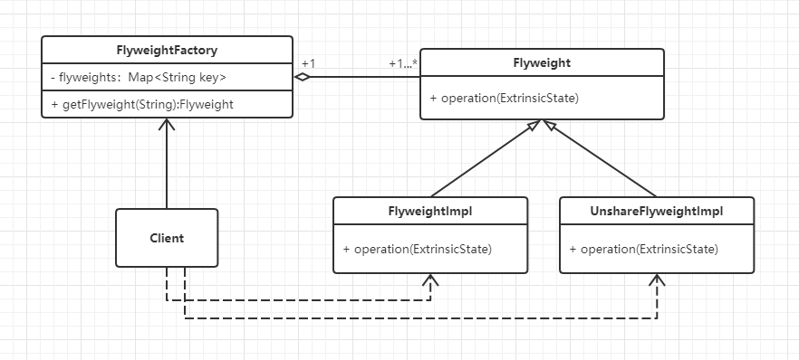

#  享元模式

## 什么是享元模式

> Use sharing to support large numbers of fine-grained objects efficiently.
>

运用共享技术有效地支持大量细粒度对象的复用。


## 享元模式的设计思想

享元模式（Flyweight Pattern）。Flyweight一词来源于拳击比赛，意思是“特轻量级”。用在程序设计中，**享元模式要求能够共享的对象必须是轻量级对象，也就是细粒度对象**，因此享元模式又称为**轻量级模式**。

享元模式以共享的方式高效地支持大量的细粒度对象，享元对象能做到共享的关键是区分内部状态和外部状态。

- 内部状态（Intrinsic State）是存储在享元对象内部并且不会随环境改变而改变的状态，因此内部状态是可以共享的状态。
- 外部状态（Extrinsic State）是随环境改变而改变的、不可以共享的状态。享元对象的外部状态必须由客户端保存，并在享元对象被创建之后，在需要使用的时候再传入享元对象内部。


## 从生活中领悟简单享元模式

作者以团建活动中的取颜料画画为例领悟享元模式，活动内容是：6个人一组，每组完成一幅画作，每组会拿到一张彩绘原型图，然后根据原型图完成一幅巨型彩绘图（类似海报墙那种）。素材：原型图每组一张，铅笔每组一支，空白画布每组一张，画刷每组若干；而颜料却是所有组共用的，有红、黄、蓝、绿、紫5种颜色各一大桶，足够使用。开始前3分钟为准备时间，采用什么样的合作方式每组自己讨论，越快完成的组获得的分数越高！颜料之所以是共用的，原因也很简单，颜料很贵，必须充分利用。

```python
# 享元模式 - 颜料很贵，必须充分利用

import logging
# 引入logging模块记录异常


class Pigment:
    """颜料"""

    def __init__(self, color):
        self.__color = color
        self.__user = ""

    def getColor(self):
        return self.__color

    def setUser(self, user):
        self.__user = user
        return self

    def showInfo(self):
        print("%s 取得 %s色颜料" % (self.__user, self.__color))


class PigmentFactory:
    """资料的工厂类"""

    def __init__(self):
        self.__pigmentSet = {
            "红": Pigment("红"),
            "黄": Pigment("黄"),
            "蓝": Pigment("蓝"),
            "绿": Pigment("绿"),
            "紫": Pigment("紫"),
        }

    def getPigment(self, color):
        pigment = self.__pigmentSet.get(color)
        if pigment is None:
            logging.error("没有%s颜色的颜料！", color)
        return pigment


def testPigment():
    factory = PigmentFactory()
    pigmentRed = factory.getPigment("红").setUser("梦之队")
    pigmentRed.showInfo()
    pigmentYellow = factory.getPigment("黄").setUser("梦之队")
    pigmentYellow.showInfo()
    pigmentBlue1 = factory.getPigment("蓝").setUser("梦之队")
    pigmentBlue1.showInfo()
    pigmentBlue2 = factory.getPigment("蓝").setUser("和平队")
    pigmentBlue2.showInfo()


if __name__ == '__main__':
    testPigment()

"""
梦之队 取得 红色颜料
梦之队 取得 黄色颜料
梦之队 取得 蓝色颜料
和平队 取得 蓝色颜料
"""
```

示例中Pigment就是享元对象，它的内部状态就是颜料的颜色，而颜料的使用者就是外部状态。


## 享元模式的框架模型

对示例代码进一步重构和优化，抽象出享元模式的框架：

### 类图



Flyweight：享元对象的抽象类，负责定义对象的内部状态和外部状态的接口。

FlyweightImpl：享元对象的具体实现者，负责具体业务（状态）的处理，如示例中的Pigment。

UnshareFlyweightImpl：不可共享的对象，不能够使用共享技术的对象（一般不会出现在享元工厂中），只是实现了抽象类Flyweight的接口（或空实现）。

FlyweightFactory：享元工厂，享元模式的核心类，其实就是享元对象的一个容器，主要是负责享元对象的创建和容器中对象的管理。


示例中在PigmengFactory的初始化（构造）函数中就把5种颜色的颜料都创建出来了，这是因为我们的颜料在活动之前就已经准备好了。在程序中我们可以在用到的时候再去创建它，这在包含一些初始化非常耗时的对象时，可有效地提升程序的性能，因为把耗时的操作分解了。外部状态也可以通过参数的方式传给operation方法，替代set的方式。以下就是示例基于框架类图实现：

```python
# 享元模式 - 基于框架实现

from abc import ABCMeta, abstractmethod
# 引入ABCMeta和abstractmethod来定义抽象类和抽象方法


class Flyweight(metaclass=ABCMeta):
    """享元类"""

    @abstractmethod
    def operation(self, extrinsicState):
        pass


class FlyweightImpl(Flyweight):
    """享元类的具体实现类"""

    def __init__(self, color):
        self.__color = color

    def operation(self, extrinsicState):
        print("%s 取得 %s色颜料" % (extrinsicState, self.__color))


class FlyweightFactory:
    """享元工厂"""

    def __init__(self):
        self.__flyweights = {}

    def getFlyweight(self, key):
        pigment = self.__flyweights.get(key)
        if pigment is None:
            pigment = FlyweightImpl(key)
        return pigment


def testFlyweight():
    factory = FlyweightFactory()
    pigmentRed = factory.getFlyweight("红")
    pigmentRed.operation("梦之队")
    pigmentYellow = factory.getFlyweight("黄")
    pigmentYellow.operation("梦之队")
    pigmentBlue1 = factory.getFlyweight("蓝")
    pigmentBlue1.operation("梦之队")
    pigmentBlue2 = factory.getFlyweight("蓝")
    pigmentBlue2.operation("和平队")


if __name__ == '__main__':
    testFlyweight()

"""
梦之队 取得 红色颜料
梦之队 取得 黄色颜料
梦之队 取得 蓝色颜料
和平队 取得 蓝色颜料
"""
```


### 设计要点

享元模式中主要有两个角色，在设计享元模式时要找到并区分这些角色：

1. **享元对象**（Flyweight）：即你期望用来共享的对象，享元对象必须是轻量级对象，也就是细粒度对象。
2. **享元工厂**（FlyweightFactory）：享元模式的核心角色，负责创建和管理享元对象。享元工厂提供一个用于存储享元对象的享元池，用户需要对象时，首先从享元池中获取，如果享元池中不存在，则创建一个新的享元对象返回给用户，并在享元池中保存该新增对象。享元工厂其实是一个修改版本的简单工厂模式。

此外有四个注意事项：

1. 享元对象必须是轻量级、细粒度的对象。
2. 区分享元对象的内部状态和外部状态。
3. 享元对象的内部状态和属性一经创建不会被随意改变。因为如果可以改变，则A取得这个对象obj后，改变了其状态，B再去取这个对象obj时就已经不是原来的状态了。
4. 使用对象时通过享元工厂获取，使得传入相同的key时获得相同的对象。


### 享元模式优缺点

优点：

1. 可以极大减少内存中对象的数量，使得相同对象或相似对象（内部状态相同的对象）在内存中只保存一份。
2. 享元模式的外部状态相对独立，而且不会影响其内部状态，从而使得享元对象可以在不同的环境中被共享。

缺点：

1. 享元模式使得系统更加复杂，需要分离出内部状态和外部状态，这使得程序的逻辑复杂化。
2. 享元对象的内部状态一经创建不能被随意改变。要解决这个问题，需要使用对象池机制。


## 应用场景

1. 一个系统有大量相同或者相似的对象，由于这类对象的大量使用，造成内存的大量耗费。
2. 对象的大部分状态都可以外部化，可以将这些外部状态传入对象中。

**享元模式是一个考虑系统性能的设计模式，使用享元模式可以节约内存空间，提高系统的性能，因为它的这一特性，在实际项目中使用得比较多**。比如浏览器的缓存，就可以使用这个设计思想，浏览器会将已打开页面的图片、文件缓存到本地，如果在一个页面中多次出现相同的图片（即一个页面中多个img标签指向同一个图片地址），则只需要创建一个图片对象，在解析到img标签的地方多次重复显示这个对象即可。

>  摘自： 罗伟富. 《人人都懂设计模式：从生活中领悟设计模式：Python实现》. 电子工业出版社