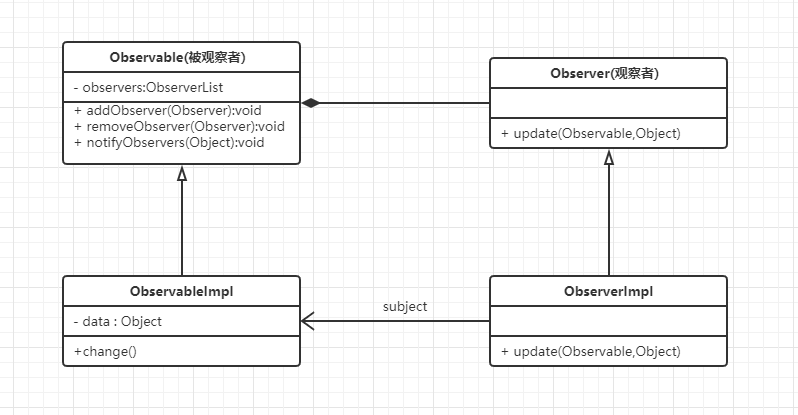
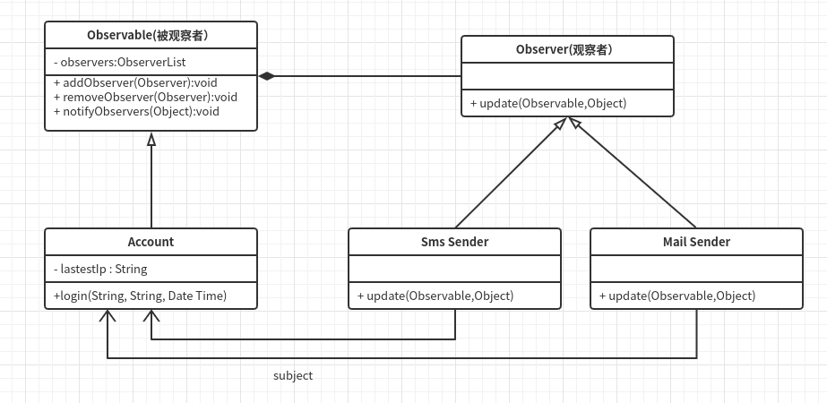

# 监听模式

## 什么是监听模式

> Define a one-to-many dependency between objects so that when on object changs state, all its dependens are notified and updated automatically.  
>
> 在对象之间定义一种一对多的依赖关系，当这个对象状态发生改变时，所有依赖它的对象都会被通知并自动更新。

&emsp;&emsp; **监听模式是一种一对多的关系，可以有任意个观察者对象同时监听某一个对象**。监听的对象被称为观察者或监听者，被监听的对象称为被观察者（Observer，也叫主题，即Subject）。**被观察者对象在状态或内容发生变化时，会通知所有的观察者对象，使得他们能够做出响相应的变化**。

&emsp;&emsp;监听模式是**对象的行为模式**，又叫 发布 / 订阅（Publish/Subscribe）模式、模型 / 视图（Model/View）模式、源 / 监听器（Source/Listener）模式 或 从属者（Dependents）模式。当你看到上述模式的时候，不要觉得陌生，它们本质上就是监听模式。

## 监听模式的核心思想

&emsp;&emsp;监听模式又称为观察者模式，顾名思义就是**观察与被观察的关系**。

&emsp;&emsp;核心思想就是**在被观察者和观察者之间建立一种自动触发的关系。**

## 从生活中领悟监听模式

生活中的例子：烧开水、带小孩、警报器等等，

- 烧开水：你在烧开水的时候看着它开没开，你就是观察者，水就是被观察者；

- 带小孩：你在带小孩，你关注他是不是饿了，是不是渴了，是不是撒尿了，你就是观察者，小孩就是被观察者。

假如有个需求：

&emsp;&emsp;我们做一个简单的智能热水器，来解决传统热水器由于人工值守，控温不慎而出现的“杀猪烫”、“冻成狗”等问题。也就是说能够做到监控水温，执行自定义模式。

需求分析：

&emsp;&emsp;明确观察与被观察的对象是谁？一旦热水器的水温度发生变化，自定义模式就应该执行相应操作。热水器是被观察（被监听）对象，而自定义模式是观察（监听）对象。

代码模拟实现：
``` python
# 监听模式-智能热水器

from abc import ABCMeta, abstractmethod
# 引入ABCMeta 和 abstractmethod 来定义抽象类和抽象方法

class WaterHeater:
    """热水器：战胜寒冬的有利武器"""

    def __init__(self):
        self.__observers = []  # 观察者，私有成员
        self.__temperature = 25  # 温度默认25，私有成员

    def getTemperature(self):
        return self.__temperature

    def setTemperature(self, temperature):
        self.__temperature = temperature;
        print("当前温度是：" + str(self.__temperature) + "℃")
        self.notifies()

    def addObserver(self, observer):
        self.__observers.append(observer)

    def notifies(self):
        for o in self.__observers:
            o.update(self)


class Observer(metaclass=ABCMeta):
    """洗澡模式和饮用模式的父类"""

    @abstractmethod
    def update(self, waterHeater):
        pass


class WashingMode(Observer):
    """洗澡模式"""

    def update(self, waterHeater):
        if 50 <= waterHeater.getTemperature() < 70:
            print("水已烧好！温度正好，可以用来洗澡了。")


class DrinkingMode(Observer):
    """饮用模式"""

    def update(self, waterHeater):
        if waterHeater.getTemperature() >= 100:
            print("水已烧开！可以用来饮用了。")


# test
def testWaterHeater():
    heater = WaterHeater()
    washingObser = WashingMode()
    drinkingObser = DrinkingMode()
    heater.addObserver(washingObser)
    heater.addObserver(drinkingObser)
    heater.setTemperature(40)
    heater.setTemperature(60)
    heater.setTemperature(100)


if __name__ == "__main__":
    testWaterHeater()

""""
当前温度是：40℃
当前温度是：60℃
水已烧好！温度正好，可以用来洗澡了。
当前温度是：100℃
水已烧开！可以用来饮用了。
"""

```

&emsp;&emsp;代码中洗澡模式和饮用模式扮演了监听者的角色，而热水器则是被监听的对象。一旦热水器的水温度发生变化，监听者就能即时知道并做出相应的判断和动作。

## 监听模式的框架模型

对上例的代码进行抽象，监听模式的设计：

### 类图和实现



&emsp;&emsp;Observer是观察者的基类，它是一个抽象类；Observable是被观察者的基类，同样也是一个抽象类（不是抽象类的基类不是一个好基类）。
- 被观察者：Observable抽取了所有被观察者的共性方法：
  - 可以添加以及移除观察者的方法（addObserver、removeObserver）
  - 用于当内容或者状态发生改变的时候通知被观察者的方法（notifyObserver）。
- 观察者：Observer主要关注要执行的更新方法：
  
  - 只要被观察者有变化，被观察者就会自动调用update方法，所以观察者只要关注update实现即可。

代码实现：
``` python
# 监听模式-框架模型

from abc import ABCMeta, abstractmethod
# 引入ABCMeta 和 abstractmethod 来定义抽象类和抽象方法

class Observer(metaclass=ABCMeta):
    """"观察者的基类"""

    @abstractmethod
    def update(self, observable, object):
        pass

class Observable:
    """"被观察者的基类"""

    def __init__(self):
        self.__observers = []

    def addObserver(self, observer):
        self.__observers.append(observer)

    def removeObserver(self, observer):
        self.__observers.remove(observer)

    def notifyObserver(self, object=0):
        for o in self.__observers:
            o.update(self, object)
```


### 基于框架实现
``` python
class WaterHeater(Observable):
    """"热水器：战胜寒冬的有利武器"""

    def __init__(self):
        super().__init__()
        self.__temperature = 25

    def setTemperature(self, temperature):
        self.__temperature = temperature
        print("当前温度是：" + str(self.__temperature) + "℃")
        self.notifyObserver()

    def getTemperature(self):
        return self.__temperature


class WashingMode(Observer):
    """该模式用于洗澡"""

    def update(self, observable, object):
        if isinstance(observable, WaterHeater) and 50 <= observable.getTemperature() < 70:
            print("水已烧好！温度正好，可以用来洗澡了。")


class DrinkingMode(Observer):
    """饮用模式"""

    def update(self, observable, object):
        if isinstance(observable, WaterHeater) and observable.getTemperature() >= 100:
            print("水已烧开！可以用来饮用了。")
```

### 模型设计要点

  在设计监听模式的程序时候要注意以下几点：  

  - 明确谁是观察者谁是被观察者。观察者与被观察者往往是多对一的关系，一个被观察对象可以有多个监听对象。

  - 被观察者在发送广播通知的时候（状态改变），无须指定具体的观察者，观察者可以自己决定是否订阅主题的通知。  

  - 被观察者至少要有添加监听者、移除监听者、通知监听者的三个方法，观察者至少要有一个更新方法，即更新当前的内容，做出相应的处理。  

  - 添加和移除监听者在不同的模型中可能会有不同的命名，比如：观察者模型中一般为addObserver/removeObserver；源/监听器模型中一般为attach/detach；应用桌面编程可能是attachWindow/detachWindow或Register/UnRegister，无论名字是什么，其实他们的功能是相同的。

### 推模型和拉模型

  根据侧重的功能，监听模型可以分为推模型和拉模型。 

  - 推模型：不管观察者是否需要，被观察者对象向观察者推送主题的详细信息，通常来说是主题对象全部或部分数据。一般在这种模型的实现中，被观察对象的部分或全部信息通过update(Object obj) 的obj参数传递 。 

    > 某App的服务要在凌晨1:00开始进行维护，1:00-2:00所有服务都会暂停，这里就需要向所有的App客户端推送完整的消息通知：“本服务将在凌曾1:00开始进行维护，1:00-2:00所有服务暂停，感谢您的理解和支持！”。不管用户想不想知道，也不管用户会不会在这期间访问App，消息都需要被准确无误地发送到。

  - 拉模型：被观察者在通知观察者的时候，只传递少量的信息。如果观察者需要更具体的信息，需要观察者主动从被观察者对象中拉取数据。一般在这种模型的实现中：被观察者对象的引用传递给update(Observable observable)的observable参数，观察者通过该引用获取数据。

    > 如某App有新的版本推出，需要发送一个版本升级的通知消息，而这个消息通知只简单地列出版本号和下载地址，如果需要升级App，还需要调用下载接口去下载安装包完成升级。


&emsp;&emsp;**推模型和拉模型更多是语义和逻辑上的区别**。框架模型中的【update(self, observer, object)】同时支持推/拉模型。作为推模型，observer可以传空，推送的消息通过object传递；作为拉模型，observer和object都可以传递数据，或只传递observer，观察者需要具体信息时通过observer引用去取数据。

## 实战应用

&emsp;&emsp;实战：账号异常登录检测和诊断机制。当账户异常登录时，会以短信或邮件的方式将登录信息发送给已经绑定的手机或邮箱。

&emsp;&emsp;实战逻辑分析：登录异常就是登录状态的改变。服务器会记录你最近几次登录的时间、地区、IP地址，从而得知你常用的登录地址；如果哪次检测到你登录的地区与常用登录地区相差非常大，则认为是一次异常登录，而**短信和邮箱的发送机制可以认为是登录的监听者，只要登录异常一出现就自动发送信息**。




``` python
from monitoring_frame import Observable, Observer
import time

# 导入时间处理模块

class Account(Observable):
    """用户账户"""

    def __init__(self):
        super().__init__()
        self.__latestIp = {}  # 最后一次登陆的IP
        self.__latestRegion = {}  # 最后一次登陆的地区

    def login(self, name, ip, time):
        region = self.__getRegion(ip)
        if self.__isLongDistance(name, region):
            self.notifyObserver({"name": name, "ip": ip, "region": region, "time": time})
        self.__latestRegion[name] = region
        self.__latestIp[name] = ip

    def __getRegion(self, ip):
        # 由IP地址获取地区信息。这里只是模拟，真实项目中应该调用IP地址解析服务
        ipRegions = {
            "101.47.18.9": "浙江省杭州市",
            "67.218.147.69": "美国洛杉矶",
            "113.108.182.52": "广东省广州市",
        }
        region = ipRegions.get(ip)
        return "" if region is None else region

    def __isLongDistance(self, name, region):
        # 计算本次登录与最近几次登录的地区差距。
        # 这里只是简单地用字符串匹配来模拟，真实的项目中应该调用地理信息相关的服务
        latestRegion = self.__latestRegion.get(name)
        return latestRegion is not None and latestRegion != region


class SmsSender(Observer):
    """短信发送器"""

    def update(self, observable, object):
        print("[短信发送] " + object["name"] + "您好！检测到您的账户可能登录异常。最近一次登录信息：\n"
              + "登录地区：" + object["region"] + "  登录ip：" + object["ip"] + "  登录时间："
              + time.strftime("%Y-%m-%d %H:%M:%S", time.gmtime(object["time"])))


class MailSender(Observer):
    """邮件发送器"""

    def update(self, observable, object):
        print("[邮件发送] " + object["name"] + "您好！检测到您的账户可能登录异常。最近一次登录信息：\n"
              + "登录地区：" + object["region"] + "  登录ip：" + object["ip"] + "  登录时间："
              + time.strftime("%Y-%m-%d %H:%M:%S", time.gmtime(object["time"])))


def testLogin():
    account = Account()
    account.addObserver(SmsSender())
    account.addObserver(MailSender())
    account.login("Jack", "101.47.18.9", time.time())
    account.login("Jack", "67.218.147.69", time.time())
    account.login("Jack", "113.108.182.52", time.time())
    account.login("Jack", "113.108.182.52", time.time())

""" runing results:
[短信发送] Jack您好！检测到您的账户可能登录异常。最近一次登录信息：
登录地区：美国洛杉矶  登录ip：67.218.147.69  登录时间：2019-09-22 15:32:13
[邮件发送] Jack您好！检测到您的账户可能登录异常。最近一次登录信息：
登录地区：美国洛杉矶  登录ip：67.218.147.69  登录时间：2019-09-22 15:32:13
[短信发送] Jack您好！检测到您的账户可能登录异常。最近一次登录信息：
登录地区：广东省广州市  登录ip：113.108.182.52  登录时间：2019-09-22 15:32:13
[邮件发送] Jack您好！检测到您的账户可能登录异常。最近一次登录信息：
登录地区：广东省广州市  登录ip：113.108.182.52  登录时间：2019-09-22 15:32:13
"""
```
注：实际项目中，用户信息（用户名、密码、最近几次登录信息等）存放在数据库中，登录应该检验用户信息，而不是模拟程序中的只记录上一次登录信息到Account对象中。

## 应用场景
1. 对一个对象状态或数据的更新需要其他对象同步更新，或者一个对象的更新需要依赖另一个对象的更新。
2. 对象仅需要将自己的更新通知给其他对象而不需要知道其他对象的细节，如消息推送。


> 摘自： 罗伟富. 《人人都懂设计模式：从生活中领悟设计模式：Python实现》. 电子工业出版社
