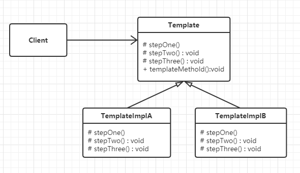

#  模板模式

## 什么是模板模式

> Define the skeleton of an algorithm in an operation, deferring some steps to client subclasses. Template Method lets subclasses redefine certain steps of an algorithm without changing the algorithm's structure.
>

定义一个操作中的算法的框架，而将算法中用到的某些具体的步骤放到子类中实现，使得子类可以在不改变算法框架的情况下重新定义该算法的某些特定步骤。这个定义算法骨架的方法就叫模板方法模式，简称模板模式。


## 模板模式的设计思想

模板模式的核心思想是：模板模式用了面向对象的继承机制。


## 模板模式的框架模型

模板模式的框架类图：

### 类图



代码实现：

```python
# 模板模式 - 代码框架
from abc import ABCMeta, abstractmethod


class Template(metaclass=ABCMeta):
    """模板类(抽象类)"""

    @abstractmethod
    def stepOne(self):
        pass

    @abstractmethod
    def stepTwo(self):
        pass

    @abstractmethod
    def stepThree(self):
        pass

    def templateMethold(self):
        """模板方法"""
        self.stepOne()
        self.stepTwo()
        self.stepThree()


class TemplateImplA(Template):
    """模板实现类A"""

    def stepOne(self):
        print("步骤一")

    def stepTwo(self):
        print("步骤二")

    def stepThree(self):
        print("步骤三")


class TemplateImplB(Template):
    """模板实现类B"""

    def stepOne(self):
        print("Step one")

    def stepTwo(self):
        print("Step two")

    def stepThree(self):
        print("Step three")


def testTemplate():
    templateA = TemplateImplA()
    templateA.templateMethold()
    templateB = TemplateImplB()
    templateB.templateMethold()


if __name__ == '__main__':
    testTemplate()

"""
步骤一
步骤二
步骤三
Step one
Step two
Step three
"""
```

Template是一个模板类，用于定义模板方法（某种算法的框架），templateMethold（）是被定义的模板方法。TemplateImplA和TemplateImplB是模板类的具体子类，用于实现算法框架中的一些特定步骤，也就是算法中的可定制部分。


## 实战应用
需求：在阅读电子书时，根据每个人的不同阅读习惯，可以设置不同的翻页方式，如左右平滑、仿真翻页。不同的翻页方式，给人以不同的展示效果。

实现：

```python
# 模板模式 - 阅读器视图
from abc import ABCMeta, abstractmethod


class ReaderView(metaclass=ABCMeta):
    """阅读器视图"""

    def __init__(self):
        self.__curPageNum = 1

    def getPage(self, pageNum):
        self.__curPageNum = pageNum
        return "第" + str(pageNum) + "的内容"

    def prePage(self):
        """模板方法，往前翻一页"""
        content = self.getPage(self.__curPageNum - 1)
        self._displayPage(content)

    def nextPage(self):
        """模板方法，往后翻一页"""
        content = self.getPage(self.__curPageNum + 1)
        self._displayPage(content)

    @abstractmethod
    def _displayPage(self, content):
        """翻页效果"""
        pass


class SmoothView(ReaderView):
    """左右平滑的视图"""

    def _displayPage(self, content):
        print("左右平滑:" + content)


class SimulationView(ReaderView):
    """仿真翻页的视图"""

    def _displayPage(self, content):
        print("仿真翻页:" + content)


def testReader():
    smoothView = SmoothView()
    smoothView.nextPage()
    smoothView.prePage()

    simulationView = SimulationView()
    simulationView.nextPage()
    simulationView.prePage()


if __name__ == '__main__':
    testReader()

"""
左右平滑:第2的内容
左右平滑:第1的内容
仿真翻页:第2的内容
仿真翻页:第1的内容
"""
```

由应用可以看出，模板模式就是用了面向对象中的继承机制。


## 应用场景

1. 对一些复杂的算法进行分割，将其算法中固定不变的部分设计为模板方法和父类具体方法，而一些可以改变的细节由其子类来实现。即一次性实现一个算法的不变部分，并将可变的行为留给子类来实现。
2. 各子类中公共的行为应被提取出来并集中到一个公共父类中以避免代码重复。
3. 需要通过子类来决定父类算法中某个步骤是否执行，实现子类对父类的反向控制。

>  摘自： 罗伟富. 《人人都懂设计模式：从生活中领悟设计模式：Python实现》. 电子工业出版社