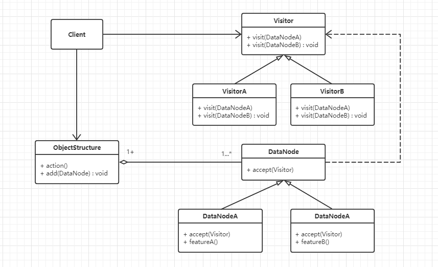

#  模板模式

## 什么是模板模式

> Define the skeleton of an algorithm in an operation, deferring some steps to client subclasses. Template Method lets subclasses redefine certain steps of an algorithm without changing the algorithm's structure.
>

定义一个操作中的算法的框架，而将算法中用到的某些具体的步骤放到子类中实现，使得子类可以在不改变算法框架的情况下重新定义该算法的某些特定步骤。这个定义算法骨架的方法就叫模板方法模式，简称模板模式。可以理解为开发中的接口与实现。


## 模板模式的设计思想

模板模式的核心思想是：定义与实现分离，接口的定义可以理解为模板，模板通常可以被复用，有着接口可以被多实现的意思。这种模式在面向对象中应用得很频繁。


## 模板模式的框架模型

对示例代码进一步重构和优化，抽象出模板模式的框架：

### 类图和代码实现



代码实现：

```python
# 模板模式 - 代码框架
from abc import ABCMeta, abstractmethod
# 引入ABCMeta和abstractmethod来定义抽象类和抽象方法


class DataNode(metaclass=ABCMeta):
    """数据结构类"""

    def accept(self, visitor):
        """接受模板者的模板"""
        visitor.visit(self)


class Visitor(metaclass=ABCMeta):
    """模板者"""

    @abstractmethod
    def visit(self, data):
        """对数据对象的模板操作"""
        pass


class ObjectStructure:
    """数据结构的管理类，也是数据对象的一个容器，可遍历容器内的所有元素"""

    def __init__(self):
        self.__datas = []

    def add(self, dataElement):
        self.__datas.append(dataElement)

    def action(self, visitor):
        """进行数据模板的操作"""
        for data in self.__datas:
            data.accept(visitor)

```

模式框架代码里Visitor的模板方法只有一个visit（），是因为Python不支持方法的重载。在一些静态语言（如Java、C++）中，应该有多个方法，针对每一个DataNode子类定义一个重载方法（如类图中的定义）。

DataNode：数据节点，可接受（accept）模板者的模板，如示例中的DesignPatternBook；DataNodeA和DataNodeB是它的具体实现类。

Visitor：模板者类，可模板（visit）具体的对象，如上面示例中的Reader。

ObjectStructure：数据结构的管理类，也是数据对象的一个容器，可遍历容器内的所有元素。


以下就是示例基于框架类图实现：

```python
# 模板模式 - 一千个读者一千哈姆雷特,基于框架实现
from visitor_frame import DataNode, Visitor, ObjectStructure


class DesignPatternBook(DataNode):
    """《从生活的角度解读设计模式》一书"""

    def getName(self):
        return "《从生活的角度解读设计模式》"


class Engineer(Visitor):
    """工程师"""

    def visit(self, book):
        print("技术狗读%s一书后的感受：能抓住模式的核心思想，深入浅出，很有见地！" % book.getName())


class ProductManager(Visitor):
    """产品经理"""

    def visit(self, book):
        print("产品经理读%s一书后的感受：配图非常有趣，文章很有层次感！" % book.getName())


class OtherFriend(Visitor):
    """IT圈外的朋友"""

    def visit(self, book):
        print("IT圈外的朋友读%s一书后的感受：技术的内容一脸懵逼，但故事很精彩，像是看小说或是故事集！"
              % book.getName())


def testVisitBook():
    book = DesignPatternBook()
    objMgr = ObjectStructure()
    objMgr.add(book)
    objMgr.action(Engineer())
    objMgr.action(ProductManager())
    objMgr.action(OtherFriend())


if __name__ == '__main__':
    testVisitBook()

"""
技术狗读《从生活的角度解读设计模式》一书后的感受：能抓住模式的核心思想，深入浅出，很有见地！
产品经理读《从生活的角度解读设计模式》一书后的感受：配图非常有趣，文章很有层次感！
IT圈外的朋友读《从生活的角度解读设计模式》一书后的感受：技术的内容一脸懵逼，但故事很精彩，像是看小说或是故事集！
"""
```


### 设计要点

模板模式中主要有三个角色，在设计模板模式时要找到并区分这些角色：

1. **模板者**（Visitor）：负责对数据节点进行模板和操作。
2. **数据节点**（DataNode）：即要被操作的数据对象。
3. **对象结构**（ObjectStructure）：数据结构的管理类，也是数据对象的一个容器，可遍历容器内的所有元素。


### 模板模式优缺点

优点：

1. 将数据和操作（算法）分离，降低了耦合度。将有关元素（数据）对象的模板行为集中到一个模板者对象中，而不是分散在一个个的元素类中，类的职责更加清晰。
2. 增加新的模板操作很方便。使用模板模式，增加新的模板操作就意味着增加一个新的具体模板者类，实现简单，无须修改源代码，符合“**开闭原则**”。
3. 让用户能够在不修改现有元素类层次结构的情况下，定义作用于该层次结构的操作。

缺点：

1. 增加新的数据类很困难。在模板模式中，每增加一个新的元素类都意味着要在抽象模板者角色中增加一个新的抽象操作，并在每一个具体模板者类中增加相应的具体操作，这违背了“开闭-原则”的要求。
2. 破坏数据对象的封装性。模板模式要求模板者对象能够模板并调用每一个元素的操作细节，这意味着元素对象有时候必须暴露一些自己的内部操作和内部状态，否则无法供模板者模板。


## 实战应用
假设宠物店中有N只猫和M只狗。我们要进行下面这3个操作：
（1）计算在这些宠物中雌猫、雄猫、雌狗、雄狗的数量。
（2）计算猫的平均体重和狗的平均体重。
（3）找出年龄最大的猫和狗。

这时候，如果要在猫和狗的对象上添加这些操作，将会增加非常多的方法而“污染”原有的对象，而且这些操作的拓展性也将非常差。这时模板模式是解决这个问题的最好方法，我们一起看一下具体的实现：

```python
# 模板模式应用 -- 猫和狗的问题
from visitor_frame import DataNode, Visitor, ObjectStructure


class Animal(DataNode):
    """动物类"""

    def __init__(self, name, isMale, age, weight):
        self.__name = name
        self.__isMale = isMale
        self.__age = age
        self.__weight = weight

    def getName(self):
        return self.__name

    def isMale(self):
        return self.__isMale

    def getAge(self):
        return self.__age

    def getWeight(self):
        return self.__weight


class Cat(Animal):
    """猫"""

    def __init__(self, name, isMale, age, weight):
        super().__init__(name, isMale, age, weight)

    def speak(self):
        print("miao~")


class Dog(Animal):
    """狗"""

    def __init__(self, name, isMale, age, weight):
        super().__init__(name, isMale, age, weight)

    def speak(self):
        print("wang~")


class GenderCounter(Visitor):
    """性别统计"""

    def __init__(self):
        self.__maleCat = 0
        self.__femaleCat = 0
        self.__maleDog = 0
        self.__femaleDog = 0

    def visit(self, data):
        if isinstance(data, Cat):
            if data.isMale():
                self.__maleCat += 1
            else:
                self.__femaleCat += 1
        elif isinstance(data, Dog):
            if data.isMale():
                self.__maleDog += 1
            else:
                self.__femaleDog += 1
        else:
            print("Not support this type")

    def getInfo(self):
        print("%d只雄猫，%d只雌猫，%d只雄狗，%d只雌狗。"
              % (self.__maleCat, self.__femaleCat, self.__maleDog, self.__femaleDog))


class WeightCounter(Visitor):
    """体重的统计"""

    def __init__(self):
        self.__catNum = 0
        self.__catWeight = 0
        self.__dogNum = 0
        self.__dogWeight = 0

    def visit(self, data):
        if isinstance(data, Cat):
            self.__catNum +=1
            self.__catWeight += data.getWeight()
        elif isinstance(data, Dog):
            self.__dogNum += 1
            self.__dogWeight += data.getWeight()
        else:
            print("Not support this type")

    def getInfo(self):
        print("猫的平均体重是：%0.2fkg， 狗的平均体重是：%0.2fkg" %
              ((self.__catWeight / self.__catNum),(self.__dogWeight / self.__dogNum)))


class AgeCounter(Visitor):
    """年龄统计"""

    def __init__(self):
        self.__catMaxAge = 0
        self.__dogMaxAge = 0

    def visit(self, data):
        if isinstance(data, Cat):
            if self.__catMaxAge < data.getAge():
                self.__catMaxAge = data.getAge()
        elif isinstance(data, Dog):
            if self.__dogMaxAge < data.getAge():
                self.__dogMaxAge = data.getAge()
        else:
            print("Not support this type")

    def getInfo(self):
        print("猫的最大年龄是：%s，狗的最大年龄是：%s" % (self.__catMaxAge, self.__dogMaxAge))


def testAnimal():
    animals = ObjectStructure()
    animals.add(Cat("Cat1", True, 1, 5))
    animals.add(Cat("Cat2", False, 0.5, 3))
    animals.add(Cat("Cat3", False, 1.2, 4.2))
    animals.add(Dog("Dog1", True, 0.5, 8))
    animals.add(Dog("Dog2", True, 3, 52))
    animals.add(Dog("Dog3", False, 1, 21))
    animals.add(Dog("Dog4", False, 2, 25))
    genderCounter = GenderCounter()
    animals.action(genderCounter)
    genderCounter.getInfo()
    print()

    weightCounter = WeightCounter()
    animals.action(weightCounter)
    weightCounter.getInfo()
    print()

    ageCounter = AgeCounter()
    animals.action(ageCounter)
    ageCounter.getInfo()


if __name__ == '__main__':
    testAnimal()

"""
1只雄猫，2只雌猫，2只雄狗，2只雌狗。

猫的平均体重是：4.07kg， 狗的平均体重是：26.50kg

猫的最大年龄是：1.2，狗的最大年龄是：3
"""
```


## 应用场景

1. 对象结构中包含的对象类型比较少，而且这些类需求比较固定，很少改变，但经常需要在此对象结构上定义新的操作。
2. 一个对象结构包含多个类型的对象，希望对这些对象实施一些依赖其具体类型的操作。在模板模式中针对每一种具体的类型都提供了一个模板操作，不同类型的对象可以有不同的模板操作。
3. 需要对一个对象结构中的对象进行很多不同的并且不相关的操作，需要避免让这些操作“污染”这些对象的类，也不希望在增加新操作时修改这些类。模板模式使得我们可以将相关的模板操作集中起来定义在模板者类中，对象结构可以被多个不同的模板者类所使用，将对象本身与对象的模板操作分离。

>  摘自： 罗伟富. 《人人都懂设计模式：从生活中领悟设计模式：Python实现》. 电子工业出版社