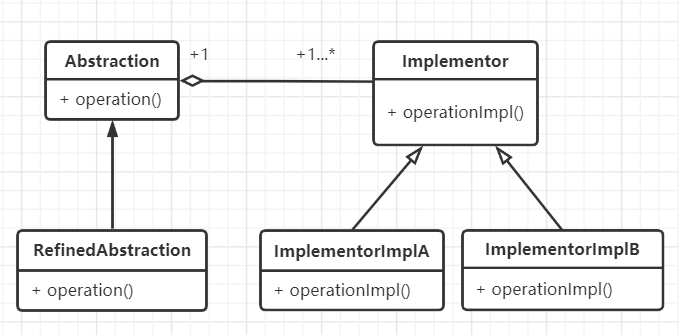
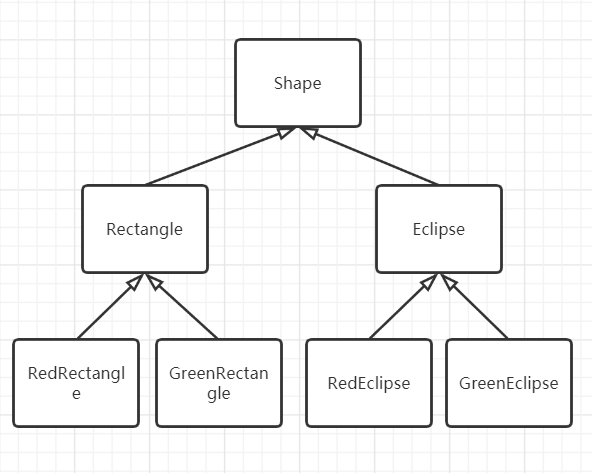
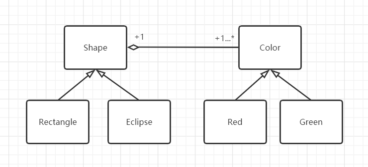

#  桥接模式

## 什么是桥接模式

> Decouple an abstraction from its implementation so that the two can vary independently.
>

桥接模式就是将抽象和实现解耦，使得它们可以独立地变化。


## 桥接模式的设计思想

桥接模式可以和[策略模式](./14_dp-strategy.html#策略模式的框架模型)合为一个模式，因为它们的思想相同，代码结构也几乎一样。只是策略模式侧重于对象行为，关注对算法、规则的封装，使得算法可以独立于使用它的用户而变化，属于行为型模式；而桥接模式侧重于软件结构，关注抽象和实现的分离，使得它们可以独立地发展，属于结构型模式。


## 桥接模式的框架模型

### 类图



从类图可以看出，桥接模式和[策略模式](./14_dp-strategy.html#策略模式的框架模型)几乎是一样的，只是多了对抽象（Abstraction）的具体实现类，用于对抽象化角色进行修正。类图中的类说明：

Implementor：一个接口类，定义必要的行为和属性；ImplementorImplA和ImplementorImplB是具体的接口实现类。

Abstraction：抽象化类，它的作用是对接口类Implementor进行一些行为的抽象；

RefinedAbstraction：是抽象化类Abstraction的具体实现类，对抽象化类进行修改。


## 实战应用
在几何图形的分类中，假设我们有矩形和椭圆之分，这时我们又希望加入颜色（红色、绿色）来拓展它的层级。如果用一般继承的思想，则会有如下类图：




如果我们再增加几个形状（如三角形），再增加几种颜色（如蓝色、紫色），这个类图将会越来越臃肿。这时，我们就希望对这个设计进行解耦，将形状和颜色分成两个分支，独立发展，互不影响。桥接模式就派上用场了，我们看一下使用桥接模式后的类图，如下图所示：



使用代码实现如下：

```python
# 桥接模式 - 几何图形
from abc import ABCMeta, abstractmethod
# 引入ABCMeta和abstractmethod来定义抽象类和抽象方法


class Shape(metaclass=ABCMeta):
    """形状"""

    def __init__(self, color):
        self._color = color

    @abstractmethod
    def getShapeType(self):
        pass

    def getShapeInfo(self):
        return self._color.getColor() + "的" + self.getShapeType()


class Rectangle(Shape):
    """矩形"""

    def __init__(self, color):
        super().__init__(color)

    def getShapeType(self):
        return "矩形"


class Ellipse(Shape):
    """椭圆"""

    def __init__(self, color):
        super().__init__(color)

    def getShapeType(self):
        return "椭圆"


class Color(metaclass=ABCMeta):
    """颜色"""

    @abstractmethod
    def getColor(self):
        pass


class Red(Color):
    """红色"""

    def getColor(self):
        return "红色"


class Green(Color):
    """绿色"""

    def getColor(self):
        return "绿色"


def testShape():
    redRect = Rectangle(Red())
    print(redRect.getShapeInfo())
    greenRect = Rectangle(Green())
    print(greenRect.getShapeInfo())

    redEllipse = Ellipse(Red())
    print(redEllipse.getShapeInfo())
    greenEllipse = Ellipse(Green())
    print(greenEllipse.getShapeInfo())


if __name__ == '__main__':
    testShape()

"""
红色的矩形
绿色的矩形
红色的椭圆
绿色的椭圆
"""
```


## 应用场景

1. 一个产品（或对象）有多种分类和多种组合，即两个（或多个）独立变化的的维度，每个维度都希望独立进行扩展。
2. 因为使用继承或因为多层继承导致系统类的个数急剧增加的系统，可以改用桥接模式来实现。

>  摘自： 罗伟富. 《人人都懂设计模式：从生活中领悟设计模式：Python实现》. 电子工业出版社