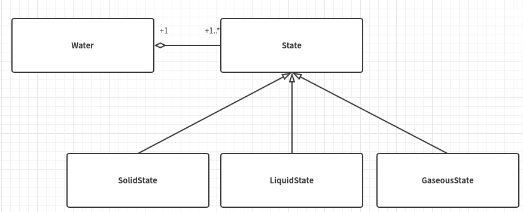
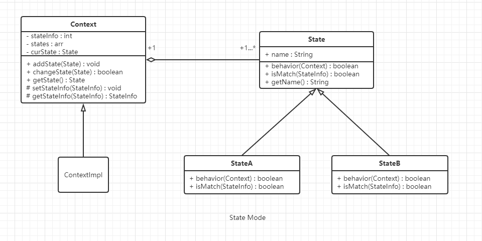

# 状态模式

## 什么是状态模式

> Allow an object to alter its behavior when its internal state changes.The object will appear to change its class.
>
> 允许一个对象在其内部状态发生改变时改变其行为，使这个对象看上去就像改变了它的类型一样。

&emsp;&emsp;状态即事物所处的某一种形态。**状态模式是说一个对象在其内部状态发生改变的时候，其表现的行为和外在属性不一样，这个对象看上去就像改变了它的类型一样。因此，状态模式又被称为对象的行为模式**，注意与监听模式的区别。

## 状态模式的核心思想

&emsp;&emsp;状态模式的核心思想就是**一个事物（对象）有多种状态，在不同的状态下所表现的行为和属性不一样。**也就是说，不论是处在什么状态，以及不同状态下的特性差异再大，实质上是同一个事物。

## 从生活中领悟状态模式

在生活中，人有少、壮、老，水有固、液、气。

- 人：少年活泼可爱，壮年活力四射，老年充满智慧。

- 水：固态--冰，坚硬寒冷；液态--水，清澈温暖，没有规则的形状；气态--水蒸气，虚无缥缈。

人和水在不同的状态下，所表现的行为和属性都是有明显差异的，而有趣的是，水的三种状态可以互相转换。我们用程序编程实现水之间的状态转换，然后进一步去研究状态模式。

从对象角度分析，得到类图：

- Water：代表水，始终不变的对象。
- SolidState、LiquidState、GaseousState：分别表示水的固、液、气三个状态。
- State：是从固、液、气抽象出来的抽象类，表示状态。



代码实现如下：

``` python
# 状态模式-水的三种状态（固液气）转变-Version 1.0.0

from abc import ABCMeta, abstractmethod


class Water:
    """水"""

    def __init__(self, state):
        self.__temperature = 25  # 默认常温25°
        self.__state = state  # 状态

    def setState(self, state):
        self.__state = state

    def changeState(self, state):
        if self.__state:
            print("由", self.__state.getName(), "变为", self.__state.getName())
        else:
            print("初始化为", state.getName())
        self.__state = state

    def getTemperature(self):
        return self.__temperature

    def setTemperature(self, temperature):
        """不符合程序的开放封闭原则"""
        self.__temperature = temperature
        if self.__temperature <= 0:
            self.setState(SolidState("固态"))
        elif self.__temperature <= 100:
            self.setState(LiquidState("液态"))
        else:
            self.setState(GaseousState("气态"))

    def riseTemperature(self, step):
        self.setTemperature(self.__temperature + step)

    def reduceTemperature(self, step):
        self.setTemperature(self.__temperature - step)

    def behavior(self):
        self.__state.behavior(self)


class State(metaclass=ABCMeta):
    """状态类"""

    def __init__(self, name):
        self.__name = name

    def getName(self):
        return self.__name

    @abstractmethod
    def behavior(self, water):
        """不同状态下的行为"""
        pass


class SolidState(State):
    """固态"""

    def __init__(self, name):
        super().__init__(name)

    def behavior(self, water):
        print("我性格高冷，当前体温" + str(water.getTemperature()) +
              "℃,我坚如钢铁，仿如一冷血动物，请用我砸人，嘿嘿……")


class LiquidState(State):
    """液态"""

    def __init__(self, name):
        super().__init__(name)

    def behavior(self, water):
        print("我性格温和，当前体温" + str(water.getTemperature()) +
              "℃，我可滋润万物，饮用我可让你活力倍增……")


class GaseousState(State):
    """气态"""

    def __init__(self, name):
        super().__init__(name)

    def behavior(self, water):
        print("我性格热烈，当前体温" + str(water.getTemperature()) +
              "℃，飞向天空是我毕生的梦想，在这你将看不到我的存在，我将达到无我的境界……")


def test():
    water = Water(LiquidState("液态"))
    water.behavior()
    water.setTemperature(-4)
    water.behavior()
    water.riseTemperature(18)
    water.behavior()
    water.reduceTemperature(110)
    water.behavior()


if __name__ == "__main__":
    test()

"""
我性格温和，当前体温25℃，我可滋润万物，饮用我可让你活力倍增……
我性格高冷，当前体温-4℃,我坚如钢铁，仿如一冷血动物，请用我砸人，嘿嘿……
我性格温和，当前体温14℃，我可滋润万物，饮用我可让你活力倍增……
我性格高冷，当前体温-96℃,我坚如钢铁，仿如一冷血动物，请用我砸人，嘿嘿……
"""
```

上诉代码的不合理的实现：

- Water的setTemperature(self,temperature)方法不符合程序设计中的开放封闭原则。虽然水只有三种状态，但在其他的应用场景中可能会有更多的状态，如果要再加一个状态（State），则要在SetTemperature中再加一个if...else...判断。
- 表示状态的类应该只会有一个实例，因为不可能出现“固态1”，“固态2”的情形，所以状态类的实现要使用单例。

## 状态模式的框架模型

&emsp;&emsp;针对状态模式的思想以及上诉代码的的一些缺点，进一步重构和优化，得到状态模式的框架模型。

### 类图和实现



- Context：上下文环境类，负责具体状态的切换。
- State：状态类的基类，负责状态的定义和接口的统一。
- StateA和StateB是具体的状态类，如之前代码中的SolidState、LiquidState、GaseousState。

```python
# 状态模式-框架模型

from abc import ABCMeta, abstractmethod


class Context(metaclass=ABCMeta):
    """状态模式的上下文环境类,负责状态的切换"""

    def __init__(self):
        self.__states = []
        self.__curState = None
        # 状态发生变化依赖的属性, 当这一变量由多个变量共同决定时可以将其单独定义成一个类
        self.__stateInfo = 0

    def addState(self, state):
        if (state not in self.__states):
            self.__states.append(state)

    def changeState(self, state):
        if (state is None):
            return False
        if (self.__curState is None):
            print("初始化为", state.getName())
        else:
            print("由", self.__curState.getName(), "变为", state.getName())
        self.__curState = state
        self.addState(state)
        return True

    def getState(self):
        return self.__curState

    def _setStateInfo(self, stateInfo):
        self.__stateInfo = stateInfo
        for state in self.__states:
            if (state.isMatch(stateInfo)):
                self.changeState(state)

    def _getStateInfo(self):
        return self.__stateInfo


class State:
    """状态的基类"""

    def __init__(self, name):
        self.__name = name

    def getName(self):
        return self.__name

    def isMatch(self, stateInfo):
        "状态的属性stateInfo是否在当前的状态范围内"
        return False

    @abstractmethod
    def behavior(self, context):
        pass


```

### 基于框架实现

```Python
class Water(Context):
    """水(H2O)"""

    def __init__(self):
        super().__init__()
        self.addState(SolidState("固态"))
        self.addState(LiquidState("液态"))
        self.addState(GaseousState("气态"))
        self.setTemperature(25)

    def getTemperature(self):
        return self._getStateInfo()

    def setTemperature(self, temperature):
        self._setStateInfo(temperature)

    def riseTemperature(self, step):
        self.setTemperature(self.getTemperature() + step)

    def reduceTemperature(self, step):
        self.setTemperature(self.getTemperature() - step)

    def behavior(self):
        state = self.getState()
        if (isinstance(state, State)):
            state.behavior(self)


# 单例的装饰器
def singleton(cls, *args, **kwargs):
    """构造一个单例的装饰器"""
    instance = {}

    def __singleton(*args, **kwargs):
        if cls not in instance:
            instance[cls] = cls(*args, **kwargs)
        return instance[cls]

    return __singleton


@singleton
class SolidState(State):
    """固态"""

    def __init__(self, name):
        super().__init__(name)

    def isMatch(self, stateInfo):
        return stateInfo < 0

    def behavior(self, context):
        print("我性格高冷，当前体温", context._getStateInfo(),
              "℃，我坚如钢铁，仿如一冷血动物，请用我砸人，嘿嘿……")


@singleton
class LiquidState(State):
    """液态"""

    def __init__(self, name):
        super().__init__(name)

    def isMatch(self, stateInfo):
        return (stateInfo >= 0 and stateInfo < 100)

    def behavior(self, context):
        print("我性格温和，当前体温", context._getStateInfo(),
              "℃，我可滋润万物，饮用我可让你活力倍增……")

@singleton
class GaseousState(State):
    """气态"""

    def __init__(self, name):
        super().__init__(name)

    def isMatch(self, stateInfo):
        return stateInfo >= 100

    def behavior(self, context):
        print("我性格热烈，当前体温", context._getStateInfo(),
              "℃，飞向天空是我毕生的梦想，在这你将看不到我的存在，我将达到无我的境界……")


# test
def testState():
    water = Water()
    water.behavior()
    water.setTemperature(-4)
    water.behavior()
    water.riseTemperature(18)
    water.behavior()
    water.riseTemperature(110)
    water.behavior()


if __name__ == "__main__":
    testState()


"""
初始化为 液态
我性格温和，当前体温 25 ℃，我可滋润万物，饮用我可让你活力倍增……
由 液态 变为 固态
我性格高冷，当前体温 -4 ℃，我坚如钢铁，仿如一冷血动物，请用我砸人，嘿嘿……
由 固态 变为 液态
我性格温和，当前体温 14 ℃，我可滋润万物，饮用我可让你活力倍增……
由 液态 变为 气态
我性格热烈，当前体温 124 ℃，飞向天空是我毕生的梦想，在这你将看不到我的存在，我将达到无我的境界……
"""
```

### 模型设计要点

1. 在实现状态模式的时候，实现的场景状态有时候会非常复杂，决定状态变化的因素也非常多，我们可以把决定状态变化的属性单独抽象成一个类StateInfo，这样判断状态属性是否符合当前的状态isMatch时就可以传入更多的信息。
2. 每一种状态应当只有唯一的实例。

### 状态模式的优缺点

- 优点
  - 封装了状态的转换规则，在状态模式中可以将状态的转换代码封装在上下文类中，对状态转换代码进行集中管理，而不是分散在一个个业务逻辑中。
  - 将所有与某个状态有关的行为放到一个类中（称为状态类），使开发人员只专注于该状态下的逻辑开发。
  - 允许状态转换逻辑与状态对象合为一体，使用时只需要注入一个不同的状态对象即可使上下文环境对象拥有不同的行为。
- 缺点
  - 会增加系统类和对象的个数。
  - 状态模式的结构与实现都较为复杂，如果使用不当容易导致程序结构和代码的混乱。

## 应用场景

- 一个对象的行为取决于它的状态，并且它在运行时可能经常改变它的状态，从而改变它的行为。
- 一个操作中含有庞大的多分支的条件语句，这些分支依赖于该对象的状态，且每一个分支的业务逻辑都非常复杂时，我们可以使用状态模式来拆分不同的分支逻辑，使程序有更好的可读性和可维护性。

> 摘自： 罗伟富. 《人人都懂设计模式：从生活中领悟设计模式：Python实现》. 电子工业出版社