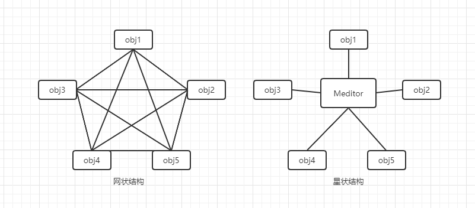
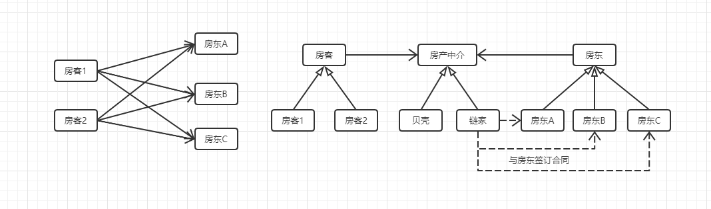
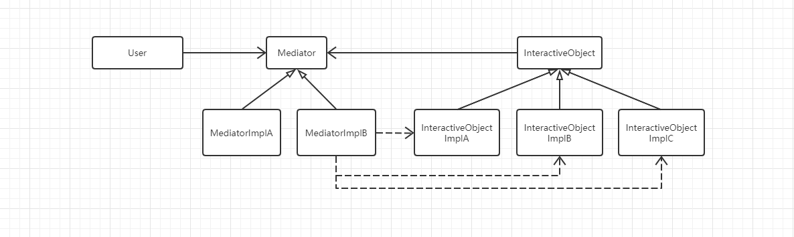
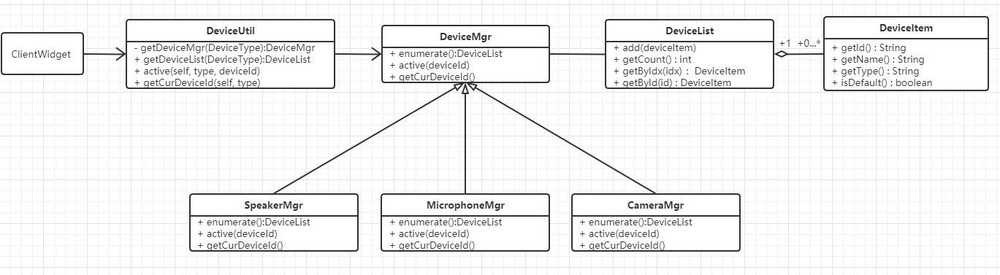

# 中介模式

## 什么是中介模式

> Define an object that encapsulates how a set of objects interact.Mediator promotes loose coupling by keeping objects from referring to each other explicitly, and it lets you vary their interaction independently.

用一个中介对象来封装一系列的对象交互，中介对象使各对象不需要显式地相互引用，从而使其耦合松散，而且可以独立地改变它们之间的交互。在程序中这便是中介模式，又称为调停模式。


## 中介模式的核心思想

中介模式的核心思想是将类关系从**复杂的网状结构解耦成简洁高效的星型结构**。在许多系统中，随着业务越来越复杂，系统越来越庞大，代码中类与类的很容易出现互相耦合，从而形成网状结构，而中介模式通过一个中介者，让这些互相耦合的类解耦，各个类只与中介者打交道，中介者承担他们之间的交互。



## 从生活中领悟状态模式

在日常生活中，中介无处不在。比如我们在找租房的时候，通过中介可以帮助我们省去不少麻烦，而且由中介来承接房客与房东之间的交互过程，可以使得整个过程更加畅通、高效。

通过UML图来体会中介模式带来的便利、高效：



代码模拟实现：

```python
# 中介模式，找房子问中介-- Version 1.0.0


class HouseInfo:
    """房源信息"""

    def __init__(self, area, price, hasWindow, hasBathroom, hasKitchen, address, owner):
        self.__area = area
        self.__price = price
        self.__hasWindow = hasWindow
        self.__hasBathroom = hasBathroom
        self.__hasKitchen = hasKitchen
        self.__address = address
        self.__owner = owner

    def getAddress(self):
        return self.__address

    def getOwnerName(self):
        return self.__owner.getName()

    def showInfo(self, isShowOwner=True):
        print("面积:" + str(self.__area) + "平米",
              "价格:" + str(self.__price) + "元",
              "窗户:" + ("有" if self.__hasWindow else "没有"),
              "卫生间:" + self.__hasBathroom,
              "厨房:" + ("有" if self.__hasKitchen else "没有"),
              "地址:" + self.__address,
              "房东:" + self.getOwnerName() if isShowOwner else "")


class HousingAgency:
    """房屋中介"""

    def __init__(self, name):
        self.__houseInfos = []
        self.__name = name

    def getName(self):
        return self.__name

    def addHouseInfo(self, houseInfo):
        self.__houseInfos.append(houseInfo)

    def removeHouseInfo(self, houseInfo):
        for info in self.__houseInfos:
            if(info == houseInfo):
                self.__houseInfos.remove(info)

    def getSearchCondition(self, description):
        """这里有一个将用户描述信息转换成搜索条件的逻辑
        (为节省篇幅这里原样返回描述)"""
        return description

    def getMatchInfos(self, searchCondition):
        """根据房源信息的各个属性查找最匹配的信息
        (为节省篇幅这里略去匹配的过程，全部输出)"""
        print(self.getName(), "为您找到以下最适合的房源：")
        for info in self.__houseInfos:
            info.showInfo(False)
        return self.__houseInfos

    def signContract(self, houseInfo, period):
        """与房东签订协议"""
        print(self.getName(), "与房东", houseInfo.getOwnerName(), "签订", houseInfo.getAddress(),
              "的房子的的租赁合同，租期", period, "年。 合同期内", self.getName(), "有权对其进行使用和转租！")

    def signContracts(self, period):
        for info in self.__houseInfos:
            self.signContract(info, period)


class HouseOwner:
    """房东"""

    def __init__(self, name):
        self.__name = name
        self.__houseInfo = None

    def getName(self):
        return self.__name

    def setHouseInfo(self, address, area, price, hasWindow, bathroom, kitchen):
        self.__houseInfo = HouseInfo(area, price, hasWindow, bathroom, kitchen, address, self)

    def publishHouseInfo(self, agency):
        agency.addHouseInfo(self.__houseInfo)
        print(self.getName() + "在", agency.getName(), "发布房源出租信息：")
        self.__houseInfo.showInfo()


class Customer:
    """用户，租房的贫下中农"""

    def __init__(self, name):
        self.__name = name

    def getName(self):
        return self.__name

    def findHouse(self, description, agency):
        print("我是" + self.getName() + ", 我想要找一个\"" + description + "\"的房子")
        print()
        return agency.getMatchInfos(agency.getSearchCondition(description))

    def seeHouse(self, houseInfos):
        """去看房，选择最适合的房子
        (这里省略看房的过程)"""
        size = len(houseInfos)
        return houseInfos[size-1]

    def signContract(self, houseInfo, agency, period):
        """与中介签订协议"""
        print(self.getName(), "与中介", agency.getName(), "签订", houseInfo.getAddress(),
              "的房子的租赁合同, 租期", period, "年。合同期内", self.__name, "有权对其进行使用！")


# test
def testRenting():
    # 房东找中介管理房屋，发布房源信息
    myHome = HousingAgency("我爱我家")
    zhangsan = HouseOwner("张三")
    zhangsan.setHouseInfo("上地西里", 20, 2500, 1, "独立卫生间", 0)
    zhangsan.publishHouseInfo(myHome)
    lisi = HouseOwner("李四")
    lisi.setHouseInfo("当代城市家园", 16, 1800, 1, "公用卫生间", 0)
    lisi.publishHouseInfo(myHome)
    wangwu = HouseOwner("王五")
    wangwu.setHouseInfo("金隅美和园", 18, 2600, 1, "独立卫生间", 1)
    wangwu.publishHouseInfo(myHome)
    print()
    # 房东与中介签订三年协议
    myHome.signContracts(3)
    print()
    # 租客登场，找中介
    tony = Customer("Tony")
    houseInfos = tony.findHouse("18平米左右，要有独卫，要有窗户，最好是朝南，有厨房更好！价位在2000左右", myHome)
    print()
    print("正在看房，寻找最合适的住巢……")
    print()
    AppropriateHouse = tony.seeHouse(houseInfos)
    # 租客与中介签订协议
    tony.signContract(AppropriateHouse, myHome, 1)


if __name__ == "__main__":
    testRenting()


'''
张三在 我爱我家 发布房源出租信息：
面积:20平米 价格:2500元 窗户:有 卫生间:独立卫生间 厨房:没有 地址:上地西里 房东:张三
李四在 我爱我家 发布房源出租信息：
面积:16平米 价格:1800元 窗户:有 卫生间:公用卫生间 厨房:没有 地址:当代城市家园 房东:李四
王五在 我爱我家 发布房源出租信息：
面积:18平米 价格:2600元 窗户:有 卫生间:独立卫生间 厨房:有 地址:金隅美和园 房东:王五

我爱我家 与房东 张三 签订 上地西里 的房子的的租赁合同，租期 3 年。 合同期内 我爱我家 有权对其进行使用和转租！
我爱我家 与房东 李四 签订 当代城市家园 的房子的的租赁合同，租期 3 年。 合同期内 我爱我家 有权对其进行使用和转租！
我爱我家 与房东 王五 签订 金隅美和园 的房子的的租赁合同，租期 3 年。 合同期内 我爱我家 有权对其进行使用和转租！

我是Tony, 我想要找一个"18平米左右，要有独卫，要有窗户，最好是朝南，有厨房更好！价位在2000左右"的房子

我爱我家 为您找到以下最适合的房源：
面积:20平米 价格:2500元 窗户:有 卫生间:独立卫生间 厨房:没有 地址:上地西里 
面积:16平米 价格:1800元 窗户:有 卫生间:公用卫生间 厨房:没有 地址:当代城市家园 
面积:18平米 价格:2600元 窗户:有 卫生间:独立卫生间 厨房:有 地址:金隅美和园 

正在看房，寻找最合适的住巢……

Tony 与中介 我爱我家 签订 金隅美和园 的房子的租赁合同, 租期 1 年。合同期内 Tony 有权对其进行使用！
'''
```


## 中介模式的框架模型

从示例中抽象出中介模式的框架模型代码。

### 类图和实现



``` python
# 中介模式-代码框架


class InteractiveObject:
    """进行交互的对象"""
    pass


class InteractiveObjectImplA:
    """实现类A"""
    pass


class InteractiveObjectImplB:
    """实现类B"""
    pass


class Meditor:
    """中介类"""

    def __init__(self):
        self.__interactiveObjA = InteractiveObjectImplA()
        self.__interactiveObjB = InteractiveObjectImplB()

    def interative(self):
        """进行交互的操作"""
        # 通过self.__interactiveObjA和self.__interactiveObjB完成相应的交互操作
        pass


```

Mediator ：中介类，用来协调对象间的交互。中介类可以有多个具体实现类，如MediatorImplA和MediatorImplB。

InteractiveObject：要进行交互的对象，InteractiveObject可以是互不相干的多个类的对象，也可以是具有继承关系的相似类。

### 设计要点

中介模式主要有以下三个角色，在设计中介模式时要找到并区分这些角色：

- 交互对象（InteractiveObject）：要进行交互的一系列对象。
- 中介者（Mediator）：负责协调各个对象之间的交互。
- 具体中介者（MediatorImpl）：中介的具体实现。

### 中介模式优缺点

优点：

- Mediator将原本分布于多个对象间的行为集中在一起，作为一个独立的概念并将其封装在一个对象中，简化了对象之间的交互。

- 将多个调用者与多个实现者之间多对多的交互关系，转换为一对多的交互关系，一对多的交互关系更易于理解、维护和扩展，大大减少了多个对象之间相互交叉引用的情况。（网状改星状）

缺点：

- 中介者承接了所有的交互逻辑，交互的复杂度转变成了中介者的复杂度，中介者类会变得越来越庞大和复杂，以至于难以维护。

- 中介者出问题会导致多个使用者同时出问题。

  （ps：生活中很容易遇到黑中介，高昂的中介费）

## 实战应用

在移动或者PC平台上通信设备（扬声器、麦克风、摄像头）进行的交互，往往是有 多 个 扬 声 器、 多 个 麦 克 风， 甚 至 多 个 摄 像 头。这种通讯设备交互程序可以使用中介模式去实现。



ClientWidget：界面类，可通过DeviceUtil枚举各种类型的设备（扬声器、麦克风、摄像头），同时可以通过DeviceUtil读取和保存当前正在使用的各种类型设备。

DeviceUtil：中介者，客户端界面通过DeviceUtil这个中介者与设备进行交互，这样界面类ClientWidget就不用同时维护三个DeviceMgr的对象，而只要与一个DeviceUtil的对象进行交互就可以了。

> 为什么DeviceUtil到DeviceMgr的依赖指向与模型图不一样呢？这是因为这个应用中，ClientWidget与DeviceMgr是单向交互的，只有ClientWidget调用DeviceMgr，而一般不会有DeviceMgr调用ClientWidget的情况。而模型图同时支持双向的交互，InteractiveObject通过直接依赖与Mediator进行交互，而User也通过Mediator间接地与InteractiveObjectImplA、InteractiveObjectImplB进行交互。

代码实现：

```python
# 中介模式应用-通信设备（麦克风、扬声器、摄像头）交互

from abc import ABCMeta, abstractmethod
# 引入ABCMeta和abstractmethod来定义抽象类和抽象方法
from enum import Enum
# Python3.4 之后支持枚举Enum的语法


class DeviceType(Enum):
    """设备类型"""
    TypeSpeaker = 1
    TypeMicrophone = 2
    TypeCamera = 3


class DeviceItem:
    """设备项"""

    def __init__(self, id, name, type, isDefault = False):
        self.__id = id
        self.__name = name
        self.__type = type
        self.__isDefault = isDefault

    def __str__(self):
        return "type:" + str(self.__type) + " id:" + str(self.__id) \
               + " name:" + str(self.__name) + " isDefault:" + str(self.__isDefault)

    def getId(self):
        return self.__id

    def getName(self):
        return self.__name

    def getType(self):
        return self.__type

    def isDefault(self):
        return self.__isDefault


class DeviceList:
    """设备列表"""

    def __init__(self):
        self.__devices = []

    def add(self, deviceItem):
        self.__devices.append(deviceItem)

    def getCount(self):
        return len(self.__devices)

    def getByIdx(self, idx):
        if idx < 0 or idx >= self.getCount():
            return None
        return self.__devices[idx]

    def getById(self, id):
        for item in self.__devices:
            if (item.getId() == id):
                return item
        return None


class DeviceMgr(metaclass=ABCMeta):
    """设备管理类接口"""

    @abstractmethod
    def enumerate(self):
        """枚举设备列表
        (在程序初始化时，有设备插拔时都要重新获取设备列表)"""
        pass

    @abstractmethod
    def active(self, deviceId):
        """选择要使用的设备"""
        pass

    @abstractmethod
    def getCurDeviceId(self):
        """获取当前正在使用的设计ID"""
        pass


class SpeakerMgr(DeviceMgr):
    """扬声器设备管理类"""

    def __init__(self):
        self.__curDeviceId = None

    def enumerate(self):
        """枚举设备列表
        (真实的项目应该通过驱动程序去读取设备信息，这里只用初始化来模拟)"""
        devices = DeviceList()
        devices.add(DeviceItem("369dd760-893b-4fe0-89b1-671eca0f0224", "Realtek High Definition Audio", DeviceType.TypeSpeaker))
        devices.add(DeviceItem("59357639-6a43-4b79-8184-f79aed9a0dfc", "NVIDIA High Definition Audio", DeviceType.TypeSpeaker, True))
        return devices

    def active(self, deviceId):
        """激活指定的设备作为当前要用的设备"""
        self.__curDeviceId = deviceId

    def getCurDeviceId(self):
        return self.__curDeviceId


class DeviceUtil:
    """设备工具类（中介）"""

    def __init__(self):
        self.__mgrs = {}
        self.__mgrs[DeviceType.TypeSpeaker] = SpeakerMgr()
        # 为节省篇幅，MicrophoneMgr和CameraMgr不再实现
        # self.__microphoneMgr = MicrophoneMgr()
        # self.__cameraMgr = CameraMgr

    def __getDeviceMgr(self, type):
        return self.__mgrs[type]

    def getDeviceList(self, type):
        return self.__getDeviceMgr(type).enumerate()

    def active(self, type, deviceId):
        self.__getDeviceMgr(type).active(deviceId)

    def getCurDeviceId(self, type):
        return self.__getDeviceMgr(type).getCurDeviceId()


# Test
def testDevices():
    deviceUtil = DeviceUtil()
    deviceList = deviceUtil.getDeviceList(DeviceType.TypeSpeaker)
    print("麦克风设备列表：")
    if deviceList.getCount() > 0:
        # 设置第一个设备为要用的设备
        deviceUtil.active(DeviceType.TypeSpeaker, deviceList.getByIdx(0).getId())
    for idx in range(0, deviceList.getCount()):
        device = deviceList.getByIdx(idx)
        print(device)
    print("当前使用的设备："
          + deviceList.getById(deviceUtil.getCurDeviceId(DeviceType.TypeSpeaker)).getName())


if __name__ == "__main__":
    testDevices()


'''
麦克风设备列表：
type:DeviceType.TypeSpeaker id:369dd760-893b-4fe0-89b1-671eca0f0224 name:Realtek High Definition Audio isDefault:False
type:DeviceType.TypeSpeaker id:59357639-6a43-4b79-8184-f79aed9a0dfc name:NVIDIA High Definition Audio isDefault:True
当前使用的设备：Realtek High Definition Audio
'''
```


## 应用场景

- 一组对象定义良好但以复杂的方式进行通信。产生的相互依赖关系结构混乱且难以理解。
- 一个对象引用其他很多对象并且直接与这些对象通信，导致难以复用该对象。
- 想通过一个中间类来封装多个类中的行为，同时又不想生成太多的子类。


> 摘自： 罗伟富. 《人人都懂设计模式：从生活中领悟设计模式：Python实现》. 电子工业出版社