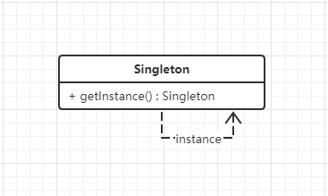

# 单例模式

## 什么是单例模式

> Ensure a class has only one instance, and provide a global point of access to it.

确保一个类只有一个实例，并且提供一个访问它的全局方法。


## 单例模式的设计思想

生活中人脚踏两条船，迟早会翻船，脚踏万条船，翻也翻不完。在程序中，有些类你希望他的实例是唯一的。**单例模式就是保证一个类有且只有一个对象（实例）的一种机制。**单例模式用来控制某些事物只允许有一个个体，例如生活中的一夫一妻制、地球只有一个等等。


## 从生活中领悟单例模式

生活中每个人都希望真爱是唯一的。

```python
# 单例模式-你就是我的唯一-Version 1.0.0


class MyBeautifulGirl(object):
    """我的漂亮女神"""
    __instance = None
    __isFirstInit = False

    def __new__(cls, name):
        if not cls.__instance:
            MyBeautifulGirl.__instance = super().__new__(cls)
        return cls.__instance

    def __init__(self, name):
        if not self.__isFirstInit:
            self.__name = name
            print("遇见" + name + "，我一见钟情！")
            MyBeautifulGirl.__isFirstInit = True
        else:
            print("遇见" + name + "，我置若罔闻！")

    def showMyHeart(self):
        print(self.__name + "就我心中的唯一！")


def testLove():
    jenny = MyBeautifulGirl("Jenny")
    jenny.showMyHeart()
    kimi = MyBeautifulGirl("Kimi")
    kimi.showMyHeart()
    print("id(jenny):", id(jenny), "id(kimi):", id(kimi))


if __name__ == "__main__":
    testLove()
    
    
'''
遇见Jenny，我一见钟情！
Jenny就我心中的唯一！
遇见Kimi，我置若罔闻！
Jenny就我心中的唯一！
id(jenny): 1721453617784 id(kimi): 1721453617784
'''

```


## 单例模式的框架模型

### 类图和实现

单例模式的类图：



单例模式Python实现的三种方式：

1. **重写`__new__和__init__`方法**

   ```python
   class Singleton1(object):
       """单例实现方式一：重写__new__和__init__方法"""
       __instance = None
       __isFirstInit = False
   
       def __new__(cls, name):
           if not cls.__instance:
               Singleton1.__instance = super().__new__(cls)
           return cls.__instance
   
       def __init__(self, name):
           if not self.__isFirstInit:
               self.__name = name
               Singleton1.__isFirstInit = True
   
       def getName(self):
           return self.__name
   
    
   
   # Test1
   def testSingleton1():
       tony = Singleton1("Tony")
       karry = Singleton1("Karry")
       print(tony.getName(), karry.getName())
       print("id(tony):", id(tony), "id(karry):", id(karry))
       print("tony == karry:", tony == karry)
   ```

   

2. **自定义`metaclass`的方法**

   ```python
   class Singleton2(type):
       """单例实现方式二：自定义metaclass的方法"""
   
       def __init__(cls, what, bases=None, dict=None):
           super().__init__(what, bases, dict)
           # 初始化全局变量cls._instance为None
           cls._instance = None
   
       def __call__(cls, *args, **kwargs):
           # 控制对象的创建过程，如果cls._instance为None则创建，否则直接返回
           if cls._instance is None:
               cls._instance = super().__call__(*args, **kwargs)
           return cls._instance
   
   
   
   class CustomClass(metaclass=Singleton2):
       """用户自定义的类"""
   
       def __init__(self, name):
           self.__name = name
   
       def getName(self):
           return self.__name
   
   
   # Test2
   def testSingleton2():
       tony = CustomClass("Tony")
       karry = CustomClass("Karry")
       print(tony.getName(), karry.getName())
       print("id(tony):", id(tony), "id(karry):", id(karry))
       print("tony == karry:", tony == karry)
   ```

   

3. **定义一个单例装饰器（装饰模式）**

```python
def singletonDecorator(cls, *args, **kwargs):
    """单例实现方式三：定义一个单例装饰器"""
    instance = {}

    def wrapperSingleton(*args, **kwargs):
        if cls not in instance:
            instance[cls] = cls(*args, **kwargs)
        return instance[cls]
    return wrapperSingleton


@singletonDecorator
class Singleton3:
    """使用单例装饰器修饰一个类"""

    def __init__(self, name):
        self.__name = name

    def getName(self):
        return self.__name
 

# Test3
def testSingleton3():
    tony = Singleton3("Tony")
    karry = Singleton3("Karry")
    print(tony.getName(), karry.getName())
    print("id(tony):", id(tony), "id(karry):", id(karry))
    print("tony == karry:", tony == karry)
```


上述三种方式，测试用例返回的结果，(除了每次类实例的id)返回结果基本一致：

```python
Tony Tony
id(tony): 2314241524400 id(karry): 2314241524400
tony == karry: True
```

其中使用装饰器模式来实现单例模式，通用性非常高，在实际项目上用的非常多。

示例中使用装饰器模式实现：

``` python
# 单例模式-你就是我的唯一-Version 2.0.0

@singletonDecorator
class MyBeautifulGirl2(object):
    """我的漂亮女神"""

    def __init__(self, name):
        self.__name = name
        if self.__name == name:
            print("遇见" + name + "，我一见钟情！")
        else:
            print("遇见" + name + "，我置若罔闻！")

    def showMyHeart(self):
        print(self.__name + "就我心中的唯一！")
        
```


## 应用场景

1. 你希望这个类只有一个且只能有一个实例。
2. 项目中的一些全局管理类（Manager）可以用单例模式来实现。


> 摘自： 罗伟富. 《人人都懂设计模式：从生活中领悟设计模式：Python实现》. 电子工业出版社