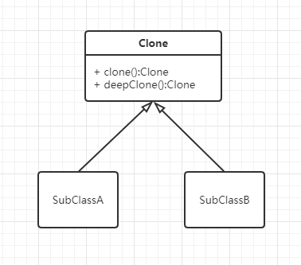

# 原型模式


## 什么是原型模式

> Specify the kinds of objects to create using a prototypical instance, and create new objects by copying this prototype.

用原型实例指定要创建对象的种类，并通过拷贝这些原型的属性来创建新的对象。简单来说，该模式是用于创建重复的对象，同时又能保证性能，它提供了一种创建对象的最佳方式。通常通过拷贝自身属性创建一个新的对象的过程又称克隆，原型模式可以理解为克隆模式。


## 原型模式的设计思想

原型模式实现了一个原型接口，该接口用于创建当前对象的克隆。clone方法就是原型模式的核心，clone方法的功能就是拷贝父本的所有属性。

通常在当直接创建对象的代价比较大时，则采用这种模式。例如，一个对象需要在一个高代价的数据库操作之后被创建。我们可以缓存该对象，在下一个请求时返回它的克隆，在需要的时候更新数据库，以此来减少数据库调用。


## 从生活中领悟原型模式

孙悟空变出猴子分身，拥有复制自身的超能力人，克隆羊多利等等无论是神话还是现实都存在克隆的概念。生活中，当一个人手头上有很多事情需要忙的时候，往往分身乏术，毕竟我们无法将分身出多个自己去处理事情。人的克隆是困难的，但程序的克隆是简单的。

```python
from copy import copy, deepcopy


class Person:
    """人"""

    def __init__(self, name, age):
        self.__name = name
        self.__age = age

    def showMyself(self):
        print("我是" + self.__name + ",年龄" + str(self.__age) + ".")

    def coding(self):
        print("我是码农，我用程序改变世界，Coding...")

    def reading(self):
        print("阅读使我快乐！知识使我成长！如饥似渴地阅读是生活的一部分...")

    def fallInLove(self):
        print("春风吹，月亮明，花前月下好相约...")

    def clone(self):
        return copy(self)


def testClone():
    tony = Person("Tony", 27)
    tony.showMyself()
    tony.coding()

    tony1 = tony.clone()
    tony1.showMyself()
    tony1.reading()

    tony2 = tony.clone()
    tony2.showMyself()
    tony2.fallInLove()


if __name__ == "__main__":
    testClone()

'''
我是Tony,年龄27.
我是码农，我用程序改变世界，Coding...
我是Tony,年龄27.
阅读使我快乐！知识使我成长！如饥似渴地阅读是生活的一部分...
我是Tony,年龄27.
春风吹，月亮明，花前月下好相约...
'''
```

## 浅拷贝和深拷贝

对象的克隆还分浅拷贝和深拷贝，两者主要区别是对引用类型的拷贝不同：***浅拷贝只拷贝引用类型对象的指针，而不拷贝引用类型对象指向的值；深拷贝则同时拷贝引用类型对象以及其指向的值。***

```python
# 克隆宠物店，深拷贝和浅拷贝
from copy import copy, deepcopy


class PetStore:
    """宠物店"""

    def __init__(self, name):
        self.__name = name
        self.__petList = []

    def setName(self, name):
        self.__name = name

    def showMyself(self):
        print("%s 宠物店有以下宠物：" % self.__name)
        for pet in self.__petList:
            print(pet + "\t", end="")
        print()

    def addPet(self, pet):
        self.__petList.append(pet)


def testPetStore():
    petter = PetStore("Petter")
    petter.addPet("小狗Coco")
    print("父本petter：", end="")
    petter.showMyself()
    print()

    petter1 = deepcopy(petter)
    petter1.addPet("小猫Amy")
    print("副本petter1：", end="")
    petter1.showMyself()
    print("父本petter：", end="")
    petter.showMyself()
    print()

    petter2 = copy(petter)
    petter2.addPet("小兔Ricky")
    print("副本petter2：", end="")
    petter2.showMyself()
    print("父本petter：", end="")
    petter.showMyself()


if __name__ == "__main__":
    testPetStore()


'''
父本petter：Petter 宠物店有以下宠物：
小狗Coco	

副本petter1：Petter 宠物店有以下宠物：
小狗Coco	小猫Amy	
父本petter：Petter 宠物店有以下宠物：

副本petter2：Petter 宠物店有以下宠物：
小狗Coco	小兔Ricky	
父本petter：Petter 宠物店有以下宠物：
小狗Coco	小兔Ricky
'''
```

副本petter1使用了深拷贝，当对petter1增加宠物，修改了__petList之后，并不影响父本的对象。

副本petter2使用了浅拷贝，当对petter2增加宠物，父本的对象也受到了影响。

这是因为PetStore类的\_\_petList是一个引用类型。在Python中引用类型有列表、字典、类对象，赋值的时候默认是浅拷贝。

***在使用克隆的方式创建对象的时候，尽量使用深拷贝的方式，这是较安全的。浅拷贝往往很危险，因为一个类中如果有引用类型的属性的时候，一个对象的改变会引起另一个对象的改变。***


## 原型模式的框架模型

原型模式的抽象框架模型：

### 类图和实现



Python由于有copy模块的支持，原型模式实现起来非常简单：
```python
# 克隆模式-代码框架

from copy import copy, deepcopy


class Clone:
    """克隆的基类"""

    def clone(self):
        """浅拷贝的方式克隆对象"""
        return copy(self)

    def deepClone(self):
        """深拷贝的方式克隆对象"""
        return deepcopy(self)


```

基于框架实现示例，只需继承Clone类即可使用深拷贝和浅拷贝。

### 设计要点

在设计原型模式时，唯一需要注意的是：区分浅拷贝与深拷贝，除非一些特殊情况（如需求本身就要求两个对象一起改变），尽量使用深拷贝的方式。在Python中，原型模式成为了语言本身的一部分，因为Python中对象的赋值就是一个浅拷贝的过程。

### 原型模式优缺点

优点：

- 原型模式通过内存拷贝的方式进行复制，比new的方式创建对象性能更好。

- 通过深拷贝的方式，可以方便地创建一个具有相同属性和行为的另一个对象，特别是对于复杂对象，方便性尤为突出。

缺点：

- 通过克隆的方式创建对象，不会执行类的初始化函数（\_\_init\_\_）。这不一定是缺点，但大家使用的时候需要注意这一点。


## 实战应用

很多应用程序都会有一些功能设置的操作（如字体、字号、常用快捷键等），也就是说这些功能是可配置和修改的。对于一些专业性的软件（如集成开发工具PyCharm和工程制图软件AutoCAD），这些配置可能会非常多而且复杂。我们在修改这些配置时，通常希望能备份一下原有的配置，以便在设置不合理或出问题时，还能再切换到之前的配置。这时，通常的做法是：复制一份原来的配置，然后在新的配置上做修改，以符合自己的使用习惯，当配置出问题时，再切换到原来的配置。

为简单起见，假设我们的应用程序只有以下几个配置项：字体、字号、语言、异常文件的路径（用于软件异常或崩溃时进行反馈）。

```python
# 实战应用 - app配置信息

from clone_frame import Clone


class AppConfig(Clone):
    """应用程序功能配置"""

    def __init__(self, configName):
        self.__configName = configName
        self.parseFromFile("./config/default.xml")

    def parseFromFile(self, filePath):
        """
        从配置文件中解析配置项
        真实项目中通过会将配置保存到配置文件中，保证下次开启时依然能够生效；
        这里为简单起见，不从文件中读取，以初始化的方式来模拟。
        """
        self.__fontType = "宋体"
        self.__fontSize = 14
        self.__language = "中文"
        self.__logPath = "./logs/appException.log"

    def saveToFile(self, filePath):
        """
        将配置保存到配置文件中
        这里为简单起见，不再实现
        """
        pass

    def copyConfig(self, configName):
        """创建一个配置的副本"""
        config = self.deepClone()
        config.__configName = configName
        return config

    def showInfo(self):
        print("%s 的配置信息如下：" % self.__configName)
        print("字体：", self.__fontType)
        print("字号：", self.__fontSize)
        print("语言：", self.__language)
        print("异常文件的路径：", self.__logPath)

    def setFontType(self, fontType):
        self.__fontType = fontType

    def setFontSize(self, fontSize):
        self.__fontSize = fontSize

    def setLanguage(self, language):
        self.__language = language

    def setLogPath(self, logPath):
        self.__logPath = logPath


def testAppConfig():
    defaultConfig = AppConfig("default")
    defaultConfig.showInfo()
    print()

    newConfig = defaultConfig.copyConfig("tonyConfig")
    newConfig.setFontType("雅黑")
    newConfig.setFontSize(18)
    newConfig.setLanguage("English")
    newConfig.showInfo()


if __name__ == "__main__":
    testAppConfig()


'''
default 的配置信息如下：
字体： 宋体
字号： 14
语言： 中文
异常文件的路径： ./logs/appException.log

tonyConfig 的配置信息如下：
字体： 雅黑
字号： 18
语言： English
异常文件的路径： ./logs/appException.log
'''
```


## 应用场景

- 如果创建新对象（如复杂对象）成本较高，我们可以利用已有的对象进行复制来获得。
- 类的初始化需要消耗非常多的资源时，如需要消耗很多的数据、硬件等资源。
- 可配合备忘录模式做一些备份的工作。


> 摘自： 罗伟富. 《人人都懂设计模式：从生活中领悟设计模式：Python实现》. 电子工业出版社