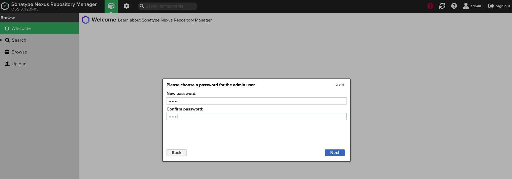

#  Docker Compose部署Nexus


## 概述

Nexus 是一个强大的仓库管理器，极大地简化了内部仓库的维护和外部仓库的访问。

2016 年 4 月 6 日 Nexus 3.0 版本发布，相较 2.x 版本有了很大的改变：

- 对低层代码进行了大规模重构，提升性能，增加可扩展性以及改善用户体验。
- 升级界面，极大的简化了用户界面的操作和管理。
- 提供新的安装包，让部署更加简单。
- 增加对 Docker, NeGet, npm, Bower 的支持。
- 提供新的管理接口，以及增强对自动任务的管理。

简单来说，Nexus是一个Maven私服。


## 基于Docker安装Nexus

使用 Docker 来安装和运行 Nexus，`docker-compose.yml` 配置如下：

``` shell
version: '3.1'
services:
  nexus:
    restart: always
    image: sonatype/nexus3
    container_name: nexus
    ports:
      - 8081:8081
    volumes:
      - /usr/local/docker/nexus/data:/nexus-data
```

赋予数据卷目录可读可写的权限，并启动：

``` shell
docker@docker-saas:/usr/local/docker/nexus$ sudo chmod 777 /usr/local/docker/nexus/data 
docker@docker-saas:/usr/local/docker/nexus$ docker-compose up -d                                                                                                                                                                           
Creating network "nexus_default" with the default driver
Pulling nexus (sonatype/nexus3:)...
...
Creating nexus ... done        
```

如果发现服务一直在尝试重启或者访问不到管理页面，可以查看容器日志`docker logs -f containerId`或前台运行（docker-compose up），根据反馈的日志错去处理。

注意，该服务官方建议2G内存以上。

## 安装后工作

1. 访问管理页面（http://ip:port/，根据自己实际情况访问)，登录控制台。

   管理员用户名：admin，默认密码在：/nexus-data/admin.password。

   初次登陆会要求重新设置密码，并进行一些基础配置，大家跟着引导配置即可。

   

2. 点击齿轮按钮，可以对Nexus进行更详细的配置，建议大家去看看熟悉。例如定期清理、代理仓库的配置、仓库组等的概念。

   - 在设置的System->Tasks，Nexus提供了一些定时任务模版，例如Delete SNAPSHOT Task。


## Maven仓库概述

### 代理仓库

代理仓库（Proxy Repository），可以理解为代理仓库，如：

- maven-central
- nuget.org-proxy

在nexus的这两个仓库都设置了代理，在设置可以找到他们分别指向 https://repo1.maven.org/maven2/ 和 https://api.nuget.org/v3/index.json。

版本策略（Version Policy）：

- Release: 正式版本
- Snapshot: 快照版本
- Mixed: 混合模式

布局策略（Layout Policy）：

- Strict：严格
- Permissive：宽松


### 宿主仓库

宿主仓库（Hosted Repository），即存储本地上传的组件和资源的，如：

- maven-releases
- maven-snapshots
- nuget-hosted

部署策略（Deployment Policy）：

- Allow Redeploy：允许重新部署
- Disable Redeploy：禁止重新部署
- Read-Only：只读


### 仓库组

仓库组（Repository Group），通常包含了多个代理仓库和宿主仓库，方便管理统一管理jar包。

在项目中只要引入仓库组就可以下载到代理仓库和宿主仓库中的包，如：

- maven-public
- nuget-group

**一般我们都是引入maven-public仓库组，因为它包含了maven-central、maven-releases、maven-snapshots三个仓库**。


## 在项目中使用Maven私服

### 配置认证信息

在 Maven `settings.xml` 的`servers` 节点下添加 Nexus 认证信息：

```xml
<server>
  <id>nexus-releases</id>
  <username>admin</username>
  <password>123456</password>
</server>

<server>
  <id>nexus-snapshots</id>
  <username>admin</username>
  <password>123456</password>
</server>
```

nexus-releases: 用于发布 Release 版本，nexus-snapshots: 用于发布 Snapshot 版本（快照版）

Release 版本与 Snapshot 版本定义如下：

```text
Release: 1.0.0/1.0.0-RELEASE
Snapshot: 1.0.0-SNAPSHOT
```

- 在项目 `pom.xml` 中设置的版本号添加 `SNAPSHOT` 标识的都会发布为 `SNAPSHOT` 版本，没有 `SNAPSHOT` 标识的都会发布为 `RELEASE` 版本。
- `SNAPSHOT` 版本会自动加一个时间作为标识，如：`1.0.0-SNAPSHOT` 发布后为变成 `1.0.0-SNAPSHOT-20180522.123456-1.jar`


### 配置自动化部署

在 项目的`pom.xml` 中添加如下代码：

```text
<distributionManagement>  
  <repository>  
    <id>nexus-releases</id>  
    <name>Nexus Release Repository</name>  
    <url>http://192.168.99.101:8081/repository/maven-releases/</url>  
  </repository>  
  <snapshotRepository>  
    <id>nexus-snapshots</id>  
    <name>Nexus Snapshot Repository</name>  
    <url>http://192.168.99.101:8081/repository/maven-snapshots/</url>  
  </snapshotRepository>  
</distributionManagement> 
```


注意事项：

- ID 名称必须要与 `settings.xml` 中 Servers 配置的 ID 名称保持一致。
- 项目版本号中有 `SNAPSHOT` 标识的，会发布到 Nexus Snapshots Repository, 否则发布到 Nexus Release Repository，并根据 ID 去匹配授权账号。


### 部署到仓库

```shell
mvn deploy
```


### 上传第三方 JAR 包

Nexus 3.0 不支持页面上传，可使用 maven 命令：

```shell
# 如第三方JAR包：aliyun-sdk-oss-2.2.3.jar
mvn deploy:deploy-file 
  -DgroupId=com.aliyun.oss 
  -DartifactId=aliyun-sdk-oss 
  -Dversion=2.2.3 
  -Dpackaging=jar 
  -Dfile=D:\aliyun-sdk-oss-2.2.3.jar 
  -Durl=http://192.168.99.101:8081/repository/maven-3rd/ 
  -DrepositoryId=nexus-releases
```

注意事项：

- 建议在上传第三方 JAR 包时，创建单独的第三方 JAR 包管理仓库，便于管理以及维护。（maven-3rd）
- `-DrepositoryId=nexus-releases` 对应的是 `settings.xml` 中 Servers 配置的 ID 名称。（授权）


### 配置代理仓库

在 项目的`pom.xml` 中添加如下代码：

```xml
<repositories>
    <repository>
        <id>nexus</id>
        <name>Nexus Repository</name>
        <url>http://192.168.99.101:8081/repository/maven-public/</url>
        <snapshots>
            <enabled>true</enabled>
        </snapshots>
        <releases>
            <enabled>true</enabled>
        </releases>
    </repository>
</repositories>
<pluginRepositories>
    <pluginRepository>
        <id>nexus</id>
        <name>Nexus Plugin Repository</name>
        <url>http://192.168.99.101:8081/repository/maven-public/</url>
        <snapshots>
            <enabled>true</enabled>
        </snapshots>
        <releases>
            <enabled>true</enabled>
        </releases>
    </pluginRepository>
</pluginRepositories>
```

注意，如果nexus关闭了匿名访问，也就是需要用户密码才能拉取jar包，那么需要在maven的setting.xml文件添加认证信息。例如上面配置的仓库id为：nexus，那么要加入如下的配置：

``` xml
<server>
  <id>nexus</id>
  <username>admin</username>
  <password>123456</password>
</server>
```

