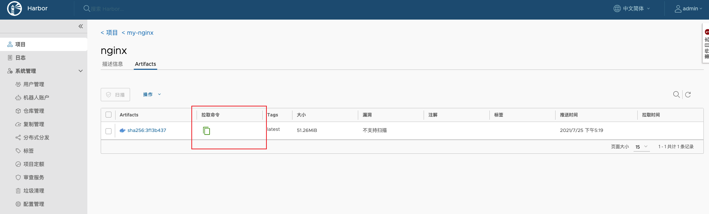

# Docker Compose 部署 Harbor


## 概述

Harbor 是一个用于存储和分发 Docker 镜像的企业级 Registry 服务器，通过添加一些企业必需的功能特性，例如安全、标识和管理等，扩展了开源 Docker Distribution。作为一个企业级私有 Registry 服务器，Harbor 提供了更好的性能和安全。提升用户使用 Registry 构建和运行环境传输镜像的效率。Harbor 支持安装在多个 Registry 节点的镜像资源复制，镜像全部保存在私有 Registry 中， 确保数据和知识产权在公司内部网络中管控。另外，Harbor 也提供了高级的安全特性，诸如用户管理，访问控制和活动审计等。


## Harbor 特性

- **基于角色的访问控制 ：** 用户与 Docker 镜像仓库通过 “项目” 进行组织管理，一个用户可以对多个镜像仓库在同一命名空间（project）里有不同的权限。

- **镜像复制 ：**  镜像可以在多个 Registry 实例中复制（同步）。尤其适合于负载均衡，高可用，混合云和多云的场景。

- **图形化用户界面 ：** 用户可以通过浏览器来浏览，检索当前 Docker 镜像仓库，管理项目和命名空间。

- **AD/LDAP 支持 ：**  Harbor 可以集成企业内部已有的 AD/LDAP，用于鉴权认证管理。

- **审计管理 ：**  所有针对镜像仓库的操作都可以被记录追溯，用于审计管理。

- **国际化 ：**  已拥有英文、中文、德文、日文和俄文的本地化版本。更多的语言将会添加进来。

- **RESTful API ：**  RESTful API 提供给管理员对于 Harbor 更多的操控，使得与其它管理软件集成变得更容易。

- **部署简单 ：**  提供在线和离线两种安装工具， 也可以安装到 vSphere 平台 (OVA 方式) 虚拟设备。


## Harbor 组件

- **Proxy：** Harbor 的 registry,  UI,  token 等服务，通过一个前置的反向代理统一接收浏览器、Docker 客户端的请求，并将请求转发给后端不同的服务。

- **Registry：**  负责储存 Docker 镜像，并处理 docker push/pull 命令。由于我们要对用户进行访问控制，即不同用户对 Docker image 有不同的读写权限，Registry 会指向一个 token 服务，强制用户的每次 docker pull/push 请求都要携带一个合法的 token, Registry 会通过公钥对 token 进行解密验证。

- **Core services：**  这是 Harbor 的核心功能，主要提供以下服务：
  - **UI：** 提供图形化界面，帮助用户管理 registry 上的镜像（image）, 并对用户进行授权。
  - **WebHook：** 为了及时获取 registry 上 image 状态变化的情况， 在 Registry 上配置 webhook，把状态变化传递给 UI 模块。
  - **Token：** 负责根据用户权限给每个 docker push/pull 命令签发 token. Docker 客户端向 - Registry 服务发起的请求，如果不包含 token，会被重定向到这里，获得 token 后再重新向 Registry 进行请求。

- **Database：** 为 core services 提供数据库服务，负责储存用户权限、审计日志、Docker image 分组信息等数据。

- **Job Services：** 提供镜像远程复制功能，可以把本地镜像同步到其他 Harbor 实例中。

- **Log Collector：** 为了帮助监控 Harbor 运行，负责收集其他组件的 log，供日后进行分析。


上图是1.x版本架构介绍，但是是比较基础的。最新的Harbor 2.x 架构概述图已经更新，有兴趣可以看[Harbor架构概述](https://github.com/goharbor/harbor/wiki/Architecture-Overview-of-Harbor)：


## 安装Harbor

### 解压安装包

[官方 GitHub](https://links.jianshu.com/go?to=https%3A%2F%2Fgithub.com%2Fgoharbor%2Fharbor) 上下载最新离线安装版并上传至服务器。

``` shell
docker@docker-saas:~$ tar -zxvf harbor-offline-installer-v2.3.1.tgz                                                                                                                                                                                  
harbor/harbor.v2.3.1.tar.gz
harbor/prepare
harbor/LICENSE
harbor/install.sh
harbor/common.sh
harbor/harbor.yml.tmpl
```

### 修改配置文件

``` shell
docker@docker-saas:~$ cd harbor/                                                                                                                                                                                                                     
docker@docker-saas:~/harbor$ cp harbor.yml.tmpl  ./harbor.yml   
 
docker@docker-saas:~/harbor$ sudo vi harbor.yml 
# 修改为域名或你服务器 IP
hostname: 192.168.99.101
# 注释掉https协议，有相关证书不用注释。
# https related config
#https:
  # https port for harbor, default is 443
#  port: 443
  # The path of cert and key files for nginx
#  certificate: /your/certificate/path
#  private_key: /your/private/key/path

```

### 执行安装脚本

``` shell
docker@docker-saas:~/harbor$ sudo ./install.sh                                                                                                                                                                                        

[Step 0]: checking if docker is installed ...

Note: docker version: 19.03.12

[Step 1]: checking docker-compose is installed ...

Note: docker-compose version: 1.29.0

[Step 2]: loading Harbor images ...
Loaded image: goharbor/harbor-exporter:v2.3.1
Loaded image: goharbor/notary-signer-photon:v2.3.1
Loaded image: goharbor/trivy-adapter-photon:v2.3.1
Loaded image: goharbor/harbor-portal:v2.3.1
Loaded image: goharbor/harbor-log:v2.3.1
Loaded image: goharbor/redis-photon:v2.3.1
Loaded image: goharbor/registry-photon:v2.3.1
Loaded image: goharbor/chartmuseum-photon:v2.3.1
Loaded image: goharbor/harbor-core:v2.3.1
Loaded image: goharbor/nginx-photon:v2.3.1
Loaded image: goharbor/harbor-jobservice:v2.3.1
Loaded image: goharbor/harbor-db:v2.3.1
Loaded image: goharbor/harbor-registryctl:v2.3.1
Loaded image: goharbor/notary-server-photon:v2.3.1
Loaded image: goharbor/prepare:v2.3.1


[Step 3]: preparing environment ...

[Step 4]: preparing harbor configs ...
prepare base dir is set to /mnt/sda1/docker/harbor
WARNING:root:WARNING: HTTP protocol is insecure. Harbor will deprecate http protocol in the future. Please make sure to upgrade to https
Clearing the configuration file: /config/registry/passwd
Clearing the configuration file: /config/registry/config.yml
Clearing the configuration file: /config/db/env
Clearing the configuration file: /config/portal/nginx.conf
Clearing the configuration file: /config/log/logrotate.conf
Clearing the configuration file: /config/log/rsyslog_docker.conf
Clearing the configuration file: /config/core/app.conf
Clearing the configuration file: /config/core/env
Clearing the configuration file: /config/nginx/nginx.conf
Clearing the configuration file: /config/jobservice/config.yml
Clearing the configuration file: /config/jobservice/env
Clearing the configuration file: /config/registryctl/config.yml
Clearing the configuration file: /config/registryctl/env
Generated configuration file: /config/portal/nginx.conf
Generated configuration file: /config/log/logrotate.conf
Generated configuration file: /config/log/rsyslog_docker.conf
Generated configuration file: /config/nginx/nginx.conf
Generated configuration file: /config/core/env
Generated configuration file: /config/core/app.conf
Generated configuration file: /config/registry/config.yml
Generated configuration file: /config/registryctl/env
Generated configuration file: /config/registryctl/config.yml
Generated configuration file: /config/db/env
Generated configuration file: /config/jobservice/env
Generated configuration file: /config/jobservice/config.yml
loaded secret from file: /data/secret/keys/secretkey
Generated configuration file: /compose_location/docker-compose.yml
Clean up the input dir


Note: stopping existing Harbor instance ...
Removing redis         ... done
Removing registry      ... done
Removing registryctl   ... done
Removing harbor-portal ... done
Removing harbor-db     ... done
Removing harbor-log    ... done
Removing network harbor_harbor


[Step 5]: starting Harbor ...
Creating network "harbor_harbor" with the default driver
Creating harbor-log ... done
Creating redis         ... done
Creating registryctl   ... done
Creating harbor-db     ... done
Creating harbor-portal ... done
Creating registry      ... done
Creating harbor-core   ... done
Creating harbor-jobservice ... done
Creating nginx             ... done
✔ ----Harbor has been installed and started successfully.----

```

安装脚本

### 登陆管理后台

通过浏览器访问 http://192.168.99.101/，看到登录页面，账号和密码：admin/Harbor12345。


## Harbor管理

### Harbor管理

Harbor 的日常运维管理是通过 docker-compose 来完成的。Harbor 本身有多个服务进程，都放在 docker 容器之中运行，我们可以通过 `docker ps` 命令查看。

``` shell
docker@docker-saas:~$ docker ps | grep goharbor
CONTAINER ID        IMAGE                                COMMAND                  CREATED             STATUS                  PORTS                       NAMES
921b8b14ee46        goharbor/nginx-photon:v2.3.1         "nginx -g 'daemon of…"   17 hours ago        Up 17 hours (healthy)   0.0.0.0:80->8080/tcp        nginx
1339c12901cc        goharbor/harbor-jobservice:v2.3.1    "/harbor/entrypoint.…"   17 hours ago        Up 17 hours (healthy)                               harbor-jobservice
3e4b4441ce0b        goharbor/harbor-core:v2.3.1          "/harbor/entrypoint.…"   17 hours ago        Up 17 hours (healthy)                               harbor-core
1b6e8f6ffd58        goharbor/registry-photon:v2.3.1      "/home/harbor/entryp…"   17 hours ago        Up 17 hours (healthy)                               registry
b64418f3bb5b        goharbor/harbor-portal:v2.3.1        "nginx -g 'daemon of…"   17 hours ago        Up 17 hours (healthy)                               harbor-portal
ff3dfe5dec59        goharbor/harbor-registryctl:v2.3.1   "/home/harbor/start.…"   17 hours ago        Up 17 hours (healthy)                               registryctl
2e0878f63c64        goharbor/harbor-db:v2.3.1            "/docker-entrypoint.…"   17 hours ago        Up 17 hours (healthy)                               harbor-db
d3d4ecaa9017        goharbor/redis-photon:v2.3.1         "redis-server /etc/r…"   17 hours ago        Up 17 hours (healthy)                               redis
9ef3883f4092        goharbor/harbor-log:v2.3.1           "/bin/sh -c /usr/loc…"   17 hours ago        Up 17 hours (healthy)   127.0.0.1:1514->10514/tcp   harbor-log

```

要对Harbor管理，只需要进入到Harbor的安装目录，通过 docker-compose 来完成的，下面为常见命令：

``` shell
# 启动
docker-compose start -d

# 停止
docker-comose stop

# 重启
docker-compose restart -d

```


### 相关镜像说明

Harbor相关镜像说明：

- **nginx：** nginx 负责流量转发和安全验证，对外提供的流量都是从 nginx 中转，所以开放 https 的 443 端口，它将流量分发到后端的 ui 和正在 docker 镜像存储的 docker registry。
- **harbor-jobservice：** harbor-jobservice 是 harbor 的 job 管理模块，job 在 harbor 里面主要是为了镜像仓库之前同步使用的；
- **harbor-core：** 主要由多个http服务组成，包含harbor-ui 、harbor-token等服务，主要的功能有：
  - 监听Registry上镜像的变化，做相应处理，比如记录日志、发起复制等
  - 充当Docker Authorization Service的角色，对镜像资源进行基于角色的鉴权
  - 连接Database，提供存取projects、users、roles、replication policies和images元数据的API接口
  - 提供UI界面
- **registry：** registry 就是 docker 原生的仓库，负责保存镜像。
- **harbor-portal：** 前端应用，对应的portal容器中有nginx服务，获取图标等信息。
- **harbor-registryctl：**docker distribution的控制组件，提供API以便触发垃圾回收动作
- **harbor-db：** harbor-db 是 harbor 的数据库，这里保存了系统的 job 以及项目、人员权限管理。由于本 harbor 的认证也是通过数据，在生产环节大多对接到企业的 ldap 中；
- **redis：** redis服务，用于registry缓存；
- **harbor-log：** harbor-log 是 harbor 的日志服务，统一管理 harbor 的日志。通过 inspect 可以看出容器统一将日志输出的 syslog。

这几个容器通过 Docker link 的形式连接在一起，这样，在容器之间可以通过容器名字互相访问。对终端用户而言，只需要暴露 proxy （即 Nginx）的服务端口。

### 容器对应的默认目录

| 容器名              | 物理路径                            | 容器路径                 |
| :------------------ | ----------------------------------- | :----------------------- |
| log                 | /var/log/harbor                     | /var/log/docker          |
| registry数据目录    | /data/registry                      | /storage                 |
| registry配置目录    | ./common/config/registry            | /etc/registry            |
| mysql数据目録       | /data/database                      | /var/lib/mysql           |
| mysql变量文件       | /common/config/db/env               |                          |
| adminserver配置目录 | /data/config/                       | /etc/adminserver/config/ |
| adminserver秘钥文件 | /data/secretkey                     | /etc/adminserver/key     |
| adminserver数据目录 | /data/                              | /data/                   |
| UI配置文件          | ./common/config/ui/app.conf         | /etc/ui/app.conf         |
| UI私钥文件          | ./common/config/ui/private_key.pem  | /etc/ui/private_key.pem  |
| UI秘钥文件          | /data/secretkey                     | /etc/ui/key              |
| UI                  | /data/ca_download/                  | /etc/ui/ca/              |
| UI                  | /data/psc/                          | /etc/ui/token/           |
| jobservice日志文件  | /data/job_logs                      | /var/log/jobs            |
| jobservice配置文件  | ./common/config/jobservice/app.conf | /etc/jobservice/app.conf |
| jobservice秘钥文件  | /data/secretkey                     | /etc/jobservice/key      |
| proxy配置文件       | ./common/config/nginx               | /etc/nginx               |


## Harbor镜像私服

### 配置仓库地址

在 `/etc/docker/daemon.json` 中增加如下内容（如果文件不存在请新建该文件）

```json
{
  "registry-mirrors": [
    "https://registry.docker-cn.com"
  ],
  "insecure-registries": [
    "192.168.***.**:**"
  ]
}
```

重启服务

``` shell
systemctl daemon-reload
systemctl restart docker
```

使用 `docker info` 命令手动检查，查看Insecure Registries是否生效。

### 上传镜像

我们以推送 Nginx 为例。

1. 新建项目，首先需要在 Harbor 上创建一个 **公开/私有** 的项目，我命名为 my-nginx。

   

2. 推送镜像，推送命令参考Harbor给的命令。

   

   Harbor 给的 Docker 推送 参考命令：

   ``` shell
   # 在项目中标记镜像
   docker tag SOURCE_IMAGE[:TAG] 192.168.99.101/my-nginx/REPOSITORY[:TAG]
   # 推送镜像到当前项目
   docker push 192.168.99.101/my-nginx/REPOSITORY[:TAG]
   ```

   由于我新建的项目是私人的，需要登陆到Harbor才能推送：

   ``` shell
   # 在项目中标记镜像
   docker tag nginx 192.168.99.101/my-nginx/nginx:latest
   
   # 登录 Harbor
   docker login 192.168.99.101 -u admin -p Harbor12345
   
   # 推送镜像到项目
   docker push 192.168.99.101/my-nginx/nginx:latest
   ```

   上传成功后，可以在Harbor的管理页面的my-nginx查看到上传到镜像。

   

### 下载镜像

如果其他机器需要下载镜像，只需要配置好客户端的镜像仓库地址即可。

同时在管理页面，查看每个镜像的详情可以获取到拉取镜像的命令，或者通过镜像名称和版本号拉取。



``` shell
# 通过镜像名称和版本号拉取
docker pull 192.168.99.101/my-nginx/nginx:latest
# Harbor提供的拉取命令
docker pull 192.168.99.101/my-nginx/nginx@sha256:3f13b4376446cf92b0cb9a5c46ba75d57c41f627c4edb8b635fa47386ea29e20

```


## 参考

1. [Docker Compose部署Harbor](https://www.jianshu.com/p/745342762344)
2. [harbor各组件功能介绍及龙芯适配工作](https://blog.csdn.net/qq_25650463/article/details/114001596)
3. [harbor的管理](https://www.cnblogs.com/tianrandai/articles/7389911.html)

