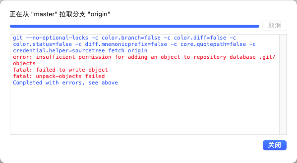

# sourcetree - error: insufficient permission for adding an object to repository database .git/objects

今天在使用Sourcetree工具的时候，突然拉取不了代码，出现了如题目的错误提示，具体如下:



提示显示我们没有权限去操作当前这个仓库,我们只要定位到项目的.git目录,修改所属组为你当前用户所在组（通过 ls -al命令的大部分输出的权限确定名称和租名应该是什么），修改所有文件写权限即可：

```
1. cd /path/to/your/repo/.git/objects
2. ls -al 查看git库的所有者（git用户 git组）
3. chown -R yourname:yourgrounp * 或者sudo chmod 777 -R .git/objects 提交
sudo chgrp -R groupname .
sudo chmod -R g+rwX . 
```


参考：
- [Git Push Error: insufficient permission for adding an object to repository database](https://stackoverflow.com/questions/6448242/git-push-error-insufficient-permission-for-adding-an-object-to-repository-datab)
- [git--sourcetree使用踩坑之insufficient permission for adding an object to repository database和迁移仓库及其他事项](https://blog.csdn.net/willba/article/details/80361850)