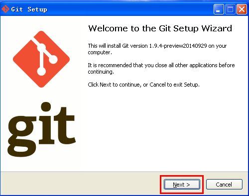
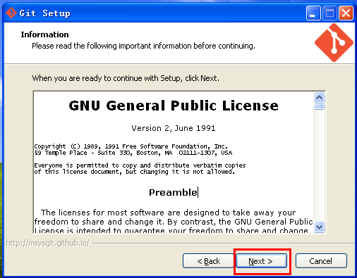
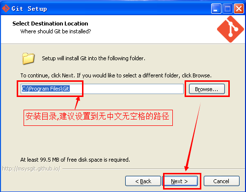
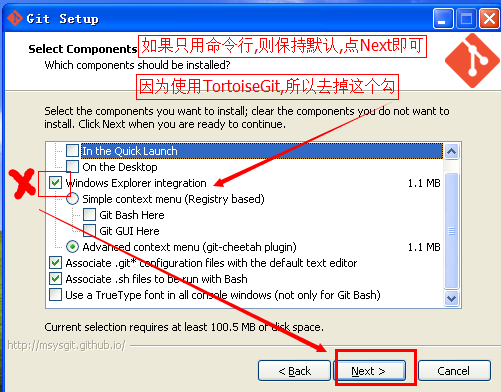
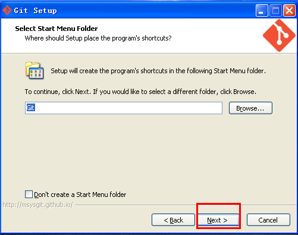
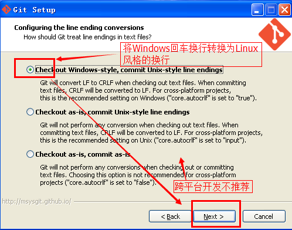
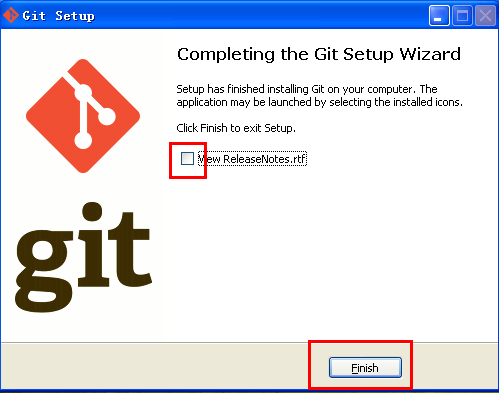

# Git简介和安装

## 简介


* Git 是一个开源的分布式版本控制系统，用于敏捷高效地处理任何或小或大的项目。
* Git 是 Linus Torvalds 为了帮助管理 Linux 内核开发而开发的一个开放源码的版本控制软件。
* Git 与常用的版本控制工具 CVS, Subversion 等不同，它采用了分布式版本库的方式，不必服务器端软件支持。

## Git 与 SVN 的区别

* Git 是`分布式`的，SVN 不是：这是 Git 和其它非分布式的版本控制系统，例如 SVN，CVS 等，最核心的区别。
* Git 把`内容按元数据方式存储`，而 SVN 是按文件：所有的资源控制系统都是把文件的元信息隐藏在一个类似 .svn、.cvs 等的文件夹里。
* Git `分支和 SVN 的分支不同`：分支在 SVN 中一点都不特别，其实它就是版本库中的另外一个目录。
* Git `没有一个全局的版本号`，而 SVN 有：目前为止这是跟 SVN 相比 Git 缺少的最大的一个特征。
* Git 的`内容完整性要优于 SVN`：Git 的内容存储使用的是 `SHA-1 哈希算法`。这能确保代码内容的完整性，确保在遇到磁盘故障和网络问题时降低对版本库的破坏。

## 安装

下载地址：https://git-scm.com/downloads  
最新安装教程参考：https://www.jianshu.com/p/414ccd423efc

双击安装文件，然后出现安装向导界面,点击下一步(Next)即可:



接着出现授权信息界面， Next即可



选择安装路径



选择文件关联,如果你不清楚,直接默认,下一步即可



接着出现开始菜单文件夹,默认,下一步即可



然后是是否配置Path的配置,选择中间一个,可以通过 Windows命令行(CMD)调用 git 命令。 然后点击下一步


关于TortoiseGit安装，参见：https://blog.csdn.net/qq_32786873/article/details/80652055

选择回车换行的格式。默认即可.(检出时转换为Windows风格,提交时转换为Linux风格.)



等待安装完成. 去掉那个查看版本说明的复选框,点击完成(Finish)按钮即可



可以在cmd里面测试是否设置了Path,是否安装成功. 在CMD中输入
``` cmd
git --version 
```
参考：
1. https://www.runoob.com/git/git-tutorial.html
2. https://zh.wikipedia.org/wiki/Git
