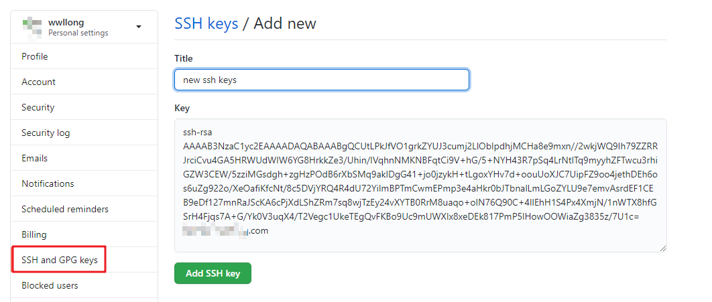

# Git配置SSH

Git安装完成后需要进行一些基础的配置，以及配置SSH，方便后续的Git操作。

## 配置用户和邮箱

Git安装完之后，需要配置用户名和邮箱，打开git bash，分别执行以下两句命令：

```shell
git config --global user.name “用户名”

git config --global user.email “邮箱”
```

用户名(本机名)任意取，一般都是容易记，亦或者某个简称，邮箱尽量保持和自己GitHub账号一致的邮箱，因为**GitHub是根据邮箱去记录贡献的，也就是我们常说的绿格子**。当然你也可以使用不同的邮箱，通过在GitHub账户设置中配置多个邮箱，来记录自己的贡献。

上述的命令是全局配置，可以将`--global`改成`--local`针对单个git仓库去配置。可以通过以下命令，查看配置是否起作用：

```shell
git config user.name

git config user.email
```

完成以上配置，是为了后面配置SSH做铺垫。

## 配置SSH

git clone支持 https 和 git（即ssh）两种方式下载源码，当使用 git 方式下载时，如果没有配置过ssh key，会有如下相关错误提示：

```
git@github.com：Permission denied(publickey).
fatal: Could not read from remote repository.
```

也就是说，通过git方式下载源码如果没有配置SSH，没有公钥和私钥是无法从远程仓库clone到本地仓库的。

### 生成公钥和私钥

接下来如何配置git的ssh key，首先打开`git bash`,执行一下命令，检查用户和邮箱是否配置，如果没有配置请按照上文配置：

```shell
git config --global --list 
```

配置好用户和邮箱后，执行生成公钥和私钥的命令：

```shell
ssh-keygen -t rsa -C "这里换上你的邮箱"
```

执行命令后需要进行3次或4次确认：

- 确认秘钥的保存路径（如果不需要改路径则直接回车)
- 如果上一步保存路径下已经有秘钥文件，则需要确认是否覆盖（如果之前的秘钥不再需要则直接回车覆盖，如需要则手动拷贝到其他目录后再覆盖）
- 创建密码（如果不需要密码则直接回车）
- 确认密码

命令执行完后，会在指定的保存路径下会生成2个文件，`id_rsa`私钥文件和`id_rsa.pub`公钥文件。（一般路径是默认保存在当前登录用户路径下）使用文本编辑器打开`id_rsa.pub`或执行以下命令，查看生成的公钥：

```shell
cat ~/.ssh/id_rsa.pub
```

### GitHub配置公钥

打开GitHub，进入到个人账号设置配置公钥： Settings -》 SSH and GPG keys -》New SSH key

将生成的公钥拷贝到key下面的文本框，title根据个人实际情况命名，然后保存。



如果想检验是否配置成功，可以回到git bash，输入以下命令：（其实尝试拉取代码即可）

```
ssh -T git@github.com
```

最后，就可以成功使用git的方式拉取代码。

## 参考：

1. https://www.cnblogs.com/zzhangyuhang/p/9896151.html