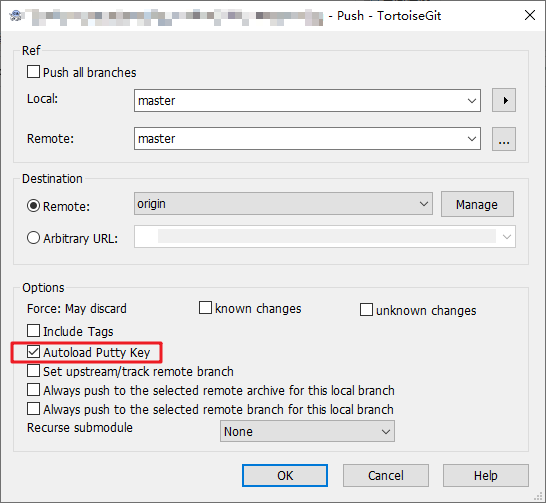

# TortoiseGit配置SSH

TortoiseGit 使用扩展名为ppk的密钥，而不是ssh-keygen生成的rsa密钥。

也就是说 Git Bash 中 使用命令`ssh-keygen -t rsa -C "这里换上你的邮箱" ` 生成的密钥在 TortoiseGit 中不能用。我们需要用到 TortoiseGit 的 PuTTYgen 工具来生成既适用于 Git 的 rsa 密钥， 也适用于 TortoiseGit 的 ppk 密钥，具体配置步骤如下：

PuTTY Key Generator

## 生成公钥和私钥

1. 从开始菜单运行TortoiseGit目录下的 PuTTYgen 程序：

   

2. 注意选择 RSA 加密方式，点击“Generate”按钮，鼠标在空白地方来回移动直到进度条完毕，就会自动生一个随机的key，这个key就是**公钥**。

   

   如有需要，可以为密钥设置对应的访问密码，就是修改上图中 “Key passphrase“ 和 “Confirm passphrase” 的值。

3. 生成完成后，点击”Save private key”，保存**私钥**到自己的本地磁盘，后续给TortoiseGit配置私钥，注意文件类型保存为`.ppk`

   

## 配置公钥

4. 打开GitHub，进入到个人账号设置配置公钥： Settings -》 SSH and GPG keys -》New SSH key

   将(第二步)生成的公钥拷贝到key下面的文本框，title根据个人实际情况命名，然后保存。
   
   

## 配置私钥

配置私钥有两种方式，一种是使用TortoiseGit开始菜单中的Pageant程序，另一种是在TortoiseGit的设置中配置Putty密钥钥。

5. 第一种：使用Pageant程序配置私钥。

   运行 TortoiseGit 开始菜单中的Pageant程序，程序启动后将自动停靠在任务栏中，在任务栏中双击打开。

   点击“Add Key”按钮，添加之前保存的私钥（`.ppk`），然后点击“Close”即可。它会默认在后台挂载私钥，如果程序退出，配置就会失效。

   

6. 第二种：在设置中配置私钥，永久有效。

   在本地项目文件夹上右键，TortoiseGit -》Settings -》Git -》 Remote，在Putty Key后选择刚才保存到本地的私钥，然后点击应用即可。

   

   在Pull或Push项目的时候，记得勾选 Autoload Putty Key选项。

   

最后就可以使用TortoiseGit可视化提交工具进行代码拉取提交等一系列操作了。