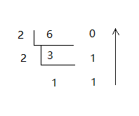

# 常量和进制的运算

## 常量

常量广义的概念是“不变化的量”，例如：在计算机程序运行时，不会被程序修改的量；数学函数中的某一个量，例如每一个具体的圆的半径、直径数值；物理学中的靠近地面的重力加速度；真空中的光速数值；不同的微粒的各自的质量。常量可区分为不同的类型，而在Java中常量的分类有：

- 整数常量：所有整数。
- 小数常量：所有小数。
- 布尔（boolean）型常量：只有两个数值，`true`或`false`。
- 字符常量：将一个数字字母或者符号用单引号 `‘’` 标识。
- 字符串常量：将一个或多个字符用双引号 `“”` 标识。
- null常量：只有一个数值就是`null`。


对于整数常量，有四种表现形式:

- 二进制：0、1 。满2进1。
- 八进制：0-7。满8进1，用`0`开头表示。
- 十进制：0-9。满10进1。
- 十六进制：0-9，A-F，满16进1，用`0x`开头表示。


## 进制的由来

**进制其实是为了方便记录数据而定的规则**。在生活中，常见的开关就是二进制的一个经典例子。电开关的开和关状态分别可以用0和1两个数字表示，0、1这些数字可以表示电信号，从而形成了数据信息。在计算机中，0和1我们又可以称为一个`位(bit)`，8位等于一个`字节（byte）`，1024个字节等于1k。在实际一些生产中并不完全按照这个比例换算，例如硬盘的出厂，一般1k就按照1000算。

采用进制计数有一个很大的优点：**进制越大，数值越短**。


## 进制转换

### 各进制转换为十进制

转换规则：**按权相加法**，即将进制每位上的数乘以位权（例如八进制就是8,64,512….），然后将得出来的数再加在一起。示例如下：

十进制转换为十进制：


``` 
121 = 1 * 10^2 + 2 * 10^1 + 1 * 10^0 
    = 121
```
二进制转换为十进制：

```
1011 = 1 * 2^3 + 0 * 2^2 + 1 * 2^1 + 1 * 2^0
     = 8 + 0 + 2 + 1
     = 11
111  = 1 * 2^2 + 1 * 2^1 + 1 * 2^0
     = 7
```

> tips: 为什么IPv4地址的一个字段最大是255？
>
> 因为每个IPv4的每个IP地址每一段用是用1个字节表示，1个字节等于八位，也就是11111111，转换为十进制就是255。

八进制转换为十进制：

```
121 = 1 * 8^2 + 2 * 8^1 + 1 * 8^0 
    = 64 + 16 + 1
    = 81
```


### 各进制转换为二进制

转换规则：**辗转相除法**，往上取余数。因为规则简单，所以此处只以十进制转换为二进制为例：

``` 
6 = 110(2)
```




### 二进制转换为八进制、十六进制

二进制转为八进制（用`0`开头表示）：从右往左取三位为一位（按转十进制计算），不足补零。

例如：111(2) = 7

```
10101110： 
  -》 010-101-110
       2   5   6
  = 0256    
```

二进制转换为十六进制（用`0x`开头表示）：从右往左取四位为一位（按转十进制计算），不足补零。 

例如：1111(2) =15

```
10101110： 
  -》 1010-1110
       10   14
  = 0xAE   
```

结论：

1. 八进制数其实是二进制中3个二进制位为1个八进制位。
2. 十六进制数其实是二进制中4个二进制位为1个十六进制位。


### 十进制、八进制、十六进制之间的转换

无论是十进制转换为八进制、十六进制，或八进制转换为十六进制等等，这三种进制之间的转换需要借助一个桥梁：二进制。

1. 将各进制转换为二进制。
2. 再将二进制转换为目标进制，例如十进制、八进制、十六进制。


## 负数的进制

负数的二进制**就是正数的二进制取反，再+1**。

例如整数 6 在计算机二进制表示为：

```
0000 0000 0000 0000 0000 0000 0000 0110
```

那么 -6 就是这个正数的二进制取反，加1（负数的二进制最必定是1）:

```
····   0000 0110
取反：  1111 1001
加一：+ 0000 0001
   =   1111 1010
   =   -6
```

11+6  和 11-6 在计算机中的运算：

```
11 + 6 =
 ···· 1011 （11）
+···· 0110 （6）
=···1 0001 （17）

11 + (-6) =
 ···· 1011 （11）
+1111 1010 （-6）
=···0 0101 （5）
```


