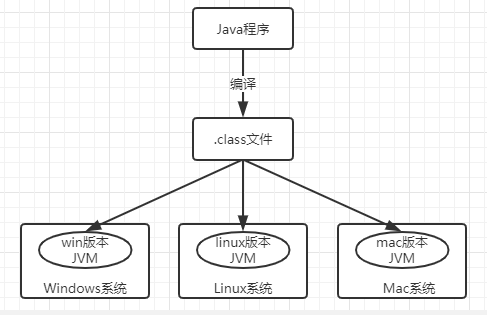
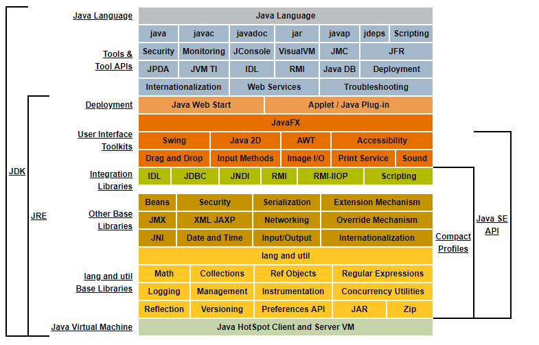

# Java-HelloWorld

## Java概述
&emsp;&emsp;Java语言是SUN（Stanford University Network,斯坦福大学网络公司）1995推出的一门的高级编程语言。
它是一种完全`面向对象`、安全可靠、应用范围广、`与平台无关`的编程语言，并且它完全开源。

&emsp;&emsp;随着Java技术在Web方面的不断成熟，已经成为了Web应用程序的首选开发语言。Java语言有三种技术架构：
- J2SE(Java 2 Platform Standard Edition) 标注版：为开发普通桌面和商务应用程序提供的解决方案。该技术体系是其他两者的基础，可以完成一些桌面应用的开发。
- J2EE(Java 2 Platform Enterprise Edition) 企业版：为开发企业环境下的应用程序提供的一套解决方案。该技术体系包含的技术如Servlet、JSP等，主要针对Web应用程序的开发。
- J2ME(Java 2 Platform Micro Edition) 小型版：为开发电子消费产品和嵌入式设备提供的解决方案。该技术体系主要应用于小型电子消费类产品，如手机中的应用程序等。

`Java发布5.0版本后，分别更名为JAVASE、JAVAEE、JAVAME。`

## Java跨平台原理
&emsp;&emsp;上面有说到Java语言是与平台无关的，即Java语言具有`跨平台`的特点，这得益于它的`虚拟机技术`(JVM,是日后学习的重点)。首先，Java语言开发的程序，经过编辑器编译成`.class`字节码文件，之后字节码文件可以在Java虚拟机上解释执行，而不同的操作系统上有对应版本的虚拟机实现。所以只要安装了Java虚拟机，同一个Java程序在不同的操作系统上都可以执行。所以Java具有良好的可移植性。



## JDK && JRE

&emsp;&emsp;在进行Java程序开发前还要需要了解两个名词概念：JDK和JRE。
- JRE(Java Runtime Environment , Java运行环境)：包括了Java虚拟机（JVM,Java Virtual Machine）和Java程序所需要的核心类库等，如果仅仅是需要运行一个开发好的Java程序，计算机种只需安装JRE即可。
- JDK（Java Development Kit,Java开发工具包）：JDK是提供给Java开发人员使用的工具包，其中包含了Java的开发工具（例如：编译工具 javac.exe, 打包工具（jar.exe等等），也包含了JRE。所以一般安装了JDK，就不用单独安装JRE.

&emsp;&emsp;JDK中包含了JRE，简单来说就是使用JDK开发完成的Java程序，交给JRE运行。

如图：JAVA语言的架构图：


图片来源：[Java官方文档](https://docs.oracle.com/javase/8/docs/)

## DOS命令行 & JDK命令行工具
DOS 基本指令 | 含 义
---|:---
dir | 当前目录下的文件和文件夹
md | 创建目录
rd | 删除空目录
cd | 进入目录
cd..| 返回上一层目录  
cd\ | 返回根目录
* | 所有的
exit |  退出
ECHO 文件内容>文件名 |建立新文件或增加文件内容

tips：当不懂命令行的操作的时候，使用help命令，获得帮助。

JDK 基本指令 | 含义
---|:---
javac | 编译源文件，需要文件全名
java | 运行字节码文件，只需要文件名

## 环境变量配置 & 临时配置

&emsp;&emsp;在官网（www.oracle.com / www.java.sun.com）下载对应版本的JDK，进行安装后还需要进行`环境变量`的配置。所谓的配置环境变量就是`将程序的命令行的目录告诉程序`,具体配置步骤可百度/Google。

&emsp;&emsp;配置环境变量PATH,将想要的变量告诉系统，将文件夹的目录添加到Path，分号分开。`环境变量的配置是为了更好地运用Java的开发工具，通常开发工具在bin目录下，bin是二进制的意思。`

- 技巧：`动态获取`，路径中使用“%自定义的环境变量名字%”动态获取已经定义的环境变量。而自定义的环境变量的变量值通常指定经常改变的路径，方便以后更改。
规范如：JAVA_HOME=......

临时配置的方式：在dos命令行窗口执行`set命令`完成
```
set path=...\...\bin;...;%path%; 
```
- set：查看本机的所有环境变量信息
- set 变量名 ： 查看一个具体环境变量值
- set 变量名= : 清空一个环境变量的值
- set 变量名=具体值 ：给指定变量定义具体值。

注意：这种方式只在当前dos窗口有效，可以通过 -start沿用上个窗口的变量配置。

## HelloWorld

接下来编写一个屏幕输出HelloWorld的Java程序。
步骤：
- 将Java代码编写到扩展名为.java的文件中。
- 通过javac命令对该文件进行编译。检查源代码的正确性，调用的是JVM的一整套编译系统，生成.class文件（字节码文件）。
- 通过java命令对生成的.class文件进行运行。
``` java
class HelloWorld{
    
    public static main(String[] agrs){
        System.out.println("Hello World!");
    }
}

/** 运行结果：
* Hello World!
*/
```

暂时记住以下概念：

&emsp;&emsp;main函数，是一个类的入口，执行从它开始。也是程序的入口，会被JVM所调用，它可以保证程序的独立运行。

&emsp;&emsp;类名定义规范：每个单词名字大写。

## 补充：classpath环境变量

&emsp;&emsp;由上面可以知道，Java源代码编译生成的.class文件可以被虚拟机直接使用，所以可以将class文件发送到指定的目录下被虚拟机查找执行，虚拟机则通过 `classpath`这个环境变量指定的文件路径下去查找类文件。

&emsp;&emsp;Java虚拟机优先去classpath变量指定的目录下去查找运行文件，如果找不到会在(dos)当前目录下查找。临时配置classpath时候，这样设置可清晰路径操作。
```
set classpath=.;%classpath%
```

在系统中设置classpath后，如果编译或运行时候，找不到文件，这个时候:
- 检查自己写的文件名字
- 查看环境变量classpath的配置