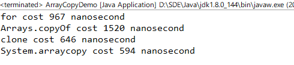
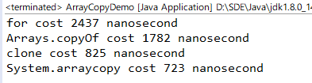
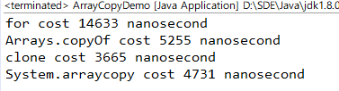
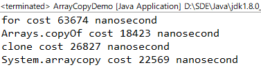

# Java复制数组的四种方法

Java复制数组有大概有四种复制方式，
- for循环逐一复制
- System.arraycopy
- System.copyof
- 使用clone方法

关于他们之间的执行效率，查阅网上相关资料，给出的结论是：  
>效率：System.arraycopy > clone > Arrays.copyOf > for循环

我自己编写测试代码进行实践，最后逐个分析。  
这里会着重看一下clon方法，在面试中有可能会问到浅拷贝和深拷贝的问题。

## 测试代码
``` java 
package indi.wwl.interview.example;

import java.util.Arrays;

import com.wwl.utils.CodeMonitor;

/**
 * 复制数组的四种方法效率对比
 * 
 * @author Wwl 
 */
public class ArrayCopyDemo {

	public static final int size = 10;

	public static void main(String[] args) {
		
		String[] strArr = new String[size];
		for(int i = 0; i < size; ++i) {
			strArr[i]="model";
		}

		long forCost = new CodeMonitor() {
			@Override
			public void runCode() {
				String[] destArr = new String[size];
				for (int x = 0; x < strArr.length; ++x) {
					destArr[x] = strArr[x];
				}
			}
		}.getCostimeNanosecond(1000);
		
		long arraysCopyCost = new CodeMonitor() {
			@Override
			public void runCode() {
				String[] destArr = Arrays.copyOf(strArr, strArr.length);
			}
		}.getCostimeNanosecond(1000);

		long cloneCost = new CodeMonitor() {
			@Override
			public void runCode() {
				String[] destArr = strArr.clone();
			}
		}.getCostimeNanosecond(1000);
		
		long systemCopyCost = new CodeMonitor() {
			@Override
			public void runCode() {
				String[] destArr = new String[size];
				System.arraycopy(strArr, 0, destArr, 0, strArr.length);
			}
		}.getCostimeNanosecond(1000);

		System.out.println("for cost " + forCost + " nanosecond");
		System.out.println("Arrays.copyOf cost " + arraysCopyCost + " nanosecond");
		System.out.println("clone cost " + cloneCost + " nanosecond");
		System.out.println("System.arraycopy cost " + systemCopyCost + " nanosecond");

	}

}
```
代码中CodeMonitors是自己编写的一个抽象类,帮助计算Code运行的时间。  getCostimeNanosecond(1000)是执行1000Code所花费的平均时间。
计算时间的过程很简单：
``` java
    long start = System.nanoTime();
    runCode();
    long end = System.nanoTime();
```

## 测试结果
size=10  
  
size=100  
  
size=1000  
  
size=10000  
  

除了上图的展示，还每个size情况进行了多次运行观察，发现：
- 数组元素不多时，Arrays.copyOf方法执行耗时是最多的，for方法在1000纳秒的时间徘徊，clone 和 System.arraycopy 经常不相伯仲，但多数是System.arraycopy执行时间更短。
- 数组元素一多，几种方法的效率对比就很明显。基本上如开头提到的：
System.arraycopy > clone > Arrays.copyOf > for循环


## for循环逐一复制
for循环是我们常用的一种程序循环结构，它的特点是代码灵活，但是效率最低。
for的速度之所以最慢我认为可能是因为下标表示法每次都从起点开始寻位到指定下标处（现代编译器应该对其有进行优化，改为指针），另外就是它每一次循环都要判断一次是否达到数组最大长度以及进行一次额外的记录下标值的加法运算。 

## Arrays.copyOf
源码：
``` java
	@SuppressWarnings("unchecked")
	public static <T> T[] copyOf(T[] original, int newLength) {
		return (T[]) copyOf(original, newLength, original.getClass());
	}

	public static <T,U> T[] copyOf(U[] original, int newLength, Class<? extends T[]> newType) {
        @SuppressWarnings("unchecked")
        T[] copy = ((Object)newType == (Object)Object[].class)
            ? (T[]) new Object[newLength]
            : (T[]) Array.newInstance(newType.getComponentType(), newLength);
        System.arraycopy(original, 0, copy, 0,
                         Math.min(original.length, newLength));
        return copy;
    }
```
查看Arrays.copyOf的源码可以发现，它实际上调用的就是System.arraycopy，效率肯定比System.arraycopy低。再加上很大一部分开销花在了Math.min函数上，所以效率就更低了。从代码可以看出来这是个浅拷贝。

## clone
源码：
``` java
	protected native Object clone() throws CloneNotSupportedException;
```
从源码上看到clone()是native方法，底层是用C语言实现的，返回类型为Object类型，在赋值的时候会发生强转，牺牲了一些效率。

clone()比较特殊,创建并返回对象的副本，可以进行浅拷贝和深拷贝。“复制”的精确含义可能取决于对象的类。关于克隆对象的相关知识,这里不展开讨论,[更多详见深拷贝和浅拷贝]()。


## System.arraycopy
源码：
``` java
	/**
	* @param      src      the source array.
	* @param      srcPos   starting position in the source array.
	* @param      dest     the destination array.
	* @param      destPos  starting position in the destination data.
	* @param      length   the number of array elements to be copied.
	*/
	public static native void arraycopy(Object src,  int  srcPos,
                                        Object dest, int destPos,
                                        int length);
```
从源码可以看到System.arraycopy()是也是native方法，底层用c或者c++实现的，因而速度会比较快。它是浅拷贝，对于非基本类型而言，它拷贝的是对象的引用，而不是去新建一个新的对象。

## 总结
在理想情况下，数组元素很多的时候，通常  
>效率：System.arraycopy > clone > Arrays.copyOf > for循环
