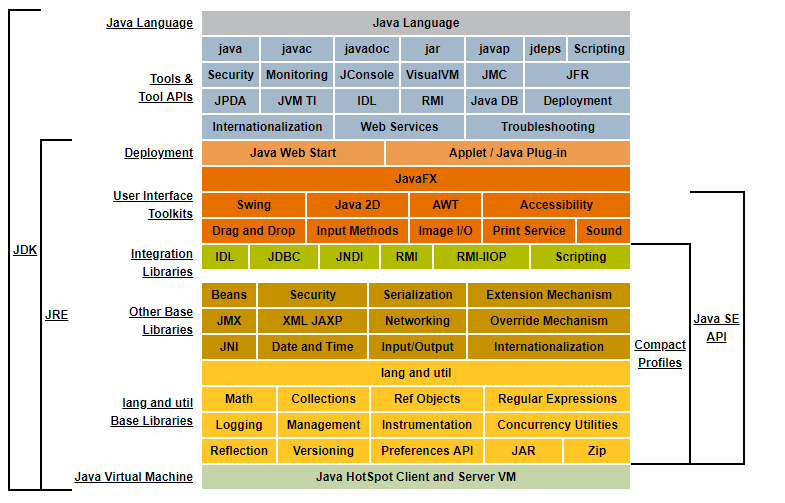

# JDK-JRE-JVM三者关系

## JDK(Java Development Kit)

JDK：Java开发工具集。JDK是提供给Java开发人员使用的，包含了Java的开发工具，也包含了JRE，所以安装了JDK,就不用单独安装JRE。

## JRE(Java Runtime Environment)

JRE：Java运行环境。包含JVM和Java程序所需的核心类库。计算机安装了JRE既可以运行一个开发好的Java程序。

## JVM(Java Virtual Machine)

JVM：Java虚拟机。

产品：
- Sun Classic VM
  - 第一款商用JVM，纯解释器方式执行代码
- Exact VM
  - Exact Memory Management 准确试内存管理
  - 编译器和解释器混合工作以及两级即时编译器
  - 只在Solaris平台发布
- HotSpot VM (优秀,目前还在用)
  - 吸取了前两者的优点，被sun收购
  - 热点代码探测技术：执行计数器->标准编译、代换编译
  - 编译器和解释器平衡。[HotSpot资料](https://xiaomogui.iteye.com/blog/857821)
- KVM
  - Kilobyte 简单，轻，可移植。
  - 手机平台，但是慢。
- JRockit
  - BEA ，被Oracle收购
  - 专注服务器端引用
  - 优势
    - 垃圾收集器
    - MissionControl服务套件(内存泄露管理)
- J9
  - IBM Technology for Java VM, IT4J
  - 类HotSpot
- Azul VM Liquid VM
  - 高性能的Java虚拟机
- TaobaoVM
  - Ali
- Dalvik(Android虚拟机)
  - Google
- Microsoft JVM

## 三者关系

三者是包含关系。JDK包含JRE,JRE包含JVM。

使用JDK开发完成的java程序，交给JRE去运行。

图片来源：[Java官方文档](https://docs.oracle.com/javase/8/docs/)