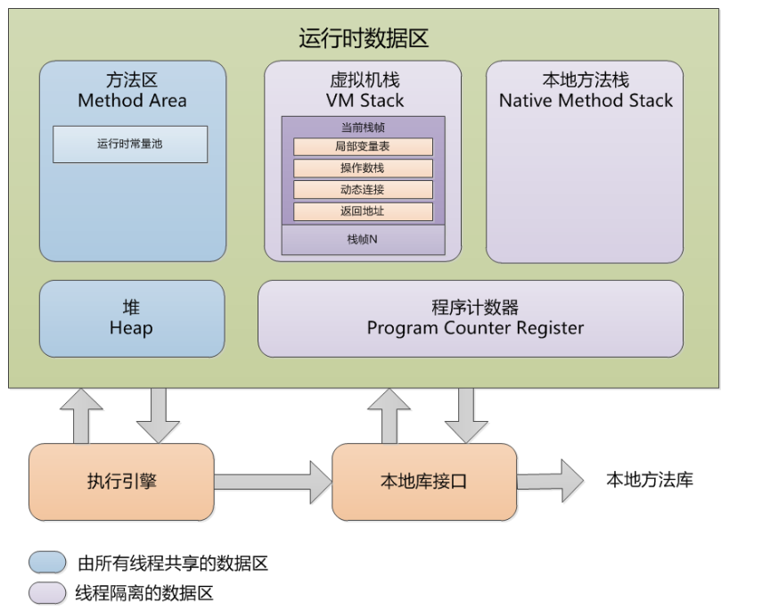
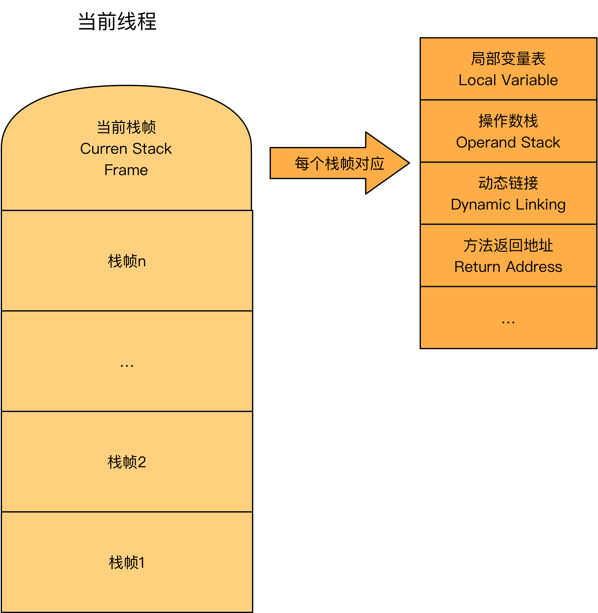

# JVM内存模型与内存溢出异常-运行时数据区域的划分

Java内存模型（Java Memory Model ,JMM）就是一种符合内存模型规范的，屏蔽了各种硬件和操作系统的访问差异的，保证了Java程序在各种平台下对内存的访问都能保证效果一致的机制及规范。
```
JMM是JVM的一种规范，定义了jvm的内存模型。它屏蔽了各种硬件和操作系统的访问差异，不像c/c++那样直接访问硬件内存，相对安全很多，它的主要目的是解决由于多线程通过共享内存进行通信时，存在的本地内存数据不一致、编译器会对代码指令重排序、处理器会对代码乱序执行等带来的问题。可以保证并发编程场景中的原子性、可见性和有序性。
```

JVM在Java程序运行的时候会把它所管理的内存划分为若干不同的数据区域，我们称之为运行时数据区域。运行时数据区域分为五大数据区域，这些区域有各自的用途，以及创建和销毁时间。

 
`其中方法区和堆是线程共享的，虚拟机栈、本地方法栈和程序计数器是线程私有（隔离）的。`

## 程序计数器（Program Counter Register）
程序计数器是一块较小的内存空间，它的作用是`当前线程所执行的字节码的行号指示器`，为`线程私有`的内存空间。

为什么需要程序计数器?
- 在虚拟机概念模型里（不同的JVM，实现方式可能不同），`字节码解释器工作就是通过改变这个计数器的值来选取下一条要执行的字节码指令`，分支、循环、跳转、异常处理、线程恢复等基础功能都需要依赖程序计数器。

为什么程序计数器是线程私有的？
- java多线程是通过`线程轮流切换`并`分配处理器执行时间`的方式实现的，在任何一个确定的时刻，一个处理器(如果是多核cpu那就是一核)都只执行一条线程中的指令，而一条线程中有多个指令，为了`线程切换后能恢复到正确执行位置`，所以每条线程都需要有一个独立的程序计数器，各条线程之间的计数器互不影响，独立存储。

`注意`：如果线程正在执行的是一个java方法，那这个计数器记录的是正在执行的虚拟机字节码指令的地址。如果`执行的是Native方法`，那么`计数器值为空（Undefined）`。这个内存区域是虚拟机规范中`唯一`没有规定任何OutOfMemoryError情况的区域。

## 虚拟机栈（VM Stacks）
虚拟机栈也是线程私有的内存空间，它的`生命周期与线程相同`。虚拟机栈描述的是Java方法执行的内存模型：每个方法被执行的时候都会同时创建一个`栈帧`（Stack frame)用于存储局部变量表、操作栈、动态链接、方法出口等信息。`每一个方法被调用直到执行完成的过程，就对应一个栈帧在虚拟机栈中从入栈到出栈的过程。`

```
栈帧是是方法运行期的基础数据结构，用来存储数据和部分过程结果。
栈帧的位置:  内存 -> 运行时数据区 -> 某个线程对应的虚拟机栈 -> here[在这里]
栈帧大小确定时间: 编译期确定，不受运行期数据影响。
```

通常有人将java内存区分为栈和堆，实际上java内存的划分比这复杂。这种流行的划分只能说明大多数程序员`最关注的与对象分配关系最密切的内存区域就是这两块。其中常说的栈，就是现在讲的虚拟机栈或者栈帧中的局部变量表部分。`

```
局部变量表:一片连续的内存空间，存放着编译期间可知的各种基本数据类型(八大基本类型和对象引用,returnAddress类型)。它的最小的局部变量表空间单位为Slot，虚拟机没有指明Slot的大小，但在jvm中，long和double类型数据明确规定为64位，占2个Slot，其它基本类型固定占用1个Slot。

八大基本类型:boolean、byte、char、short、int、float、long、double。

对象引用（reference类型）：不同于基本数据类型，它不等同于对象本身，即使是String，内部也是char数组组成，根据不同虚拟机的实现，它可能是指向一个对象起始位置指针，也可能指向一个代表对象的句柄或其他与该对象有关的位置。

returnAddress类型:指向一条字节码指令的地址。

局部变量表所需要的内存空间在编译期完成分配，当进入一个方法时，这个方法在栈中需要分配多大的局部变量空间是完全确定的，在方法运行期间不会改变局部变量表大小。
```

 


`Java虚拟机规范中，对该区域规定了两种异常：`
1. 线程请求的栈深度大于虚拟机允许的栈深度，将抛出StackOverflowError。（递归）
2. 虚拟机栈空间可以动态扩展，当动态扩展是无法申请到足够的空间时，抛出OutOfMemory异常。（局部变量过大/多，栈空间国小）

## 本地方法栈（Native Method Stacks）

本地方法栈是与虚拟机栈发挥的作用十分相似,区别是`虚拟机栈执行的是Java方法(也就是字节码)服务，而本地方法栈则为虚拟机使用到的native方法服务`，可能底层调用的c或者c++编写的方法，我们打开jdk安装目录可以看到也有很多用c编写的文件，可能就是native方法所调用的c代码。Java虚拟机规范没有很多强制规定，因此不同的虚拟机有不同的实现方式，例如：HotSpot虚拟机直接把本地方法栈和虚拟栈合二为一。

此区域同虚拟机栈一样规定了StackOverflowError和OutOfMemory异常。

## 堆（Heap）
`对于大多数应用来说，堆是java虚拟机管理内存最大的一块内存区域。堆的目的是用来存放对象实例，是被线程所共享的一块内存区域，也就是说对象是被线程共享的，它在虚拟机启动时创建。`

java虚拟机规范对这块的描述是:`所有对象实例以及数组都要在堆上分配内存，但随着JIT编译器的发展和逃逸分析技术的逐渐成熟，栈上分配、标量替换优化技术将导致微妙的变化，所有对象分配在堆上就不是那么“绝对”了`。

```
即时编译器（JIT)：可以把Java的字节码，包括需要被解释的指令的程序）转换成可以直接发送给处理器直接执行的指令程序)

逃逸分析：通过逃逸分析来决定某些实例或者变量是否要在堆中进行分配，如果开启了逃逸分析，即可将这些变量直接在栈上进行分配，而非堆上进行分配。这些变量的指针可以被全局所引用，或者其其它线程所引用。

参考逃逸分析：https://www.jianshu.com/p/20bd2e9b1f03
```

`堆也是垃圾收集器所管理的主要区域，因此常被称为“GC堆(Garbage Collected Heap)”`。从内存回收角度看，由于现在收集器基本采用`分代收集算法`，所以`Java堆中还可以细分为新生代和老年代，再细致点还有Eden(伊甸园)空间、From Survivor空间、To Survivor空间等。（8：1：1）`。从内存分配角度看，线程所共享的堆中可能会划分出`多个线程私有的分配缓冲区`（Thread Local Allocation Buffer，TLAB)。`其实进一步的划分，目的是为了更好地回收内存或分配内存。`

根据虚拟机规范，Java堆可以存在`物理上不连续的内存空间`，就像磁盘空间只要逻辑是连续的即可。它的内存大小可以设为固定大小，也可以扩展。
当前主流的虚拟机如HotPot都按可扩展实现(通过设置 -Xmx和-Xms)，如果堆中没有内存完成实例分配，而且堆也无法再扩展，将抛出OOM错误(OutOfMemoryError)。

## 方法区（Method Area）
方法区同堆一样，是所有线程共享的内存区域，`用于存储已被虚拟机加载的类信息、常量、静态变量、即时编译后的代码等数据，如static修饰的变量加载类的时候就被加载到方法区中。

java虚拟机规范称这个区域为堆的一个逻辑部分，但为了区分堆，又被称为非堆（Non-Heap）。

注意，方法区有时候会被称为“永久代”（Permannen），但是两者是不等价的。在老版jdk，HotSpot虚拟机以`永久代`来实现方法区，从而JVM的垃圾收集器可以像管理堆区一样管理这部分区域，从而不需要专门为这部分设计垃圾回收机制。而其他虚拟机不一定这样实现方法区。不过自从JDK7之后，Hotspot虚拟机便将运行时常量池从永久代移除了。`jdk8真正开始废弃永久代，而使用元空间(Metaspace)`

```
jdk1.7开始逐步去永久代。从String.interns()方法可以看出来。  
String.interns()作用是如果字符串常量池已经包含一个等于这个String对象的字符串，则返回代表池中的这个字符串的String对象。  
在jdk1.6及以前常量池分配在永久代中，可通过
-XX:PermSize和-XX:MaxPermSize限制方法区大小。
```
``` java
public class StringIntern {
    //运行如下代码探究运行时常量池的位置
    public static void main(String[] args) throws Throwable {
        //用list保持着引用 防止full gc回收常量池
        List<String> list = new ArrayList<String>();
        int i = 0;
        while(true){
            list.add(String.valueOf(i++).intern());
        }
    }
}
//如果在jdk1.6环境下运行，同时限制方法区大小，将报OOM后面跟着PermGen space，说明方法区OOM，即常量池在永久代
//如果是jdk1.7或1.8环境下运行，同时限制堆的大小，将报OOM后面跟着heap space，即常量池在堆中
```

```
相关设置比如：-Xmx5m -Xms5m -XX:-UseGCOverheadLimit

如果不设置UseGCOverheadLimit将报java.lang.OutOfMemoryError: GC overhead limit exceeded，
这个错是因为GC占用了多余98%（默认值）的CPU时间却只回收了少于2%（默认值）的堆空间。目的是为了让应用终止，给开发者机会去诊断问题。一般是应用程序在有限的内存上创建了大量的临时对象或者弱引用对象，从而导致该异常。虽然加大内存可以暂时解决这个问题，但是还是强烈建议去优化代码，后者更加有效，也可通过UseGCOverheadLimit避免[不推荐，这里是因为测试用，并不能解决根本问题]
```

java虚拟机规范对方法区限制比较宽松，除了跟堆一样可以不存在连续的内存空间，定义空间大小和可扩展空间，还可以选择不实现垃圾收集。`GC行为一般在这个行为较少出现，回收这块内存的主要目标是针对常量池的回收和对类型的卸载，而类型的卸载条件相对苛刻，所以GC成绩一般不太满意。`

当方法区无法满足内存分配需求时候，将抛出OOM异常。

### 运行时常量池
运行时常量池（Runtime Constant pool)是方法区的一部分，class文件除了有类的字段、接口、方法等描述信息之外，还有一项常量池(Constant pool Table)。用于存放编译期间生成的各种字面量和符号引用，这部分内容在类加载后存到方法区的运行时常量池中。

对于运行时常量池，JVM规范没有做任何的细节要求，提供商可以根据实现的虚拟机需求来实现该内存区域。一般来说，运行时常量池除了保存Class文件中描述的符号引用外，还会把翻译出来的`直接引用`也存储在该内存区域。

运行时常量池相对Class文件常量池来说具备`动态性`：运行期间也可能将新的常量池放入池中，开发人员用得比较多的便是String类的intern()方法。

该区域内存会抛出OOM异常。

### 直接内存
直接内存不是虚拟机运行时数据区的一部分，也不是Java虚拟机规范中定义的内存区域。直接内存的分配不会受到堆大小的限制，但会受到本地总内存大小以及处理器寻址空间的限制。

应用：NIO类，JDK1.4引入的一种基于通道与缓冲区的I/O方式，它可以使用Native函数直接分配堆外内存，然后通过该一个存储在Java堆中DirectByteBuffer对象作为这块（直接内存）的引用进行操作。这样做的好处，可以避免Java堆和Native堆中来回复制数据。

一般在配置虚拟机时，设置实际内存设置-Xmx等信息，需要考虑直接内存，避免各个内存区域的总和大于物理内存限制的总和。

>参考：  
https://www.jianshu.com/p/76959115d486  
《深入理解Java虚拟机》——周志明


