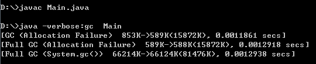

# 栈帧结构

## 什么是栈帧？
栈帧（Frame）: 是一种用来存储数据和部分过程结果的数据结构，用于虚拟机进行方法的调用和执行，同时也被用来处理动态链接 （Dynamic Linking）、方法返回值和异常分派（Dispatch Exception）。  它是虚拟机栈的栈元素，也就是入栈和出栈的一个单元。 

位置：内存 -> 运行时数据区 -> 某个线程对应的虚拟机栈 -> here[在这里]  

大小确定时间: 编译程序代码的时候，就已经确定了局部变量表和操作数栈的大小，不受运行期数据影响。

## 栈帧是一种数据结构，包含的数据有？
`局部变量表、操作数栈、动态链接、方法返回地址、附加信息。`

## 什么是局部变量？
是一片逻辑连续的内存空间，最小单位是Slot，用来存放方法参数和方法内部定义的局部变量。  
虚拟机没有明确指明一个Slot的内存空间大小。但是boolean、byte、char、short、int、float、reference、returnAddress类型的数据都可以用32位空间或更小的内存来存放，这些类型占用一个Slot。Java中的long和double类型是64位，占用两个Slot。（只有double和long是jvms里明确规定的64位数据类型）

虚拟机如何调用局部变量表？  
局部变量表是有索引的，就像数组一样。从0开始，到表的最大索引，也就是Slot的数量-1。  
注意：方法参数的个数 + 局部变量的个数 ≠ Slot的数量。因为Slot的空间是可以复用的，当pc计数器的值已经超出了某个变量的作用域时，下一个变量不必使用新的Slot空间，可以去覆盖前面那个空间。(P183)
``` java
JVM37:
On instance method invocation, local variable 0 is always used to pass a reference to the object on which the instance method is being invoked (this in the Java programming language)
在一个实例方法的调用时，局部变量表的第0位是一个指向当前对象的引用，也就是Java里的this。
```

Slot复用对GC的影响(P239)：  
>先了解一下System.gc()机制:
``` java
public class Main{
    public static void main(String [] args){
        byte[] placeholder = new byte[64*1024*1024];//64mb
        System.gc();
    }
}
```

理解：
- 第一行，Allocation Filure(空间分配失败)引起了Minor GC。因为创建的对象太大，新生代装不下，所以进行了一次GC。
- 第二行，由于新生代GC完了后，还是装不下，这时就应该把它直接放到老年代，为了老年代又足够的空间来迎接这个大对象，所以老年代进行一次Full GC。
- 第三行，是代码中的手动gc，发现这次手动gc并没有回收掉这个大对象。因为，placeholder这个对象，还在作用域....就不该回收....

>这回System.gc()该回收掉placeholder了吧？
``` java
public class Main{
    public static void main(String [] args){
        {
            byte[] placeholder = new byte[64*1024*1024];
        }
        System.gc();
    }
}
``` 

解读：
- 明显，还是没有回收掉这个placeholder大对象。手动gc后，内存空间并没有改变。
- 因为虚拟机并不急着让placeholder回收掉。在这个程序中，对虚拟机来说，回不回收placeholder，对内存没有丝毫影响，剩余的空间一样都是浪费(空闲)着，回收了反倒还浪费时间。

> 这样做才能成功回收:

``` java
public class Main{
    public static void main(String [] args){
        {
            byte[] placeholder = new byte[64*1024*1024];
        }
        int a = 0; //a复用了这片空间
        System.gc();
    }
}
```
 
解读：
- 在a复用空间之前，虽然placeholder退出了作用域，但是虚拟机并没有做什么事，只是知道pc指针已经超出了placeholder的作用域，知道placeholder过期了。所以placeholder仍保持者GC Roots之间的关联。
- 当a=0复用了前面对象的空间时，就打断了GC Roots与局部变量表中的placeholder之间的关联。因为a复用了这片空间(虽然只是用了一小部分)。此时GC Root无法达到placeholder对象，满足回收条件。
- 然后System.gc()就成功回收了。

`在placeholder所占的空间被复用之前并不会判定为‘垃圾’，在复用后才会被判定为‘垃圾’。`刚才使用一个int a来复用，这个复用看起来很轻量。

>如果使用一个新的大对象来复用，那么GC是如何发生的呢？
``` java
public class Main{
    public static void main(String [] args)throws InterruptedException{
        {
            byte[] placeholder = new byte[64*1024*1024];
        }
        byte[]arr= new byte[20*1024*1024];
        System.gc();
    }
}　
```
 
解读：
- 第一行，因为即将创建的placeholder太大，新生代装不下，所以进行一次GC。
- 第二行, 因为GC之后还是装不下placeholder，所以把这个大对象直接放进老年代里。迎接这个大对象之前，先清一清自己的空间(Full GC)，怕自己装不下。
- 第三行，因为即将创建的arr太大，新生代装不下，所以进行一次GC。
- 第四行，因为GC之后还是装不下arr， 所以把这个大对象直接放进老年代里。迎接这个大对象之前，先清一清自己的空间(Full GC)，怕自己装不下。`但是，可以看到这一次Full GC并没有把placeholder清理掉，因为还没开始复用呢。`随后创建好了arr, 也就是复用了placeholder的空间。这时才把placeholder判定为垃圾。
- 第五行，是代码里手写的System.gc()方法。这时把placeholder这个垃圾清理掉。

有没有发现这个Full GC来的不是很恰到好处？因为没有及时清理掉placeholder。为什么没有清理掉呢？因为局部变量表里的placeholder数据还和GC Root连着，导致没有判定它为垃圾。能不能及时断开这个连接，让这个Full GC起到它该起的作用呢？

>可以巧用null来解决，看下面代码：
``` java
public class Main{
    public static void main(String [] args)throws InterruptedException{
        {
            byte[] placeholder = new byte[64*1024*1024];
            placeholder = null; //断开GC Root链接
        }
        byte[]arr= new byte[20*1024*1024];
        System.gc();
    }
}　　
```
 
解读：
- 第一行，因为即将创建的placeholder太大，新生代装不下，所以进行一次GC。
- 第二行, 因为GC之后还是装不下placeholder，所以把这个大对象直接放进老年代里。迎接这个大对象之前，先清一清自己的空间(Full GC)，怕自己装不下。
- 随后placeholder= null;
- 第三行，因为即将创建的arr太大，新生代装不下，所以进行一次GC。
- 第四行，因为GC之后还是装不下arr， 所以把这个大对象直接放进老年代里。迎接这个大对象之前，先清一清自己的空间(Full GC)，怕自己装不下。`可以看到这一次Full GC把placeholder清理掉了。`
- 随后创建好了arr,复用了placeholder。
- 第五行，是代码里手写的System.gc()方法。

## 什么是操作数栈(参考JVMS7)
每个栈帧都包含一个被叫做操作数栈的后进先出的栈。叫操作栈，或者操作数栈。通常情况下，操作数栈指的就是当前栈桢的操作数栈。

操作数栈有什么用？  
```
The operand stack is empty when the frame that contains it is created. The Java virtual machine supplies instructions to load constants or values from local variables or fields onto the operand stack. Other Java virtual machine instructions take operands from the operand stack, operate on them, and push the result back onto the operand stack. The operand stack is also used to prepare parameters to be passed to methods and to receive method results.
```
- 栈桢刚创建时，里面的操作数栈是空的。
- Java虚拟机提供指令来让操作数栈对一些数据进行入栈操作，比如可以把局部变量表里的数据、实例的字段等数据入栈。
- 同时也有指令来支持出栈操作。
- 向其他方法传参的参数，也存在操作数栈中。
- 其他方法返回的结果，返回时存在操作数栈中。

操作数栈本身就是一个普通的栈吗？  
操作数栈本身就是栈，加上数据结构支持的一些指令和操作。但是，操作数栈是区分类型的，操作数栈中严格区分类型，而且指令和类型也好严格匹配。

栈桢和栈桢是完全独立的吗？  
本来栈桢作为虚拟机栈的一个单元，应该是栈桢之间完全独立的。
但是，虚拟机进行了一些优化：为了避免过多的方法间参数的复制传递、方法返回值的复制传递 等一些操作，就让一部分数据进行栈桢间共享。

## 什么是动态链接？
 一个方法调用另一个方法，或者一个类使用另一个类的成员变量时，总得知道被调用者的名字吧？(你可以不认识它本身，但调用它就需要知道他的名字)。符号引用就相当于名字，这些被调用者的名字就存放在Java字节码文件里。

名字是知道了，但是Java真正运行起来的时候，真的能靠这个名字（符号引用）就能找到相应的类和方法吗？

`需要解析成相应的直接引用，利用直接引用来准确地找到。`

举个例子，就相当于我在0X0300H这个地址存入了一个数526，为了方便编程，我把这个给这个地址起了个别名叫A, 以后我编程的时候(运行之前)可以用别名A来暗示访问这个空间的数据，但其实程序运行起来后，实质上还是去寻找0X0300H这片空间来获取526这个数据的。

这样的`符号引用和直接引用在运行时进行解析和链接的过程，叫动态链接。`

动态链接的前提:  
每一个栈帧内部都要包含一个指向运行时常量池的引用，来支持动态链接的实现。

## 方法返回地址
方法正常调用完成:  
返回一个值给调用它的方法，方法正常完成发生在一个方法执行过程中遇到了方法返回的字节码指令的时候，使用哪种返回指令取决于方法返回值的数据类型（如果有返回值的话）。

Java虚拟机根据不同数据类型有不同的底层return指令。当被调用方法执行某条return指令时，会选择相应的return指令来让值返回(如果该方法有返回值的话)。

在这种情况，当前栈桢就被用来恢复调用者的状态，都恢复哪些呢？恢复局部变量表、操作数栈 和 程序计数器(pc指针)，而这个程序计数器要适当地增加，来指向下一条指令(也就是调用函数的下一句)。使调用者方法能够正常地继续执行下去，而且返回值push到了调用方法的操作数栈中。

方法异常调用完成:  
异常时不会返回值给调用者。

## 附加信息
JVM里没有明文规定....

>原文：https://www.cnblogs.com/noKing/p/8167700.html
