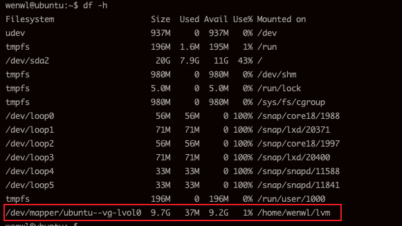

# Linux LVM 磁盘扩容

## LVM基本概念

| 概念                            | 说明                                                         |
| ------------------------------- | ------------------------------------------------------------ |
| PV (Physical volume)，物理卷    | 可以在上面建立卷组的媒介，可以是硬盘分区，也可以是硬盘本身或者回环文件（ loopback file ）。<br />物理卷包括一个特殊的 header，其余部分被切割为一块块物理区域（ physical extents ）。 |
| VG (Volume group)，卷组         | 将一组物理卷收集为一个管理单元。                             |
| LV (Logical volume )，逻辑卷    | 虚拟分区，由物理区域（physical extents）组成。               |
| PE (Physical extent )，物理区域 | 硬盘可供指派给逻辑卷的最小单位（通常为 4MB）。               |


## 磁盘操作相关命令

| 指令                                        | 说明                                                   |
| ------------------------------------------- | ------------------------------------------------------ |
| df -h                                       | 查看挂载点                                             |
| lvdisplay                                   | 显示当前的 logical volume                              |
| vgdisplay                                   | 显示当前的 volume group                                |
| pvdisplay                                   | 显示当前的 physical volume                             |

| 下文的一些指令                                        | 说明                                                   |
| ------------------------------------------- | ------------------------------------------------------ |
| fdisk -l                                    | 查看磁盘情况，一般配合 \|grep '/dev'                   |
| fdisk /dev/sdb                              | 为磁盘/dev/sdb创建新分区                               |
| mkfs -t ext4 /dev/sdb1                      | 格式化磁盘/dev/sdb1分区                                |
| pvcreate /dev/sdb1                          | 将磁盘/dev/sdb1分区创建为逻辑卷                        |
| vgcreate ubuntu-vg /dev/sdb1                | 在逻辑卷/dev/sdb1创建卷组ubuntu-vg                     |
| lvcreate -L 9.9G ubuntu-vg                  | 在卷组ubuntu-vg上创建9.9G到逻辑卷                      |
| mount /dev/ubuntu-vg/lvol0 /home/wenwl/lvm/ | 将逻辑卷/dev/ubuntu-vg/lvol0挂载到/home/wenwl/lvm/目录 |
| vgextend ubuntu-vg /dev/sdc1                | 将逻辑卷/dev/sdc1扩容到ubuntu-vg卷组上                 |
| lvextend -L +9.9G /dev/ubuntu-vg/lvol0      | 扩容10G到逻辑卷/dev/ubuntu-vg/lvol0                    |


## LVM 扩容栗子

 扩容例子基于 Ubunut 20.04，使用原始的fdisk格式化工具：

### 了解磁盘情况

```
fdisk -l |grep '/dev'
```


这台机器没有开启LVM，目前只有一个sda硬盘，上面有一个sda1和一个sda2分区，原先是想扩展sda2分区的空间，
但是我们需要先将sda磁盘转成LVM，这是一个相对复杂的过程，本文只是想演示LVM扩容，这就本末倒置了，
故我接下来将，分别插入两块磁盘，演示LVM扩容示例：

### 新磁盘作LVM管理

1. 首先增加一块磁盘(10G)，效果如下：

   

   sdb就是我们的新加入的磁盘。目前新加的磁盘并没有被分区，待后续分区后，将磁盘用LVM管理后，再插入一个新到磁盘将分区扩容到20G。

2. 执行以下指令，创建新的分区 `sdb`。（**带#注释部分只是为了说明，执行请忽略，下文出现作用相同，不再一一备注**）

   ```shell
   wenwl@ubuntu:~$ sudo fdisk /dev/sdb # 创建分区命令
   
   Welcome to fdisk (util-linux 2.34).
   Changes will remain in memory only, until you decide to write them.
   Be careful before using the write command.
   
   Device does not contain a recognized partition table.
   Created a new DOS disklabel with disk identifier 0x34971ed9.
   
   Command (m for help): n # 新建分区
   Partition type
      p   primary (0 primary, 0 extended, 4 free)
      e   extended (container for logical partitions)
   Select (default p): p # 默认主分区
   Partition number (1-4, default 1):  # 默认一个分区
   First sector (2048-20971519, default 2048): # 默认开始簇
   Last sector, +/-sectors or +/-size{K,M,G,T,P} (2048-20971519, default 20971519): # 默认即可
   
   Created a new partition 1 of type 'Linux' and of size 10 GiB.
   
   Command (m for help): w # 写入磁盘分区
   The partition table has been altered.
   Calling ioctl() to re-read partition table.
   Syncing disks.
   
   ```

   结果如下：

   

3. 格式化分区

   ```shell
   wenwl@ubuntu:~$ sudo mkfs -t ext4 /dev/sdb1 # 格式化分区
   mke2fs 1.45.5 (07-Jan-2020)
   Creating filesystem with 2621184 4k blocks and 655360 inodes
   Filesystem UUID: fb9f90ef-c3d1-4bcd-987f-26f746ae6af7
   Superblock backups stored on blocks: 
           32768, 98304, 163840, 229376, 294912, 819200, 884736, 1605632
   
   Allocating group tables: done                            
   Writing inode tables: done                            
   Creating journal (16384 blocks): done
   Writing superblocks and filesystem accounting information: done 
   ```

4. 将新建的分区创建为物理卷（PV）, 随后创建一个卷组，并将PV加入到卷组（VG）中 ，并查看卷组信息，查看结果。

   ``` shell
   wenwl@ubuntu:~$ sudo pvcreate /dev/sdb1 # 创建PV
   WARNING: ext4 signature detected on /dev/sdb1 at offset 1080. Wipe it? [y/n]: y
     Wiping ext4 signature on /dev/sdb1.
     Physical volume "/dev/sdb1" successfully created.
   wenwl@ubuntu:~$ sudo vgcreate ubuntu-vg /dev/sdb1 # 创建并加入卷组
      Volume group "ubuntu-vg" successfully created
   wenwl@ubuntu:~$ sudo pvscan # 查看卷组
      PV /dev/sdb1   VG ubuntu-vg       lvm2 [<10.00 GiB / <10.00 GiB free]
      Total: 1 [<10.00 GiB] / in use: 1 [<10.00 GiB] / in no VG: 0 [0   ]
   ```

   由结果已知，目前sdb1分区已经加入到ubuntu-vg卷组中

5. 在ubuntu-vg卷组上创建逻辑卷（LV）

   先查看卷组信息，得到容量信息，好创建逻辑卷：

   ``` shell
   wenwl@ubuntu:~$ sudo vgdisplay  # 查看卷组信息
     --- Volume group ---
     VG Name               ubuntu-vg
     System ID             
     Format                lvm2
     Metadata Areas        1
     Metadata Sequence No  1
     VG Access             read/write
     VG Status             resizable
     MAX LV                0
     Cur LV                0
     Open LV               0
     Max PV                0
     Cur PV                1
     Act PV                1
     VG Size               <10.00 GiB
     PE Size               4.00 MiB
     Total PE              2559
     Alloc PE / Size       0 / 0   
     Free  PE / Size       2559 / <10.00 GiB
     VG UUID               3GGVfV-xuUP-5xMu-uiki-LY8o-Qmo0-wrHmsP
   ```

   目前卷组的默认PE为4MB（这个设置可以通过-s参数修改大小），计算可用空间得到：  
   2559.0*4/1024 ~= 9.996039375  
   现在我们在这个卷组上创建一个逻辑卷，并将所有空间给新建的逻辑卷：

   ```shell
   wenwl@ubuntu:~$ sudo lvcreate -L 9.9G ubuntu-vg # 创建逻辑卷
     Rounding up size to full physical extent 9.90 GiB
     Logical volume "lvol0" created.
   ```

   逻辑卷“lvol0”以及创建完成。（如果要自定义命名，在ubuntu-vg前使用-n newName即可）

   查看逻辑卷信息：

   ``` shell
   wenwl@ubuntu:~$ sudo lvdisplay #查看逻辑卷信息
     --- Logical volume ---
     LV Path                /dev/ubuntu-vg/lvol0
     LV Name                lvol0
     VG Name                ubuntu-vg
     LV UUID                loQ5zr-pzz9-XG1H-W3Rp-kXBR-uOPw-BPzh3s
     LV Write Access        read/write
     LV Creation host, time ubuntu, 2021-05-16 03:46:43 +0000
     LV Status              available
     # open                 0
     LV Size                9.90 GiB
     Current LE             2535
     Segments               1
     Allocation             inherit
     Read ahead sectors     auto
     - currently set to     256
     Block device           253:0
   
   ```

6. 挂载逻辑卷

   将逻辑卷挂载到某个目录下（此处挂在到了/home/wenwl/lvm/），以后数据都通过逻辑卷写入磁盘：

   ``` shell
   sudo mount /dev/ubuntu-vg/lvol0 /home/wenwl/lvm/
   ```

   如果遇到类似下面的错误：

   ```shell
   mount: /home/wenwl/lvm: wrong fs type, bad option, bad superblock on /dev/mapper/ubuntu--vg-lvol0, missing codepage or helper program, or other error.
   ```

   可能是没安装工具或者没有格式化分区导致的，安装工具方法参照下面指令，格式化分区参见上文第四步。

   ``` shell
   # centos
   yum install nfs-utils
   # ubuntu
   apt-get install nfs-common
   ```

   查看结果：

   

至此，我们整个磁盘就被LVM管理，并被挂在在了/home/wenwl/lvm上。

### 扩容分区

假如随着业务的增长，写入/home/wenwl/lvm的数据越来越多，10G已经完全不够用了，这个时候我们需要给/dev/mapper/ubuntu--vg-lvol0扩容，在原卷组的磁盘也只有10G情况下，选择增加一块硬盘的情况来扩容，具体步骤可参考：

1. 增加一个磁盘。
2. 在新磁盘建立创建新分区并格式化分区
3. 新分区创建为物理卷。

以上的步骤可参见上文，这里不重复展开描述，主要是讲后续扩容操作。前三步执行结果如下：

``` shell
wenwl@ubuntu:~$ sudo pvscan 
  PV /dev/sdb1   VG ubuntu-vg       lvm2 [<10.00 GiB / 96.00 MiB free]
  PV /dev/sdc1                      lvm2 [<10.00 GiB]
  Total: 2 [<20.00 GiB] / in use: 1 [<10.00 GiB] / in no VG: 1 [<10.00 GiB]
```

/dev/sdc1 是我新增的磁盘上的分区，已经创建为逻辑卷，目前它是没有加入到任务卷组里面的。接下来我们将其加入到扩容到卷组ubuntu-vg，也就是扩容VG：

4. 扩容VG：

   ``` shell
   wenwl@ubuntu:~$ sudo vgextend ubuntu-vg /dev/sdc1 # 扩容ubuntu-vg
     Volume group "ubuntu-vg" successfully extended
   wenwl@ubuntu:~$ sudo vgdisplay # 查看卷组
     --- Volume group ---
     VG Name               ubuntu-vg
     System ID             
     Format                lvm2
     Metadata Areas        2
     Metadata Sequence No  3
     VG Access             read/write
     VG Status             resizable
     MAX LV                0
     Cur LV                1
     Open LV               1
     Max PV                0
     Cur PV                2
     Act PV                2
     VG Size               19.99 GiB
     PE Size               4.00 MiB
     Total PE              5118
     Alloc PE / Size       2535 / 9.90 GiB
     Free  PE / Size       2583 / <10.09 GiB
     VG UUID               3GGVfV-xuUP-5xMu-uiki-LY8o-Qmo0-wrHmsP
   
   ```

   根据卷组信息可知，这个时候ubuntu-vg已经扩容成功，因为它有大概有10G 的Free  PE。这个时候分区 /dev/mapper/ubuntu--vg-lvol0 还没有完成扩容，我们需要将卷组上的10G空闲空间分配给它，也就是扩容对应的逻辑卷，即扩容LV：

   

5. 扩容LV

   在扩容前，最好查看当前的逻辑卷，确定好扩容的路径：

   ```shell
   wenwl@ubuntu:~$ sudo lvdisplay 
     --- Logical volume ---
     LV Path                /dev/ubuntu-vg/lvol0
     LV Name                lvol0
     VG Name                ubuntu-vg
     LV UUID                loQ5zr-pzz9-XG1H-W3Rp-kXBR-uOPw-BPzh3s
     LV Write Access        read/write
     LV Creation host, time ubuntu, 2021-05-16 03:46:43 +0000
     LV Status              available
     # open                 1
     LV Size                9.90 GiB
     Current LE             2535
     Segments               1
     Allocation             inherit
     Read ahead sectors     auto
     - currently set to     256
     Block device           253:0
   
   ```

   此次我们要扩容逻辑卷路径为 /dev/ubuntu-vg/lvol0。

   扩容LV可以按指定增加大小或者按百分比扩容：

   ```shell
   # 增加指定大小
   lvextend -L +10G /dev/ubuntu-vg/lvol0
   # 按百分比扩容
   lvextend -l +100%FREE /dev/ubuntu-vg/lvol0
   ```

   我的执行操作：

   ``` shell
   sudo lvextend -L +2G /dev/ubuntu-vg/lvol0 # 先加2G
     Size of logical volume ubuntu-vg/lvol0 changed from 9.90 GiB (2535 extents) to 11.90 GiB (3047 extents).
     Logical volume ubuntu-vg/lvol0 successfully resized.
   wenwl@ubuntu:~$ sudo lvextend -l +100%FREE /dev/ubuntu-vg/lvol0 # all in
     Size of logical volume ubuntu-vg/lvol0 changed from 11.90 GiB (3047 extents) to 19.99 GiB (5118 extents).
     Logical volume ubuntu-vg/lvol0 successfully resized.
   wenwl@ubuntu:~$ sudo lvdisplay # 查看当前逻辑卷
     --- Logical volume ---
     LV Path                /dev/ubuntu-vg/lvol0
     LV Name                lvol0
     VG Name                ubuntu-vg
     LV UUID                loQ5zr-pzz9-XG1H-W3Rp-kXBR-uOPw-BPzh3s
     LV Write Access        read/write
     LV Creation host, time ubuntu, 2021-05-16 03:46:43 +0000
     LV Status              available
     # open                 1
     LV Size                19.99 GiB
     Current LE             5118
     Segments               2
     Allocation             inherit
     Read ahead sectors     auto
     - currently set to     256
     Block device           253:0
   
   ```

   由逻辑卷信息可知，目前逻辑卷的大小已经扩容到20G！但是如果 执行` df -h` 会发现还没扩容到，是因为我们还需要刷新分区信息，才能将扩容让磁盘可知。

6. 刷新分区

   ```shell
   wenwl@ubuntu:~$ sudo resize2fs /dev/ubuntu-vg/lvol0 # 刷新分区
   resize2fs 1.45.5 (07-Jan-2020)
   Filesystem at /dev/ubuntu-vg/lvol0 is mounted on /home/wenwl/lvm; on-line resizing required
   old_desc_blocks = 2, new_desc_blocks = 3
   The filesystem on /dev/ubuntu-vg/lvol0 is now 5240832 (4k) blocks long.
   
   wenwl@ubuntu:~$ df -h
   Filesystem                    Size  Used Avail Use% Mounted on
   udev                          937M     0  937M   0% /dev
   tmpfs                         196M  1.6M  195M   1% /run
   /dev/sda2                      20G  7.9G   11G  43% /
   tmpfs                         980M     0  980M   0% /dev/shm
   tmpfs                         5.0M     0  5.0M   0% /run/lock
   tmpfs                         980M     0  980M   0% /sys/fs/cgroup
   /dev/loop1                     56M   56M     0 100% /snap/core18/1988
   /dev/loop0                     56M   56M     0 100% /snap/core18/1997
   /dev/loop3                     33M   33M     0 100% /snap/snapd/11588
   /dev/loop4                     71M   71M     0 100% /snap/lxd/20400
   /dev/loop2                     71M   71M     0 100% /snap/lxd/20371
   /dev/loop5                     33M   33M     0 100% /snap/snapd/11841
   tmpfs                         196M     0  196M   0% /run/user/1000
   /dev/mapper/ubuntu--vg-lvol0   20G   44M   19G   1% /home/wenwl/lvm # 已经变成了20G
   
   ```

   自此扩容成功！！

参考：  
[Linux LVM 磁盘扩容](https://funtl.com/zh/linux/Linux-LVM-%E7%A3%81%E7%9B%98%E6%89%A9%E5%AE%B9.html#lvm-%E7%9A%84%E5%9F%BA%E6%9C%AC%E6%A6%82%E5%BF%B5)  
[Linux 扩容 / 根分区(LVM+非LVM)](https://www.cnblogs.com/nf01/articles/14583107.html)
[解决mount时发生错误wrong fs type, bad option, bad superblock](https://blog.csdn.net/weixin_38642130/article/details/88640051)
[Linux LVM逻辑卷配置过程详解（创建，增加，减少，删除，卸载）](https://blog.51cto.com/dreamfire/1084729)

