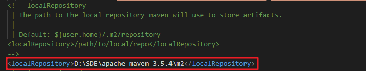

# Maven仓库

## Maven本地仓库

Maven的本地资源库用来存储所有项目的依赖关系到本地文件夹。一个Maven项目，所有相关文都被存储在Maven本地仓库。

默认情况下，Maven的本地资源默认为./m2目录文件夹：

    Unix/Mac OS ：~/.m2
    Windows:c:\Documents and Settings\{username}\.m2

通常情况下，可改变默认的.m2目录下的默认本地仓库文件夹到其他更有意义的名称，例如repo。

进入{your-maven_path}/conf/settings.xml找到localRepository，配置本地仓库路径即可。

## Maven中央仓库

当建立一个Maven的项目，Maven会检查pom.xml文件，以确定下载哪些依赖。首先，Maven会先从本地资源仓库获得Maven的本地资源库依赖资源，如果没有找到，然后默认从[Maven中央仓库](http://repo1.maven.org/maven2/)查找下载

使用[mvnrepository](https://mvnrepository.com/),搜索依赖的配置。
