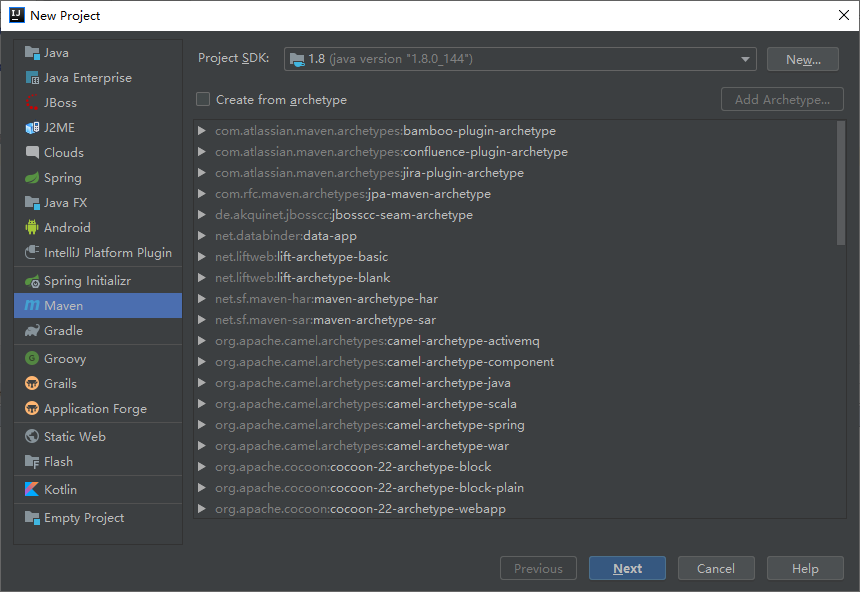
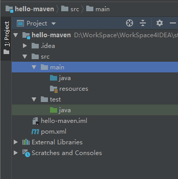
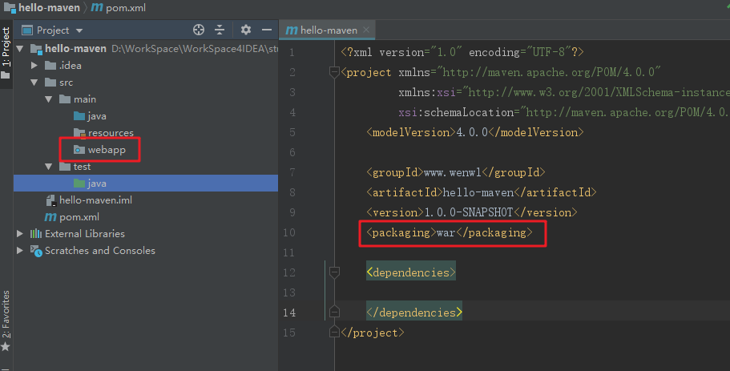
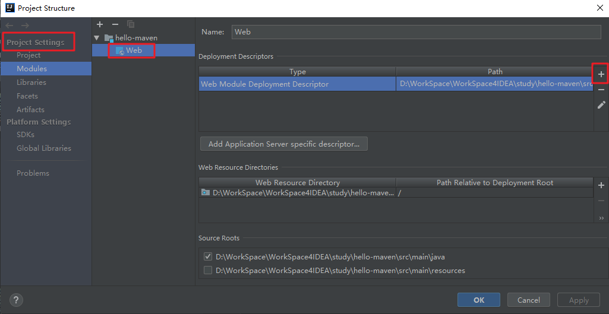
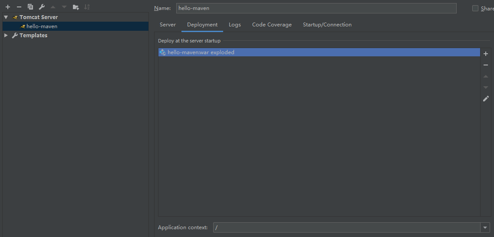

# Hello-Maven

使用IDEA创建第一个maven项目：hello-maven

## 创建Mavne工程- web项目
Create New Project -> Maven:



关于archetype(骨架)，它是封装好的Maven工程，默认带了一些配置，目的是为了简化开发。



## IDEA 配置 Maven 

1. ctrl + alt + s ：快捷打开设置。
2. 搜索：Maven（路径：Build -》 Build Tools -》 Maven）
3. 修改Maven home，User settings file、Local repository等配置即可。

## 创建webapp目录

创建webapp目录，修改pom.xml文件，刷新Maven依赖，webapp文件夹样式会发生改变。



## 配置web.xml

web目录文件添加WEB-INF目录，配置web.xml。

``` xml
<?xml version="1.0" encoding="UTF-8"?>
<web-app xmlns="http://xmlns.jcp.org/xml/ns/javaee"
         xmlns:xsi="http://www.w3.org/2001/XMLSchema-instance"
         xsi:schemaLocation="http://xmlns.jcp.org/xml/ns/javaee http://xmlns.jcp.org/xml/ns/javaee/web-app_4_0.xsd"
         version="4.0">
</web-app>
```

可通过IDEA生成web.xml。



## 编写HelloServlet

引入servlet依赖

``` xml
<?xml version="1.0" encoding="UTF-8"?>
<project xmlns="http://maven.apache.org/POM/4.0.0"
         xmlns:xsi="http://www.w3.org/2001/XMLSchema-instance"
         xsi:schemaLocation="http://maven.apache.org/POM/4.0.0 http://maven.apache.org/xsd/maven-4.0.0.xsd">
    <modelVersion>4.0.0</modelVersion>

    <groupId>www.wenwl</groupId>
    <artifactId>hello-maven</artifactId>
    <version>1.0.0-SNAPSHOT</version>
    <packaging>war</packaging>

    <dependencies>
        <dependency>
            <groupId>javax.servlet</groupId>
            <artifactId>javax.servlet-api</artifactId>
            <version>4.0.1</version>
        </dependency>
    </dependencies>
</project>
```

创建包`com.wenwl.hello.maven.servlet`，编写HelloServlet类 。

``` java
public class HelloServlet extends HttpServlet {

    @Override
    protected void doGet(HttpServletRequest req, HttpServletResponse resp) throws ServletException, IOException {
        req.getRequestDispatcher("/index.jsp").forward(req,resp);
    }

    @Override
    protected void doPost(HttpServletRequest req, HttpServletResponse resp) throws ServletException, IOException {

    }
}
```

## 添加jsp、配置servlet

创建index.jsp,添加到webapp目录：

``` jsp

<%@ page contentType="text/html;charset=UTF-8" language="java" %>
<html>
<head>
    <title>Title</title>
</head>
<body>
    Hello-Maven
</body>
</html>
```

web.xml文件添加servlet配置
``` xml
    <servlet>
        <servlet-name>HelloServlet</servlet-name>
        <servlet-class>com.wenwl.hello.maven.servlet.HelloServlet</servlet-class>
    </servlet>
    <servlet-mapping>
        <servlet-name>HelloServlet</servlet-name>
        <url-pattern>/servlet/hello</url-pattern>
    </servlet-mapping>
```

## 配置Tomcat

在配置Tomcat前，打包项目`mvn package`:



访问：http://localhost:8080/servlet/hello

``` html
Hello-Maven
```


