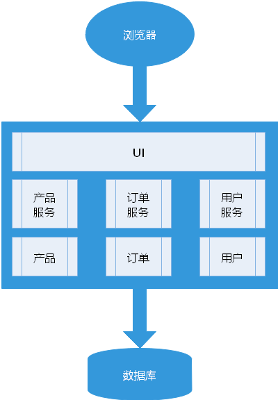
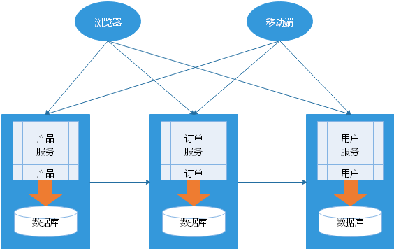

# 微服务架构简介

微服务是一种思想，实际开发是分布式开发。

## 概述

微服务架构是一种架构概念，旨在通过将功能分解到各个离散的服务中，以实现对解决方案的解耦，从而降低系统的耦合性并提供更加灵活的服务支持。

微服务架构能把一个大型的单个应用程序和服务拆分为数个甚至数十个的微服务，它可扩展单个组件而不是整个的应用程序堆栈，从而满足服务等级协议。微服务强调围绕业务领域组件来创建应用，这些应用可独立地进行开发、管理和迭代。在分散的组件中使用云架构和平台式部署、管理和服务功能，使产品交付变得更加简单。

简单来说，微服务架构就是用一些功能比较明确、业务比较精练的服务去解决更大、更实际的问题。

::: tip 系统架构三个标准

- 提高敏捷性：及时响应业务需求，促进企业发展
- 提升用户体验：提升用户体验，减少用户流失
- 降低成本：降低增加产品、客户或业务方案的成本

:::

## 传统架构与微服务架构的区别

通过WEB的传统架构到微服务架构的演变做一个简单区别描述。

### 传统架构 - 单体开发

传统的 WEB 开发方式，一般被称为 **单体式开发（Monolithic）**。既所有的功能打包在一个 WAR 包里，基本没有外部依赖（除了容器），部署在一个 JavaEE 容器（Tomcat，JBoss，WebLogic）里，包含了 DO/DAO，Service，UI 等所有逻辑。

 优点：

- 开发简单，集中式管理
- 基本不会重复开发
- 功能都在本地，没有分布式的管理和调用消耗

缺点：

- 效率低：开发都在同一个项目改代码，相互等待，冲突不断
- 维护难：代码功功能耦合在一起，新人不知道何从下手
- 不灵活：构建时间长，任何小修改都要重构整个项目，耗时
- 稳定性差：一个微小的问题，都可能导致整个应用挂掉
- 扩展性不够：无法满足高并发下的业务需求

### 微服务架构 - 分布式开发

将上述单体应用的服务，进行有效的拆分应用，实现敏捷开发和部署。

微服务架构的优缺点：[微服务简介](./micrservice-introduction.html#微服务的优点)。

## SOA架构与微服务架构的区别

面试的时候，经常会有面试官问SOA架构（面向服务的架构）和微服务架构有什么区别？由于两者之间有很多相似之处，面试者容易混淆。下面从三点讨论他们之间的区别：

### SOA注重重用，微服务注重重写

SOA 的主要目的是为了企业各个系统更加容易地融合在一起。通常会把可以重用的模块服务抽取或组合起来，让各个系统调用。

微服务通常由重写一个模块开始。要把整个巨石型的应用重写是有很大的风险的，也不一定必要。我们向微服务迁移的时候通常从耦合度最低的模块或对扩展性要求最高的模块开始。把它们一个一个剥离出来用敏捷地重写，可以尝试最新的技术和语言和框架，然后 **单独布署**。它通常不依赖其他服务。微服务中常用的 `API Gateway` 的模式主要目的也不是重用代码。而是减少客户端和服务间的往来。

`API Gateway` 模式不等同与 `Facade` 模式，我们可以使用如 `Future` 之类的调用，甚至返回不完整数据。

### SOA注重水平服务，微服务注重垂直服务

SOA 架构在设计的时候喜欢给服务分层(如 Service Layers 模式)。我们常常见到一个 Entity 服务层的设计，美其名曰 Data Access Layer。这种设计要求所有的服务都通过这个 Entity 服务层，来获取数据。但是这种设计非常不灵活，比如每次数据层的改动都可能影响到所有业务层的服务。而每个微服务通常有它自己独立的 Data Store。我们在拆分数据库时可以适当的做些去范式化，让它不需要依赖其他服务的数据。

微服务通常是直接面对用户的，每个微服务通常直接为用户提供某个功能。类似的功能可能针对手机有一个服务，针对机顶盒是另外一个服务。在 SOA 设计模式中这种情况通常会用到 Multi-ChannelEndpoint 的模式返回一个大而全的结果兼顾到所有的客户端的需求。

### SOA注重自上而下，微服务注重自下而上

SOA 架构在设计开始时会先定义好服务合同。它喜欢集中管理所有的服务，包括集中管理业务逻辑，数据，流程，Schema 等。它使用 Enterprise Inventory 和 Service Composition 等方法来集中管理服务。SOA 架构通常会预先把每个模块服务接口都定义好。模块系统间的通讯必须遵守这些接口，各服务是针对他们的调用者。

SOA 架构适用于 TO GAF 之类的架构方法论。

微服务则敏捷得多。只要用户用得到，就先把这个服务挖出来。然后针对性的，快速确认业务需求，快速开发迭代。

### 总结

微服务与 SOA 有很多相同之处。两者都属于典型的、包含松耦合分布式组件的系统结构。**在围绕着服务的概念创建架构这一方面，微服务提供了一种更清晰、定义更良好的方式**。微服务的原则与敏捷软件开发思想是高度一致的，而它与 SOA 原则的演化的目标也是相同的，即减少传统的企业服务总线开发的高复杂性。

两者之间最关键的区别在于，**微服务专注于以自治的方式产生价值**。但是两种架构背后的意图是不同的：**SOA 尝试将应用集成，一般采用中央管理模式来确保各应用能够交互运作。微服务尝试部署新功能，快速有效地扩展开发团队。它着重于分散管理、代码再利用与自动化执行**。

| 功能     | SOA                  | 微服务                       |
| :------- | :------------------- | :--------------------------- |
| 组件大小 | 大块业务逻辑         | 单独任务或小块业务逻辑       |
| 耦合     | 通常松耦合           | 总是松耦合                   |
| 公司架构 | 任何类型             | 小型、专注于功能交叉的团队   |
| 管理     | 着重中央管理         | 着重分散管理                 |
| 目标     | 确保应用能够交互操作 | 执行新功能，快速拓展开发团队 |

微服务并不是一种新思想的方法，它是SOA架构的一种变体。它更像是**一种思想的精炼，一种 SOA 的精细化演进，并且更好地利用了先进的技术以解决问题**，例如容器与自动化等。所以对于我们去选择服务技术框架时，并不是非黑即白，而是针对 SOA、MSA 两种架构设计同时要考虑到兼容性，对于现有平台情况架构设计，退则守 SOA，进则攻 MSA，阶段性选择适合的。

## 参考

1. [微服务架构的概念](https://funtl.com/zh/micro-service-about/)
2. [传统架构与微服务架构的区别](https://funtl.com/zh/micro-service-about/%E5%86%8D%E8%B0%88%E5%BE%AE%E6%9C%8D%E5%8A%A1-%E4%BC%A0%E7%BB%9F%E6%9E%B6%E6%9E%84%E4%B8%8E%E5%BE%AE%E6%9C%8D%E5%8A%A1%E6%9E%B6%E6%9E%84%E7%9A%84%E5%8C%BA%E5%88%AB.html#%E6%9C%AC%E8%8A%82%E8%A7%86%E9%A2%91)
3. [SOA 架构与微服务架构的区别](https://funtl.com/zh/micro-service-about/%E5%86%8D%E8%B0%88%E5%BE%AE%E6%9C%8D%E5%8A%A1-SOA-%E6%9E%B6%E6%9E%84%E4%B8%8E%E5%BE%AE%E6%9C%8D%E5%8A%A1%E6%9E%B6%E6%9E%84%E7%9A%84%E5%8C%BA%E5%88%AB.html)