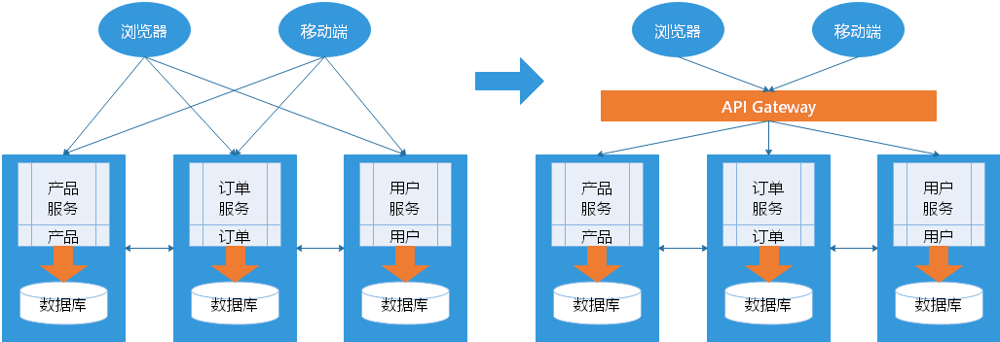

## 微服务的实践

在微服务实际应用中，通常需要解决以下问题：

1. 客户端如何访问这些服务？
2. 每个服务之间如何通信？
3. 如此多的服务，如何实现？
4. 服务挂了，如何解决？

## 客户端如何访问这些服务

原来的单体方式开发，所有的服务都是本地的，UI 可以直接调用，现在按功能拆分成独立的服务，服务一般都在独立的虚拟机上的 Java 进程了。那么客户端 UI 该如何访问呢？

假如后台有 N 个服务，那么客户端（PC、手机、手表等等）就需要记住并且管理这  N 个服务，一个服务的**下线**、**更新**、**升级**，客户端就要重新部署，这明显不符合我们服务拆分的理念，特别当客户端是移动应用的时候，通常业务变化的节奏更快。另外，对 N 个小服务的调用也是一个不小的网络开销。此外，一般微服务在系统内部，通常是无状态的，用户登录信息和权限管理最好有一个统一的地方维护管理（OAuth）。

所以，一般在后台 N 个服务和 客户端 之间一般会有 一个代理 或者叫 `API Gateway`，他的作用包括：

- 提供统一服务入口，让微服务对前台透明
- 聚合后台的服务，节省流量，提升性能
- 提供安全，过滤，流控等API管理功能

其实这个 `API Gateway` 可以有很多广义的实现办法，可以是一个软硬一体的盒子，也可以是一个简单的 MVC 框架，甚至是一个 `Node.js` 的服务端。他们最重要的作用是为前台（通常是移动应用）提供后台服务的聚合，提供一个统一的访问服务入口，解除他们之间的耦合， **不过 `API Gateway` 也有可能成为单点故障或者性能的瓶颈 **。

## 每个服务之间如何通信

所有的微服务都跑在独立的虚拟机的 Java 进程，所以服务间的通信就是 IPC（Inter Process Communication，进程间通信），目前已经有很多成熟的方案。现在基本最通用的有两种方式：

### 同步调用

同步调用比较简单，一致性强，但是容易出调用问题，性能体验上也会差些，特别是调用层次多的时候。有以下两种方式：

- REST（JAX-RS，Spring Boot）
- RPC（Thrift，Dubbo）

一般 REST 基于 HTTP，更容易实现且容易被接受，服务端实现技术也更灵活些，各个语言都能支持，同时能跨客户端，对客户端没有特殊的要求，只要封装了 HTTP 的 SDK 就能调用，所以相对使用得更广一些。

RPC 也有自己的优点，传输协议更高效，安全更可控，特别在一个公司内部，如果有统一个的开发规范和统一的服务框架时，它的开发效率优势更明显些。同步调用的方案选择，一般就看各自的技术积累以及实际条件去选择了。

### 异步调用

异步消息的方式在分布式系统中有特别广泛的应用，他既能减低调用服务之间的耦合，又能成为调用之间的缓冲，确保消息积压不会冲垮被调用方，同时能保证调用方的服务体验，调用方继续干自己该干的活，不至于被后台性能拖慢。不过需要付出的代价是一致性的减弱，需要接受数据 **最终一致性**。

还有就是后台服务一般要实现 **幂等性**，因为消息的发送出于性能的考虑一般会有重复（保证消息的被收到且仅收到一次，对性能是很大的考验），最后就是必须引入一个独立的 `Broker`（消息中转站）。

以下是异步调用的一些消息队列的技术选型：

- Kafka
- RocketMQ
- Notify
- MessageQueue

## 如此多的服务，如何实现

在微服务架构中，一般每一个服务都是有多个节点（多个拷贝）来做负载均衡。一个服务随时可能下线，也可能应对临时访问压力增加新的服务节点。那么服务之间如何相互感知以及服务如何管理呢？

这就需要引入服务注册中心了，它专门用于服务的注册与发现。一般有两类做法，也各有优缺点：

### 基于客户端的服务注册与发现

基于客户端的服务注册与发现，基本都是通过 Zookeeper 等类似技术做服务注册信息的分布式管理。当服务上线时，服务提供者将自己的服务信息注册到 ZK（或类似框架），并通过心跳维持长链接，实时更新链接信息。服务调用者通过 ZK 寻址，根据可定制算法，找到一个服务，还可以将服务信息缓存在本地以提高性能。当服务下线时，ZK 会发通知给服务客户端。

这种方案的优点是架构简单，扩展灵活，只对服务注册器依赖。缺点是客户端要维护所有调用服务的地址，有技术难度，一般大公司都有成熟的内部框架支持，比如 Dubbo，Dubbo默认的服务注册中心是Zookeeper。

### 基于服务端的服务注册与发现

基于服务端的服务注册与发现优点是简单，所有服务对于前台调用方透明，一般在小公司在云服务上部署的应用采用的比较多。常见的实现有：

- Eureka
- Nacos

## 服务挂了，如何解决

单体方式开发一个很大的风险是：把所有鸡蛋放在一个篮子里，一荣俱荣，一损俱损，而分布式开发最大的特性就是**网络是不可靠的**。通过微服务拆分能降低这个风险，不过如果没有特别的保障，那么结局同样肯定是噩梦。所以当我们的系统是由一系列的 **服务调用链** 组成的时候，我们必须**确保任一环节出问题都不至于影响整体链路**。相应的手段有很多：

- 重试机制
- 限流
- 熔断机制
- 负载均衡
- 降级（本地缓存）

## 参考

1. [微服务的实践](https://funtl.com/zh/micro-service-about/%E5%86%8D%E8%B0%88%E5%BE%AE%E6%9C%8D%E5%8A%A1-%E5%BE%AE%E6%9C%8D%E5%8A%A1%E7%9A%84%E5%AE%9E%E8%B7%B5.html#%E6%A6%82%E8%BF%B0)