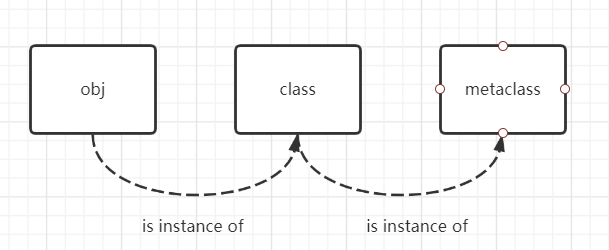
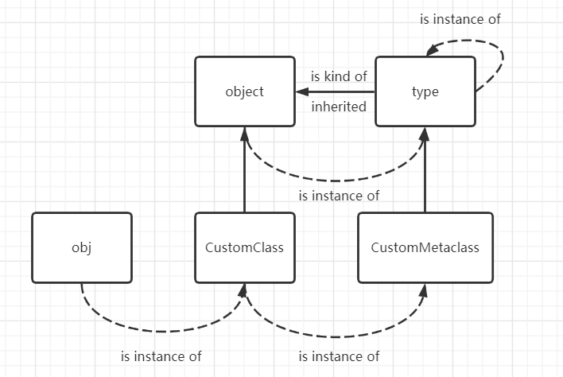
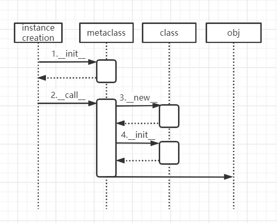

# Python中metaclass的原理


在了解metaclass原理前，需要对[内置函数type和isinstance](./Python的内置函数type和isinstance.html)有所了解，这里默认认为已经掌握这两个函数。

metaclass直译为元类，**可控制类的属性和类实例的创建过程。**在Python中，一切都可以是对象(例如：一个整数、一串字符串、一个类实例等等），一个类也是一个对象，和其他对象一样，类也是是元类（metaclass）的一个实例。我们用一张图来表示对象（obj）、类（class）、元类（metaclass）之间的关系，如图所示：



## 默认的metaclass是type类型

当自定义一个类，不指明metaclass时，该类的默认的metaclass是type类型。即在调用type函数传入自定义类的时候，结果为type类型。

```python
class MyClass:
    pass


if __name__ == "__main__":
    m = MyClass()
    print(type(MyClass))
    print(type(m))
    print()

    print(isinstance(m, MyClass))
    print(isinstance(MyClass, type))


"""
<class 'type'>
<class '__main__.MyClass'>

True
True
"""
```

type类型总是让人感到困惑，因为type也可以当作函数来使用，返回一个对象的类型。type在Python中是一个极为特殊的类型。为了彻底理解metaclass，我们还要搞清楚type与object的关系。

## type与object的关系

在Python3中，object是所有类的基类（注意，这与上面obj是不同的概念，这跟Java中的Object类同样的概念），所有的类都直接或间接地继承自object类。同样的type类也继承自object类。这就对我们的理解造成了极大的困扰，主要表现在以下三点：

- type是一个metaclass，而且是一个默认的metaclass。这就是说object的默认metaclass也是type，**即object的类型是type，object是type的一个实例。**
- type是object的一个子类，继承object的所有属性和行为；
- type还是一个callable，即实现了__call__方法，可以当成一个函数来使用。

两者之间的关系如图：



type和object有点像“蛋生鸡”与“鸡生蛋”的关系，type是object的子类，同时object又是type的一个实例（因为type是object的类型），二者是不可分离的。而type的类型是type，而不是object！

从图中我们可以知道，我们可以自定义metaclass，自定义的metaclass必须继承自type。自定义的metaclass通常以Metaclas（s或Meta）作为后缀取名以示区分。CustomMetaclass和type都是metaclass类型的。

前面提到所有的类都继承自object，包括内置的类和用户自定义的类，但一般的类的metaclass是type，是type的一个实例。如果要改变类的metaclass，必须在定义类时显式地指定它的metaclass。如下：

```python
# 显示指定metaclass
class CustomMetaclass(type):
    pass


class CustomClass(metaclass=CustomMetaclass):
    pass


if __name__ == "__main__":
    print(type(object))
    print(type(type))
    print()

    obj = CustomClass()
    print(type(CustomClass))
    print(type(obj))
    print(type(CustomMetaclass))

    print()
    print(isinstance(obj, CustomClass))
    print(isinstance(obj, object))

'''
<class 'type'>
<class 'type'>

<class '__main__.CustomMetaclass'>
<class '__main__.CustomClass'>
<class 'type'>

True
True
'''


```


## 自定义metaclass

自定义metaclass，要注意以下几点：

- object的\_\_init\_\_方法只有一个参数，但自定义metaclass的\_\_init\_\_有四个参数。

  这是因为自定义metaclass继承自type，而type重写了\_\_init\_\_方法。

  ```python
  # object
  def __init__(self)
  
  # type
  def __init__(cls, what, bases=None, dict=None)
  ```

- 对于普通类，重写\_\_call\_\_方法说明对象是callable的。在metaclass中\_\_call\_\_方法还负责对象的创建。对象的创建过程如下：

  

结合代码分析：

```python
# 自定义metaclass创建对象过程
class CustomMetaclass(type):

    def __init__(cls, what, bases=None, dict=None):
        print("CustomMetaclass.__init__ cls:", cls)
        super().__init__(what, bases, dict)

    def __call__(cls, *args, **kwargs):
        print("CustomMetaclass.__call__ args:", args, kwargs)
        self = super(CustomMetaclass, cls).__call__(*args, **kwargs)
        print("CustomMetaclass.__call__ self:", self)
        return self


class CustomClass(metaclass=CustomMetaclass):

    def __init__(self, *args, **kwargs):
        print("CustomClass.__init__ self:", self)
        super().__init__()

    def __new__(cls, *args, **kwargs):
        self = super().__new__(cls)
        print("CustomClass.__new__, self:", self)
        return self

    def __call__(self, *args, **kwargs):
        print("CustomClass.__call__ args:", args)


if __name__ == "__main__":
    obj = CustomClass("Meta arg1", "Meta arg2", kwarg1=1, kwarg2=2)
    print(type(CustomClass))
    print(obj)
    obj("arg1", "arg2")

'''
CustomMetaclass.__init__ cls: <class '__main__.CustomClass'>
CustomMetaclass.__call__ args: ('Meta arg1', 'Meta arg2') {'kwarg1': 1, 'kwarg2': 2}
CustomClass.__new__, self: <__main__.CustomClass object at 0x0000026532C57F40>
CustomClass.__init__ self: <__main__.CustomClass object at 0x0000026532C57F40>
CustomMetaclass.__call__ self: <__main__.CustomClass object at 0x0000026532C57F40>
<class '__main__.CustomMetaclass'>
<__main__.CustomClass object at 0x0000026532C57F40>
CustomClass.__call__ args: ('arg1', 'arg2')
'''
```

大致过程：

1. metaclass.\_\_init\_\_ 进行一些初始化的操作，如全局变量的初始化。
2. metaclass.\_\_call\_\_创建实例，在创建的过程中会调用class的 \_\_new\_\_和\_\_init\_\_方法。
3. class的 \_\_new\_\_进行具体是实例化操作，返回一个实例对象obj。
4. class的 \_\_init\_\_对返回的实例对象obj进行初始化，如状态和属性的设置。
5. 返回一个用户真正需要使用的对象obj。

至此，大概就可以了解如何通过metaclass自定义一个对象生命周期的各个过程。

在实际应用中，可以通过metaclass实现单例模式。

> 摘自： 罗伟富. 《人人都懂设计模式：从生活中领悟设计模式：Python实现》. 电子工业出版社