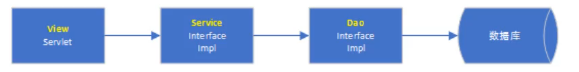
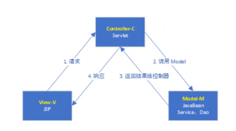
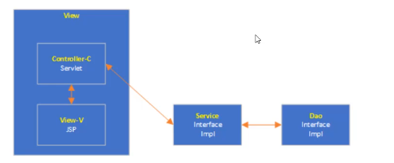

# 三层架构与MVC

## 什么是系统架构

系统架构是指整合应用系统程序大的结构。经常提到的系统结构有两种：**三层架构与MVC**。这两种结构既有区别，又有联系。但这两种结构的使用，均是为了**降低系统模块间的耦合度，降低系统的复杂度**。

## 什么是三层架构

三层架构属于系统架构的一种。三层架构是指：**视图层View**、**服务层Service**、**持久层DAO**。它们分别完成不同的功能。

* View层（视图层）：用于接收用户提交请求的代码
* Service层（业务逻辑层）：系统的业务逻辑主要在这里完成
* DAO层（数据访问层）：直接操作数据库的代码

架构层命名原则：**约定优于配置**

为了**更好的降低各层间的耦合度**，在三层架构程序设计中，采用**面向抽象编程**。即上层对下层的调用，是通过接口实现的。而下层对上层的真正服务提供者，是下层接口的实现类。**服务标准〔接口）是相同的，服务提供者（实现类）可以更换，这就实现了层间解耦合**。

三层架构经典案例：c#的petshop项目

::: tip 补充
1.为什么要用数据库？数据库解决数据读写、存储、检索效率的问题。

2.关于代码开发，实现高内聚、低耦合的原则：

* 一个类只做一种事：高内聚
* 一个方法只做一件事
* 写且写一次

3.开发中，业务才是核心，技术辅助业务。通常，业务越复杂，系统的耦合度越高，对于业务的复杂度，使用事务来衡量。

* 简单业务：只开启一个事务
* 普通业务：开启三个事务
* 复杂业务：开启七个事务

解决办法：多张表之间有依赖关系，说明有强关联，这个时候要想办法分拆业务。
:::

## 什么是MVC模式

MVC，即**Model模型、View视图及Controller控制器**。

* View：视图，为用户提供使用界面，与用户直接进行交互。
* Model：模型，承载数据，并对用户的提交请求进行计算的模块。分为两类，一类称为**数据模型**，一类称为**业务模型**。所谓数据模型是指实体类，专门承载业务数据的，如Student、User等。而业务模型则是指Service或Dao对象，专门用于处理用户提交请求。
* Controller：控制器，用于将用户求转发给相应的的Model进行处理，并根据Model的计算结果向用户提供相应响应。

## MVC架构程序的工作流程

* 用户通过View页面向服务端提出请求。可以是表单请求、超链接请求、AJAX请求等
* 服务端Controller控制器接收到请求后对请求进行解析，找到相应的Model对用户请求进行处理
* Model处理后，将处理结果再交给Controller
* Controller在接到处理结果后，根据处理结果找到作要作为向客户端发回的晌应View页面。页面经渲染（数据填充〕后，再发送给客户端。

## 三层架构 与 MVC 模式

**MVC模式其实是应用在三层架构中的view层。MVC模式将三层架构中的view层进行了解耦**。传统开发中（servlet服务器小程序）负责处理业务逻辑以及页面展示，之后的JSP技术专门用来处理页面展示，但是实际上JSP就是servlet，所以它也是可以处理业务逻辑的。（类似于.net的.aspx)。**view层被进一步划分为Controller、View**。在Java中就是Servlet、JSP。

注意：[MVC模式并不是一种设计模式](/design-patterns-advanced/4_dp-mvc.html)。