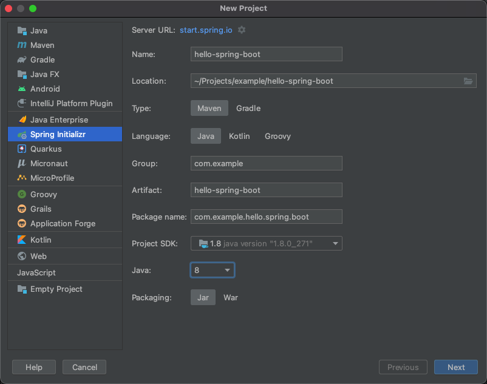
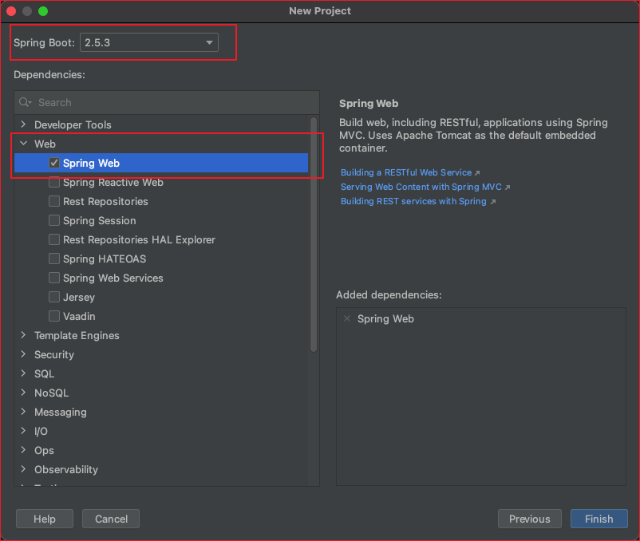
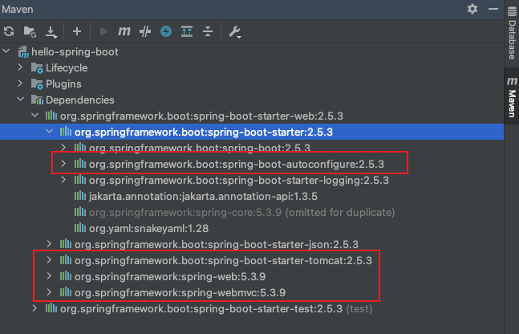

# Hello Spring Boot 

使用 Intellij IDEA 来新建一个 Spring Boot 项目。

## 创建Spring Boot项目

1. IDEA -> New Project -> Spring Initializr -> Hello Spring Boot 

   实质上，IDEA创建Spring Boot项目是是调用了[Spring官方的提供的服务](https://start.spring.io/)。

   

   

2. 下一步：选择Spring Boot版本以及Web开发所需要的依赖。

   

3. 下一步，Finish。至此，一个Spring Boot已经创建完成！

   创建的Spring Boot目录结构如下：

   ``` shell
   .
   ├── HELP.md
   ├── hello-spring-boot.iml
   ├── mvnw
   ├── mvnw.cmd
   ├── pom.xml
   └── src
       ├── main
       │   ├── java
       │   │   └── com
       │   │       └── example
       │   │           └── hello
       │   │               └── spring
       │   │                   └── boot
       │   │                       └── HelloSpringBootApplication.java
       │   └── resources
       │       ├── application.properties
       │       ├── static
       │       └── templates
       └── test
           └── java
               └── com
                   └── example
                       └── hello
                           └── spring
                               └── boot
                                   └── HelloSpringBootApplicationTests.java
   
   18 directories, 8 files
   ```

   文件说明：

   - .gitignore：Git 过滤配置文件
   - pom.xml：Maven 的依赖管理配置文件
   - **HelloSpringBootApplication.java：程序入口**
   - resources：资源文件目录
     - static: 静态资源文件目录
     - templates：模板资源文件目录
     - application.properties：Spring Boot 的配置文件，实际开发中会替换成 YAML 语言配置（application.yml）

## pom.xml

``` xml
<?xml version="1.0" encoding="UTF-8"?>
<project xmlns="http://maven.apache.org/POM/4.0.0" xmlns:xsi="http://www.w3.org/2001/XMLSchema-instance"
         xsi:schemaLocation="http://maven.apache.org/POM/4.0.0 https://maven.apache.org/xsd/maven-4.0.0.xsd">
    <modelVersion>4.0.0</modelVersion>
    <parent>
        <groupId>org.springframework.boot</groupId>
        <artifactId>spring-boot-starter-parent</artifactId>
        <version>2.5.3</version>
        <relativePath/> <!-- lookup parent from repository -->
    </parent>
    <groupId>com.example</groupId>
    <artifactId>hello-spring-boot</artifactId>
    <version>0.0.1-SNAPSHOT</version>
    <name>hello-spring-boot</name>
    <description>Demo project for Spring Boot</description>
    <properties>
        <java.version>1.8</java.version>
    </properties>
    <dependencies>
        <dependency>
            <groupId>org.springframework.boot</groupId>
            <artifactId>spring-boot-starter-web</artifactId>
        </dependency>

        <dependency>
            <groupId>org.springframework.boot</groupId>
            <artifactId>spring-boot-starter-test</artifactId>
            <scope>test</scope>
        </dependency>
    </dependencies>

    <build>
        <plugins>
            <plugin>
                <groupId>org.springframework.boot</groupId>
                <artifactId>spring-boot-maven-plugin</artifactId>
            </plugin>
        </plugins>
    </build>

</project>

```

Maven工程配置说明：

- parent：继承了 Spring Boot 的 Parent，表示我们是一个 Spring Boot 工程。
- `spring-boot-starter-web`：包含了 `spring-boot-starter` 还自动帮我们开启了 Web 支持。
- `spring-boot-starter-test`：包含了 `spring-boot-test` ，支持Spring Boot 单元测试。


## 运行Spring Boot项目

运行Spring Boot项目非常简单，只需要找到程序入口运行即可。

我们这个例子的程序入口就在com.example.hello.spring.boot.HelloSpringBootApplication#main，启动后可以通过浏览器访问 http://localhost:8080即可。这里为了让运行结果比较明显，新建一个HelloController.java：

``` java
package com.example.hello.spring.boot.ctrl;

import org.springframework.web.bind.annotation.RequestMapping;
import org.springframework.web.bind.annotation.RequestMethod;
import org.springframework.web.bind.annotation.RestController;

@RestController
public class HelloController {

    @RequestMapping(value = "", method = RequestMethod.GET)
    public String sayHi() {
        return "Hello Spring Boot";
    }
}
```

启动后，访问地址  http://localhost:8080 可以看到：

``` 
Hello Spring Boot
```


## 对比传统SSM项目

Spring Boot 帮我们做了自动配置（Java 配置方式），使得Spring开发Web应用开箱即用。

- 没有配置 web.xml
- 没有配置 application.xml，Spring Boot 帮你配置了
- 没有配置 application-mvc.xml，Spring Boot 帮你配置了
- 没有配置 Tomcat，Spring Boot 内嵌了 Tomcat 容器

Spring做的自动配置，主要放在`spring-boot-autoconfigure`，它提供了大量的主流配置：



## Spring Boot 单元测试

有些版本的`spring-boot-starter-test`并没有引入junit包，需要自己引入。

``` xml
 <dependency>
   <groupId>junit</groupId>
   <artifactId>junit</artifactId>
   <scope>test</scope>
</dependency>
```

Spring Boot 单元测试主要是通过 `@RunWith` 和 `@SpringBootTest` 注解来开启单元测试功能。运行它会先启动 Spring Boot 工程，再启动单元测试。注意，在1.x 版本 Spring Boot的@SpringBootTest 注解中才需要加入classes = HelloSpringBootApplication.class 配置，以读到资源文件夹下的配置文件。

``` java
package com.example.hello.spring.boot;

import org.junit.Before;
import org.junit.Test;
import org.junit.runner.RunWith;
import org.springframework.beans.factory.annotation.Autowired;
import org.springframework.boot.test.context.SpringBootTest;
import org.springframework.boot.test.web.client.TestRestTemplate;
import org.springframework.boot.web.server.LocalServerPort;
import org.springframework.http.ResponseEntity;
import org.springframework.test.context.junit4.SpringRunner;

import java.net.URL;

import static org.hamcrest.CoreMatchers.equalTo;
import static org.junit.Assert.assertThat;

@RunWith(SpringRunner.class)
@SpringBootTest(classes = HelloSpringBootApplication.class, webEnvironment = SpringBootTest.WebEnvironment.RANDOM_PORT)
public class HelloSpringBootApplicationTests {

    @LocalServerPort
    private int port;

    private URL base;

    @Autowired
    private TestRestTemplate template;

    @Before
    public void setUp() throws Exception {
        this.base = new URL("http://localhost:" + port + "/");
    }

    @Test
    public void contextLoads() {
        ResponseEntity<String> response = template.getForEntity(base.toString(), String.class);
        assertThat(response.getBody(), equalTo("Hello Spring Boot"));
    }

}
```

