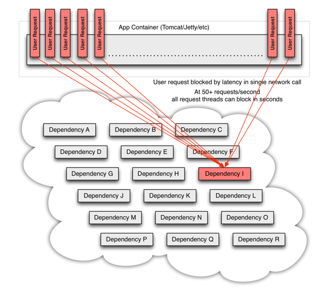

# 服务雪崩效应

## 概述

在微服务架构中，根据业务来拆分成一个个的服务，服务与服务之间可以互相通信来完成业务，同时为了保证服务高可用，单个服务通常会集群部署。但是由于网络原因或者自身的原因，服务并不能保证 100% 可用，如果单个服务出现问题，调用这个服务时就会出现线程阻塞，此时若有大量的请求涌入，`Servlet` 容器的线程资源会被消耗完毕，导致服务瘫痪。也就是说故障会随着服务与服务之间的依赖性传播，特别是较低层的服务如果出现故障，会导致**级联故障**，最后会对整个微服务系统造成灾难性的严重后果，这就是服务故障的 **“雪崩”** 效应。

## 雪崩案例

完好情况下，请求流如下：

当一个依赖的节点坏掉时，将阻塞整个的用户请求：

流量高峰时，一个单节点的宕机或延迟，会迅速导致所有服务负载达到饱和。应用中任何一个可能通过网络访问其他服务的节点，都有可能成为造成潜在故障的来源。更严重的是，还可能导致服务之间的延迟增加，占用队列、线程等系统资源，从而导致多系统之间的级联故障。

更严重的是，当网络请求是通过第三方的一个黑盒客户端来发起时，实现细节都被隐藏起来了，而且还可能频繁变动，这样发生问题时就很难监控和改动。如果这个第三方还是通过传递依赖的，主应用程序中根本没有显示地写出调用的代码，那就更难了。

网络连接失败或者有延迟，服务将会产生故障或者响应变慢，最终反应成为一个 bug。

## 雪崩效应形成原因

简化服务雪崩的参与者为 **服务提供者** 和 **服务调用者**, 并将服务雪崩产生的过程分为以下三个阶段来分析形成的原因:

- 服务提供者不可用：硬件故障、程序Bug、缓存击穿（缓存失效，不命中）、用户大量请求（秒杀、大促）
- 重试加大流量：用户重试、代码逻辑重试
- 服务调用者不可用：主要是同步等待造成的资源耗尽

## 服务雪崩应对策略

针对造成服务雪崩的不同原因, 可以使用不同的应对策略:

- 流量控制：网关限流（OpenResty）、用户交互限流（采用加载动画,提高用户的忍耐等待时间；提交按钮添加强制等待时间机制）、关闭重试
- 改进缓存模式：缓存预加载、同步改为异步刷新
- 服务自动扩容：AWS的auto scaling
- 服务调用者降级服务：资源隔离（主要是对调用服务的线程池进行隔离）、对依赖服务进行分类（强依赖：服务不可用会导致当前业务中止；弱依赖：服务的不可用不会导致当前业务的中止.）、不可用服务的调用快速失败（**超时机制**，**熔断器** 和熔断后的 **降级方法** 来实现）

## 参考

1. [Hystrix 使用手册 | 官方文档翻译](https://www.cnblogs.com/flashsun/p/12579367.html#_label0_0)
2. [防雪崩利器：熔断器 Hystrix 的原理与使用](https://segmentfault.com/a/1190000005988895) （好文，强烈推荐）