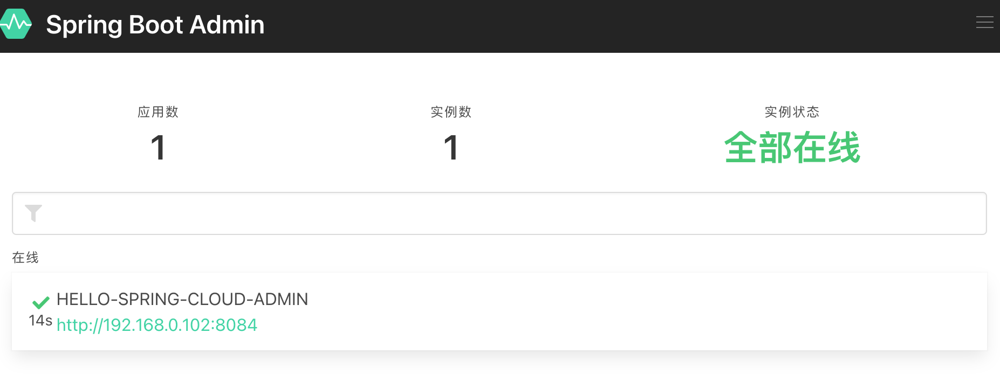
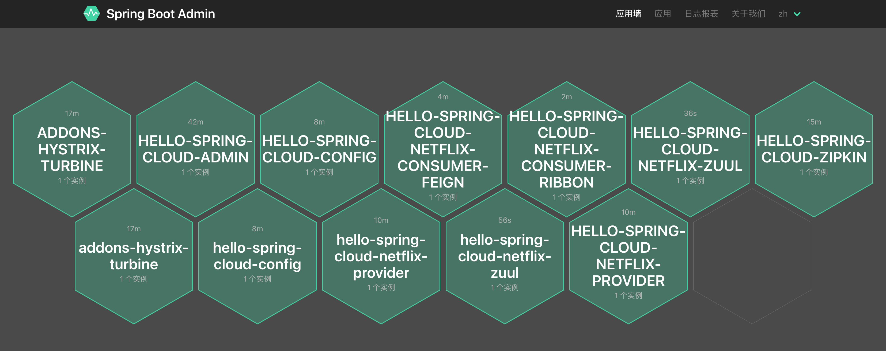
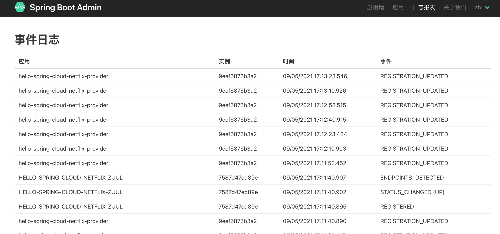

# Spring Boot Admin


## 概述

随着开发周期的推移，项目会不断变大，切分出的服务也会越来越多，这时一个个的微服务构成了错综复杂的系统。对于各个微服务系统的健康状态、会话数量、并发数、服务资源、延迟等度量信息的收集就成为了一个挑战。[`Spring Boot Admin`](https://github.com/codecentric/spring-boot-admin) 应运而生，它正是基于这些需求开发出的一套功能强大的监控管理系统。

Spring Boot Admin 总体同样采用的是C/S架构。意味着主要有两个角色：

- Server：服务端，对接入的客户端的健康状态、服务资源、延迟等信息进行收集展示。
- Client：客户端，向Admin服务端发送当前服务系统状态。

下文将`Spring Boot Admin`简称为`SBA`，更多介绍见[Spring Boot Admin官方指导文档](https://codecentric.github.io/spring-boot-admin/current/)。

## SBA服务端

创建一个工程名为 `hello-spring-cloud-admin` 的项目。专门收集和展示各个微服务端状态。

### POM

主要增加了 1 个依赖:`de.codecentric:spring-boot-admin-starter-server`，版本号为：2.2.4，版本号托管到 `dependencies` 项目中。

**注意：SBA和Spring Boot是搭配使用的**，例如当前示例中，Spring Boot 使用的版本为`2.2.0.RELEASE`，那么SBA应该使用 2.2.x 的版本，否则启动的时候会出现各种“幺蛾子”情况。

``` xml
<?xml version="1.0" encoding="UTF-8"?>
<project xmlns="http://maven.apache.org/POM/4.0.0" xmlns:xsi="http://www.w3.org/2001/XMLSchema-instance"
         xsi:schemaLocation="http://maven.apache.org/POM/4.0.0 https://maven.apache.org/xsd/maven-4.0.0.xsd">
    <modelVersion>4.0.0</modelVersion>

    <parent>
        <groupId>com.example</groupId>
        <artifactId>hello-spring-cloud-netflix-dependencies</artifactId>
        <version>1.0.0-SNAPSHOT</version>
        <relativePath>../hello-spring-cloud-netflix-dependencies/pom.xml</relativePath>
    </parent>

    <artifactId>hello-spring-cloud-admin</artifactId>
    <version>0.0.1-SNAPSHOT</version>

    <dependencies>
        <!-- Spring Boot Begin -->
        <dependency>
            <groupId>org.springframework.boot</groupId>
            <artifactId>spring-boot-starter-web</artifactId>
        </dependency>
        <dependency>
            <groupId>org.springframework.boot</groupId>
            <artifactId>spring-boot-starter-actuator</artifactId>
        </dependency>
        <dependency>
            <groupId>org.springframework.boot</groupId>
            <artifactId>spring-boot-starter-test</artifactId>
            <scope>test</scope>
        </dependency>

        <dependency>
            <groupId>de.codecentric</groupId>
            <artifactId>spring-boot-admin-starter-server</artifactId>
        </dependency>
        <!-- Spring Boot End -->

        <!-- Spring Cloud Begin -->
        <dependency>
            <groupId>org.springframework.cloud</groupId>
            <artifactId>spring-cloud-starter-zipkin</artifactId>
        </dependency>
        <dependency>
            <groupId>org.springframework.cloud</groupId>
            <artifactId>spring-cloud-starter-netflix-eureka-server</artifactId>
        </dependency>
        <!-- Spring Cloud End -->
    </dependencies>

    <build>
        <plugins>
            <plugin>
                <groupId>org.springframework.boot</groupId>
                <artifactId>spring-boot-maven-plugin</artifactId>
                <configuration>
                    <mainClass>com.example.hello.spring.cloud.admin.AdminApplication</mainClass>
                </configuration>
            </plugin>
        </plugins>
    </build>

</project>
```

### Application

通过 `@EnableAdminServer` 注解开启 Admin 功能。同样需要开启`@EnableEurekaClient`将服务注册到Eureka。

``` java
package com.example.hello.spring.cloud.admin;

import de.codecentric.boot.admin.server.config.EnableAdminServer;
import org.springframework.boot.SpringApplication;
import org.springframework.boot.autoconfigure.SpringBootApplication;
import org.springframework.cloud.netflix.eureka.EnableEurekaClient;

@SpringBootApplication
@EnableEurekaClient
@EnableAdminServer
public class AdminApplication {

    public static void main(String[] args) {
        SpringApplication.run(AdminApplication.class, args);
    }

}
```

### application.yml

端口号为`8084`，除了要配置Spring Boot Admin Server相关配置外，还有Spring、Eurka注册中心、ZipKin链路追踪相关配置。

``` yaml
spring:
  application:
    name: hello-spring-cloud-admin
  zipkin:
    base-url: http://localhost:9411

server:
  port: 8084

# Spring Boot Admin Server 相关配置
management:
  endpoint:
    health:
      show-details: always
  endpoints:
    web:
      exposure:
        include: health,info

eureka:
  client:
    serviceUrl:
      defaultZone: http://localhost:8761/eureka/
```


## SBA 客户端

将**所有需要被SBA监管的服务**，参考以下步骤配置为SBA客户端。

### POM

增加 `de.codecentric:spring-boot-admin-starter-client` 依赖，使用的版本号同上为 2.2.4 ，版本号托管到 `dependencies` 项目中：

``` xml
<dependency>
    <groupId>de.codecentric</groupId>
    <artifactId>spring-boot-admin-starter-client</artifactId>
</dependency>
```

### application.yml

配置 SBA 服务端地址。

```yaml
spring:
  boot:
    admin:
      client:
        url: http://localhost:8084
```


## 测试访问

打开浏览器访问：http://localhost:8084 ，可以访问SBA的管理界面：



我们可以从SBA中可以查看上线的应用数、实例数、日志报表、应用墙，还可以看到服务的endpoint信息可视化表示等等。随着应用越来越多，SBA的可视化管理更加直观：





