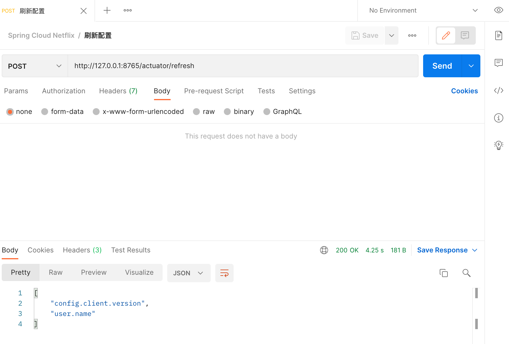

# 动态刷新配置

我们知道配置文件随时可能是会变的，当我们在更新了配置文件后，又不想重启服务该如何处理呢？此外，配置文件往往是多环境的，我们又该如何处理？


## 动态刷新配置用例

我们接着以上一节的[服务消费者 - Feign](./spring-cloud-service-consumer-feign.html)为例。

### application.yml

消费者增加健康检查配置、测试用的`user.name`配置：

``` yaml
# 增加健康检查配置
# 这里的目的是开启 actuator/refresh 接口用于刷新配置
management:
  endpoint:
    shutdown:
      enabled: false
  endpoints:
    web:
      exposure:
        include: "*"
 
# 测试动态刷新配置
user:
  name: 灶门炭治郎
```

### ControllerTest

创建一个 `ConfigTestCtrl` 来测试动态刷新配置，在其中获取 `user.name` 属性，通过 `@RefreshScope`注解开启刷新配置功能，可以使用 `DynamicPropertyFactory` 动态获取配置内容。

``` java
package com.example.hello.spring.cloud.netflix.consumer.feign.ctrl;

import com.netflix.config.DynamicPropertyFactory;
import com.netflix.config.DynamicStringProperty;
import org.springframework.cloud.context.config.annotation.RefreshScope;
import org.springframework.web.bind.annotation.GetMapping;
import org.springframework.web.bind.annotation.RestController;

@RefreshScope
@RestController
public class ConfigTestCtrl {

    @GetMapping(value = "hello")
    public String sayHello() {
        DynamicStringProperty property = DynamicPropertyFactory.getInstance().getStringProperty("user.name", "Hello Config");
        return property.getValue();
    }

}
```

### 测试访问

浏览器访问：http://127.0.0.1:8765/hello，浏览器显示：

``` html
灶门炭治郎
```

将`user.name`修改为灶门祢豆子，并上传到Git仓库，修改配置文件后Spring Cloud Config并不会自动刷新配置，需要手动 POST 请求服务的 `actuator/refresh` 接口才可以使新配置生效。



重新访问接口，浏览器显示：

``` html
灶门祢豆子
```


## Spring Boot Profile

我们在做项目开发的时候，生产环境和测试环境的一些配置可能会不一样，有时候一些功能也可能会不一样，所以我们可能会在上线的时候手工修改这些配置信息。但是 Spring 中为我们提供了 Profile 这个功能。我们只需要在启动的时候添加一个虚拟机参数，激活自己环境所要用的 Profile 就可以了。

操作起来很简单，只需要为不同的环境编写专门的配置文件，如：`application-dev.yml`、`application-prod.yml`， 启动项目时只需要增加一个命令参数 `--spring.profiles.active=环境配置` 即可，启动命令如下

```
java -jar app.jar --spring.profiles.active=prod
```